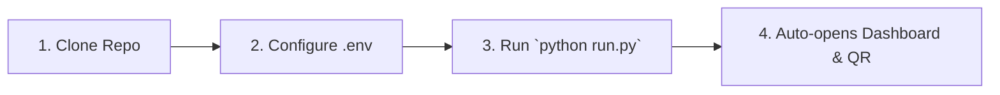

# ☕ EDITH — Autonomous AI Sales Agent Platform (WB-Agent)

> **Enterprise-grade, human-like autonomous conversational AI sales agent engineered for B2B wholesale conversion, intelligent consultative discovery, persistent memory, and deterministic pricing.**  
> Reference Tenant: **North Bengal Tea Co.** (Direct estate producer of Darjeeling, Dooars, and Assam CTC teas).

[](https://www.python.org/)
[](https://fastapi.tiangolo.com/)
[](https://nextjs.org/)
[](https://build.nvidia.com/)
[](https://github.com/WhiskeySockets/Baileys)
[](LICENSE)

---

## 📸 Visual Operations Tour & Brand Design

EDITH features a refined **Dual-Theme Design System** crafted for high-efficiency 24/7 wholesale operations:
- **Royal Pitch Black (Midnight Celestial)**: Deep onyx canvas, subtle cyan/sky-blue glows, frosted glass cards, and emerald accent telemetry.
- **Estate White (Daylight Operations)**: Crisp pearl-white surfaces, high-contrast typography, refined borders, and sunlight-legible data badges.
- **Official Brand Assets**: High-resolution transparent EDITH brand emblem (`logo-transparent.png`), light-mode emblem (`logo-light.png`), and compact favicon icon (`logo-icon.png`).
- **Brand Tagline**: *"More Conversations • Real Opportunities"*.
- **Mobile First & Responsive**: Seamless experience on iPhones, Android devices, tablets, and 4K ultra-wide monitors.

### 1. Live 3-Panel Inbox & Conversational Sales Console
The operational command center for real-time buyer conversations, AI consultative reasoning, customer memory, and atomic human takeover:
- **Left Thread List**: Real-time conversation stream with search, "+ New Chat" phone initiator, lead score indicators (0–100), unread badges, and status pills.
- **Center Timeline**: Live WhatsApp dialogue showing customer queries, EDITH AI responses, timestamp audit, and single-click **Report / Correct Response** operator feedback.
- **Right Profile Drawer**: Live customer intelligence (business type, monthly volume, packaging preference, destination city), sales stage progression, and **Take Over / Resume AI** control. On mobile devices, this is accessible via a high-visibility slide-over drawer.


---

### 2. Wholesale Operations Center (Overview)
Executive command view featuring real-time KPI metrics, active pipeline valuation, 16-stage consultative sales funnel distribution, and safety rule bounds:


---

### 3. Interactive Volume Discount Curve & Deterministic Pricing
Zero-hallucination pricing engine. EDITH deterministically computes wholesale volume tiers (50kg, 100kg, 500kg) with live rate curve visualization and an interactive quote simulator:


---

### 4. Model Architecture, Fallback Hierarchy & Live Telemetry
Configure primary thinking models (**Nemotron-3 Ultra 550B**), chained fallback sequence (**Nano Omni 30B**, **Super 120B**, **Gemma 4 31B**), API keys with automatic local `.env` sync, and benchmark latency telemetry:


---

### 5. Modular System Prompts & Token Budget Donut
Isolated, version-controlled system instructions across 5 architectural concerns (`core_safety`, `core_identity`, `business_policy`, `sales_style`, `business_profile`) with 1-click historical rollback and live token distribution:


---

### 6. Wholesale Commercial Orders
Full lifecycle management of B2B purchase orders generated via AI consultative discovery or operator desk:


---

### 7. Estate Tea Catalog & Packaging Tiers
Direct estate product catalog (Darjeeling First Flush, Assam Kadak CTC, Dooars Hotel Blend) with live stock toggling, packaging variants (5kg to 50kg), and Minimum Order Quantities (MOQs):


---

### 8. Lead Ingestion & B2B Proposal Pipeline
Wholesale lead acquisition engine with E.164 normalization, multipart CSV batch upload, automated lead scoring, and 1-click tailored proposal dispatch:


---

### 9. Automated B2B Campaign Drip & Anti-Ban Jitter Outreach
Rate-limited WhatsApp cold campaigns enforcing randomized inter-message jitter (**25.0s – 45.0s**), daily volume ceilings, live outreach funnels, and automated handoff to EDITH upon buyer reply:


---

### 10. Sales Intelligence & Objection Analytics Dashboard
Executive analytics suite featuring **Objection Pareto Analysis (80/20 rule)**, regional lead density and revenue tables across Eastern India corridors, pipeline stage forecasting, and **1-click executive CSV export**:


---

### 11. Knowledge Grounding & Vector RAG Query Tester
Ground truth knowledge base maintaining estate certifications, transit timelines, and tasting sample policies with live semantic vector search diagnostics:


---

### 12. Automated Follow-up Cadence & Stop Conditions
Context-aware, bounded follow-up sequences (Day 0, Day 1, Day 3) enforcing preflight rules, quiet hours (9 PM – 9 AM IST), and instant auto-cancellation upon buyer reply:


---

### 13. Human Escalations & Handoff Queue
High-value buyer handoff queue with explainable trigger categories (`HOT_LEAD`, `CUSTOM_PRICING`, `COMPLAINT`, `KNOWLEDGE_GAP`) and instant WhatsApp owner alerts:


---

### 14. Platform Safety & Global Kill-Switch
Autonomous control panel featuring the master AI messaging kill-switch, humanized follow-up intervals, quiet hours enforcement, and owner escalation phone (`+91 89006 53250`):


---

### 15. Mobile Responsive & Dual-Theme Architecture
EDITH is engineered mobile-first with adaptive touch UI optimized for operators on iOS Safari, Android Chrome, and desktop:
- **Responsive Navigation Drawer**: One-tap slide-out drawer on phones with quick theme toggle, system status pills, and direct access to all 14 routes.
- **Dedicated Mobile Chat View**: Full-screen conversation thread view with seamless 1-tap `← Back` navigation between the active customer timeline and inbox list.
- **Slide-Over Customer Intelligence**: Buyer profile, commercial stage, order intent, and takeover controls accessible via a slide-over modal drawer on mobile viewports.
- **Horizontal Scrolling Tables**: Orders, leads, campaigns, schedules, and analytics tables wrapped with `overflow-x-auto` containers and strict `min-w` to prevent column squishing on narrow screens.
- **Touch Targets**: All interactive buttons, action pills, and inputs adhere to mobile touch guidelines (>=44px height).
- **Dual Theme Switcher**: 1-tap toggling between **Estate White** and **Royal Pitch Black** with persistent `localStorage` theme state and zero FOUC (flash of unstyled content).

| Mobile Operations Center | Mobile Live Chat Stream |
| :---: | :---: |
|  |  |

---

## ⚡ Super Fast Quickstart (Unified 1-Command Startup)

We provide a zero-configuration single root orchestrator (`run.py`) that checks preflight dependencies, verifies and frees ports, auto-installs missing packages, seeds the database, and boots all 4 microservices simultaneously into a unified terminal with live color-coded logging.



### Step 1: Clone the Repository
```bash
git clone https://github.com/naborajs/wb-agent.git
cd wb-agent
```

### Step 2: Environment Setup
Copy the template configuration file:
```bash
cp .env.example .env
```
Ensure your `.env` contains your NVIDIA API key and WhatsApp configuration:
```env
# AI Model (NVIDIA Nemotron 3.5 / Ultra via NVIDIA NIM)
NVIDIA_API_KEY=your-nvapi-key-here
NVIDIA_FALLBACK_API_KEY=your-backup-nvapi-key
NVIDIA_MODEL=nvidia/nemotron-3-ultra-550b-a55b
LLM_PROVIDER=nvidia
LLM_MAX_TOKENS=2048
LLM_REQUEST_TIMEOUT=60

# WhatsApp Integration (Linked Device Bridge)
WHATSAPP_PROVIDER=bridge
WHATSAPP_BRIDGE_URL=http://localhost:3001
OWNER_WHATSAPP_NUMBER=+918900653250
```

### Step 3: Start Everything With One Single Command! 🚀
Run the master orchestrator from the project root:
```bash
python run.py
```

What `run.py` does automatically:
1. **Preflight Diagnostics**: Checks Python 3.11+, Node.js 18+, and npm versions.
2. **Dependency Resolution**: Automatically installs any missing Python packages, WhatsApp bridge modules, and Next.js dependencies.
3. **Port Conflict Protection**: Verifies ports `8000` (FastAPI), `3001` (WhatsApp Bridge), and `3000` (Next.js Dashboard), clearing stale locks.
4. **Database & Catalog Seeding**: Auto-initializes SQLite / PostgreSQL and seeds North Bengal Tea Co. products, volume rules, and leads if empty.
5. **Simultaneous Multi-Service Boot**: Launches:
   - ⚡ **FastAPI Backend Service** (`http://localhost:8000`)
   - 🧠 **Durable Background Job Worker** (cadence follow-ups & async reasoning)
   - 📱 **Baileys WhatsApp Bridge** (`http://localhost:3001`)
   - 💻 **Next.js 14 Operator Control Center** (`http://localhost:3000`)
6. **Live Unified Logging**: Color-coded prefix logs (`[BACKEND]`, `[WORKER]`, `[WHATSAPP]`, `[DASHBOARD]`) streamed directly to your terminal.
7. **Clean Graceful Shutdown**: Pressing `Ctrl+C` cleanly shuts down all subprocesses without orphaned background tasks or port locking.

*(Optional flags: `python run.py --no-open` to disable auto-opening browser tabs, `python run.py --skip-install` for instant warm reboots).*

---

### Step 4: Connect WhatsApp (Simple QR Scan)
When the browser opens [http://localhost:3001/qr](http://localhost:3001/qr):
1. Open **WhatsApp** on your bot phone (`+91 89187 53100` or your test number).
2. Tap **Settings > Linked Devices > Link a Device**.
3. Scan the QR code shown on screen.
4. 🎉 **Connected!** The bridge is linked and forwards incoming messages automatically.

---

<details>
<summary>🛠️ Advanced / Developer: Manual Multi-Terminal Startup</summary>

If you prefer to run each service in a separate terminal window:

1. **WhatsApp Bridge (Terminal 1)**:
   ```bash
   cd whatsapp-bridge && npm install && node index.js
   ```
2. **FastAPI Backend (Terminal 2)**:
   ```bash
   pip install -r backend/requirements.txt
   python scripts/seed_demo.py
   python -m uvicorn app.main:app --app-dir backend --host 0.0.0.0 --port 8000
   ```
3. **Durable Worker (Terminal 3)**:
   ```bash
   $env:PYTHONPATH="backend"; python -m app.jobs.worker
   ```
4. **Next.js Dashboard (Terminal 4)**:
   ```bash
   cd dashboard && npm install && npm run dev
   ```
</details>

---

## 🧪 Chat with EDITH (Testing & Verification)

### Option A: Send a WhatsApp Message
Send a message from any phone to your linked bot number (`+91 89187 53100`):
> *"Bhai mujhe cafe ke liye tea chahiye, around 100kg monthly milk tea ke liye Siliguri me"*

Watch EDITH:
1. **Passively extract** business type (`Cafe`), monthly quantity (`100kg`), use case (`milk_tea`), and destination (`Siliguri`).
2. **Never repeat questions** you already answered.
3. Recommend **Assam Kadak CTC** or **Dooars Hotel Special Blend** with exact wholesale pricing and volume discounts.
4. Seamlessly switch between **English**, **Hindi**, and **Hinglish** based on customer dialect.
5. Stop selling immediately when you say *"I want to order, please send invoice"*, and alert the owner!

### Option B: Run Automated Multi-Turn Sales Simulation
```bash
$env:PYTHONPATH="backend"; python scripts/test_edith_multiturn.py
```
Run regression tests:
```bash
$env:PYTHONPATH="backend"; python -m pytest backend/tests/unit -v
```

---

## 🌟 What Makes EDITH Different?

| Feature | Generic Chatbots | EDITH Sales Operating System |
| :--- | :--- | :--- |
| **Sales Methodology** | Scripted Q&A / FAQ | Consultative SPIN-style discovery; discovers before recommending |
| **Pricing Integrity** | Prone to hallucinations | **Deterministic**: 100% calculated from verified rules and MOQs |
| **Unknown Handling** | Guesses or makes up facts | **Zero Hallucination**: Escalates to owner (`+91 89006 53250`) via WhatsApp alert |
| **Memory** | Resets every session | **Persistent Multi-Tier**: Profile, requirements, past objections across dialogues |
| **Operator Safety** | Race condition if human types | **Atomic Pre-Send Check**: Aborts AI send if operator took over |
| **Follow-Ups** | Uncontrolled spam loops | **Bounded Analysis**: Contextual Day 1 / Day 3 sequences with auto-stop |
| **Dialect Engine** | Rigid English only | **Multi-Dialect Code-Switching**: English, Hindi, and conversational Hinglish |

---

## 📂 Detailed Documentation Directory

All comprehensive architectural design records, operational runbooks, API schemas, and setup guides are organized inside the **[`docs/`](docs/)** folder:

### 🏛️ Architecture & Decisions
- **[System Architecture Overview](docs/architecture.md)**: High-level data flows, worker loops, and component diagrams.
- **[Dashboard Visual Operations Tour](docs/visual-tour.md)**: Complete high-resolution visual documentation of all 12 operational pages.
- **[Architecture Decision Records (ADRs)](docs/decisions/)**:
  - [ADR-0001: PostgreSQL & pgvector as Primary Storage](docs/decisions/0001-postgresql-primary-storage.md)
  - [ADR-0002: Modular Monolith Architecture](docs/decisions/0002-modular-monolith-architecture.md)
  - [ADR-0003: Database-Backed Durable Job Queue](docs/decisions/0003-database-backed-queue.md)
  - [ADR-0004: Conversation-Level Distributed Locking](docs/decisions/0004-conversation-concurrency.md)
  - [ADR-0005: Multi-Provider LLM Abstraction](docs/decisions/0005-provider-abstraction.md)
  - [ADR-0006: Multi-Tier Memory & Fact Provenance](docs/decisions/0006-memory-architecture.md)
  - [ADR-0007: Knowledge Grounding & Authority Hierarchy](docs/decisions/0007-knowledge-rag-authority.md)
  - [ADR-0008: Atomic Pre-Send Human Takeover Protection](docs/decisions/0008-human-takeover-race-prevention.md)
  - [ADR-0009: Context-Aware Follow-Up Cancellation](docs/decisions/0009-followup-engine-cancellation.md)
  - [ADR-0010: Local-First Modular Monolith Deployment](docs/decisions/0010-local-first-architecture.md)
  - [ADR-0011: Dual WhatsApp Provider Architecture (Baileys + Meta Cloud)](docs/decisions/0011-whatsapp-adapter-architecture.md)
  - [ADR-0012: Operator Correction Learning](docs/decisions/0012-operator-correction-learning.md)
  - [ADR-0013: Modular Prompt Versioning & Rollback](docs/decisions/0013-modular-prompt-versioning.md)
  - [ADR-0014: Auditable Commercial Quotes](docs/decisions/0014-auditable-commercial-quotes.md)

### 🛠️ Setup & Operations Runbooks
- **[Prerequisites & System Requirements](docs/setup/01-prerequisites-and-system-requirements.md)**
- **[Database & pgvector Setup](docs/setup/02-database-and-pgvector-setup.md)**
- **[Backend Fast Start Runbook](docs/setup/03-backend-setup.md)**
- **[Dashboard Frontend Setup & Visual Tour](docs/setup/04-dashboard-frontend-setup.md)**
- **[WhatsApp Integration Guide](docs/setup/05-whatsapp-integration-guide.md)**
- **[NVIDIA Nemotron & LLM Configuration](docs/setup/06-nvidia-nemotron-and-llm-setup.md)**
- **[Owner Escalation Setup](docs/setup/07-owner-escalation-channel.md)**
- **[End-to-End Verification Runbook](docs/setup/08-end-to-end-verification.md)**
- **[API Reference Documentation](docs/api-reference.md)**
- **[Troubleshooting & Error Solutions Catalog](docs/troubleshooting/error-catalog-and-solutions.md)**

---

## 🔐 Contact Numbers & Configuration

- **Bot WhatsApp Number:** Configured through linked device bridge (`+91 89187 53100`).
- **Owner Escalation WhatsApp:** Configured via `OWNER_WHATSAPP_NUMBER` (`+91 89006 53250`).
- **Demo Reference Business:** North Bengal Tea Co. (Siliguri, West Bengal, India).
