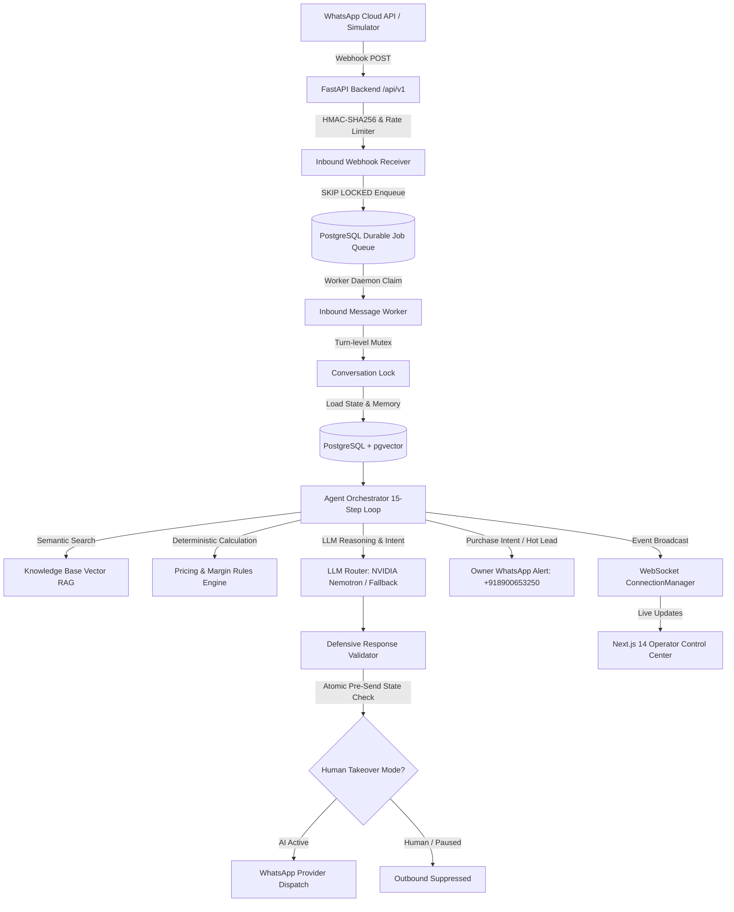

# 🌿 WB-Agent: Autonomous AI Sales Agent Platform

> **Production AI Sales Operating System for WhatsApp B2B Conversion & Pipeline Acceleration**  
> Built for **North Bengal Tea Co.** (Estate-direct Darjeeling, Dooars, and Assam CTC wholesale supplier).

[](https://www.python.org/)
[](https://fastapi.tiangolo.com/)
[](https://nextjs.org/)
[](https://www.postgresql.org/)
[](LICENSE)
[]()

---

## 📌 Executive Summary

**WB-Agent** is an autonomous B2B conversational AI platform engineered to acquire, qualify, understand, nurture, and close legitimate business leads through WhatsApp. Unlike generic chatbots or brittle prompt wrappers, WB-Agent is a **stateful sales operating system** with:

1. **Deterministic Pricing & Margin Safety**: The LLM *never* invents prices or discounts. All quotations are calculated by a deterministic pricing engine enforcing Minimum Order Quantities (MOQs), volume tiers, and strict negotiation boundaries (autonomous discount ceiling capped at 5.0%).
2. **Customer Long-Term Memory**: Multi-layered persistent memory tracking business profiles, monthly volume requirements, tea grade preferences, and past objections across conversations.
3. **Guaranteed Compliance & Cancellation Guards**: Automated Day 0, Day 1, Day 3 follow-up sequences automatically cancel the millisecond a buyer replies, opts out, or requests a live human operator.
4. **Instant Owner Escalation**: High-priority buyer purchase intent, contract pricing requests, or complaints immediately dispatch formatted WhatsApp alerts directly to the business owner at `+91 89006 53250`.
5. **Real-time Operator Control Center**: High-density 3-panel live inbox built with Next.js 14, Tailwind CSS, and WebSockets providing seamless human takeover (`Take Over` / `Resume AI`), lead directory, catalog management, and emergency kill-switches.

---

## 🏛️ System Architecture



---

## 💼 Business Domain: North Bengal Tea Co.

| Attribute | Specification |
| :--- | :--- |
| **Company** | North Bengal Tea Co. |
| **Origins** | Darjeeling (Kurseong, Mirik), Dooars & Terai, Upper Assam |
| **Key Products** | Darjeeling Spring First Flush (FTGFOP1), Assam Kadak CTC (BP), Dooars Hotel Blend (BOP/OF) |
| **Minimum Order Quantity** | 10 kg (Darjeeling), 25 kg (Assam CTC), 20 kg (Dooars) |
| **Volume Discounts** | 50 kg (5%), 100 kg (10%), 500 kg (15% + Human Approval) |
| **Autonomous Discount Cap** | 5.0% maximum |
| **Escalation Target** | Rajiv Sen (Business Owner): `+91 89006 53250` |

---

## 🚀 Quickstart Guide

### Prerequisites
- Python 3.11+
- Node.js 18+ and npm
- PostgreSQL 16+ with `pgvector` (or SQLite for lightweight local testing)

### 1. Clone & Configure Environment
```bash
git clone https://github.com/naborajs/wb-agent.git
cd wb-agent
cp .env.example .env
```

### 2. Backend Setup & Seeding
```bash
# Install Python dependencies
pip install -e backend/

# Run database migrations and seed catalog, pricing rules, and demo leads
python scripts/seed_demo.py
```

### 3. Run Automated Tests
```bash
# Execute unit and persona evaluation test suites
pytest backend/tests/ -v
```

### 4. Launch Operator Control Center (Dashboard)
```bash
cd dashboard
npm install
npm run dev
# Dashboard opens at http://localhost:3000
```

### 5. Start API Server & Queue Worker
```bash
# Start FastAPI backend
uvicorn app.main:app --app-dir backend --host 0.0.0.0 --port 8000 --reload
```

---

## 🧪 Persona Simulation Benchmark

Run the automated 5-persona buyer simulation to verify sales funnel transitions, lead scoring, and owner escalation:

```bash
python scripts/run_simulation.py
```

Simulated buyer journeys include:
- **Boutique Café Owner**: Specialty tea discovery, tasting sample request, and delivery coordination.
- **Hotel Chain Procurement Manager**: High-volume 100kg/month negotiation, price objection handling, and human handoff.
- **Skeptical Tea Retailer**: Origin authenticity verification (GI certification check) and MOQ inquiries.
- **Adversarial Attacker**: Prompt injection jailbreak defense and extreme unauthorized discount resistance.
- **Opt-Out Customer**: Immediate WhatsApp policy unsubscribe compliance.

---

## 🛡️ Security & Guardrails

- **Defensive Input Sanitizer**: Rejects prompt injection jailbreaks (`ignore previous instructions`, `dan mode`, `developer mode`).
- **Sliding Window Rate Limiter**: Per-phone and per-IP transaction rate caps preventing carrier flooding.
- **HMAC-SHA256 Webhook Verification**: Cryptographic validation of incoming Meta WhatsApp webhooks (`X-Hub-Signature-256`).
- **Role-Based Access Control**: Scoped API keys (`lead:read`, `lead:write`, `agent:control`) and bcrypt-hashed operator credentials.
- **Emergency Kill-Switch**: One-click platform suspension in `/settings` instantly halting all autonomous outbound dispatches.

---

## 📄 License

Licensed under the Apache License, Version 2.0. See [LICENSE](LICENSE) for details.
