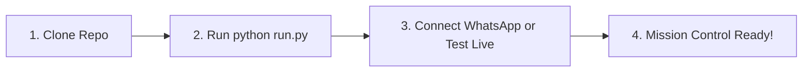

# 🚀 WhatsApp AI Agent by NS (EDITH AI Sales Operating System)

> **Enterprise-grade, human-like autonomous conversational AI sales agent engineered for B2B commercial conversion, intelligent consultative discovery, persistent memory, and configurable business rules.**  
> Built for any legitimate business, product, service, industry, pricing model, and sales process. Includes optional sample datasets (such as North Bengal Tea Co. or general commercial commerce).

[](https://www.python.org/)
[](https://fastapi.tiangolo.com/)
[](https://nextjs.org/)
[](https://build.nvidia.com/)
[](https://github.com/WhiskeySockets/Baileys)
[](LICENSE)

---

## ⚡ Quick Start Guide (Run in 2 Minutes with 1 Command)

> **New to the project?** You don't need complex setup, manual database installs, or Docker. A single command (`python run.py`) checks your environment, installs missing packages, seeds the database, and boots the entire platform simultaneously!



### 📋 Prerequisites
- **Python**: 3.10 or higher (`python --version`)
- **Node.js**: 18.0 or higher with npm (`node --version`)
- **Git**: Installed and configured

---

### Step 1: Clone & Enter the Repository
```bash
git clone https://github.com/naborajs/wb-agent.git
cd wb-agent
```

---

### Step 2: (Optional) Configure Your `.env`
If you want to use live LLMs (Google Gemini 3.1 Live or NVIDIA NIM), copy the template:
```bash
cp .env.example .env
```
*(💡 **Beginner Friendly:** You can skip this step! Without a `.env`, the system automatically runs with smart built-in fallback personas and local simulation mode so you can start right away).*

---

### Step 3: Run the Master Orchestrator 🚀
Execute this single command in your terminal:
```bash
python run.py
```

#### What `run.py` does automatically:
1. **Preflight Diagnostics**: Verifies Python and Node.js runtimes.
2. **Auto-Install Missing Dependencies**: Installs Python backend packages, WhatsApp bridge modules, and Next.js dependencies.
3. **Database Initialization**: Sets up SQLite database and seeds default commercial catalog rules, pricing tiers, and policies.
4. **Boots All 4 Services Simultaneously**:
   - 💻 **Next.js Operator Dashboard**: `http://localhost:3000` (auto-opens in your browser)
   - ⚡ **FastAPI Backend & API Docs**: `http://localhost:8000/api/v1/docs`
   - 📱 **WhatsApp Baileys Bridge**: `http://localhost:3001`
   - 🧠 **Dual-Brain Deliberation Bus**: FRIDAY (Gemini Live) & EDITH (NVIDIA NIM)
5. **Unified Multiplexed Logs**: Color-coded logs stream in your terminal. Press `Ctrl+C` anytime for a clean, graceful shutdown.

---

### Step 4: Connect WhatsApp (3 Simple Ways)

When the dashboard opens at **`http://localhost:3000`**:

| Method | Best For | How to Connect |
| :--- | :--- | :--- |
| **🟢 Method 1: Instant QR Scan** | Standard Phone | 1. Open WhatsApp &gt; **Settings / 3 dots &gt; Linked Devices &gt; Link a Device**.<br>2. Point camera at the live QR code directly on the **Dashboard Overview (`http://localhost:3000`)** or the terminal ASCII QR! |
| **📱 Method 2: 8-Digit Pairing Code** | Remote VPS / No Camera | 1. On the **Dashboard Overview (`http://localhost:3000`)** or `http://localhost:3001/code`, enter your phone number with country code.<br>2. Click **"Get Code"** to receive an 8-character code (e.g. `ABCD-1234`).<br>3. On phone: WhatsApp &gt; **Linked Devices &gt; Link a Device &gt; Tap "Link with phone number instead"** and type code. |
| **☁️ Method 3: Official Meta Cloud API** | Enterprise Production | Set `WHATSAPP_PROVIDER=meta_cloud`, `WHATSAPP_TOKEN`, and `WHATSAPP_PHONE_NUMBER_ID` in your `.env`. |

---

### Step 5: Test Instantly (Even Without a Phone!)
You don't even need a phone connected to start testing:
- **Instant AI Simulator**: Test customer inquiries directly on the Overview page (`http://localhost:3000`) with real-time reasoning and quote generation.
- **Dual-Brain Console**: Open `http://localhost:3000/brain` to chat or talk via live voice with FRIDAY and delegate tasks to EDITH.
- **Knowledge Hub RAG**: Open `http://localhost:3000/knowledge` to inspect catalog policies, or chat with EDITH to create and adjust pricing tiers.
- **Run Automated Verification**:
  ```bash
  python backend/scripts/verify_dual_brain_endpoints.py # Verifies dual-brain refusal, fallback, briefing, and 24h velocity
  python backend/scripts/verify_edith_chat_brain.py    # Verifies EDITH catalog & knowledge chat
  ```

---

## 📸 Visual Operations Tour & Brand Design

EDITH features a refined **Dual-Theme Design System** crafted for high-efficiency 24/7 wholesale operations:
- **Royal Pitch Black (Midnight Celestial)**: Deep onyx canvas, subtle cyan/sky-blue glows, frosted glass cards, and emerald accent telemetry.
- **Estate White (Daylight Operations)**: Crisp pearl-white surfaces, high-contrast typography, refined borders, and sunlight-legible data badges.
- **Official Brand Assets**: High-resolution transparent EDITH brand emblem (`logo-transparent.png`), light-mode emblem (`logo-light.png`), and compact favicon icon (`logo-icon.png`).
- **Brand Tagline**: *"More Conversations • Real Opportunities"*.
- **Mobile First & Responsive**: Seamless experience on iPhones, Android devices, tablets, and 4K ultra-wide monitors.

### 1. Live 3-Panel Inbox & Conversational Sales Console
The operational command center for real-time buyer conversations, AI consultative reasoning, customer memory, and atomic human takeover:
- **Left Thread List**: Real-time conversation stream with search, "+ New Chat" phone initiator, lead score indicators (0–100), unread badges, and status pills.
- **Center Timeline**: Live WhatsApp dialogue showing customer queries, EDITH AI responses, timestamp audit, and single-click **Report / Correct Response** operator feedback.
- **Right Profile Drawer**: Live customer intelligence (business type, monthly volume, packaging preference, destination city), sales stage progression, and **Take Over / Resume AI** control. On mobile devices, this is accessible via a high-visibility slide-over drawer.


---

### 2. Dual-Brain Command Center (Overview & Inter-Brain Agency)
The mission control centerpiece powered by the **InterBrainMessage Synaptic Protocol** between **FRIDAY** (Google Gemini 3.1 Flash Live) and **EDITH** (NVIDIA NIM). It features 5 real-time autonomous operational mechanics:

#### ⚡ 1. Live "Inter-Brain Activity Ticker" (Real-Time Synaptic Stream)
- Pinned directly beneath the Hero Bus on the Overview page.
- Real-time auto-updating terminal ticker showing autonomous decisions as they occur:
  - 🟢 `[10:42:15 AM] EDITH held 15% margin boundary: Denied 35% discount for lead +91 98001...`
  - 🟣 `[10:41:02 AM] FRIDAY voice query: Executed DOM inspection on Knowledge Hub (185ms)`
  - 🟢 `[10:38:20 AM] EDITH outbound: Qualified bulk Darjeeling buyer, quote sent via WhatsApp`
- Interactive controls: Filter pills (`All Synapses`, `🟢 EDITH Only`, `🟣 FRIDAY Only`), pause on hover, and clickable event telemetry audit modal.
- Connected via real-time WebSockets with automatic fallback to `/api/v1/brain/dialogues`.

#### 🎙️ 2. "Play Executive Morning Audio Briefing" (Friday Voice Brief)
- Prominent glowing action button on the Hero Bus with pulsing radar ring + voice trigger (*"give me today's brief"*, *"yesterday's brief"*, *"play briefing"*).
- Prompts Friday to synthesize an audio executive debrief:
  > *"Good morning! WhatsApp gateway is connected. You have 7 hot leads in negotiation with ₹4,85,000 in active pipeline. EDITH successfully defended our commercial margin on 2 wholesale requests today. Dual-brain compute cost is running at $0.0076."*
- Features an active animated speech waveform visualizer syncing with Web Speech API audio, today/yesterday selector, live metrics cards, and a transcript card.
- Backed by `GET /api/v1/brain/briefing?timeframe=today|yesterday`.

#### 🧠 3. Smart Bidirectional Connection & Refusal/Fallback (EDITH ↔ Friday)
- **Bidirectional Refusal Protocol**: EDITH can delegate actions to Friday (`edith_request_friday`). Friday independently evaluates requests and has the authority to **refuse non-emergency audio interruptions** during operator focus:
  > *"Voice interruption declined: Operator is in dashboard focus mode. Non-critical commercial notifications must not disrupt operator workflow via audio; routing to silent notification channel instead."*
- **Autonomous Fallback System**: When Friday denies, EDITH does not get stuck. EDITH triggers its fallback plan:
  > *"EDITH autonomous fallback initiated: Since Friday declined audio interruption, EDITH has dispatched a direct high-priority system alert to the operator's Notification Center."*
  EDITH creates a direct `AgentNotification` and broadcasts it to the dashboard.
- **Mutual Background Thinking**: When idle, both brains run background scans (`POST /api/v1/brain/background-think`) auditing catalog margins, anti-spam cooling periods, and bus latency, recording synchronized health dialogues in SQLite tables.

#### 📈 4. 24-Hour Inbound Traffic Velocity & Autonomous Resolution Heatmap
- Sleek 24-hour hourly activity histogram and sparkline chart:
  - **Peak Operational Hours**: **10:00 AM** (Morning Surge), **2:00 PM** (Wholesale Restock), **9:00 PM** (Night Shift).
  - **Autonomous Resolution**: **94.2% AI Conversions** (388 leads closed without human lag) vs **5.8% Human Handoffs** (24 escalations).
  - **Flatline Latency Curve**: **1.1s** flatline turn latency across all volume spikes.
  - Tailored design for both Light and Dark themes with interactive hover telemetry drawers.
  - Friday Voice Copilot awareness (`get_hourly_traffic_velocity`) for instant spoken answers.
  - Backed by `GET /api/v1/brain/hourly-velocity`.

#### 🎯 5. Executive Quick-Action Dock
- Compact quick-action tray pinned below the hero for instant 1-click workflows:
  - ⚡ **Test 25% Discount Policy**: Pre-loads simulator with a 25% discount inquiry and triggers instant execution to watch EDITH hold commercial margin.
  - 📡 **Send Live WhatsApp Test Ping**: Sends immediate diagnostic ping to WhatsApp gateway.
  - 📚 **Add Temporary Knowledge Rule**: Emergency policy modal audited by EDITH before RAG ingestion.
  - 🛑 **Toggle Autonomous Safe Mode / Pause AI**: Instant toggle between active autonomous closing and safe read-only mode (`POST /api/v1/brain/toggle-safe-mode`).


---

### 3. Interactive Volume Discount Curve & Configurable Business Rules
Zero-hallucination pricing engine. Spreadsheet-style business rules editor that computes volume tiers, customer segment rules, and custom formulas with live rate curve visualization and an interactive quote simulator:


---

### 4. Model Architecture, Fallback Hierarchy & Live Telemetry
Configure primary thinking models (**Nemotron-3 Ultra 550B**), chained fallback sequence (**Nano Omni 30B**, **Super 120B**, **Gemma 4 31B**), API keys with automatic local `.env` sync, and benchmark latency telemetry:


---

### 5. Modular System Prompts & Token Budget Donut
Isolated, version-controlled system instructions across 5 architectural concerns (`core_safety`, `core_identity`, `business_policy`, `sales_style`, `business_profile`) with 1-click historical rollback and live token distribution:


---

### 6. Wholesale Commercial Orders
Full lifecycle management of B2B purchase orders generated via AI consultative discovery or operator desk:


---

### 7. Product & Service Catalog & Packaging Tiers
Commercial product catalog with live stock toggling, packaging variants, and Minimum Order Quantities (MOQs):


---

### 8. Lead Ingestion & B2B Proposal Pipeline
Wholesale lead acquisition engine with E.164 normalization, multipart CSV batch upload, automated lead scoring, and 1-click tailored proposal dispatch:


---

### 9. Automated B2B Campaign Drip & Anti-Ban Jitter Outreach
Rate-limited WhatsApp cold campaigns enforcing randomized inter-message jitter (**25.0s – 45.0s**), daily volume ceilings, live outreach funnels, and automated handoff to EDITH upon buyer reply:


---

### 10. Sales Intelligence & Objection Analytics Dashboard
Executive analytics suite featuring **Objection Pareto Analysis (80/20 rule)**, regional lead density and revenue tables across Eastern India corridors, pipeline stage forecasting, and **1-click executive CSV export**:


---

### 11. Knowledge Grounding & Vector RAG Query Tester
Ground truth knowledge base maintaining estate certifications, transit timelines, and tasting sample policies with live semantic vector search diagnostics:


---

### 12. Automated Follow-up Cadence & Stop Conditions
Context-aware, bounded follow-up sequences (Day 0, Day 1, Day 3) enforcing preflight rules, quiet hours (9 PM – 9 AM IST), and instant auto-cancellation upon buyer reply:


---

### 13. Human Escalations & Handoff Queue
High-value buyer handoff queue with explainable trigger categories (`HOT_LEAD`, `CUSTOM_PRICING`, `COMPLAINT`, `KNOWLEDGE_GAP`) and instant WhatsApp owner alerts:


---

### 14. Platform Safety & Global Kill-Switch
Autonomous control panel featuring the master AI messaging kill-switch, humanized follow-up intervals, quiet hours enforcement, and owner escalation phone (`+91 89006 53250`):


---

### 15. Mobile Responsive & Dual-Theme Architecture
EDITH is engineered mobile-first with adaptive touch UI optimized for operators on iOS Safari, Android Chrome, and desktop:
- **Responsive Navigation Drawer**: One-tap slide-out drawer on phones with quick theme toggle, system status pills, and direct access to all 14 routes.
- **Dedicated Mobile Chat View**: Full-screen conversation thread view with seamless 1-tap `← Back` navigation between the active customer timeline and inbox list.
- **Slide-Over Customer Intelligence**: Buyer profile, commercial stage, order intent, and takeover controls accessible via a slide-over modal drawer on mobile viewports.
- **Horizontal Scrolling Tables**: Orders, leads, campaigns, schedules, and analytics tables wrapped with `overflow-x-auto` containers and strict `min-w` to prevent column squishing on narrow screens.
- **Touch Targets**: All interactive buttons, action pills, and inputs adhere to mobile touch guidelines (>=44px height).
- **Dual Theme Switcher**: 1-tap toggling between **Estate White** and **Royal Pitch Black** with persistent `localStorage` theme state and zero FOUC (flash of unstyled content).

| Mobile Operations Center | Mobile Live Chat Stream |
| :---: | :---: |
|  |  |

---

## 🛠️ Developer Controls & Advanced Startup

### CLI Flags & Performance Options
The master orchestrator (`run.py`) supports convenient runtime flags:
```bash
python run.py                # Standard zero-config startup with auto-install
python run.py --skip-install # Instant warm reboot (skips dependency checking)
python run.py --no-open      # Starts all services without auto-launching browser
python run.py --clean        # Cleans caches, resets locks, and performs a fresh boot
```

### ❓ Developer Troubleshooting & FAQ

| Common Issue | Cause | Solution |
| :--- | :--- | :--- |
| **Port in Use (8000, 3000, 3001)** | A previous process was not killed cleanly | `run.py` automatically detects and clears port locks on startup. You can also run `python run.py --clean` or close stale terminal windows. |
| **PowerShell Execution Policy** | Windows blocks running npm / activate scripts | Run: `Set-ExecutionPolicy -Scope Process -ExecutionPolicy Bypass` in PowerShell, or switch to Command Prompt (`cmd`). |
| **How do I test without a phone?** | You want to verify AI negotiation without WhatsApp | Open `http://localhost:3000` and use the **Instant AI Simulator** widget on the Overview page, or run `python backend/scripts/verify_edith_chat_brain.py`. |
| **How do I stop all services?** | Multi-process cleanup | Press **`Ctrl+C`** once in the terminal running `run.py`. The orchestrator will gracefully terminate FastAPI, Node.js, and background workers without orphan tasks. |
| **Can I run without API keys?** | Testing offline | Yes! Without `.env`, EDITH and Friday operate in built-in offline simulation mode with grounded deterministic pricing and simulated turns. |

---

<details>
<summary>🛠️ Advanced / Developer: Manual Multi-Terminal Startup</summary>

If you prefer to run each service in a separate terminal window:

1. **WhatsApp Bridge (Terminal 1)**:
   ```bash
   cd whatsapp-bridge && npm install && node index.js
   ```
2. **FastAPI Backend (Terminal 2)**:
   ```bash
   pip install -r backend/requirements.txt
   python scripts/seed_demo.py
   python -m uvicorn app.main:app --app-dir backend --host 0.0.0.0 --port 8000
   ```
3. **Durable Worker (Terminal 3)**:
   ```bash
   $env:PYTHONPATH="backend"; python -m app.jobs.worker
   ```
4. **Next.js Dashboard (Terminal 4)**:
   ```bash
   cd dashboard && npm install && npm run dev
   ```
</details>

---

## 🧪 Chat with EDITH (Testing & Verification)

### Option A: Send a WhatsApp Message
Send a message from any phone to your linked bot number (`+91 89187 53100`):
> *"Bhai mujhe cafe ke liye commercial supplies chahiye, around 100 units monthly Siliguri me"*

Watch EDITH:
1. **Passively extract** business type (`Cafe`), monthly quantity (`100 units`), and destination (`Siliguri`).
2. **Never repeat questions** you already answered.
3. Recommend verified commercial product tiers with exact wholesale pricing and volume discounts.
4. Seamlessly switch between **English**, **Hindi**, and **Hinglish** based on customer dialect.
5. Stop selling immediately when you say *"I want to order, please send invoice"*, and alert the owner!

### Option B: Run Automated Multi-Turn Sales Simulation
```bash
$env:PYTHONPATH="backend"; python scripts/test_edith_multiturn.py
```
Run regression tests:
```bash
$env:PYTHONPATH="backend"; python -m pytest backend/tests/unit -v
```

---

## 🌟 What Makes EDITH Different?

| Feature | Generic Chatbots | EDITH Sales Operating System |
| :--- | :--- | :--- |
| **Sales Methodology** | Scripted Q&A / FAQ | Consultative SPIN-style discovery; discovers before recommending |
| **Pricing Integrity** | Prone to hallucinations | **Deterministic**: 100% calculated from verified rules and MOQs |
| **Unknown Handling** | Guesses or makes up facts | **Zero Hallucination**: Escalates to owner (`+91 89006 53250`) via WhatsApp alert |
| **Memory** | Resets every session | **Persistent Multi-Tier**: Profile, requirements, past objections across dialogues |
| **Operator Safety** | Race condition if human types | **Atomic Pre-Send Check**: Aborts AI send if operator took over |
| **Follow-Ups** | Uncontrolled spam loops | **Bounded Analysis**: Contextual Day 1 / Day 3 sequences with auto-stop |
| **Dialect Engine** | Rigid English only | **Multi-Dialect Code-Switching**: English, Hindi, and conversational Hinglish |

---

## 📂 Detailed Documentation Directory

All comprehensive architectural design records, operational runbooks, API schemas, and setup guides are organized inside the **[`docs/`](docs/)** folder:

### 🏛️ Architecture & Decisions
- **[System Architecture Overview](docs/architecture.md)**: High-level data flows, worker loops, and component diagrams.
- **[Dashboard Visual Operations Tour](docs/visual-tour.md)**: Complete high-resolution visual documentation of all 12 operational pages.
- **[Architecture Decision Records (ADRs)](docs/decisions/)**:
  - [ADR-0001: PostgreSQL & pgvector as Primary Storage](docs/decisions/0001-postgresql-primary-storage.md)
  - [ADR-0002: Modular Monolith Architecture](docs/decisions/0002-modular-monolith-architecture.md)
  - [ADR-0003: Database-Backed Durable Job Queue](docs/decisions/0003-database-backed-queue.md)
  - [ADR-0004: Conversation-Level Distributed Locking](docs/decisions/0004-conversation-concurrency.md)
  - [ADR-0005: Multi-Provider LLM Abstraction](docs/decisions/0005-provider-abstraction.md)
  - [ADR-0006: Multi-Tier Memory & Fact Provenance](docs/decisions/0006-memory-architecture.md)
  - [ADR-0007: Knowledge Grounding & Authority Hierarchy](docs/decisions/0007-knowledge-rag-authority.md)
  - [ADR-0008: Atomic Pre-Send Human Takeover Protection](docs/decisions/0008-human-takeover-race-prevention.md)
  - [ADR-0009: Context-Aware Follow-Up Cancellation](docs/decisions/0009-followup-engine-cancellation.md)
  - [ADR-0010: Local-First Modular Monolith Deployment](docs/decisions/0010-local-first-architecture.md)
  - [ADR-0011: Dual WhatsApp Provider Architecture (Baileys + Meta Cloud)](docs/decisions/0011-whatsapp-adapter-architecture.md)
  - [ADR-0012: Operator Correction Learning](docs/decisions/0012-operator-correction-learning.md)
  - [ADR-0013: Modular Prompt Versioning & Rollback](docs/decisions/0013-modular-prompt-versioning.md)
  - [ADR-0014: Auditable Commercial Quotes](docs/decisions/0014-auditable-commercial-quotes.md)

### 🛠️ Setup & Operations Runbooks
- **[Prerequisites & System Requirements](docs/setup/01-prerequisites-and-system-requirements.md)**
- **[Database & pgvector Setup](docs/setup/02-database-and-pgvector-setup.md)**
- **[Backend Fast Start Runbook](docs/setup/03-backend-setup.md)**
- **[Dashboard Frontend Setup & Visual Tour](docs/setup/04-dashboard-frontend-setup.md)**
- **[WhatsApp Integration Guide](docs/setup/05-whatsapp-integration-guide.md)**
- **[NVIDIA Nemotron & LLM Configuration](docs/setup/06-nvidia-nemotron-and-llm-setup.md)**
- **[Owner Escalation Setup](docs/setup/07-owner-escalation-channel.md)**
- **[End-to-End Verification Runbook](docs/setup/08-end-to-end-verification.md)**
- **[API Reference Documentation](docs/api-reference.md)**
- **[Troubleshooting & Error Solutions Catalog](docs/troubleshooting/error-catalog-and-solutions.md)**

---

## 🔐 Contact Numbers & Configuration

- **Bot WhatsApp Number:** Configured through linked device bridge (`+91 89187 53100`).
- **Owner Escalation WhatsApp:** Configured via `OWNER_WHATSAPP_NUMBER` (`+91 89006 53250`).
- **Platform Identity:** WhatsApp AI Agent by NS (Industry-Agnostic Operating System).
- **Optional Demo Dataset:** North Bengal Tea Co. (Siliguri, West Bengal, India).
