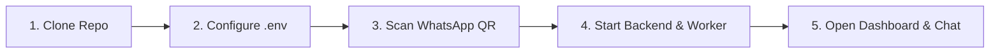

# ☕ EDITH — Autonomous AI Sales Agent Platform (WB-Agent)

> **Enterprise-grade, human-like autonomous conversational AI sales agent engineered for B2B wholesale conversion, intelligent consultative discovery, persistent memory, and deterministic pricing.**  
> Built for **North Bengal Tea Co.** (Direct estate producer of Darjeeling, Dooars, and Assam CTC teas).

[](https://www.python.org/)
[](https://fastapi.tiangolo.com/)
[](https://nextjs.org/)
[](https://build.nvidia.com/)
[](https://github.com/WhiskeySockets/Baileys)
[](LICENSE)

---

## ⚡ Super Fast Quickstart (Up & Running in 2 Minutes)

Get EDITH running on your local machine, connected to your WhatsApp number, and ready to respond to real buyers in a few simple steps.



---

### Step 1: Clone the Repository
```bash
git clone https://github.com/naborajs/wb-agent.git
cd wb-agent
```

---

### Step 2: Environment Setup
Copy the template configuration file:
```bash
cp .env.example .env
```
Ensure your `.env` contains:
```env
# AI Model (NVIDIA Nemotron 3.5 Lightning via NVIDIA NIM)
NVIDIA_API_KEY=your-nvapi-key-here
NVIDIA_BASE_URL=https://integrate.api.nvidia.com/v1
NVIDIA_MODEL=nvidia/nemotron-3.5-lightning-30b-a3b
LLM_PROVIDER=nvidia
LLM_MAX_TOKENS=2048
LLM_REQUEST_TIMEOUT=60

# WhatsApp Integration (Linked Device Bridge)
WHATSAPP_PROVIDER=bridge
WHATSAPP_BRIDGE_URL=http://localhost:3001
OWNER_WHATSAPP_NUMBER=+918900653250
```

---

### Step 3: Connect WhatsApp (Super Easy QR Scan)
Open a terminal and start the lightweight Baileys WhatsApp Bridge:
```bash
cd whatsapp-bridge
npm install
node index.js
```
👉 Open your browser at **[http://localhost:3001/qr](http://localhost:3001/qr)**:
1. Open **WhatsApp** on your bot phone (`+91 8918753100` or your test number).
2. Tap **Settings > Linked Devices > Link a Device**.
3. Scan the QR code shown on screen.
4. 🎉 **Connected!** The bridge is now linked and forwards incoming messages automatically.

---

### Step 4: Start the Backend & Worker
Open a new terminal at the project root (`wb-agent/`):
```bash
# 1. Install Python dependencies
pip install -r backend/requirements.txt

# 2. Seed catalog, demo leads, and pricing rules
python scripts/seed_demo.py

# 3. Start the FastAPI backend
python -m uvicorn app.main:app --app-dir backend --host 0.0.0.0 --port 8000
```

In another terminal, start the background job worker (processes sales turns and background thinking):
```bash
python -m app.jobs.worker
```

---

### Step 5: Start the Web Dashboard
Open another terminal:
```bash
cd dashboard
npm install
npm run dev
```
Open **[http://localhost:3000](http://localhost:3000)** to view the live sales operator console:
- **Live Inbox:** Real-time customer chat, dynamic 2-second auto-sync, scroll-to-bottom.
- **Human Takeover:** Click `Take Over` at any second to pause AI; click `Resume AI` to return control.
- **Customer Identity:** Inspect persistent memory, sales stage, lead score, and requirements.

---

## 🧪 Chat with EDITH (Testing & Verification)

### Option A: Send a WhatsApp Message
Send a message from any phone to your linked bot number (`+91 8918753100`):
> *"Bhai mujhe cafe ke liye tea chahiye, around 100kg monthly milk tea ke liye Siliguri me"*

Watch EDITH:
1. **Passively extract** business type (`Cafe`), monthly quantity (`100kg`), use case (`milk_tea`), and destination (`Siliguri`).
2. **Never repeat questions** you already answered.
3. Recommend **Assam Kadak CTC** or **Dooars Hotel Special Blend** with exact wholesale pricing and volume discounts.
4. Acknowledge price concerns or quality questions with estate-tested facts.
5. Stop selling immediately when you say *"I want to order, please send invoice"*, and alert the owner!

### Option B: Run Automated Multi-Turn Sales Simulation
Run our automated sales simulation script verifying all 4 turns:
```bash
$env:PYTHONPATH="backend"; python scripts/test_edith_multiturn.py
```
Run regression tests:
```bash
$env:PYTHONPATH="backend"; python -m pytest backend/tests/ -v
```

---

## 🌟 What Makes EDITH Different?

| Feature | Generic Chatbots | EDITH Sales Operating System |
| :--- | :--- | :--- |
| **Sales Methodology** | Scripted Q&A / FAQ | Consultative SPIN-style discovery; discovers before recommending |
| **Pricing Integrity** | Prone to hallucinations | **Deterministic**: 100% calculated from verified rules and MOQs |
| **Unknown Handling** | Guesses or makes up facts | **Zero Hallucination**: Escalates to owner (`+91 89006 53250`) via WhatsApp alert |
| **Memory** | Resets every session | **Persistent Multi-Tier**: Profile, requirements, past objections across dialogues |
| **Operator Safety** | Race condition if human types | **Atomic Pre-Send Check**: Aborts AI send if operator took over |
| **Follow-Ups** | Uncontrolled spam loops | **Bounded Analysis**: Contextual Day 1 / Day 3 sequences with auto-stop |

---

## 📂 Detailed Documentation Directory

All comprehensive architectural design records, operational runbooks, API schemas, and setup guides are organized inside the **[`docs/`](docs/)** folder:

### 🏛️ Architecture & Decisions
- **[System Architecture Overview](docs/architecture.md)**: High-level data flows, worker loops, and component diagrams.
- **[Architecture Decision Records (ADRs)](docs/decisions/)**:
  - [ADR-0001: PostgreSQL & pgvector as Primary Storage](docs/decisions/0001-postgresql-primary-storage.md)
  - [ADR-0002: Modular Monolith Architecture](docs/decisions/0002-modular-monolith-architecture.md)
  - [ADR-0003: Database-Backed Durable Job Queue](docs/decisions/0003-database-backed-queue.md)
  - [ADR-0004: Conversation-Level Distributed Locking](docs/decisions/0004-conversation-concurrency.md)
  - [ADR-0005: Multi-Provider LLM Abstraction](docs/decisions/0005-provider-abstraction.md)
  - [ADR-0006: Multi-Tier Memory & Fact Provenance](docs/decisions/0006-memory-architecture.md)
  - [ADR-0007: Knowledge Grounding & Authority Hierarchy](docs/decisions/0007-knowledge-rag-authority.md)
  - [ADR-0008: Atomic Pre-Send Human Takeover Protection](docs/decisions/0008-human-takeover-race-prevention.md)
  - [ADR-0009: Context-Aware Follow-Up Cancellation](docs/decisions/0009-followup-engine-cancellation.md)
  - [ADR-0010: Local-First Modular Monolith Deployment](docs/decisions/0010-local-first-architecture.md)
  - [ADR-0011: Dual WhatsApp Provider Architecture (Baileys + Meta Cloud)](docs/decisions/0011-whatsapp-adapter-architecture.md)

### 🛠️ Setup & Operations Runbooks
- **[Prerequisites & System Requirements](docs/setup/01-prerequisites-and-system-requirements.md)**
- **[Database & pgvector Setup](docs/setup/02-database-and-pgvector-setup.md)**
- **[Backend Fast Start Runbook](docs/setup/03-backend-setup.md)**
- **[Dashboard Frontend Setup](docs/setup/04-dashboard-frontend-setup.md)**
- **[WhatsApp Integration Guide](docs/setup/05-whatsapp-integration-guide.md)**
- **[NVIDIA Nemotron & LLM Configuration](docs/setup/06-nvidia-nemotron-and-llm-setup.md)**
- **[Owner Escalation Setup](docs/setup/07-owner-escalation-channel.md)**
- **[End-to-End Verification Runbook](docs/setup/08-end-to-end-verification.md)**
- **[API Reference Documentation](docs/api-reference.md)**
- **[Troubleshooting & Error Solutions Catalog](docs/troubleshooting/error-catalog-and-solutions.md)**

---

## 🔐 Contact Numbers & Configuration

- **Bot WhatsApp Number:** Configured through linked device bridge (`+91 8918753100`).
- **Owner Escalation WhatsApp:** Configured via `OWNER_WHATSAPP_NUMBER` (`+91 89006 53250`).
- **Demo Business:** North Bengal Tea Co. (Siliguri, West Bengal, India).
