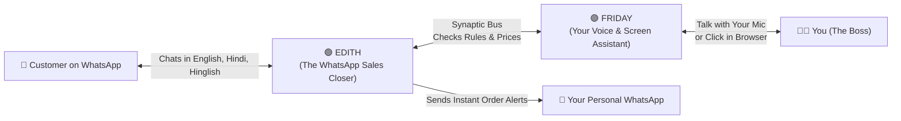
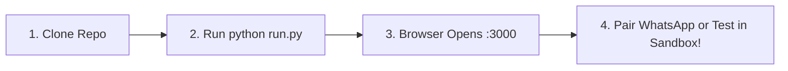

# 🚀 WhatsApp AI Agent by NS (EDITH + FRIDAY Dual-Brain AI Operating System)


> **An autonomous, industry-agnostic AI Sales & Operations Operating System engineered by Naboraj Sarkar (NS).**  
> Powered by two collaborative AI brains—**🟢 EDITH** *(Customer-Facing WhatsApp Sales Closer)* and **🟣 FRIDAY** *(Voice & Mission Control Supervisor)*—with zero-hallucination deterministic pricing, 1-click AI business auto-fill, persistent customer memory, and statutory GST PDF invoicing.

[](https://www.python.org/)
[](https://fastapi.tiangolo.com/)
[](https://nextjs.org/)
[](https://aistudio.google.com/)
[](https://build.nvidia.com/)
[](assets%20docs/guides/whatsapp-bridge-guide.md)
[](LICENSE)

---

## 🧭 Choose Your Guide (Built for Every Skill Level)

Whether you are a **15-year-old student** running your first AI project, a **business owner** setting up your store without writing code, or a **senior software architect** inspecting concurrency locks and WebSocket protocols, start with the guide tailored for you:

| Who Are You? | Best Starting Point | Deep-Dive Sub-Document |
| :--- | :--- | :--- |
| 🧒 **Beginner / Student (Age 12–15+)** | [Part 1: What Is This? (Simple Explanation)](#-part-1-what-is-this-project-explain-like-im-15) & [Part 2: 2-Minute Startup](#-part-2-run-everything-in-2-minutes-1-command) | 👉 **[Beginner & Student Quick-Start Guide](assets%20docs/guides/beginner-quick-start.md)** |
| 💼 **Business Owner / Store Manager** | [Part 3: Set Up Any Business in 10 Seconds](#-part-3-set-up-any-business-in-10-seconds-no-coding-needed) | 👉 **[Business Owner & Operator Playbook](assets%20docs/guides/business-owner-guide.md)** |
| 💻 **Senior Software Developer / Architect** | [Part 5: System Architecture & Engineering](#-part-5-system-architecture--engineering-for-senior-developers) | 👉 **[Senior Developer & Systems Architecture Reference](assets%20docs/guides/senior-developer-architecture.md)** |
| 📱 **WhatsApp & DevOps Integrator** | [Dual WhatsApp Gateway Controls](#-dual-whatsapp-gateway-unofficial-qr-bridge-vs-official-meta-cloud-api) | 👉 **[WhatsApp Connectivity Guide](assets%20docs/guides/whatsapp-bridge-guide.md)** & **[Production Runbook](assets%20docs/runbooks/production-deployment.md)** |
| 🔌 **API & Frontend Engineer** | [Part 6: Master Documentation Hub](#-part-6-complete-documentation-directory--redirection-hub) | 👉 **[Complete REST API & WebSocket Reference (137 Endpoints)](assets%20docs/api-reference.md)** |

---

## 🌟 Part 1: What Is This Project? (Explain Like I'm 15)

Imagine you run a business—like a **custom sneaker brand**, a **gaming PC shop**, a **bakery**, a **real estate agency**, or a **wholesale tea company**.

Every day, dozens of customers message your WhatsApp asking:
- *"How much does this cost?"*
- *"Can I get a 20% discount if I buy 50 units?"*
- *"Bhai, Kolkata me delivery kab tak milega?"* (in Hindi or Hinglish!)
- *"Please send me an official PDF invoice so I can pay."*

If you are busy or asleep, you miss sales. And if you connect a regular AI chatbot, it might **make up fake prices** or accidentally promise a **90% discount**!

### 💡 How WhatsApp AI Agent by NS Solves This: Two AI Brains Working Together

Instead of one basic chatbot, this platform gives you **two specialized AI teammates** that talk to each other:


```mermaid
flowchart LR
    Customer["📱 Customer on WhatsApp"] <-->|"Chats in English, Hindi, Hinglish"| EDITH["🟢 EDITH\n(The WhatsApp Sales Closer)"]
    EDITH <-->|"Synaptic Bus\nChecks Rules & Prices"| FRIDAY["🟣 FRIDAY\n(Your Voice & Screen Assistant)"]
    FRIDAY <-->|"Talk with Your Mic\nor Click in Browser"| You["🧑‍💻 You (The Boss)"]
    EDITH -->|"Sends Instant Order Alerts"| OwnerPhone["📲 Your Personal WhatsApp"]
```

1. **🟢 EDITH (The WhatsApp Sales Closer — Powered by NVIDIA NIM)**:
   - Replies to customers on WhatsApp 24/7 in **English, Hindi, Bengali, and Hinglish**.
   - Remembers every customer's name, company, city, and past orders so she **never asks the same question twice**.
   - Uses a **strict calculator** (`PricingService`) for prices, discounts, and GST taxes—she **never guesses or hallucinates numbers**.
   - Generates **PDF Pro-Forma Invoices** and sends them directly in WhatsApp.
   - Texts **your personal WhatsApp** the moment a buyer is ready to pay or needs human help!
2. **🟣 FRIDAY (Your Voice & Dashboard Assistant — Powered by Google Gemini Live)**:
   - Lives inside your web dashboard (`http://localhost:3000`).
   - You can **talk to her with your microphone** (just like Iron Man's assistant!).
   - Tell her *"Scroll down"*, *"Open the Analytics page and switch to dark mode"*, *"Give me today's morning briefing"*, or *"Explain the full website"*, and she controls the screen for you in real time!

> 📖 **Want the full step-by-step beginner walkthrough?** Read the **[Beginner & Student Guide (Explain Like I'm 15)](assets%20docs/guides/beginner-quick-start.md)**.

---

## ⚡ Part 2: Run Everything in 2 Minutes (1 Command)

You don't need Docker, complex database installations, or 4 separate terminal windows. A single command (`python run.py`) checks your computer, installs any missing packages, sets up a local SQLite database (`wb_agent.db`), and launches the entire platform at once!


```mermaid
flowchart LR
    A["1. Clone Repo"] --> B["2. Run python run.py"]
    B --> C["3. Browser Opens :3000"]
    C --> D["4. Pair WhatsApp or Test in Sandbox!"]
```

### 📋 Prerequisites
Make sure these 3 free tools are installed on your computer (Windows, macOS, or Linux):
- **Python 3.10+** (`python --version`) — [Download Python](https://www.python.org/downloads/)
- **Node.js 18+** with npm (`node --version`) — [Download Node.js](https://nodejs.org/)
- **Git** (`git --version`) — [Download Git](https://git-scm.com/)

---

### Step 1: Clone the Repository
```bash
git clone https://github.com/naborajs/wb-agent.git
cd wb-agent
```

### Step 2: (Optional) Add Free AI Keys — Or Run Zero-Config!
> 💡 **Zero-Config Ready:** You can skip this step and run `python run.py` immediately! Without API keys, the platform runs in built-in offline simulation mode with exact catalog math.

To enable live AI brains (**Google Gemini** for Friday & **NVIDIA NIM** for EDITH), copy `.env.example` to `.env` (or paste your keys later inside the Dashboard under `/integrations`):
```bash
cp .env.example .env
```
```env
GEMINI_API_KEY=your_google_gemini_api_key          # Free at https://aistudio.google.com/
NVIDIA_API_KEY=nvapi-your_nvidia_nim_api_key       # Free at https://build.nvidia.com/
```

### Step 3: Launch with the Master Orchestrator 🚀
```bash
python run.py
```

#### What `python run.py` does automatically:
1. **Pre-Flight Check & Port Cleanup**: Verifies Python & Node.js and frees ports `3000`, `3001`, and `8000` if any old process is stuck.
2. **Auto-Install Dependencies**: Installs Python packages (`backend/requirements.txt`), WhatsApp Bridge packages (`whatsapp-bridge`), and Next.js packages (`dashboard`).
3. **Zero-Config Database Initialization**: Initializes SQLite in WAL mode (`wb_agent.db`), seeds starter catalog items and volume discount tiers, and deduplicates multi-device WhatsApp `@lid` threads.
4. **Starts All 4 Services Simultaneously**:
   - 🖥️ **Next.js 14 Mission Control Dashboard**: `http://localhost:3000` *(auto-opens in your browser)*
   - ⚡ **FastAPI Backend & Swagger Docs**: `http://localhost:8000/api/v1/docs`
   - 📱 **WhatsApp Baileys Bridge**: `http://localhost:3001`
   - ⚙️ **Durable Background Worker**: Runs scheduled follow-ups, campaign drips, and background AI audits
5. **Clean Shutdown**: Press **`Ctrl+C`** once in the terminal anytime to stop all 4 services cleanly.

### 🌐 Running on a Cloud VPS / Linux Server / Presentation Machine
```bash
git pull origin main
python run.py --no-open      # Starts all services without launching a local browser window
```

---

## 🪄 Part 3: Set Up Any Business in 10 Seconds (No Coding Needed)

When you open **`http://localhost:3000`**, zero personal phone numbers are hardcoded. Click **`⚙️ Setup, WhatsApp & Features`** in the top navigation bar (or visit **`/settings`**) to configure your workspace:

### 1. ✨ AI Business Auto-Fill Architect (Describe Any Business in Plain English)
Don't want to fill out settings manually?
- In **`/settings`** (or **Step 2** of the Setup Modal), type a 1-sentence description of **any business**:
  > *"We run a solar rooftop and lithium battery inverter company called SunVolt Energy in Pune"*  
  > *"Artisanal bakery & corporate gift hamper brand called Maison Crumb"*
- Click **Auto-Fill Entire Business & Seed Catalog with AI** (`POST /api/v1/settings/ai-autofill-business`).
- The AI automatically populates all **16 commercial settings** (Brand Name, Industry, Tagline, Agent Role, Brand Tone, Target Audience, Currency, Measurement Unit, Max Discount %, Escalation Qty, GST/Tax %, Payment Terms, Return Policy, Supported Languages) **and seeds 4 tailored products with realistic prices** into your SQLite catalog!

### 2. 🏭 1-Click Industry Presets + Custom Preset Creator
Switch the entire platform between **6 built-in commercial verticals** with one click (`POST /api/v1/settings/industry-preset`), or save your own custom preset (`POST /api/v1/settings/custom-preset`):
- 🛍️ **E-Commerce & D2C Retail** (*NovaCart D2C Store* — units)
- 🏭 **B2B Wholesale & Manufacturing** (*Apex Industrial Supply Co.* — units)
- 💻 **SaaS, Cloud & Tech Agency** (*CloudScale AI Solutions* — seats / packages)
- 🏥 **Healthcare, Diagnostics & Clinics** (*MedCare Diagnostics & Wellness* — packages / sessions)
- 🏢 **Real Estate & Property Advisory** (*Skyline Premier Realty* — sq.ft)
- 🍵 **Tea Estates & Agro Commodities** (*Himalayan Tea & Agro Exports* — kg)
- ➕ **Save Current as New Preset**: Save any custom business configuration as a permanent 1-click preset card!

### 3. 📱 Dual WhatsApp Gateway: Unofficial QR Bridge vs. Official Meta Cloud API
Switch between two WhatsApp connection modes anytime in **`/settings`** or **Step 1 of the Setup Modal**:
- **📲 Unofficial Web Bridge (`Baileys :3001`)**: Scan the live **QR Code** from WhatsApp (*Linked Devices*) or enter any phone number to get an **8-Digit Pairing Code**. Click **"Switch / Connect a Different WhatsApp Number"** anytime to reset the session (`POST /api/v1/settings/whatsapp-reset`).
- **✅ Official Meta Cloud API (`Graph v20.0`)**: Enter your **Meta Phone Number ID**, **WABA ID**, **Permanent Access Token**, and **Webhook Verify Token** for enterprise green-tick WABA deployments.
- **🔔 Owner Escalation Phone**: Enter your personal WhatsApp number so EDITH texts you instant order confirmations, hot-lead summaries, and human handoff alerts.

### 4. ✨ Simplified Mode vs. 🛠️ Advanced Mode (+ 13 Feature Toggles)
Use the **`✨ Simplified` | `🛠️ Advanced`** toggle in the top bar at any time:
- **✨ Simplified Mode**: Clean, distraction-free workspace for everyday business owners—talk to Friday, check revenue, manage leads & orders, and reply in the WhatsApp inbox.
- **🛠️ Advanced Mode**: Unlocks all **17 platform routes**, including the **Dual-Brain Synaptic Console (`/brain`)**, **15-Model AI Playground (`/playground`)**, **Unified Knowledge Hub (`/knowledge`)**, and **Modular System Prompts (`/prompts`)**.
- **13 Granular Feature Toggles**: Turn individual sidebar modules ON or OFF in real time.

### 5. 🎙️ Voice & Multi-Task Agency with FRIDAY (`Gemini 3.1 Flash Live`)
Click the floating **FRIDAY Copilot** at the bottom-right of any page:
- **Live Talk Timer (`MM:SS`)**: Real-time session duration counter in both expanded and minimized views.
- **Universal Page & Section Scrolling**: Say *"Scroll down"*, *"Scroll to bottom"*, *"Scroll to top"*, or *"Scroll to the radar chart"*.
- **Multi-Step Compound Commands**: Say *"Open the analytics page, switch to dark mode, and scroll down"*—Friday executes every step sequentially.
- **Full Website Walkthrough**: Ask *"Explain the full website"* for a complete spoken tour of the platform.

> 📖 **Want the complete operator manual?** Read the **[Business Owner & Operator Playbook](assets%20docs/guides/business-owner-guide.md)**.

---

## 📸 Part 4: Visual Operations Tour & Brand Design

The interface features a **Dual-Theme Design System**—**Royal Pitch Black** (*Midnight Celestial*) and **Estate White** (*Daylight Operations*)—with official **NS / EDITH** brand emblems (`logo-transparent.png`, `logo-light.png`, `logo-icon.png`) and full mobile responsiveness.

### 1. Live 3-Panel Inbox & Conversational Sales Console (`/conversations`)
Real-time buyer conversations, 1-Click AI Draft Reply suggestions (`✨ AI Suggest Reply`), voice note transcription, customer memory profile, and atomic **Take Over / Resume AI** controls:


---

### 2. Dual-Brain Command Center & Synaptic Bus (`/` & `/brain`)
Powered by the **InterBrainMessage Synaptic Protocol** between **FRIDAY** (Google Gemini 3.1 Flash Live) and **EDITH** (NVIDIA NIM):
- **⚡ Live Inter-Brain Activity Ticker**: Real-time stream of margin defenses, DOM actions, and outbound quotes.
- **🎙️ Executive Morning Audio Briefing**: Spoken executive debrief of pipeline value, hot leads, and compute cost (`GET /api/v1/brain/briefing`).
- **🧠 Bidirectional Agency, Refusal Rights & Autonomous Fallback**: EDITH and Friday evaluate cross-brain requests independently, refuse policy or focus violations, and trigger autonomous notification fallbacks.
- **📈 24-Hour Inbound Traffic Velocity Heatmap**: Hourly resolution histogram (`GET /api/v1/brain/hourly-velocity`).
- **🎯 Executive Quick-Action Dock**: 1-click discount policy test, WhatsApp test ping, temporary RAG rule injection, and Safe Mode kill-switch.


---

### 3. Interactive Volume Discount Curve & Deterministic Pricing (`/pricing` & `/knowledge`)
Zero-hallucination pricing engine computing volume tiers, MOQs, customer segment rules, and statutory 5%/18% GST (`CGST + SGST` vs `IGST`) with an interactive quote simulator:


---

### 4. Model Architecture, 5-Role Router & 15-Model Playground (`/integrations` & `/playground`)
Assign any of the **15+ Google Gemini & NVIDIA NIM models** (`Nemotron-3 Ultra 550B`, `Super 120B`, `Nano Omni 30B`, `Llama 3.3 70B`, `DeepSeek R1`, `Gemini 2.5 Pro/Flash`) across 5 system roles with dual-key rotation, automatic `.env` persistence, and an interactive **Multi-Model Negotiation Arena (`/playground`)**:


---

### 5. Modular System Prompts Studio & Git Diff Viewer (`/prompts`)
Version-controlled system instructions across **7 dynamic prompt sections** (`core_safety`, `core_identity`, `business_policy`, `sales_style`, `business_profile`, `product_steering`, `escalation_rules`) + custom user-created sections, featuring **NemoTron AI prompt optimization**, **server-side git-style line diffs**, version pinning, and 1-click rollback:


---

### 6. Unified Knowledge Hub, Interactive Spreadsheet Editor & Vector RAG (`/knowledge`)
Consolidates **Product Catalog**, **Pricing Rules**, **Business Policies**, and **Agent Guidance** with an **Excel-like Interactive Spreadsheet Editor**, **Multi-Format Document Ingestion** (`PDF`, `DOCX`, `XLSX`, `CSV`, `JSON`, `MD`), **Agentic Chat Updater**, and **Semantic Vector RAG Tester**:

| Knowledge Base & Vector RAG | Product & Packaging Catalog |
| :---: | :---: |
|  |  |

---

### 7. Commercial Orders, Lead Pipeline & Anti-Ban Campaigns (`/orders`, `/leads`, `/campaigns`)
Full lifecycle management of B2B purchase orders and GST PDF invoices, E.164 CSV lead ingestion, and **Chat-Driven WhatsApp Campaigns** with randomized **25s–45s anti-ban jitter**:

| Wholesale Commercial Orders | Lead Intake & Pipeline | Automated B2B Campaigns |
| :---: | :---: | :---: |
|  |  |  |

---

### 8. Sales Intelligence, Follow-Up Cadence, Handoffs & Settings (`/analytics`, `/followups`, `/handoffs`, `/settings`)
Pareto 80/20 objection analytics with 1-click CSV export, context-aware Day 0/1/3 follow-ups with preflight auto-cancellation on reply, human escalation queue, and the AI Business Architect settings console:

| Sales Intelligence & Analytics | Follow-Up Sequences |
| :---: | :---: |
|  |  |
| **Human Escalations & Handoff Queue** | **AI Business Architect & Platform Settings** |
|  |  |

---

### 9. Mobile-First Responsive & Dual-Theme Architecture
Adaptive touch UI optimized for iOS Safari, Android Chrome, tablets, and 4K desktop monitors with 1-tap slide-over drawers and instant **Estate White** / **Royal Pitch Black** theme switching:

| Mobile Operations Center | Mobile Live Chat Stream |
| :---: | :---: |
|  |  |

---

## 🏛️ Part 5: System Architecture & Engineering (For Senior Developers)

> 📖 **Looking for the full architectural specification?** Read the **[Senior Software Engineer & Systems Architect Reference](assets%20docs/guides/senior-developer-architecture.md)** and **[System Architecture Deep Dive](assets%20docs/architecture.md)**.

### Architectural Highlights
| Subsystem | Engineering Implementation | Key Files |
| :--- | :--- | :--- |
| **15-Step Turn Orchestrator** | Conversation-scoped mutex (`conversation_locks`), passive fact extraction, 16-stage SPIN state machine, deterministic pricing injection, and atomic pre-send human takeover verification (`ADR-0008`). | `backend/app/agent/orchestrator.py`, `backend/app/conversations/locking.py` |
| **Dual-Brain Synaptic Bus** | Asynchronous `InterBrainBus` with bidirectional task delegation, independent margin/focus refusal rights (`ADR-0015`), and autonomous fallback to `AgentNotification`. | `backend/app/brain/inter_brain_bus.py`, `backend/app/api/routes/brain.py` |
| **5-Role Dynamic AI Router** | Routes across 18 Google Gemini & NVIDIA NIM models with dual-key rotation, sliding-window circuit breaker, and zero-config offline simulation fallback (`ADR-0026`). | `backend/app/ai/router.py`, `backend/app/ai/circuit_breaker.py` |
| **Ephemeral Voice Pipeline** | Server-side single-use token minting (`BidiGenerateContentConstrained`), 16kHz/24kHz PCM Web Audio streaming, DOM screen snapshots (`captureScreenSnapshot`), and 26 voice tools. | `dashboard/components/VoiceAgent.tsx`, `backend/app/api/routes/voice.py` |
| **Canonical `@lid` Deduplication** | Resolves WhatsApp multi-device Linked IDs (`@lid`) to canonical E.164 phone numbers and auto-consolidates duplicate conversation threads. | `whatsapp-bridge/index.js`, `backend/app/utils/phone.py` |
| **Rust 3D Mesh Generator** | Zero-dependency procedural Rust crate compiling Wavefront `.obj` meshes (`friday_orb.obj` & `edith_core.obj`) rendered via Three.js WebGL cores. | `rust-models/src/`, `dashboard/components/3d/` |
| **Resilient Storage & Queue** | Zero-config SQLite WAL (`wb_agent.db`) default + auto-upgrading PostgreSQL 16 `pgvector` support, backed by a transactional `FOR UPDATE SKIP LOCKED` job worker. | `backend/app/database/session.py`, `backend/app/jobs/worker.py` |

### Developer CLI Flags & Testing Suite
```bash
# Master Orchestrator Flags
python run.py                # Full preflight check, auto-install, DB seed, and 4-service launch
python run.py --skip-install # Instant warm reboot (skips pip/npm dependency checks)
python run.py --no-open      # Headless server launch without opening browser windows
python run.py --clean        # Frees ports 3000/3001/8000, cleans caches, and restarts fresh

# 4-Tier Automated Verification Suite
$env:PYTHONPATH="backend"; python -m pytest backend/tests/unit -v        # 43 Unit Test Modules
python run_e2e_tests.py                                                  # 60 End-to-End Contract Tests
$env:PYTHONPATH="backend"; python -m pytest backend/tests/evaluation -v  # Adversarial & Persona Tests
python scripts/smoke_test.py                                             # Live API Smoke Test
```

### ❓ Quick Troubleshooting & FAQ
| Common Issue | Cause | Solution |
| :--- | :--- | :--- |
| **Port 3000 / 3001 / 8000 in use** | A previous process was left running | `python run.py` automatically clears stale port locks on startup, or run `python run.py --clean`. |
| **PowerShell script policy error** | Windows blocks running `npm` in PowerShell | Run `Set-ExecutionPolicy -Scope Process -ExecutionPolicy Bypass` in PowerShell, or use `cmd`. |
| **How to test without WhatsApp?** | Testing offline or before scanning QR | Use the **Live Inbound Simulation** card on `http://localhost:3000` or the `/conversations` Sandbox tab. |
| **How to switch WhatsApp phones?** | Linking a different phone number | Open `⚙️ Setup, WhatsApp & Features` -> Step 1 -> click **"Switch / Connect a Different WhatsApp Number"**. |

---

## 📚 Part 6: Complete Documentation Directory & Redirection Hub

All documentation is organized inside **[`assets docs/`](assets%20docs/)** and hyperlinked below:

### 🧭 Role-Based Guides (`assets docs/guides/`)
- 🧒 **[Beginner & Student Quick-Start Guide (Explain Like I'm 15)](assets%20docs/guides/beginner-quick-start.md)**
- 💼 **[Business Owner & Operator Playbook (No-Code Setup & Daily Operations)](assets%20docs/guides/business-owner-guide.md)**
- 🏛️ **[Senior Software Engineer & Systems Architect Reference](assets%20docs/guides/senior-developer-architecture.md)**
- 🛠️ **[Developer Onboarding & Local Environment Guide](assets%20docs/guides/developer-onboarding.md)**
- 📱 **[WhatsApp Connectivity Guide (Unofficial Baileys QR vs. Official Meta Cloud API)](assets%20docs/guides/whatsapp-bridge-guide.md)**

### 🏛️ Core Architecture & Reference (`assets docs/`)
- 🗺️ **[Master Knowledge Base Index (Obsidian MOC)](assets%20docs/index.md)**
- 📐 **[System Architecture Deep Dive](assets%20docs/architecture.md)**
- 🔌 **[Complete REST API & WebSocket Reference (All 137 Endpoints)](assets%20docs/api-reference.md)**
- 🖥️ **[Dashboard Visual Operations Tour (All 17 Routes)](assets%20docs/visual-tour.md)**
- 🎙️ **[Voice Agent Architecture & Security Specification](VOICE-AGENT.md)**
- 🔄 **[16-Stage Conversational Sales State Machine](assets%20docs/architecture/conversational-state-machine.md)**
- 🧮 **[Deterministic Pricing & GST Engine](assets%20docs/architecture/deterministic-pricing-engine.md)**
- 🧠 **[Multi-Tier Memory & Customer Profiling System](assets%20docs/architecture/multi-tier-memory-system.md)**
- ⚙️ **[Durable Job Queue & Worker Architecture](assets%20docs/architecture/durable-queue-and-worker.md)**
- 🤝 **[Consultative SPIN Sales Framework](assets%20docs/sales/consultative-framework.md)**
- 🛡️ **[Security & Threat Model](assets%20docs/security/threat-model.md)**
- 📋 **[Platform Changelog (`v2.4.0`)](assets%20docs/CHANGELOG.md)**

### 🚀 Setup, Operations & Troubleshooting Runbooks
- **[01. Prerequisites & System Requirements](assets%20docs/setup/01-prerequisites-and-system-requirements.md)**
- **[02. Database Setup (Zero-Config SQLite WAL & PostgreSQL pgvector)](assets%20docs/setup/02-database-and-pgvector-setup.md)**
- **[03. FastAPI Backend Setup](assets%20docs/setup/03-backend-setup.md)**
- **[04. Next.js 14 Dashboard Setup](assets%20docs/setup/04-dashboard-frontend-setup.md)**
- **[05. WhatsApp Integration Guide](assets%20docs/setup/05-whatsapp-integration-guide.md)**
- **[06. NVIDIA NIM & Gemini LLM Setup](assets%20docs/setup/06-nvidia-nemotron-and-llm-setup.md)**
- **[07. Owner Escalation Channel Setup](assets%20docs/setup/07-owner-escalation-channel.md)**
- **[08. End-to-End Verification Runbook](assets%20docs/setup/08-end-to-end-verification.md)**
- **[09. Production Deployment Checklist](assets%20docs/setup/09-production-deployment-checklist.md)**
- **[Operations Runbook & Emergency Kill-Switch](assets%20docs/operations-runbook.md)**
- **[Production Deployment Runbook](assets%20docs/runbooks/production-deployment.md)**
- **[Incident Response Playbook](assets%20docs/runbooks/incident-response.md)**
- **[Troubleshooting & Error Solutions Catalog](assets%20docs/troubleshooting/error-catalog-and-solutions.md)**
- **[E2E Test Infrastructure (`TEST_INFRA.md`)](TEST_INFRA.md)** & **[E2E Verification Report (`TEST_READY.md`)](TEST_READY.md)**

<details>
<summary>📜 <b>View All 26 Architecture Decision Records (ADR-0001 to ADR-0026)</b></summary>

1. [ADR-0001: Primary Storage & Vector Architecture](assets%20docs/decisions/0001-postgresql-primary-storage.md)
2. [ADR-0002: Modular Monolith Architecture](assets%20docs/decisions/0002-modular-monolith-architecture.md)
3. [ADR-0003: Database-Backed Durable Job Queue](assets%20docs/decisions/0003-database-backed-queue.md)
4. [ADR-0004: Conversation-Level Single-Turn Mutex](assets%20docs/decisions/0004-conversation-concurrency.md)
5. [ADR-0005: Multi-Provider LLM & Channel Abstraction](assets%20docs/decisions/0005-provider-abstraction.md)
6. [ADR-0006: Multi-Tier Memory & Fact Provenance](assets%20docs/decisions/0006-memory-architecture.md)
7. [ADR-0007: Knowledge Grounding & Authority Hierarchy](assets%20docs/decisions/0007-knowledge-rag-authority.md)
8. [ADR-0008: Atomic Pre-Send Human Takeover Protection](assets%20docs/decisions/0008-human-takeover-race-prevention.md)
9. [ADR-0009: Context-Aware Follow-Up Cancellation](assets%20docs/decisions/0009-followup-engine-cancellation.md)
10. [ADR-0010: Local-First Modular Monolith Deployment](assets%20docs/decisions/0010-local-first-architecture.md)
11. [ADR-0011: Dual WhatsApp Provider Architecture (Baileys + Meta Cloud)](assets%20docs/decisions/0011-whatsapp-adapter-architecture.md)
12. [ADR-0012: In-Chat Operator Correction Learning](assets%20docs/decisions/0012-operator-correction-learning.md)
13. [ADR-0013: Modular Prompt Versioning & Rollback](assets%20docs/decisions/0013-modular-prompt-versioning.md)
14. [ADR-0014: Auditable Commercial Quotes & Expiry](assets%20docs/decisions/0014-auditable-commercial-quotes.md)
15. [ADR-0015: Dual-Brain Bidirectional Agency, Refusal Rights & Autonomous Fallback](assets%20docs/decisions/0015-dual-brain-bidirectional-agency-and-refusal.md)
16. [ADR-0016: Campaign Orchestration, Rate-Limiting Jitter & Anti-Ban Guards](assets%20docs/decisions/0016-campaign-orchestration-and-anti-ban-guards.md)
17. [ADR-0017: Resilient SQLite WAL & Automated Schema Migrations](assets%20docs/decisions/0017-resilient-sqlite-and-schema-migrations.md)
18. [ADR-0018: WhatsApp Sliding-Window Rate Limiting & Ban Prevention](assets%20docs/decisions/0018-whatsapp-rate-limiting-and-ban-prevention.md)
19. [ADR-0019: Automated Vector PDF Invoicing, GST Compliance & Quote Lifecycle](assets%20docs/decisions/0019-invoicing-gst-and-quote-lifecycle.md)
20. [ADR-0020: Next.js 14 Frontend Architecture & Synaptic Observability](assets%20docs/decisions/0020-frontend-architecture-and-observability.md)
21. [ADR-0021: Multi-Currency Pricing & Internationalization](assets%20docs/decisions/0021-multi-currency-pricing-and-internationalization.md)
22. [ADR-0022: Simulation Sandbox Isolation & Outbox Guardrails](assets%20docs/decisions/0022-simulation-sandbox-isolation-and-live-whatsapp-guardrails.md)
23. [ADR-0023: Conversation History Lifecycle & Database VACUUM Maintenance](assets%20docs/decisions/0023-conversation-history-lifecycle-and-database-management.md)
24. [ADR-0024: WhatsApp Group Message AI Suppression & Operator Alerts](assets%20docs/decisions/0024-whatsapp-group-message-suppression-and-operator-notification.md)
25. [ADR-0025: One-Click AI Reply Suggestions & Omnipotent Friday Agency](assets%20docs/decisions/0025-one-click-ai-suggestion-and-omnipotent-friday-agency.md)
26. [ADR-0026: Dynamic 5-Role Model Assignment & Zero-Cost NVIDIA NIM Playground](assets%20docs/decisions/0026-dynamic-model-assignment-and-zero-cost-nvidia-playground.md)

</details>

---

## 🔐 Platform Identity & Configuration

- **Platform Identity**: **WhatsApp AI Agent by NS** (*EDITH + FRIDAY Autonomous Sales & Operations OS*)
- **Creator & Lead Architect**: **Naboraj Sarkar (NS)**
- **Bot WhatsApp Channel**: Dynamically linked via QR Code / 8-Digit Pairing Code (`:3001`) or Official Meta Cloud API (`v20.0`)
- **Owner Escalation Channel**: Configurable in Dashboard Setup Modal (`/settings`) or via `OWNER_WHATSAPP_NUMBER` in `.env`
- **License**: [Apache License 2.0](LICENSE)
