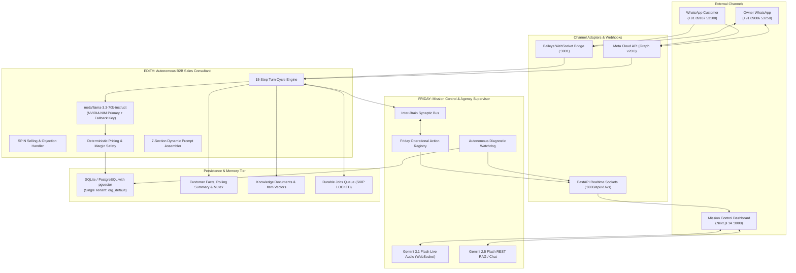
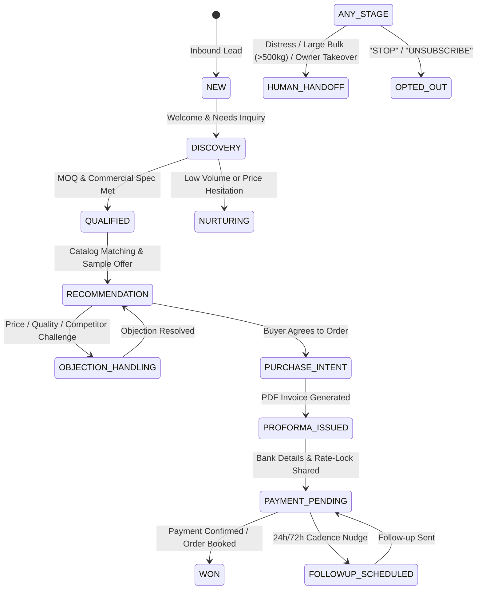
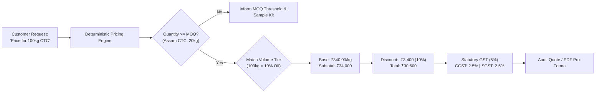

# 🏛️ WB-Agent Enterprise System Architecture Deep Dive

> [!NOTE]
> This document details the end-to-end technical architecture of **WB-Agent (EDITH & FRIDAY)**, the autonomous B2B sales and operations operating system powering commercial wholesale conversations, deterministic pricing, and multi-channel orchestration.

---

## 1. Dual-Brain Cognitive System Topology

WB-Agent implements a decoupled dual-brain architecture that separates real-time customer negotiations from internal operational intelligence and diagnostic agency:

---

## 2. 15-Step Conversational Turn Decision Cycle

Every inbound WhatsApp turn processed by `AgentOrchestrator` executes through a strictly sequenced 15-step cycle:

1. **Webhook Ingestion**: Fast edge reception, HMAC-SHA256 signature verification, and deduplication via `provider_message_id`.
2. **Turn-Level Mutex**: Acquires atomic lock on `Conversation.id` (`conversation_locks`) to eliminate race conditions from rapid successive user messages.
3. **Context Assembly**: Loads rolling recent turns, conversation summary, long-term customer memory, and preferred language without token bloat.
4. **Language & Intent Recognition**: Classifies language (English, Hindi, Bengali, Hinglish) and intent (`opt_out`, `human_request`, `purchase_intent`, `objection`, `price_inquiry`, `sample_request`, `product_inquiry`).
5. **Opt-Out Compliance**: If opt-out is detected, updates `Customer.opt_in_status = False`, records timestamp, transitions stage to `OPTED_OUT`, and dispatches immediate acknowledgment.
6. **Explicit Human Request**: If human requested, marks conversation mode `HUMAN`, records `Handoff`, and dispatches owner alert.
7. **Purchase Intent Detection**: If ready to purchase, transitions stage to `PURCHASE_INTENT`, raises lead score, creates handoff, and dispatches hot buyer alert to `+91 89006 53250`.
8. **Knowledge RAG Retrieval**: If information required, executes cosine similarity search over `knowledge_items` and `knowledge_chunks` with source attribution.
9. **Deterministic Pricing Calculation**: If pricing or quote requested, queries `PricingService` to calculate volume tier discounts and enforce the 5% autonomous discount ceiling.
10. **LLM Generation**: Synthesizes response via `AIRouter` using configured `EDITH_SALES_MODEL` (`meta/llama-3.3-70b-instruct`) with dual-key rotation.
11. **Defensive Validation**: Runs `ResponseValidator` to enforce factual grounding, block unverified financial commitments, and sanitize against prompt injection.
12. **Atomic Pre-Send State Check (ADR-008)**: Re-queries `Conversation.mode`. If human operator engaged while LLM was generating, outbound AI message is suppressed.
13. **Outbound Dispatch**: Sends message via active `WhatsAppProvider` (Baileys or Meta Cloud API).
14. **Customer Memory & Summary Update**: Extracts new verified facts and updates semantic summary asynchronously.
15. **Audit Logging & Lock Release**: Commits `AgentRun` and `ToolCall` records, releases mutex, and broadcasts real-time updates via WebSockets.

---

## 3. Consultative Sales State Machine (16 Stages)

---

## 4. Deterministic Pricing & Margin Safety (ADR-007, ADR-0014)

> [!CAUTION]
> The AI Language Model is **NEVER** allowed to do mathematical pricing calculations or invent volume discounts. All pricing is computed deterministically from `pricing_rules` rows in the database.

- **Autonomous Discount Authority**: Up to **5.0%** autonomously. Any higher discount requires explicit human approval.
- **Statutory Taxes**: 5% GST breakdown computed dynamically based on interstate (`IGST`) vs intrastate (`CGST` + `SGST`) delivery destination.
- **Rate-Lock Guarantee**: Pro-forma invoices lock price for **7 days** with automatic expiry tracking.

---

## 5. Database Domain Model (35 Core Entities)

The database schema is partitioned across 7 logical domains:

1. **Tenancy & Access**: `Organization`, `User`, `ApiKey` (Normalized to `org_default`).
2. **CRM & Lead Lifecycle**: `Lead`, `Customer`, `Deal`, `LeadEvent`.
3. **Conversations & Memory**: `Conversation`, `Message`, `MessageStatus`, `ConversationSummary`, `CustomerMemory`.
4. **Catalog, Pricing & Orders**: `Product`, `ProductVariant`, `PricingRule`, `ProductCustomField`, `PricingRuleVersion`, `Inventory`, `Order`, `OrderItem`, `Quote`, `QuoteItem`.
5. **Knowledge & RAG**: `KnowledgeDocument`, `KnowledgeChunk`, `KnowledgeItem`, `KnowledgeCategory`, `HumanKnowledgeRequest`, `KnowledgeCandidate`, `CustomerProfileVersion`.
6. **Campaigns & Outreach**: `Campaign`, `CampaignLead`, `FollowupJob`, `Job`.
7. **Governance, Auditing & Inter-Brain**: `AgentRun`, `AgentEvent`, `ToolCall`, `SalesEvent`, `Handoff`, `Notification`, `AgentNotification`, `InterBrainMessage`, `WatchdogAlert`, `AuditLog`, `VoiceAuditLog`, `SalesLearning`, `PromptSection`, `PromptVersion`.

---

## 6. Real-Time Telemetry & Failover Matrix

| Service | Primary Provider | Fallback Provider | Fallback Trigger |
| :--- | :--- | :--- | :--- |
| **Sales Brain (EDITH)** | NVIDIA NIM `meta/llama-3.3-70b-instruct` | NVIDIA NIM Fallback Key (`NVIDIA_API_KEY_FALLBACK`) | 429, 500, 503, Network Timeout (25s) |
| **Agency / Supervisor (FRIDAY)** | Google Gemini `gemini-2.5-flash` | Gemini Fallback Key (`GEMINI_API_KEY_FALLBACK`) | Rate limit (429), Model quota, Timeout (30s) |
| **Live Voice Streaming** | Google Gemini Live `gemini-3.1-flash-live-preview` | Local TTS / REST Audio Synthesis | WebSocket disconnect, quota exhaustion |
| **Diagnostic Watchdog** | `openai/gpt-oss-20b` (NVIDIA NIM) | `nvidia/nemotron-3.5-lightning-30b-a3b` | 429, 500, circuit breaker trip |
| **WhatsApp Channel** | Self-Hosted Baileys Bridge (:3001) | Meta Cloud API (Graph v20.0) | Bridge disconnect, heartbeat failure |
| **Database** | PostgreSQL 16 with pgvector | Local SQLite with aiosqlite | Postgres connection refused, network partition |

---

*WB-Agent Enterprise System Architecture · Designed for 99.9% Uptime and Zero Hallucination B2B Operations*
