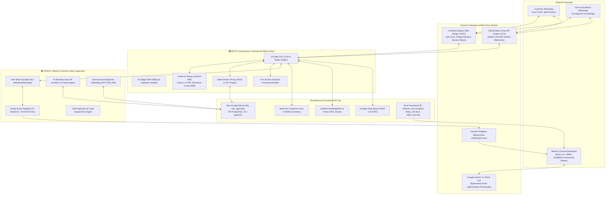
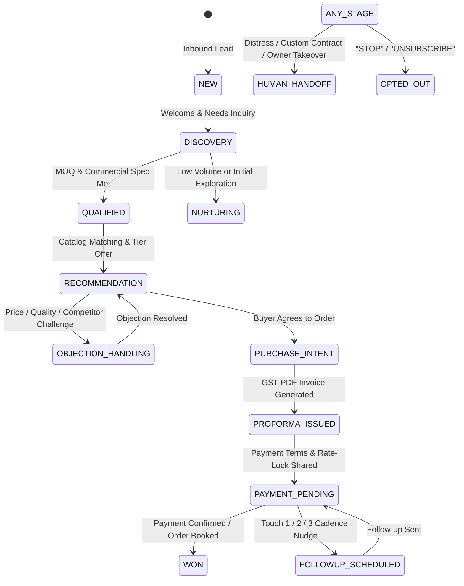
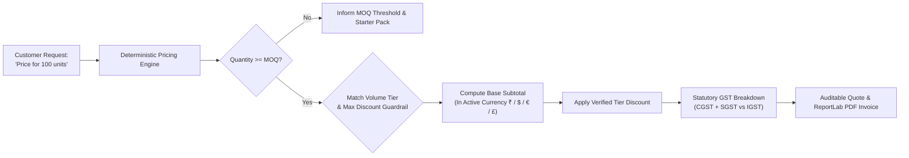

# 🏛️ WhatsApp AI Agent by NS — Enterprise System Architecture Deep Dive

> [!NOTE]
> **Architected & Engineered by [Naboraj Sarkar (NS)](https://naborajs.me)**  
> 📖 **Official Live Documentation**: [naborajs.me/projects/whatsapp-ai-agent-dual-brain/docs](https://naborajs.me/projects/whatsapp-ai-agent-dual-brain/docs)  
> 🌐 **Chapter Reference**: [Chapter 1: Dual-Brain Cognitive Architecture](https://naborajs.me/docs/whatsapp-ai-agent/ch-1-dual-brain)  
> 📰 **Origin Story**: [The Idea Behind EDITH WhatsApp AI Agent](https://naborajs.me/blog/the-idea-behind-edith-whatsapp-ai-agent-by-ns)  
>
> This document details the end-to-end technical architecture of **WhatsApp AI Agent by NS (EDITH & FRIDAY)**, the industry-agnostic autonomous AI sales and operations operating system powering WhatsApp negotiations, deterministic pricing, live voice DOM control, and multi-channel orchestration.
> - Looking for a beginner overview? Read **[[guides/beginner-quick-start|Beginner Quick-Start (ELI15)]]**.
> - Looking for code-level engineering specs? Read **[[guides/senior-developer-architecture|Senior Developer & Systems Architect Reference]]**.

---

## 1. Dual-Brain Cognitive System Topology

The platform implements a decoupled **Dual-Brain Cognitive Architecture** (`ADR-0015`) that separates real-time customer negotiations (**🟢 EDITH**) from internal operational intelligence and voice/UI agency (**🟣 FRIDAY**):

```mermaid
flowchart TB
    subgraph Channels["External Channels"]
        WA["Customer WhatsApp\n(Any E.164 / @lid Device)"]
        Owner["Owner Escalation WhatsApp\n(Configured via /settings)"]
        UI["Mission Control Dashboard\n(Next.js 14 :3000 | Simplified & Advanced Modes)"]
    end

    subgraph Adapters["Channel Gateways & Real-Time Sockets"]
        Baileys["Unofficial Baileys Web Bridge (:3001)\n(QR Scan, 8-Digit Pairing & Session Reset)"]
        Meta["Official Meta Cloud API (Graph v20.0)\n(HMAC-SHA256 Verified Webhooks)"]
        WS_Server["FastAPI Realtime WebSockets (:8000/api/v1/ws)"]
        GeminiLive["Google Gemini 3.1 Flash Live\n(Ephemeral Token 16kHz/24kHz PCM Audio)"]
    end

    subgraph EDITH_Brain["🟢 EDITH: Autonomous Commercial Sales Closer"]
        direction TB
        TurnEngine["15-Step Turn Cycle & Mutex Engine"]
        SPIN["16-Stage SPIN Selling & Objection Handler"]
        PriceCalc["Deterministic Pricing, MOQ & GST Engine"]
        PromptAssembler["7+N Section Dynamic Prompt Assembler"]
        EDITH_Model["5-Role AI Router (NVIDIA NIM)\nLlama 3.3 70B / Nemotron-3 Ultra 550B"]
    end

    subgraph FRIDAY_Brain["🟣 FRIDAY: Mission Control & Voice Supervisor"]
        direction TB
        AgenticBus["Inter-Brain Synaptic Bus (InterBrainMessage)"]
        ActionReg["Friday Action Registry (27 Backend + 26 DOM Tools)"]
        BizArchitect["AI Business Auto-Fill Architect & Preset Engine"]
        CodeDiag["Self-Inspection & Code Diagnostics Engine"]
        Watchdog["Autonomous Diagnostic Watchdog (GPT-OSS 20B)"]
    end

    subgraph Storage["Persistence & Procedural 3D Tier"]
        DB["Zero-Config SQLite WAL (wb_agent.db)\nOR PostgreSQL 16 + pgvector"]
        Memory["Multi-Tier Customer Facts & Rolling Summary"]
        Vector["Unified KnowledgeItem & Vector RAG Chunks"]
        Queue["Durable Jobs Queue (SKIP LOCKED)"]
        Rust3D["Rust Procedural 3D Meshes (rust-models/)\nfriday_orb.obj & edith_core.obj"]
    end

    WA <--> Baileys & Meta
    Baileys & Meta <--> TurnEngine
    TurnEngine <--> EDITH_Model & PriceCalc & PromptAssembler
    PriceCalc <--> DB
    TurnEngine <--> AgenticBus <--> ActionReg
    ActionReg --> WS_Server --> UI
    UI <--> GeminiLive
    BizArchitect & Watchdog <--> DB
    TurnEngine <--> Memory & Vector & Queue
    Owner <--> Baileys & Meta
    Rust3D --> UI
```

---

## 2. 15-Step Conversational Turn Decision Cycle (`AgentOrchestrator`)

Every inbound WhatsApp turn processed by `AgentOrchestrator` (`backend/app/agent/orchestrator.py`) executes through a strictly sequenced 15-step cycle:

1. **Webhook Ingestion & Canonical `@lid` Resolution**: Verifies HMAC-SHA256 signatures, deduplicates `provider_message_id`, and resolves multi-device Linked IDs (`@lid`) into canonical E.164 phone numbers (`app/utils/phone.py`).
2. **Group Chat Suppression (`ADR-0024`)**: If the message originates from a WhatsApp group (`@g.us`), forces `Conversation.mode = "HUMAN"`, suppresses AI auto-reply, and alerts the operator.
3. **Turn-Level Mutex (`ADR-0004`)**: Acquires an atomic lock on `Conversation.id` (`conversation_locks`) to eliminate race conditions from rapid multi-message bursts.
4. **Multi-Tier Context Assembly (`ADR-0006`)**: Loads rolling recent turns, compressed `ConversationSummary`, long-term `CustomerMemory` facts, and active workspace business rules (`.workspace_config.json`).
5. **Language, Dialect & Intent Classification**: Classifies dialect (English, Hindi, Bengali, Hinglish) and intent (`opt_out`, `human_request`, `purchase_intent`, `objection`, `price_inquiry`, `sample_request`, `product_inquiry`).
6. **Opt-Out Compliance**: If `STOP` / `UNSUBSCRIBE` is detected, sets `Customer.opt_in_status = False`, cancels all pending `FollowupJob` records, transitions stage to `OPTED_OUT`, and sends acknowledgment.
7. **Sentiment Distress & Explicit Human Request**: Runs `analyze_sentiment`. If high distress or human request is detected, switches conversation mode to `HUMAN`, creates a `Handoff`, and dispatches an owner WhatsApp alert.
8. **Purchase Intent & Escalation Check**: If buyer agrees to order or requests quantity above `escalation_qty`, transitions stage to `PURCHASE_INTENT`, raises lead score, creates a handoff, and alerts the configured `OWNER_WHATSAPP_NUMBER`.
9. **Unified Knowledge RAG Retrieval (`ADR-0007`)**: Executes hybrid vector + keyword retrieval over active `KnowledgeItem` and `KnowledgeChunk` records.
10. **Deterministic Pricing Calculation (`ADR-0014`)**: Queries `PricingService` to compute base prices, volume tier discounts, MOQ checks, and autonomous discount ceilings (`max_discount_pct`).
11. **7+N Dynamic Prompt Assembly (`ADR-0013`)**: Assembles active versions of all enabled prompt sections (`core_safety`, `core_identity`, `business_policy`, `sales_style`, `business_profile`, `product_steering`, `escalation_rules`, plus custom sections).
12. **Multi-Provider LLM Synthesis**: Generates response via `AIRouter` using the configured `edith_sales_model` with dual-key rotation and chained fallback models.
13. **Defensive Pricing & Safety Validation**: Runs `ResponseValidator` and `pricing_validator` to block hallucinated prices or prompt injection attempts.
14. **Atomic Pre-Send State Check (`ADR-0008`)**: Re-queries `Conversation.mode` immediately before dispatch. If a human operator clicked **Take Over** while the LLM was generating, the AI message is aborted.
15. **Outbound Dispatch, Memory Extraction & Broadcast**: Sends message via active `WhatsAppProvider` (`baileys_bridge` or `meta_cloud`), extracts new customer facts asynchronously, releases the mutex, and broadcasts WebSocket events.

---

## 3. Consultative Sales State Machine (16 Stages)

```mermaid
stateDiagram-v2
    [*] --> NEW: Inbound Lead
    NEW --> DISCOVERY: Welcome & Needs Inquiry
    DISCOVERY --> QUALIFIED: MOQ & Commercial Spec Met
    DISCOVERY --> NURTURING: Low Volume or Initial Exploration
    QUALIFIED --> RECOMMENDATION: Catalog Matching & Tier Offer
    RECOMMENDATION --> OBJECTION_HANDLING: Price / Quality / Competitor Challenge
    OBJECTION_HANDLING --> RECOMMENDATION: Objection Resolved
    RECOMMENDATION --> PURCHASE_INTENT: Buyer Agrees to Order
    PURCHASE_INTENT --> PROFORMA_ISSUED: GST PDF Invoice Generated
    PROFORMA_ISSUED --> PAYMENT_PENDING: Payment Terms & Rate-Lock Shared
    PAYMENT_PENDING --> WON: Payment Confirmed / Order Booked
    PAYMENT_PENDING --> FOLLOWUP_SCHEDULED: Touch 1 / 2 / 3 Cadence Nudge
    FOLLOWUP_SCHEDULED --> PAYMENT_PENDING: Follow-up Sent
    ANY_STAGE --> HUMAN_HANDOFF: Distress / Custom Contract / Owner Takeover
    ANY_STAGE --> OPTED_OUT: "STOP" / "UNSUBSCRIBE"
```

---

## 4. Deterministic Pricing, Multi-Industry Units & Statutory GST (`ADR-0014`, `ADR-0019`, `ADR-0021`)

> [!CAUTION]
> The AI Language Model is **NEVER** allowed to invent product prices or calculate invoice totals. All math is computed deterministically by `PricingService` and `InvoiceGenerator` in Python.

```mermaid
flowchart LR
    Inbound["Customer Request:\n'Price for 100 units'"] --> Engine["Deterministic Pricing Engine"]
    Engine --> CheckMOQ{"Quantity >= MOQ?"}
    CheckMOQ -- No --> RejectMOQ["Inform MOQ Threshold & Starter Pack"]
    CheckMOQ -- Yes --> TierCheck{"Match Volume Tier\n& Max Discount Guardrail"}
    TierCheck --> BasePrice["Compute Base Subtotal\n(In Active Currency ₹ / $ / € / £)"]
    BasePrice --> Discount["Apply Verified Tier Discount"]
    Discount --> TaxCalc["Statutory GST Breakdown\n(CGST + SGST vs IGST)"]
    TaxCalc --> Proforma["Auditable Quote & ReportLab PDF Invoice"]
```

- **Multi-Industry Units & Currencies**: Supports any measurement unit (`unit`, `kg`, `seat`, `package`, `sq.ft`, `lot`, `system`) and 6 international currencies (`INR ₹`, `USD $`, `EUR €`, `GBP £`, `AED د.إ`, `SGD S$`).
- **Autonomous Discount Authority**: Configurable in `/settings` (`max_discount_pct`, default `5%–12%`). Any discount request above this ceiling triggers a human handoff.
- **Statutory Tax & Rate-Lock**: Computes intrastate (`CGST + SGST`) vs. interstate (`IGST`) tax breakdowns and locks pro-forma invoice rates for **7 days**.

---

## 5. Database Domain Model (35 Core Entities + `.workspace_config.json`)

The persistence layer runs out-of-the-box on **SQLite 3 in WAL mode (`wb_agent.db`)** and scales seamlessly to **PostgreSQL 16 with `pgvector`** across 7 logical domains:

1. **Tenancy & Access**: `Organization`, `User`, `ApiKey` (Normalized to `org_default` / `default`).
2. **CRM & Lead Lifecycle**: `Lead`, `Customer`, `Deal`, `LeadEvent`.
3. **Conversations & Memory**: `Conversation`, `Message`, `MessageStatus`, `ConversationSummary`, `CustomerMemory`.
4. **Catalog, Pricing & Orders**: `Product`, `ProductVariant`, `PricingRule`, `ProductCustomField`, `PricingRuleVersion`, `Inventory`, `Order`, `OrderItem`, `Quote`, `QuoteItem`.
5. **Unified Knowledge & RAG**: `KnowledgeItem` (unified catalog, pricing, policy & guide store with `spreadsheet_data`), `KnowledgeDocument`, `KnowledgeChunk`, `KnowledgeCategory`, `HumanKnowledgeRequest`, `KnowledgeCandidate`, `CustomerProfileVersion`.
6. **Campaigns & Outreach**: `Campaign`, `CampaignLead`, `FollowupJob`, `Job`.
7. **Governance, Auditing & Inter-Brain**: `AgentRun`, `AgentEvent`, `ToolCall`, `SalesEvent`, `Handoff`, `Notification`, `AgentNotification`, `InterBrainMessage`, `WatchdogAlert`, `AuditLog`, `VoiceAuditLog`, `SalesLearning`, `PromptSection`, `PromptVersion`.

---

## 6. 5-Role Dynamic AI Router & Failover Matrix (`ADR-0026`)

| System Role / Service | Primary Provider & Default Model | Fallback Chain & Trigger |
| :--- | :--- | :--- |
| **Sales Brain (`edith_sales_model`)** | NVIDIA NIM `meta/llama-3.3-70b-instruct` | Rotates to `NVIDIA_FALLBACK_API_KEY` → `nemotron-3-nano-omni-30b` → `nemotron-3-super-120b` → `gemma-4-31b-it` → Offline Simulator |
| **Policy & Prompt Architect (`edith_policy_model`)** | NVIDIA NIM `nvidia/nemotron-3-ultra-550b-instruct` | Cascades to `nemotron-3-super-120b` → `deepseek-ai/deepseek-r1` |
| **Web & RAG Copilot (`friday_web_model`)** | Google Gemini `gemini-2.5-flash` | Rotates to `GEMINI_API_KEY_FALLBACK` → NVIDIA NIM fallback chain |
| **Live Voice Streaming (`friday_voice_model`)** | Google Gemini Live `gemini-3.1-flash-live-preview` | Ephemeral WebSocket resumption + Web Speech API synthesis fallback |
| **Diagnostic Watchdog (`system_watchdog_model`)** | NVIDIA NIM `openai/gpt-oss-20b` | `nvidia/nemotron-3-nano-omni-30b` + deterministic rule engine |
| **WhatsApp Gateway** | Unofficial Baileys Bridge (`:3001`) OR Official Meta Cloud API (`v20.0`) | Runtime switchable in `/settings` (`whatsapp_connection_mode`); sandbox simulator fallback |
| **Database Engine** | Zero-Config SQLite WAL (`wb_agent.db`) | Auto-upgrades `postgres://` URLs to `postgresql+asyncpg://` for cloud PostgreSQL 16 + `pgvector` |

---

*WhatsApp AI Agent by NS · Architected & Engineered by **Naboraj Sarkar (NS)** · Enterprise v2.4.0*
