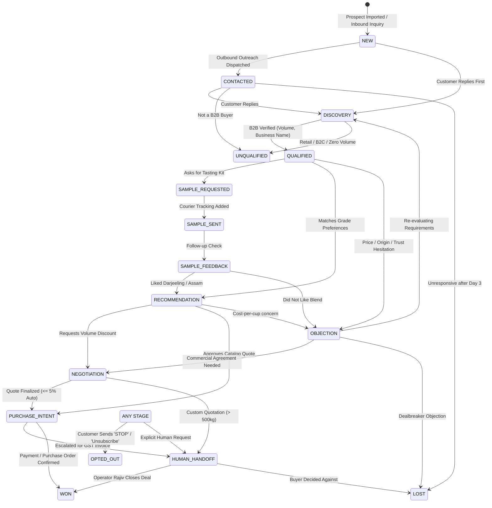

# 🔄 Conversational 16-Stage Sales State Machine

> [!NOTE]
> WB-Agent does not treat sales conversations as open-ended chats. Every conversation is bounded by an explicit, auditable **16-Stage Finite State Machine** (`SalesStageManager`) that tracks pipeline progress, validates allowed transitions, and prevents illegal backward jumps.
>
> ⬅️ Back to: [[index|Knowledge Base Index]]

---

## 🗺️ State Transition Diagram

---

## 📊 Stage Definitions & Commercial Significance

| Stage | Name | Commercial Objective |
| :--- | :--- | :--- |
| 1 | `NEW` | Raw prospect ingested; zero contact made yet. |
| 2 | `CONTACTED` | First proactive campaign outreach sent to customer. |
| 3 | `ENGAGED` | Customer opened or acknowledged message. |
| 4 | `DISCOVERY` | Uncovering business type, daily cuppage, and preferred tea varieties. |
| 5 | `QUALIFIED` | Customer verified as genuine commercial buyer with requirements meeting MOQ. |
| 6 | `UNQUALIFIED` | B2C buyer, below MOQ, or personal consumer. |
| 7 | `SAMPLE_REQUESTED` | Tasting kit ordered (₹499 credited against first commercial order). |
| 8 | `SAMPLE_SENT` | Courier tracking number generated. |
| 9 | `SAMPLE_FEEDBACK` | Inquiring on leaf aroma, cuppage, and brew color. |
| 10 | `RECOMMENDATION` | Specific estate tea grades pitched with base rates. |
| 11 | `OBJECTION` | Reframing concerns regarding price, competitor blends, or transit time. |
| 12 | `NEGOTIATION` | Computing volume tier discounts within autonomous 5% ceiling. |
| 13 | `PURCHASE_INTENT` | Buyer confirmed intention to order; order parameters locked. |
| 14 | `HUMAN_HANDOFF` | Live operator Rajiv takes over for GST invoice and payment details. |
| 15 | `WON` | Commercial order confirmed, invoice paid, and tea dispatched. |
| 16 | `LOST` | Opportunity closed without conversion. |
| Ex | `OPTED_OUT` | Immediate anti-spam consent revocation; all outreach permanently halted. |

---

## 🛡️ Transition Validation & Audit Trails

In `backend/app/agent/sales_stage.py`:
- All state changes must pass `SalesStageManager.can_transition(from_stage, to_stage)`.
- Illegal transitions (e.g. attempting to jump from `NEW` directly to `WON`) raise a `ValueError` to prevent data corruption.
- Every valid transition logs an immutable record in `sales_events` recording `stage_from`, `stage_to`, `reason`, and the associated `AgentRun`.

---

## 🔀 Next Step
Explore how pricing is deterministically governed:
👉 Proceed to **[[deterministic-pricing-engine|Deterministic Pricing & Margin Safety]]**.
