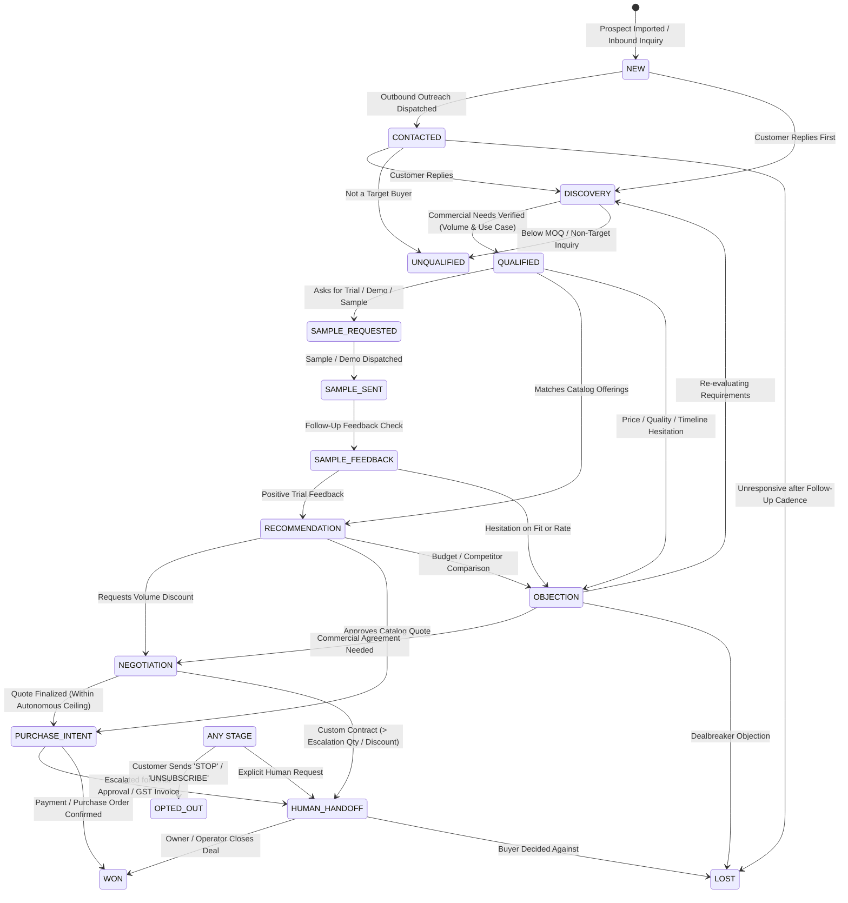

# 🔄 Conversational 16-Stage Sales State Machine

> [!NOTE]
> **WhatsApp AI Agent by NS** · *Engineered by [Naboraj Sarkar (NS)](https://naborajs.me)*  
> 📖 **Official Documentation Hub**: [naborajs.me/projects/whatsapp-ai-agent-dual-brain/docs](https://naborajs.me/projects/whatsapp-ai-agent-dual-brain/docs)  
> 🌐 **Chapter Reference**: [Chapter 3: NLU, Intent Classification & State Machine](https://naborajs.me/docs/whatsapp-ai-agent/ch-3-intent-routing)  
>
> Every customer conversation is governed by an explicit, auditable **16-Stage Finite State Machine** (`SalesStageManager` in `backend/app/agent/sales_stage.py`) that tracks commercial progression, validates allowed transitions, and prevents invalid backward jumps.
>
> ⬅️ Back to: [[../index|Master Knowledge Base Index]]

---

## 🗺️ State Transition Diagram

```mermaid
stateDiagram-v2
    [*] --> NEW: Prospect Imported / Inbound Inquiry
    NEW --> CONTACTED: Outbound Outreach Dispatched
    NEW --> DISCOVERY: Customer Replies First
    CONTACTED --> DISCOVERY: Customer Replies
    CONTACTED --> UNQUALIFIED: Not a Target Buyer
    CONTACTED --> LOST: Unresponsive after Follow-Up Cadence

    DISCOVERY --> QUALIFIED: Commercial Needs Verified (Volume & Use Case)
    DISCOVERY --> UNQUALIFIED: Below MOQ / Non-Target Inquiry
    
    QUALIFIED --> SAMPLE_REQUESTED: Asks for Trial / Demo / Sample
    QUALIFIED --> RECOMMENDATION: Matches Catalog Offerings
    QUALIFIED --> OBJECTION: Price / Quality / Timeline Hesitation

    SAMPLE_REQUESTED --> SAMPLE_SENT: Sample / Demo Dispatched
    SAMPLE_SENT --> SAMPLE_FEEDBACK: Follow-Up Feedback Check
    SAMPLE_FEEDBACK --> RECOMMENDATION: Positive Trial Feedback
    SAMPLE_FEEDBACK --> OBJECTION: Hesitation on Fit or Rate

    RECOMMENDATION --> NEGOTIATION: Requests Volume Discount
    RECOMMENDATION --> PURCHASE_INTENT: Approves Catalog Quote
    RECOMMENDATION --> OBJECTION: Budget / Competitor Comparison

    OBJECTION --> NEGOTIATION: Commercial Agreement Needed
    OBJECTION --> DISCOVERY: Re-evaluating Requirements
    OBJECTION --> LOST: Dealbreaker Objection

    NEGOTIATION --> PURCHASE_INTENT: Quote Finalized (Within Autonomous Ceiling)
    NEGOTIATION --> HUMAN_HANDOFF: Custom Contract (> Escalation Qty / Discount)
    
    PURCHASE_INTENT --> HUMAN_HANDOFF: Escalated for Final Approval / GST Invoice
    PURCHASE_INTENT --> WON: Payment / Purchase Order Confirmed

    HUMAN_HANDOFF --> WON: Owner / Operator Closes Deal
    HUMAN_HANDOFF --> LOST: Buyer Decided Against

    state "ANY STAGE" as ANY
    ANY --> OPTED_OUT: Customer Sends 'STOP' / 'UNSUBSCRIBE'
    ANY --> HUMAN_HANDOFF: Explicit Human Request
```

---

## 📊 Stage Definitions & Commercial Significance

| Stage | Name | Commercial Objective |
| :--- | :--- | :--- |
| 1 | `NEW` | Raw prospect ingested; zero contact made yet. |
| 2 | `CONTACTED` | First proactive campaign outreach sent to customer. |
| 3 | `ENGAGED` | Customer opened or acknowledged message. |
| 4 | `DISCOVERY` | Uncovering buyer segment, volume requirement, and use case. |
| 5 | `QUALIFIED` | Buyer verified with requirements meeting catalog MOQ. |
| 6 | `UNQUALIFIED` | Non-target inquiry or below minimum order threshold. |
| 7 | `SAMPLE_REQUESTED` | Trial pack, product demo, or sample kit requested. |
| 8 | `SAMPLE_SENT` | Sample tracking or trial access dispatched. |
| 9 | `SAMPLE_FEEDBACK` | Gathering buyer feedback on sample quality or demo fit. |
| 10 | `RECOMMENDATION` | Tailored catalog SKUs pitched with deterministic base rates. |
| 11 | `OBJECTION` | Reframing concerns regarding price, competitor comparisons, or transit time. |
| 12 | `NEGOTIATION` | Computing volume tier discounts within the autonomous discount ceiling (`max_discount_pct`). |
| 13 | `PURCHASE_INTENT` | Buyer confirmed intention to order; pro-forma invoice triggered. |
| 14 | `HUMAN_HANDOFF` | Live operator/owner takes over or receives WhatsApp escalation alert. |
| 15 | `WON` | Commercial order confirmed and invoice paid. |
| 16 | `LOST` | Opportunity closed without conversion. |
| Ex | `OPTED_OUT` | Immediate anti-spam consent revocation; all outreach permanently halted. |

---

## 🔀 Next Step
Explore how pricing is deterministically governed:
👉 Proceed to **[[deterministic-pricing-engine|Deterministic Pricing & Margin Safety]]**.
