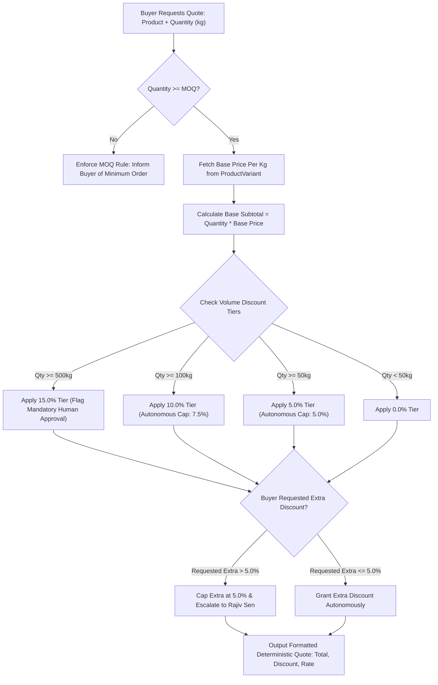

# 🏷️ Deterministic Pricing & Margin Safety Engine

> [!NOTE]
> In WB-Agent, the Large Language Model has **zero authority** to generate or invent commercial pricing. All quotes are calculated by a deterministic formulaic engine that strictly enforces Minimum Order Quantities (MOQs), volume discount matrices, and autonomous discount caps.
>
> ⬅️ Back to: [[index|Knowledge Base Index]]

---

## 🧮 Pricing Decision Algorithm



---

## 📦 Wholesale Catalog & Minimum Order Quantities (MOQ)

| Product | Grade | Origin | Packaging | Base Price | MOQ |
| :--- | :--- | :--- | :--- | :--- | :--- |
| **Darjeeling First Flush** | FTGFOP1 | Kurseong, Mirik | 5kg Foil / 20kg Chest | ₹1,450 - ₹1,600 / kg | **10 kg** |
| **Assam Kadak CTC** | BP | Upper Assam | 10kg Poly / 30kg Master Sack | ₹340 - ₹380 / kg | **25 kg** |
| **Dooars Hotel Blend** | BOP / OF | Terai & Dooars | 20kg Poly / 50kg Jute Sack | ₹230 - ₹260 / kg | **20 kg** |

---

## 📈 Deterministic Volume Tier Rules

Rules stored in the database (`pricing_rules` table):

| Rule Name | Minimum Quantity | Base Discount | Autonomous Cap | Approval Required |
| :--- | :--- | :--- | :--- | :--- |
| **Tier 1 Volume** | 50.0 kg | **5.0%** | 5.0% | False (Autonomous) |
| **Tier 2 Volume** | 100.0 kg | **10.0%** | 7.5% | False (Autonomous) |
| **Tier 3 Enterprise**| 500.0 kg | **15.0%** | 10.0% | **True (Escalate to Owner)** |

---

## 💻 Mathematical Calculation Formula

In `backend/app/pricing/calculator.py`:

$$\text{Subtotal} = \text{Quantity} \times \text{Base Price}$$

$$\text{Effective Discount \%} = \min(\text{Tier Discount} + \text{Extra Discount}, \text{Maximum Cap})$$

$$\text{Total Price} = \text{Subtotal} \times \left(1 - \frac{\text{Effective Discount \%}}{100}\right)$$

```python
# Exact calculation in PricingService
subtotal = variant.base_price_per_kg * Decimal(str(quantity_kg))
discount_amount = (subtotal * effective_discount / Decimal("100.0")).quantize(Decimal("0.01"))
net_total = subtotal - discount_amount
```

---

## 🛡️ Administrative Protection (ADR-008 & Section 71)

To protect wholesale profit margins:
- The AI Agent is strictly denied permission to call administrative tools like `update_global_pricing`, `override_margin`, or `approve_unauthorized_discount`.
- Attempting to call an administrative mutation throws a `PermissionError` that is logged to `audit_logs`.

---

## 🔀 Next Step
Explore how facts and customer preferences are preserved:
👉 Proceed to **[[multi-tier-memory-system|Multi-Tier Memory Architecture]]**.
