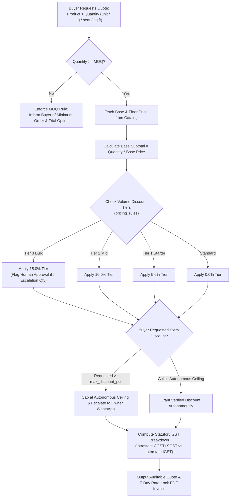

# 🏷️ Deterministic Pricing, Multi-Industry Units & Margin Safety Engine

> [!NOTE]
> **WhatsApp AI Agent by NS** · *Engineered by [Naboraj Sarkar (NS)](https://naborajs.me)*  
> 📖 **Official Documentation Hub**: [naborajs.me/projects/whatsapp-ai-agent-dual-brain/docs](https://naborajs.me/projects/whatsapp-ai-agent-dual-brain/docs)  
> 🌐 **Chapter Reference**: [Chapter 4: Real-Time Catalog, Pricing & Quotation Engine](https://naborajs.me/docs/whatsapp-ai-agent/ch-4-catalog-pricing)  
>
> In this platform, the Large Language Model has **zero authority** to invent product prices or calculate discount math. All commercial quotes and GST Pro-Forma Invoices are calculated deterministically by `PricingService` (`backend/app/pricing/calculator.py`) using verified database rules (`products`, `pricing_rules`, and `KnowledgeItem`).
>
> ⬅️ Back to: [[../index|Master Knowledge Base Index]]

---

## 🧮 Pricing Decision Algorithm

```mermaid
flowchart TD
    Inquiry["Buyer Requests Quote:\nProduct + Quantity (unit / kg / seat / sq.ft)"] --> CheckMOQ{"Quantity >= MOQ?"}
    
    CheckMOQ -->|No| RejectMOQ["Enforce MOQ Rule:\nInform Buyer of Minimum Order & Trial Option"]
    CheckMOQ -->|Yes| FetchBase["Fetch Base & Floor Price from Catalog"]

    FetchBase --> Subtotal["Calculate Base Subtotal = Quantity * Base Price"]
    Subtotal --> TierCheck{"Check Volume Discount Tiers\n(pricing_rules)"}

    TierCheck -->|Tier 3 Bulk| Tier3["Apply 15.0% Tier\n(Flag Human Approval if > Escalation Qty)"]
    TierCheck -->|Tier 2 Mid| Tier2["Apply 10.0% Tier"]
    TierCheck -->|Tier 1 Starter| Tier1["Apply 5.0% Tier"]
    TierCheck -->|Standard| Tier0["Apply 0.0% Tier"]

    Tier3 & Tier2 & Tier1 & Tier0 --> CheckExtra{"Buyer Requested Extra Discount?"}

    CheckExtra -->|Requested > max_discount_pct| FlagHuman["Cap at Autonomous Ceiling & Escalate to Owner WhatsApp"]
    CheckExtra -->|Within Autonomous Ceiling| AutoGrant["Grant Verified Discount Autonomously"]

    FlagHuman & AutoGrant --> GST["Compute Statutory GST Breakdown\n(Intrastate CGST+SGST vs Interstate IGST)"]
    GST --> FinalQuote["Output Auditable Quote & 7-Day Rate-Lock PDF Invoice"]
```

---

## 🏭 Multi-Industry Catalog & Unit Support

Through the **AI Business Auto-Fill Architect** (`POST /api/v1/settings/ai-autofill-business`) and **6 Built-In Industry Presets**, the pricing engine supports any industry unit and currency (`₹`, `$`, `€`, `£`, `AED`, `SGD`):

| Industry Preset | Sample Catalog Offerings | Unit | Floor Guardrail |
| :--- | :--- | :--- | :--- |
| 🛍️ **E-Commerce & D2C** | Wireless ANC Headphones, AMOLED Smart Watch, GaN Charger | `unit` | Enforced per SKU |
| 🏭 **B2B Wholesale** | 5kW AC Servo Motor Kit, Modbus PLC Controller, VFD Drive | `unit` | Enforced per SKU |
| 💻 **SaaS & Cloud Agency** | Enterprise AI Copilot License, DevOps Retainer, SOC2 Audit | `seat` / `package` | Enforced per SKU |
| 🏥 **Healthcare & Clinics** | 90-Parameter Full Body Checkup, Cardiac Screening, 3D Dental Scan | `package` / `session` | Enforced per SKU |
| 🏢 **Real Estate** | 3BHK Luxury Residence, Grade-A Office Suite, Retail Showroom | `sq.ft` | Enforced per SKU |
| 🍵 **Tea & Agro Exports** | Darjeeling First Flush FTGFOP1, Assam Orthodox, Kadak CTC | `kg` | Enforced per SKU |

---

## 📈 Deterministic Volume Tier Rules (`pricing_rules` Table)

| Rule Name | Minimum Quantity | Base Discount | Autonomous Cap | Approval Required |
| :--- | :--- | :--- | :--- | :--- |
| **Tier 1 Volume** | 50 units / kg | **5.0%** | 5.0% | `False` (Autonomous) |
| **Tier 2 Volume** | 100 units / kg | **10.0%** | 7.5%–12.0% | `False` (Autonomous) |
| **Tier 3 Enterprise**| 500+ units / kg | **15.0%** | Configurable | `True` (Escalates to Owner) |

---

## 💻 Mathematical Calculation Formula

In `backend/app/pricing/calculator.py`:

$$\text{Subtotal} = \text{Quantity} \times \text{Base Price}$$

$$\text{Effective Discount \%} = \min(\text{Tier Discount} + \text{Extra Discount}, \text{Maximum Cap})$$

$$\text{Net Total} = \text{Subtotal} \times \left(1 - \frac{\text{Effective Discount \%}}{100}\right)$$

---

## 🔀 Next Step
Explore how facts and customer preferences are preserved across sessions:
👉 Proceed to **[[multi-tier-memory-system|Multi-Tier Memory Architecture]]**.
