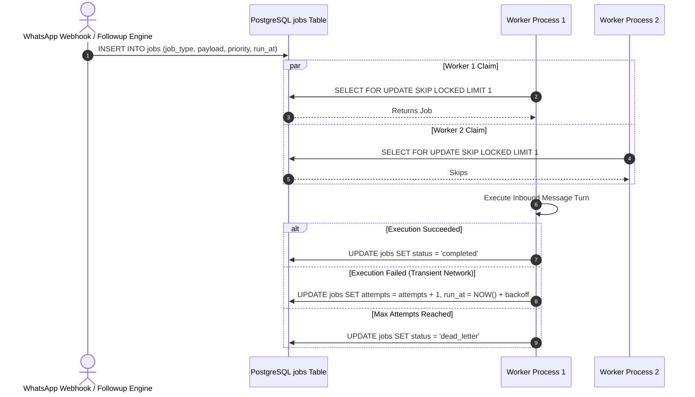

# ⚡ Durable PostgreSQL Job Queue & SKIP LOCKED Worker

> [!NOTE]
> Rather than adding external operational overhead with Redis, RabbitMQ, or Celery, WB-Agent implements a transactional, durable job queue directly inside PostgreSQL utilizing `SELECT ... FOR UPDATE SKIP LOCKED` (ADR-003).
>
> ⬅️ Back to: [[index|Knowledge Base Index]]

---

## 🏗️ Queue & Worker Lifecycle Flowchart



---

## 🔒 The SKIP LOCKED Pattern (ADR-003)

In high-volume WhatsApp deployments, multiple background worker instances poll the queue simultaneously. Without `SKIP LOCKED`, workers lock each other out, leading to contention and pipeline stalls.

In `backend/app/jobs/queue.py`:
```python
stmt = (
    select(Job)
    .where(Job.status == "pending", Job.run_at <= now)
    .order_by(Job.priority.desc(), Job.run_at.asc())
    .with_for_update(skip_locked=True)
    .limit(1)
)
```

### Key Advantages:
1. **Zero Contention**: Worker 2 automatically skips whatever row Worker 1 has locked without blocking.
2. **ACID Transactional Guarantees**: Enqueueing a message is committed inside the same transaction as updating conversation metadata.
3. **No Phantom State**: If a worker process crashes, PostgreSQL immediately rolls back the uncommitted transaction and releases the lock for another worker.

---

## 📈 Exponential Backoff with Jitter

When a transient network error occurs (e.g. Meta Graph API timeout or network glitch), the queue schedules a retry with exponential backoff and randomized jitter to prevent synchronized retries (thundering herd problem):

$$\text{delay} = \left(2^{\text{attempts}} \times 2\right) + \text{uniform}(0.5, 2.0)$$

```python
delay_seconds = (2 ** job.attempts) * 2.0 + random.uniform(0.5, 2.0)
job.run_at = utc_now() + timedelta(seconds=delay_seconds)
job.status = "pending"
```

---

## 💀 Dead-Lettering (DLQ)

If a job fails repeatedly and reaches `max_attempts` (default: 3):
1. `Job.status` transitions to `dead_letter`.
2. The error stack trace is serialized to `job.error_details`.
3. An operational notification is automatically emitted to the dashboard alerting operators of the failed job.

---

## 🔀 Next Step
Return to the master overview:
👉 Return to **[[index|Knowledge Base Index]]**.
