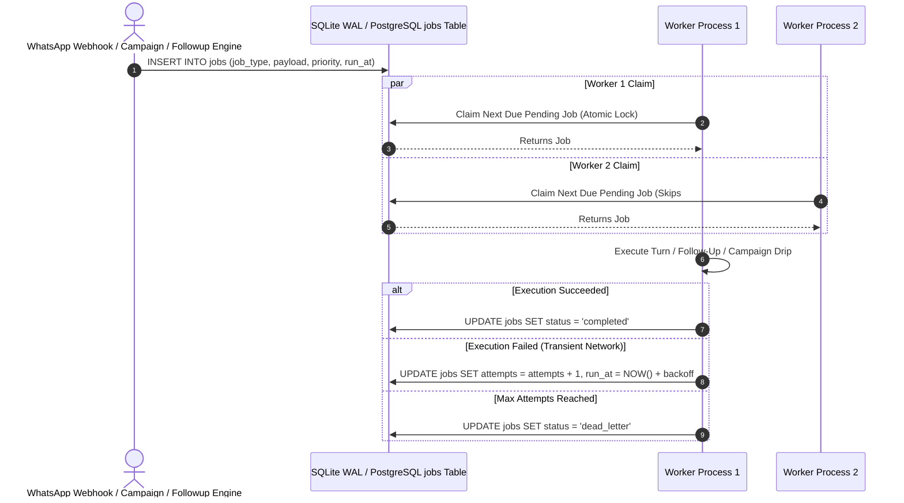

# ⚡ Durable Database Job Queue & Worker Architecture

> [!NOTE]
> **WhatsApp AI Agent by NS** · *Engineered by Naboraj Sarkar (NS)*  
> Rather than requiring external Redis, RabbitMQ, or Celery clusters, the platform implements a transactional, durable job queue directly inside the database (`jobs` and `followup_jobs` tables) working seamlessly across both **Zero-Config SQLite WAL (`wb_agent.db`)** and **PostgreSQL 16 (`SELECT ... FOR UPDATE SKIP LOCKED`)** (`ADR-0003`, `ADR-0017`).
>
> ⬅️ Back to: [[../index|Master Knowledge Base Index]]

---

## 🏗️ Queue & Worker Lifecycle Flowchart


```mermaid
sequenceDiagram
    autonumber
    actor Webhook as WhatsApp Webhook / Campaign / Followup Engine
    participant DB as SQLite WAL / PostgreSQL jobs Table
    participant W1 as Worker Process 1
    participant W2 as Worker Process 2

    Webhook->>DB: INSERT INTO jobs (job_type, payload, priority, run_at)
    
    par Worker 1 Claim
        W1->>DB: Claim Next Due Pending Job (Atomic Lock)
        DB-->>W1: Returns Job #101 (status = 'running')
    and Worker 2 Claim
        W2->>DB: Claim Next Due Pending Job (Skips #101)
        DB-->>W2: Returns Job #102 (status = 'running')
    end

    W1->>W1: Execute Turn / Follow-Up / Campaign Drip
    alt Execution Succeeded
        W1->>DB: UPDATE jobs SET status = 'completed'
    else Execution Failed (Transient Network)
        W1->>DB: UPDATE jobs SET attempts = attempts + 1, run_at = NOW() + backoff
    else Max Attempts Reached
        W1->>DB: UPDATE jobs SET status = 'dead_letter'
    end
```

---

## 🔒 Atomic Job Claiming (`ADR-0003`)

In `backend/app/jobs/queue.py`:
```python
stmt = (
    select(Job)
    .where(Job.status == "pending", Job.run_at <= now)
    .order_by(Job.priority.desc(), Job.run_at.asc())
    .with_for_update(skip_locked=True)
    .limit(1)
)
```

### Key Advantages:
1. **Zero External Broker Overhead**: Runs out-of-the-box with `python run.py` on SQLite WAL, and scales horizontally across multiple workers on PostgreSQL 16 using `FOR UPDATE SKIP LOCKED`.
2. **ACID Transactional Guarantees**: Enqueueing a follow-up or outbound dispatch commits inside the same transaction as conversation state updates.
3. **Crash Resilience**: Stale running jobs exceeding lock timeout are automatically recovered.

---

## 📈 Exponential Backoff with Jitter & Dead-Letter Queue (DLQ)

When a transient error occurs, the worker schedules a retry with exponential backoff and randomized jitter:

$$\text{delay} = \left(2^{\text{attempts}} \times 2\right) + \text{uniform}(0.5, 2.0)$$

If a job reaches `max_attempts` (default `3`), `Job.status` transitions to `dead_letter` and emits an `AgentNotification` to the Mission Control dashboard.

---

## 🔀 Next Step
👉 Return to **[[../index|Master Knowledge Base Index]]**.
