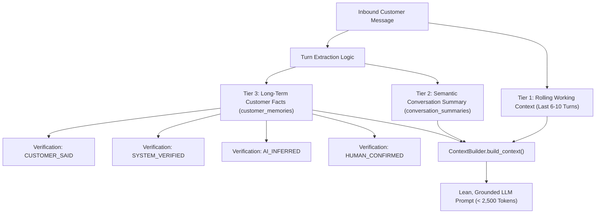

# 🧠 Multi-Tier Memory Architecture & Customer Facts

> [!NOTE]
> WB-Agent eliminates the twin hazards of LLM conversational memory: **context-window token exhaustion** and **loss of critical business agreements**. It achieves this via an auditable, multi-tier memory system separating short-term working turns, semantic summaries, and long-term customer facts.
>
> ⬅️ Back to: [[index|Knowledge Base Index]]

---

## 🏛️ Memory Architecture Diagram



---

## 🗃️ The Three Memory Tiers

### Tier 1: Rolling Working Context
- Stores the last 6 to 10 active conversational turns directly in the prompt.
- Retains immediate conversational cadence, tone, and immediate question-answer continuity.
- Managed by `ConversationService.get_recent_messages()`.

### Tier 2: Semantic Rolling Summary
- When a conversation exceeds 10 turns, earlier turns are compressed into a dense, chronological bulleted summary.
- Focuses strictly on commercial commitments made, pricing discussed, and outstanding buyer questions.
- Stored in `conversation_summaries` table.

### Tier 3: Long-Term Customer Facts
- High-value business attributes extracted and persisted across conversations and sessions.
- Even if a customer returns 6 months later from a new marketing campaign, their business profile, volume needs, and preferred tea varieties remain instantly available.
- Stored in `customer_memories` table.

---

## 🏷️ Fact Categories & Verification Hierarchy

Each long-term memory record contains:
- `key`: Distinct attribute name (e.g. `monthly_volume_kg`, `preferred_grade`, `gst_number`, `delivery_location`).
- `value`: Fact content (e.g. `100 kg`, `Assam Kadak CTC`, `Siliguri Warehouse`).
- `category`: Classification tag (`requirement`, `preference`, `business_detail`, `objection_history`).
- `verification_status`:

| Status | Meaning | Trust Level |
| :--- | :--- | :--- |
| `HUMAN_CONFIRMED` | Reviewed or manually added by human operator Rajiv. | **Highest** (Never overwritten by AI) |
| `SYSTEM_VERIFIED` | Validated by system tool execution (e.g. GST portal check, tracking API). | High |
| `CUSTOMER_SAID` | Directly quoted by buyer in message text. | Medium |
| `AI_INFERRED` | Inferred by agent from conversational context. | Low (Subject to verification) |

---

## 🛡️ Context Assembly & Token Optimization

In `backend/app/conversations/context.py`:
```python
class ContextBuilder:
    def build_system_context(self, customer: Customer, facts: List[CustomerMemory], summary: Optional[str]) -> str:
        # Assembles structured, deduplicated XML context blocks:
        # <customer_profile> ... </customer_profile>
        # <verified_facts> ... </verified_facts>
        # <conversation_summary> ... </conversation_summary>
```

This prevents prompt dilution, keeps inference latency under 1.2 seconds, and guarantees that the model stays grounded in facts.

---

## 🔀 Next Step
Explore how background jobs and queues operate:
👉 Proceed to **[[durable-queue-and-worker|Durable Queue with SKIP LOCKED]]**.
