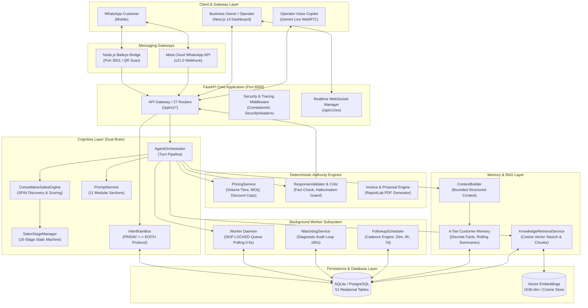
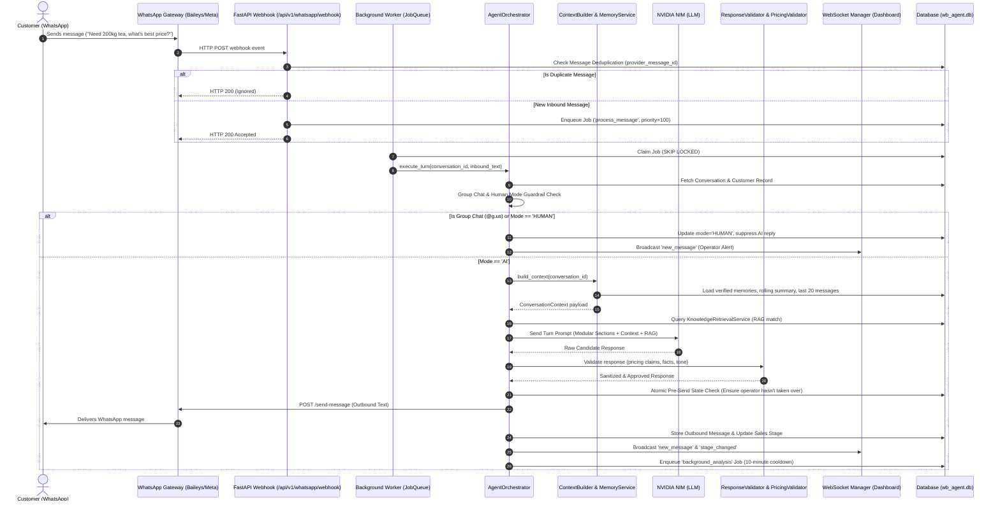
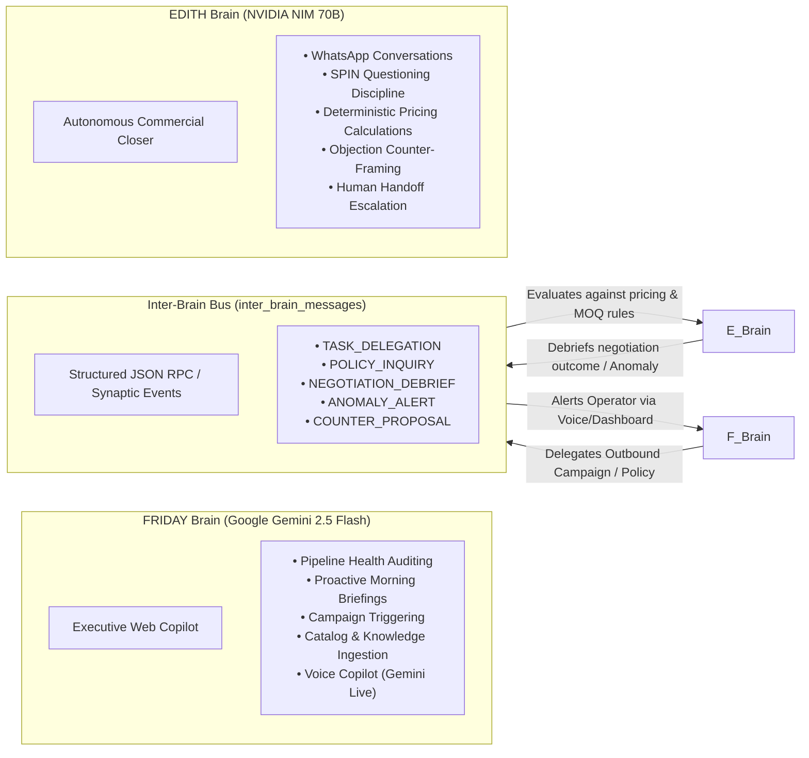
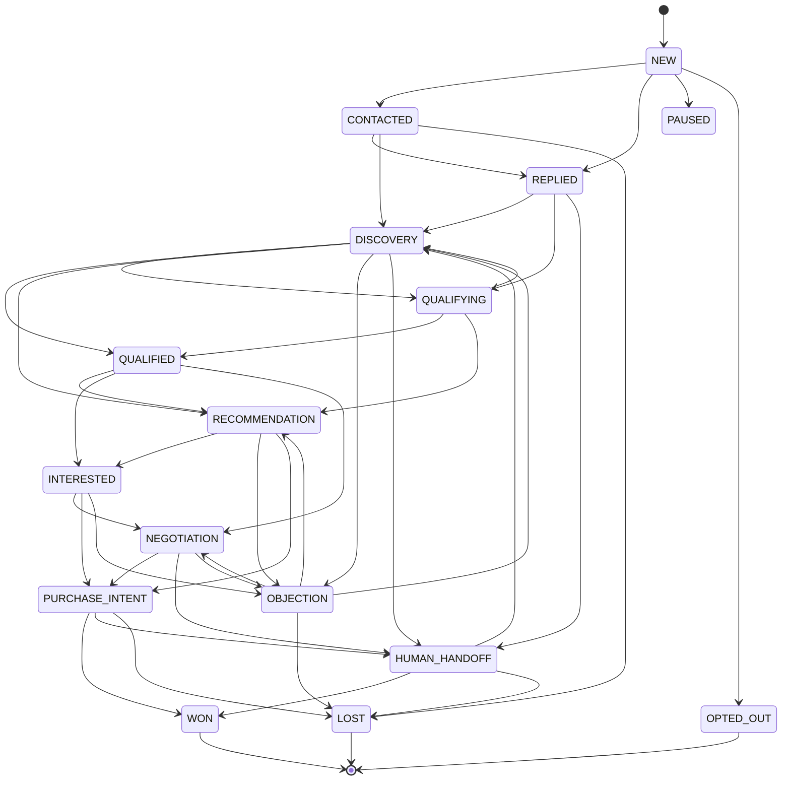
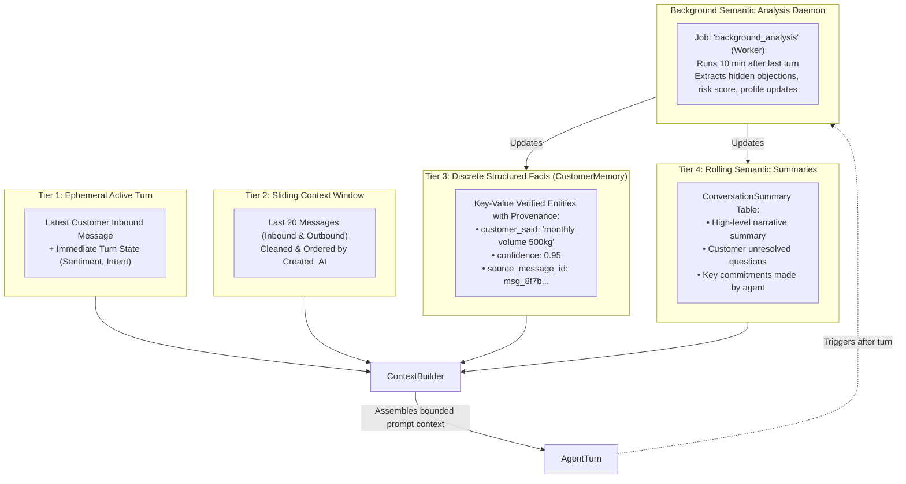
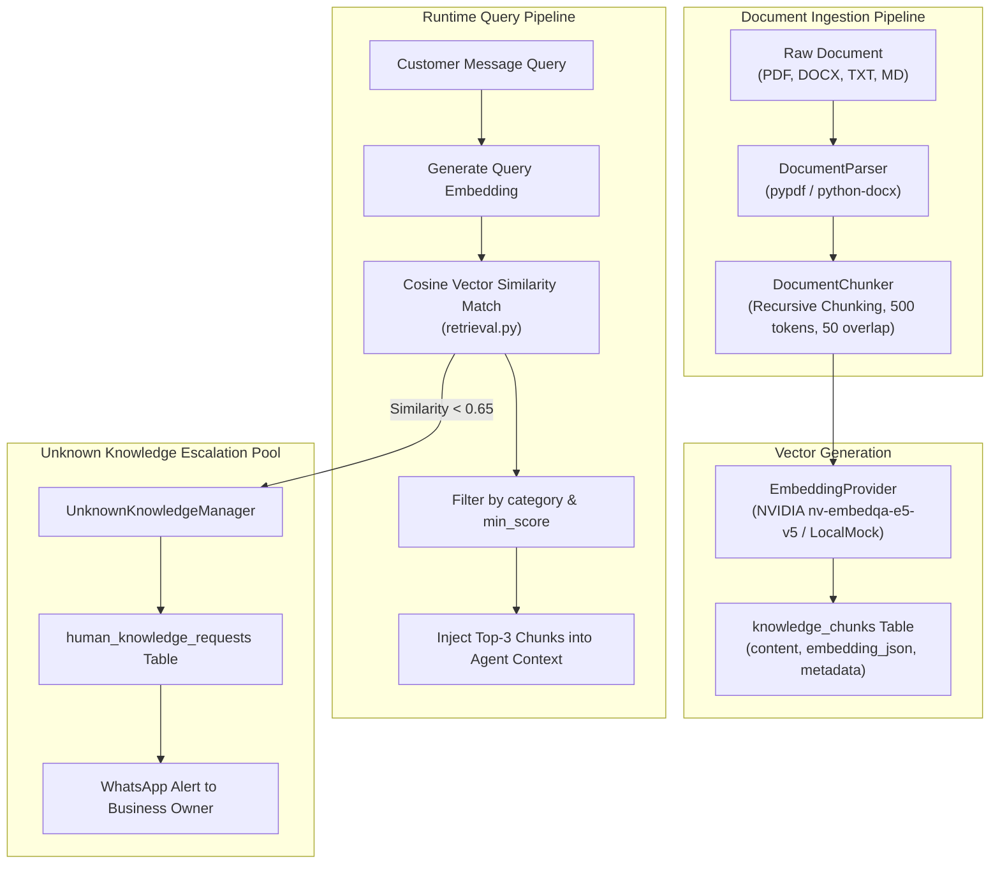
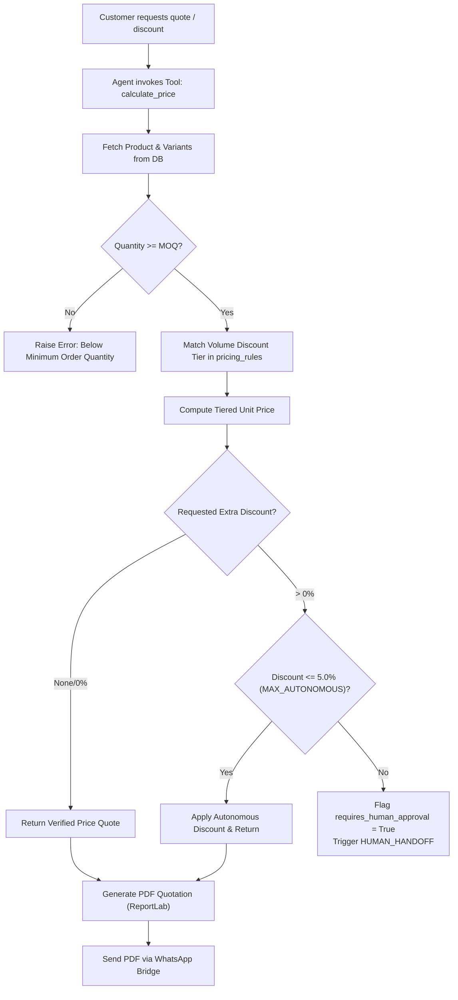
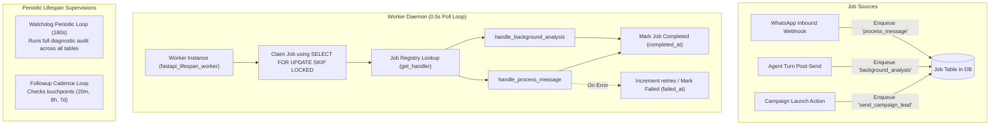

# CURRENT_ARCHITECTURE.md: Complete Architectural Blueprint & Subsystem Deep-Dive

> **Standard**: VERIFIED BY CODE | VERIFIED BY RUNTIME | VERIFIED BY DATABASE  
> **Date of Audit**: 2026-09-21  
> **Repository Root**: `d:/Projects/Python/wb-agent`  
> **Target Audience**: Senior AI Systems Architect, ChatGPT Enterprise Engineering Team, Production Tech Leads

---

## 1. System Overview & Multi-Tier Topology

WB-Agent (codenamed **EDITH** / **FRIDAY**) is an enterprise-grade autonomous sales operating system for B2B WhatsApp commerce. The system coordinates two distinct cognitive agents:
1. **EDITH** (Autonomous Commercial Closer & WhatsApp Negotiator): Powered by NVIDIA NIM (`meta/llama-3.3-70b-instruct` / `nvidia/nemotron-3-8b-base`), EDITH conducts direct customer negotiations, executes deterministic pricing calculations, handles sales objections, and enforces strict boundary guards.
2. **FRIDAY** (Executive Copilot & Web AI Supervisor): Powered by Google Gemini (`gemini-2.5-flash` / Gemini Live WebRTC), FRIDAY acts as the business owner's copilot, analyzing pipeline health, delegating outbound campaigns, managing knowledge, and rendering audio briefings.

---

## 2. Inbound & Outbound Messaging Pipeline

The messaging pipeline processes inbound customer interactions with strict idempotency, loop suppression, atomic state guards, and multi-provider failover.

### Key Guardrails in Orchestrator (`backend/app/agent/orchestrator.py`):
1. **Self-Message Echo Suppression**: Drops any message where `sender_id == settings.WHATSAPP_BOT_NUMBER` (`918918753100`).
2. **WhatsApp Group Chat Suppression**: Inspects `channel_id.endswith("@g.us")`. If true, automatically sets `mode = "HUMAN"` and suppresses autonomous reply.
3. **Turn Idempotency Guard**: Checks if an outbound agent reply already exists with timestamp `>= inbound_msg.created_at`.
4. **Human Takeover Race Condition Guard**: Re-checks `conv.mode` immediately prior to dispatching outbound payload. If operator flipped toggle to `HUMAN`, the LLM reply is discarded.

---

## 3. Cognitive Architecture & Dual-Brain Protocol

The system separates executive supervisory tasks from front-line sales execution via the **Inter-Brain Bus** (`backend/app/brain/inter_brain_bus.py`, 3,514 lines).

### Independent Agency & Refusal Rights:
- EDITH possesses **independent refusal rights**: If FRIDAY delegates a task that violates deterministic MOQ or exceeds the autonomous 5.0% discount ceiling, EDITH formally registers a rejection on the Inter-Brain Bus (`InterBrainMessage(status='rejected', reason='EXCEEDS_DISCOUNT_CEILING')`).
- Telemetry events are broadcast in real time to the `/brain` visual cockpit.

---

## 4. Sales Pipeline State Machine (16 Stages)

State progression is strictly governed by `SalesStageManager` (`backend/app/agent/sales_stage.py`). The LLM cannot assign arbitrary stages; transitions must exist in `ALLOWED_TRANSITIONS`.

### Auditability:
Every stage transition writes an immutable `SalesEvent` record capturing:
- `conversation_id`, `from_stage`, `to_stage`
- `trigger_source` (`"llm_classification"`, `"operator_manual"`, `"timeout_cadence"`)
- `confidence_score` (0.0 to 1.0)
- `created_at` timestamp

---

## 5. Multi-Tier Memory Subsystem

The memory subsystem prevents repetitive questioning, maintains multi-week dialogue continuity, and extracts verifiable business facts while bounding LLM context window consumption.

### Memory Schema Specifications:
- `CustomerMemory`:
  - `key` (e.g., `business_type`, `daily_consumption`, `delivery_location`, `gstin`)
  - `value` (JSON string or scalar)
  - `provenance` (`CUSTOMER_SAID`, `INFERRED`, `OPERATOR_CONFIRMED`)
  - `confidence` (Decimal 0.00 – 1.00)
- `ConversationSummary`:
  - `summary` (Compact narrative)
  - `turn_count` (Track turns summarized)
  - `unresolved_objections` (JSON array)

---

## 6. Dynamic Modular Prompt Architecture

System prompts are not static text files; they are dynamically compiled from relational database records (`prompt_sections` and `prompt_versions`) managed by `PromptService` (`backend/app/agent/prompts.py`).

```mermaid
flowchart LR
    subgraph Sections["11 Dynamic Modular Sections (prompt_sections)"]
        S1["core_safety<br/>(Order: 1)"]
        S2["core_identity<br/>(Order: 2)"]
        S3["business_policy<br/>(Order: 3)"]
        S4["sales_style<br/>(Order: 4)"]
        S5["business_profile<br/>(Order: 5)"]
        S6["objection_handling<br/>(Order: 6)"]
        S7["pricing_guidelines<br/>(Order: 7)"]
        S8["custom_rules<br/>(Order: 8..11)"]
    end

    subgraph Versions["Version Control & Diff Engine (prompt_versions)"]
        V["Active Version (is_active = True)<br/>Token Count (cl100k_base BPE)<br/>Git-style line diffing"]
    end

    subgraph Compiler["Prompt Assembly Engine"]
        A["Filter is_active == True<br/>Order by order_index ASC<br/>Substitute Variables ({{business_name}})<br/>Inject ConversationContext"]
    end

    subgraph Output["Final LLM System Prompt"]
        P["NVIDIA Nemotron System Instruction<br/>(Audited & Token-Bounded)"]
    end

    Sections --> Versions
    Versions --> Compiler
    Compiler --> Output
```

### Prompt Management Capabilities:
1. **Live Dashboard Editor**: Route `/prompts` allows viewing and editing sections with live syntax highlighting and token calculation.
2. **Line-Level Git Diff**: Uses `difflib.ndiff` to display added/removed lines before committing version updates.
3. **Instant Rollback**: One-click reactivation of previous prompt versions (`activate_version`).
4. **Safety Pinning**: Critical versions can be pinned (`pinned = True`) to prevent pruning during maintenance.

---

## 7. Knowledge Hub, Vector Store & RAG Pipeline

The Knowledge Hub (`backend/app/knowledge/`) provides hybrid semantic retrieval across structured catalog items and unstructured business documents.

---

## 8. Deterministic Pricing & Invoicing Engine

To prevent catastrophic hallucinations (e.g., offering 90% discounts), pricing logic is completely removed from LLM discretion and executed by `PricingService` (`backend/app/pricing/calculator.py`).

---

## 9. Background Worker Subsystem & Durability

Asynchronous and scheduled workloads are executed by the `Worker` daemon (`backend/app/jobs/worker.py`) started during FastAPI lifespan startup.

---

## 10. Data Layer Architecture (51 Tables across 16 Modules)

The database schema is organized into 16 modular domains under `backend/app/database/models/`:

| Module | Table Names | Primary Purpose |
| :--- | :--- | :--- |
| **organization.py** | `organizations`, `users`, `api_keys` | Tenant hierarchy, user authentication, API credentials |
| **lead_customer.py** | `leads`, `customers`, `deals`, `lead_events` | B2B CRM core, pipeline value, deal stages |
| **conversation.py** | `conversations`, `messages`, `message_statuses`, `conversation_summaries`, `customer_memory` | Chat sessions, message history, 4-tier memory |
| **product_pricing.py**| `products`, `product_variants`, `pricing_rules`, `product_custom_fields`, `pricing_rule_versions`, `inventory` | Catalog, volume tiers, MOQ, inventory tracking |
| **knowledge.py** | `knowledge_documents`, `knowledge_chunks` | Unstructured RAG documents and vector chunks |
| **knowledge_item.py**| `knowledge_items`, `knowledge_categories` | Structured business rules, FAQs, guidelines |
| **knowledge_request.py**| `human_knowledge_requests`, `knowledge_candidates`, `customer_profile_versions`, `conversation_analysis` | Unknown question escalations, auto-extracted profiles |
| **campaign_followup.py**| `campaigns`, `campaign_leads`, `followup_jobs`, `jobs` | Outbound campaigns, cadence scheduler, durable queue |
| **agent_audit.py** | `agent_runs`, `agent_events`, `tool_calls`, `sales_events`, `handoffs`, `notifications`, `integrations`, `agent_settings`, `audit_logs`, `voice_audit_logs`, `friday_problem_reports` | Complete telemetry, audit trails, human handoffs |
| **order.py** | `orders`, `order_items`, `quotes`, `quote_items` | B2B commercial transactions and quotations |
| **prompt_section.py**| `prompt_sections` | Dynamic modular system prompt sections |
| **prompt_version.py**| `prompt_versions` | Version-controlled prompt instructions and diffs |
| **inter_brain.py** | `inter_brain_messages` | FRIDAY <-> EDITH asynchronous bus communications |
| **watchdog.py** | `watchdog_alerts` | Autonomous system health and diagnostic alarms |
| **notification.py** | `agent_notifications` | Operator dashboard notifications and unread badges |
| **learning.py** | `sales_learnings` | Auto-extracted sales conversion insights |

---

## 11. Security, Redaction & Recovery

1. **Zero Secret Exposure**:
   - Environment variables (`.env`) hold API keys (`NVIDIA_API_KEY`, `GEMINI_API_KEY`, `WHATSAPP_TOKEN`).
   - Settings are instantiated via Pydantic `BaseSettings` (`backend/app/config.py`).
   - API endpoints redact sensitive keys when returning configuration objects to the frontend.
2. **Correlation ID Tracing**:
   - Every HTTP request passes through `CorrelationIdMiddleware`, stamping an `X-Correlation-ID` header for end-to-end tracing across FastAPI logs and background jobs.
3. **Database Integrity & Cascades**:
   - Foreign key constraints with `ON DELETE CASCADE` prevent orphaned records in `messages`, `customer_memory`, and `prompt_versions`.
4. **Graceful Daemon Shutdown**:
   - `lifespan` context manager traps `SIGINT` / `SIGTERM`, signals `worker.stop()`, and awaits active task completion before closing the database connection pool.
