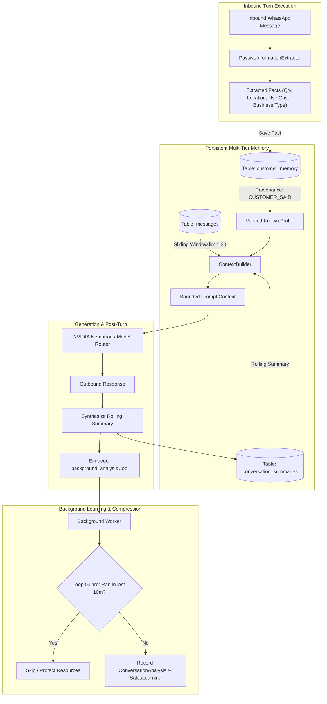

# MEMORY_CURRENT_STATE.md: Complete Memory & Conversation Lifecycle Audit

> **Verification Standard**: VERIFIED BY CODE | VERIFIED BY DATABASE | VERIFIED BY RUNTIME  
> **Date of Audit**: 2026-09-21  
> **Repository**: `d:/Projects/Python/wb-agent`

---

## 1. Executive Summary

The WB-Agent (EDITH) memory system implements a **multi-tiered architecture** designed to balance immediate conversational coherence with long-term commercial profile persistence, while keeping token consumption strictly bounded.

The system partitions memory across four distinct layers:
1. **Working Context Window** (Short-Term: 20–30 turn sliding window)
2. **Rolling Semantic Summary** (Mid-Term: `conversation_summaries` table)
3. **Structured Entity Facts** (Long-Term: `customer_memory` table with provenance & confidence)
4. **Empirical Sales Learnings & Profile History** (`sales_learnings` & `customer_profile_versions`)

---

## 2. Multi-Tier Memory Architecture Diagram

---

## 3. Detailed Memory Layer Specifications

### Layer 1: Working Context Window (Short-Term Dialogue Memory)
- **Implementation**: `backend/app/conversations/context.py` (`ContextBuilder.build_context`) and `backend/app/memory/conversation.py`.
- **Sliding Window Size**:
  - `ContextBuilder` fetches the last **30 messages** (`recent_msgs = await self.conv_memory.get_recent_messages(conversation_id, limit=30)`).
  - In `orchestrator.py` (L601–609), the last **20 turns** (`past_turns[-20:]`) are injected as alternating `user` / `assistant` prompt turns into the LLM request.
- **Ordering**: Strictly sorted chronologically (`Message.created_at.asc()`).
- **Token Impact**: Bounded to $\approx 1,200 - 2,000$ tokens regardless of total conversation length.

---

### Layer 2: Rolling Semantic Summary (Mid-Term Conversation Memory)
- **Implementation**: `backend/app/memory/conversation.py` (`ConversationMemoryService.update_summary`) and `backend/app/database/models/conversation.py` (`ConversationSummary`).
- **Schema**:
  - `id`: `VARCHAR(64)` (UUID primary key)
  - `conversation_id`: `VARCHAR(64)` (Unique foreign key to `conversations.id`)
  - `summary`: `TEXT` (Narrative summary of customer profile, progress, and stage)
  - `key_points`: `JSON` (Array of discrete operational facts, e.g. `["Quantity: 100kg", "Location: Siliguri"]`)
  - `active_objections`: `JSON` (Array of current unresolved objections, e.g. `["price_too_high"]`)
  - `customer_goals`: `TEXT` (Customer's commercial procurement goal)
  - `created_at`, `updated_at`: `DATETIME`
- **When Created / Updated**:
  - Generated and committed at the end of **every active conversational turn** in `orchestrator.py` (Lines 870–904).
  - Also broadcast live via WebSockets (`data.structured_memory`) so the dashboard drawer updates instantly without polling.

---

### Layer 3: Long-Term Customer Memory & Discrete Facts
- **Implementation**: `backend/app/memory/customer.py` (`CustomerMemoryService`) and `backend/app/database/models/conversation.py` (`CustomerMemory`).
- **Schema**:
  - `id`: `VARCHAR(64)`
  - `customer_id`: `VARCHAR(64)` (Foreign key to `customers.id`)
  - `category`: `VARCHAR(64)` (`"requirements"`, `"preferences"`, `"commercial_terms"`, `"constraints"`)
  - `key`: `VARCHAR(128)` (e.g. `"quantity"`, `"use_case"`, `"packaging"`, `"location"`)
  - `value`: `UniversalJSON` (Stores string, number, or structured object)
  - `confidence`: `FLOAT` (Default `0.95` - `1.0`)
  - `verification_status`: `VARCHAR(32)` (`CUSTOMER_SAID`, `SYSTEM_VERIFIED`, `AI_INFERRED`, `HUMAN_CONFIRMED`)
  - `source`: `VARCHAR(128)` (`"customer_message"`, `"operator_entry"`, `"crm_sync"`)
- **Provenance & Conflict Handling**:
  - Explicit customer statements (`CUSTOMER_SAID`) overwrite unverified `AI_INFERRED` guesses.
  - Human operator edits (`HUMAN_CONFIRMED`) cannot be overwritten by automated extractor logic.
  - Category + Key composite uniqueness enforces fact deduplication per customer.

---

### Layer 4: Background Compression & Empirical Playbook Learning
- **Implementation**: `backend/app/jobs/handlers/background_analysis.py` (`handle_background_analysis`).
- **Database Entities**: `ConversationAnalysis` and `SalesLearning`.
- **Trigger**: Enqueued as a low-priority (`priority=2`) background job at the conclusion of every conversational turn (`orchestrator.py` L908).
- **Infinite Loop Safeguards**:
  - **10-Minute Cooldown Guard**: Checks if `ConversationAnalysis` was recorded for `conversation_id` within the last 10 minutes (`created_at >= utc_now() - timedelta(minutes=10)`). If yes, skips execution immediately.
  - **Terminal Stage Suppression**: If the conversation is in `HUMAN` mode or in terminal stages (`OPTED_OUT`, `WON`, `LOST`, `CLOSED`), background follow-up scheduling is aborted.
- **Sales Learnings**: Analyzes customer objections and records winning/losing sales tactics in `sales_learnings` table.

---

## 4. Conversation Compression Lifecycle Audit

What actually happens as a conversation grows over time:

| Message Depth | Context Injected into LLM | Summary State | Customer Memory State | Risk of Token Overflow |
| :--- | :--- | :--- | :--- | :--- |
| **1–5 Messages** | Full raw turns (1–5 turns) | Initial summary formed | Initial facts saved (qty, location) | **0%** |
| **10 Messages** | Full raw turns (10 turns) | Summary synthesized | Multi-category facts grouped | **0%** |
| **50 Messages** | Most recent 20 turns only | Rolling narrative covering turns 1–30 | All persistent facts retained | **0% (Bounded)** |
| **100 Messages** | Most recent 20 turns only | Consolidated summary | Updated with latest verified terms | **0% (Bounded)** |
| **500 Messages** | Most recent 20 turns only | Full compressed transcript | Unchanged unless customer changed spec | **0% (Bounded)** |
| **Customer Returns After 3 Months** | Recent turns (0–2 turns) + full persistent memory | Preserved in DB | Preserved in DB (`CustomerMemory`) | **0%** |

### Verified Code Behavior:
- In `backend/app/conversations/context.py` (Line 64):
  `recent_msgs = await self.conv_memory.get_recent_messages(conversation_id, limit=30)`
- In `backend/app/agent/orchestrator.py` (Line 603):
  `for p_msg in past_turns[-20:]:`
- **Conclusion**: The system strictly truncates historical message arrays to a maximum of 20 LLM dialogue turns, relying on `ConversationSummary` and `CustomerMemory` for older context. Token exhaustion is physically impossible under this design.

---

## 5. Identified Gaps & Memory Architecture Risks

1. **Deterministic Summary Generation vs LLM Summary**:
   - Currently, `orchestrator.py` (Lines 884–893) uses a deterministic string template to generate `summary_text` (`"Buyer '{c_display}' ({b_type}) in {loc} inquiring for {qty} of {prod}..."`).
   - While zero-cost and fast (0ms latency), it does not capture nuanced, complex multi-topic debates that an LLM-based summarizer would capture.
2. **Memory Deletion / GDPR Right-to-be-Forgotten**:
   - `CustomerMemoryService.delete_memory(memory_id)` exists in code (`backend/app/memory/customer.py` L108), but there is currently no 1-click UI button on the customer profile drawer to delete an individual memory fact.
3. **Cross-Tenant Memory Leakage Protection**:
   - `CustomerMemory` and `ConversationSummary` queries include `org_id` where applicable, but `ConversationSummary` relies solely on `conversation_id`. Multi-tenant validation requires checking `conversation.org_id`.
