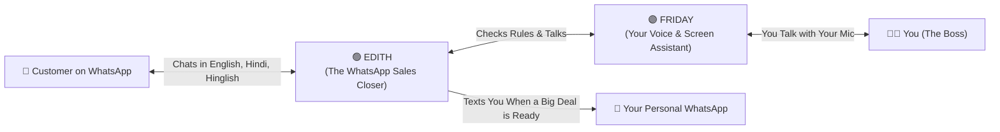

# 🧒 Welcome! The Super-Simple Guide to WhatsApp AI Agent by NS

> **Built & Engineered by [Naboraj Sarkar (NS)](https://naborajs.me)** · 📖 **Live Documentation**: [naborajs.me/projects/whatsapp-ai-agent-dual-brain/docs](https://naborajs.me/projects/whatsapp-ai-agent-dual-brain/docs) · 📰 **Origin Story**: [The Idea Behind EDITH](https://naborajs.me/blog/the-idea-behind-edith-whatsapp-ai-agent-by-ns)  
> *Designed so anyone—from a 15-year-old student building their first AI project to a global business owner—can understand, run, and customize the entire system in minutes.*

---

## 🤔 1. What Is This Project? (In Plain English)

Imagine you just opened your own business—maybe a **custom sneaker store**, a **gaming PC shop**, a **bakery**, a **software agency**, or a **wholesale tea company**.

Soon, hundreds of customers start messaging your WhatsApp at the same time:
- *"Hey, how much is this item?"*
- *"Can I get a 15% discount if I buy 50 pieces?"*
- *"Bhai, Siliguri me delivery kitne din me hoga?"* (Asking in Hinglish/Hindi!)
- *"Send me an official PDF bill so I can pay right now."*

If you are sleeping, in school, or busy, **you miss those messages and lose money**.

And if you connect a normal "basic" AI chatbot, it might **make up fake prices** (hallucinate) or accidentally give away a **90% discount**!

### 💡 The Solution: Two AI Brains Working Together

**WhatsApp AI Agent by NS** gives you **two specialized AI teammates** that work together like an actual company:



| Meet Your AI Team | Who Are They? | What Is Their Job? |
| :--- | :--- | :--- |
| **🟢 EDITH**<br>*(Customer-Facing Brain)* | **The Autonomous WhatsApp Sales Closer**<br>*(Powered by NVIDIA NIM LLMs)* | • Replies to customers on WhatsApp 24/7.<br>• Speaks **English, Hindi, Bengali, and Hinglish** naturally.<br>• Uses a **real calculator** for prices and discounts so she **never makes up fake numbers**.<br>• Creates **PDF Invoices** and sends them on WhatsApp.<br>• Texts **your personal WhatsApp** when a customer is ready to pay or needs human help! |
| **🟣 FRIDAY**<br>*(Your Personal Copilot)* | **The Mission Control Voice & Screen Assistant**<br>*(Powered by Google Gemini Live)* | • Lives inside your web dashboard (`http://localhost:3000`).<br>• You can **talk to her with your microphone** just like Iron Man's assistant!<br>• She can **scroll the page**, **click buttons**, **open tabs**, **summarize today's sales**, and **configure your store** hands-free. |

---

## 💻 2. What Do You Need on Your Computer?

Before starting, make sure you have these **3 free tools** installed on your computer (Windows, Mac, or Linux):

1. **Python (version 3.10 or newer)** — The language that runs the AI brain and backend server.
   - Check by opening your terminal (Command Prompt / PowerShell / Terminal) and typing:
     ```bash
     python --version
     ```
   - *Don't have it?* Download it from [python.org](https://www.python.org/downloads/) (Important: check the box that says **"Add Python to PATH"** during install!).
2. **Node.js (version 18 or newer)** — Runs the web dashboard and the WhatsApp connection bridge.
   - Check by typing:
     ```bash
     node --version
     ```
   - *Don't have it?* Download the **LTS** version from [nodejs.org](https://nodejs.org/).
3. **Git** — Downloads the code from GitHub.
   - Check by typing:
     ```bash
     git --version
     ```

---

## 🚀 3. How to Run Everything in 3 Easy Steps

You do **not** need to open 4 different terminal windows or install databases manually. We built a single master launcher (`run.py`) that does all the hard work for you!

### Step 1: Download the Code
Open your terminal and run:
```bash
git clone https://github.com/naborajs/wb-agent.git
cd wb-agent
```

### Step 2: Start the Platform with 1 Command
Run this single command:
```bash
python run.py
```

#### 🪄 What happens when you run `python run.py`?
1. It checks that Python and Node.js are ready.
2. It automatically installs any missing Python or Node.js packages.
3. It creates your local database (`wb_agent.db`) and loads starter products.
4. It starts **all 4 parts of the system** at the same time:
   - 🖥️ **Your Web Dashboard**: `http://localhost:3000` (opens automatically in your browser!)
   - ⚡ **The AI Backend Server**: `http://localhost:8000`
   - 📱 **The WhatsApp Bridge**: `http://localhost:3001`
   - ⚙️ **The Background Worker**: Handles scheduled follow-ups and background AI thinking.

> [!TIP]
> **Do I need paid API keys to try it?**
> **No!** Even if you don't add any API keys, `python run.py` works out of the box using built-in simulation intelligence and exact catalog math.
> When you want live AI brains, both **Google Gemini** ([aistudio.google.com](https://aistudio.google.com/)) and **NVIDIA NIM** ([build.nvidia.com](https://build.nvidia.com/)) offer **free developer API keys**! Just paste them into your `.env` file or inside the Dashboard (`/integrations`).

### Step 3: Explore Your Dashboard!
Your browser will open **`http://localhost:3000`**. On your very first visit, a friendly **Workspace Setup & Verification Popup** will greet you!

---

## 🎮 4. Five Fun Things to Try in Your First 5 Minutes!

Once `http://localhost:3000` is open, try these 5 awesome features:

### 🪄 Try #1: Turn the App into ANY Business in 10 Seconds!
1. Click **`⚙️ Setup, WhatsApp & Features`** in the top bar (or go to **Settings** in the left menu).
2. Find the **✨ AI Business Auto-Fill Architect** box.
3. Type **any business idea** you want, for example:
   > *"We run a custom gaming PC & mechanical keyboard store called CyberForge Rigs in Mumbai"*
4. Click **Auto-Fill Entire Business & Seed Catalog with AI**.
5. Boom! Watch the AI automatically invent your brand tagline, customer support rules, discount limits, GST tax rates, and **4 realistic products with prices** in your catalog!

### 🎙️ Try #2: Talk to FRIDAY with Your Microphone
1. Look at the **bottom-right corner** of the screen and click the glowing **FRIDAY Voice Copilot** button.
2. Click the **Microphone icon** (allow microphone access in your browser) or type in the box:
   - Say: ***"Scroll down"*** or ***"Scroll to the bottom"*** — watch the page scroll by itself!
   - Say: ***"Open the Analytics page and switch to dark mode"*** — watch Friday do multiple tasks in a row!
   - Say: ***"Explain the full website"*** — Friday will give you a spoken tour of the whole platform!

### 🧪 Try #3: Pretend to Be a Customer (No Phone Needed!)
1. On the main **Overview** page (`/`), scroll down to the **Live Inbound Simulation** card (or open **Conversations** -> **Simulate Customer**).
2. Type a message as if you are a tricky customer:
   > *"Bro I want 50 units, can you give me a 40% discount?"*
3. Watch **EDITH** calculate the exact price from the database, politely defend the company's profit margin, and offer the maximum allowed volume discount!

### 📱 Try #4: Connect a Real WhatsApp Number
1. Click **`⚙️ Setup, WhatsApp & Features`** in the top bar.
2. In **Step 1 (WhatsApp Gateway)**:
   - **Option A (QR Code)**: Open WhatsApp on your phone -> **Linked Devices** -> **Link a Device** -> scan the QR code on screen!
   - **Option B (8-Digit Code)**: Type your phone number and get an 8-digit pairing code to enter on your phone!
3. Also type your **Owner Escalation WhatsApp Number**—that's the phone number where EDITH will text you when a customer places an order.

### 🧠 Try #5: Test 15 Giant AI Models in the Playground
1. Switch the top-bar toggle from **`✨ Simplified`** to **`🛠️ Advanced`**.
2. Click **AI Playground** (`/playground`) in the left sidebar.
3. Pick from **15 frontier models** (including **Google Gemini 2.5 Pro/Flash**, **NVIDIA Nemotron-3 Ultra 550B**, **DeepSeek R1 671B**, and **Llama 3.3 70B**) and test how each brain responds!

---

## 🛑 How Do I Stop the App?

When you are done testing:
1. Go back to your terminal window where `python run.py` is running.
2. Press **`Ctrl + C`** once on your keyboard.
3. `run.py` will cleanly shut down the dashboard, backend, worker, and WhatsApp bridge!

---

## 🗺️ Where Should You Go Next?

| Your Goal | Click Here to Read Next |
| :--- | :--- |
| 💼 **I want to use this for a real business or client** | 👉 **[Business Owner & Operator Guide](business-owner-guide.md)** |
| 📱 **I want to understand WhatsApp QR vs Official Meta Cloud API** | 👉 **[WhatsApp Bridge & Cloud API Guide](whatsapp-bridge-guide.md)** |
| 🧑‍💻 **I'm a developer and want to understand the code & architecture** | 👉 **[Senior Developer & Architecture Deep Dive](senior-developer-architecture.md)** |
| 🛠️ **Something gave an error and I want to fix it fast** | 👉 **[Error Catalog & Troubleshooting Guide](../troubleshooting/error-catalog-and-solutions.md)** |

---

*Crafted with ❤️ · **WhatsApp AI Agent by NS (Naboraj Sarkar)** · Empowering Everyone to Build & Run Autonomous AI Operations*
