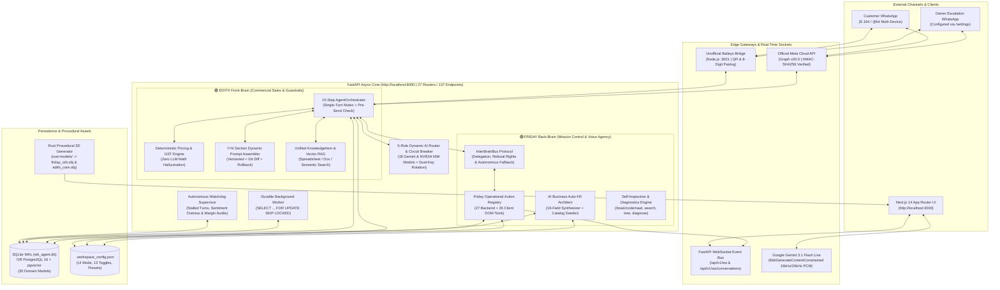

# 🏛️ Senior Software Engineer & Systems Architect Reference — WhatsApp AI Agent by NS

> **Architected & Engineered by Naboraj Sarkar (NS)** · *Production engineering specification covering the Dual-Brain Synaptic Bus, 15-Step Conversational Turn Engine, Deterministic Pricing & GST Math, Ephemeral Gemini Live Audio Pipeline, Unified Knowledge RAG Hub, Dynamic 5-Role Model Router, and Procedural Rust 3D Mesh Pipeline.*

---

## 1. High-Level System Topology & Service Boundaries

**WhatsApp AI Agent by NS** is designed as a **Local-First Modular Monolith** (`ADR-0002`, `ADR-0010`) orchestrated by a zero-config master supervisor (`run.py`) that boots four concurrent runtime processes:



### Runtime Process Map (`run.py`)
| Process | Runtime / Stack | Port | Core Responsibility |
| :--- | :--- | :--- | :--- |
| **1. FastAPI Backend** | Python 3.10+ / Uvicorn / SQLAlchemy 2.0 Async | `:8000` | 27 API routers (137 endpoints), WebSocket pub/sub, `AgentOrchestrator`, `InterBrainBus`, `AIRouter`, and PDF invoice generation. |
| **2. Durable Job Worker** | Python Asyncio Daemon (`app.jobs.worker`) | Internal | Polls `jobs` and `followup_jobs` tables, executes anti-ban jitter campaign drips (`25s–45s`), and runs idle background thinking. |
| **3. WhatsApp Bridge** | Node.js 18+ / `@whiskeysockets/baileys` / Express | `:3001` | Multi-device WhatsApp Web socket, QR & 8-digit pairing (`/pair`), session reset (`/reset-session`), and `@lid` to E.164 phone resolution. |
| **4. Mission Control UI** | Next.js 14 (App Router) / TypeScript / Tailwind / Three.js | `:3000` | 17 operational routes, Simplified vs Advanced workspace modes, WebGL 3D brain cores, and Friday Live Voice WebSocket client. |

---

## 2. Repository Directory Architecture

```text
wb-agent/
├── run.py                          # Master zero-config orchestrator (preflight, auto-install, DB seed, 4-service supervisor)
├── docker-compose.yml              # Containerized multi-service orchestration (Postgres + pgvector, Backend, Worker, Dashboard)
├── .env.example                    # Environment variable template (zero personal numbers hardcoded)
├── backend/
│   ├── app/
│   │   ├── main.py                 # FastAPI app factory, CORS, HSTS/timing middleware, router mounting
│   │   ├── config.py               # Pydantic Settings (env + runtime overrides)
│   │   ├── agent/                  # EDITH 15-step orchestrator, SPIN sales stage machine, extractor, validator, critic
│   │   ├── ai/                     # Dynamic 5-role AIRouter, circuit breaker, dual-key rotation, Gemini audio client
│   │   ├── api/routes/             # 27 route modules (137 endpoints across brain, settings, voice, knowledge, prompts, etc.)
│   │   ├── audio/                  # Whisper / Gemini multimodal voice note transcription (.ogg, .opus, .mp3)
│   │   ├── brain/                  # InterBrainBus synaptic protocol & AI codebase self-inspection service (code_service.py)
│   │   ├── conversations/          # Single-turn mutex locking, context window assembly, thread deduplication
│   │   ├── database/               # SQLAlchemy 2.0 async engine, 35 ORM models across 7 domain modules, schema migrations
│   │   ├── jobs/                   # Transactional database queue & worker daemon
│   │   ├── knowledge/              # Document chunking, vector embeddings, unified KnowledgeItem RAG service
│   │   ├── pricing/                # Deterministic volume tier calculator, MOQ guardrails, multi-currency FX engine
│   │   ├── services/               # Campaign engine, Friday action registry (27 actions), ReportLab GST PDF invoice generator
│   │   ├── watchdog/               # Autonomous diagnostic supervisor & anomaly detector
│   │   └── whatsapp/               # Provider abstraction (Baileys Bridge, Meta Cloud API v20.0, Sandbox Simulator)
│   └── tests/                      # 4-Tier test suite: unit/ (43 files), e2e/ (60 tests), evaluation/ (adversarial & personas)
├── dashboard/
│   ├── app/                        # 17 Next.js App Router pages (/, /brain, /playground, /conversations, /knowledge, /settings, etc.)
│   ├── components/                 # DashboardShell, OnboardingAndModeModal, VoiceAgent, 3d/ (Three.js), voice/ (DOM actions)
│   └── public/models/              # Compiled Wavefront .obj 3D meshes (friday_orb.obj, edith_core.obj)
├── whatsapp-bridge/
│   └── index.js                    # Baileys WebSocket bridge (:3001) with /status, /qr, /pair, /reset-session, /config, /send
├── rust-models/
│   ├── Cargo.toml                  # Zero-dependency Rust procedural 3D geometry crate
│   └── src/                        # Mesh builder, icosahedron/torus Friday orb, octahedron/gyroid EDITH core
├── scripts/                        # Operational CLI utilities (smoke_test.py, backup_db.py, optimize_db.py, seed_demo.py)
└── assets docs/                    # Interconnected documentation vault (guides, architecture, 26 ADRs, setup, runbooks, audits)
```

---

## 3. Dual-Brain Cognitive Protocol (`InterBrainBus` — ADR-0015)

Unlike single-agent wrappers, the platform separates **customer-facing commercial execution (EDITH)** from **internal operator supervision and UI agency (FRIDAY)** connected via an asynchronous `InterBrainBus` (`backend/app/brain/inter_brain_bus.py`) backed by the `inter_brain_messages` table.

### Key Architectural Mechanics:
1. **Friday → EDITH Task Delegation (`POST /api/v1/brain/request-edith`)**:
   - When the operator instructs Friday (e.g., *"Tell EDITH to offer a 30% discount to lead +919876543210"*), Friday dispatches a structured `InterBrainMessage` over the synaptic bus.
   - **Independent Policy & Margin Evaluation**: EDITH evaluates the request against the active `max_discount_pct` and `floor_price` rules. If the request violates commercial guardrails, **EDITH exercises autonomous refusal rights** (`status: REFUSED`), returning a detailed margin calculation to Friday rather than blindly executing an unprofitable order.
2. **EDITH → Friday Escalation & Friday Refusal (`POST /api/v1/brain/edith-to-friday`)**:
   - EDITH can request Friday to interrupt the operator via live voice audio.
   - Friday checks the operator's active dashboard focus state. For non-emergency notifications during focus mode, **Friday declines the voice interruption** and instructs EDITH to use a non-disruptive channel.
   - **Autonomous Fallback**: Upon refusal, EDITH automatically executes its fallback path—persisting a high-priority `AgentNotification` and broadcasting it silently over WebSocket (`agent_notification`).
3. **Mutual Idle Background Thinking (`POST /api/v1/brain/background-think`)**:
   - Audits catalog margin boundaries, anti-spam campaign cooldowns, and synaptic latency, recording auditable deliberation traces visible in `/brain`.

---

## 4. 15-Step `AgentOrchestrator` Turn Cycle & Concurrency Guarantees

Every inbound customer message (`POST /api/v1/webhooks/whatsapp` or `/api/v1/whatsapp/simulate-inbound`) executes a deterministic 15-step pipeline (`backend/app/agent/orchestrator.py`):

1. **Webhook Verification & Canonical Phone Resolution (`app/utils/phone.py`)**:
   - Verifies HMAC-SHA256 signatures (for Meta Cloud API) and deduplicates `provider_message_id`.
   - Resolves WhatsApp multi-device Linked IDs (`@lid`) to canonical E.164 phone digits and auto-merges duplicate threads so a buyer never splits across two inbox threads.
2. **Group Message Suppression (`ADR-0024`)**:
   - Messages originating from WhatsApp group JIDs (`@g.us`) are logged, force-switched to `HUMAN` mode, and generate an operator notification—EDITH never auto-replies inside group chats.
3. **Single-Turn Conversation Mutex (`ADR-0004`, `app/conversations/locking.py`)**:
   - Acquires a conversation-scoped lock (`conversation_locks`) so rapid multi-message bursts from a buyer are processed sequentially without state corruption.
4. **Multi-Tier Context Assembly (`ADR-0006`)**:
   - Loads Tier-1 active rolling turns, Tier-2 compressed `ConversationSummary`, and Tier-3 structured `CustomerMemory` facts with provenance.
5. **Multilingual & Dialect Classification**:
   - Detects English, Hindi, Bengali, and conversational Hinglish (`app/agent/intent.py`), matching the buyer's dialect automatically.
6. **Opt-Out & Compliance Guard**:
   - Immediate deterministic handling of `STOP` / `UNSUBSCRIBE` keywords, cancelling all pending `FollowupJob` records.
7. **Sentiment Distress & Human Request Check**:
   - Runs `analyze_sentiment` (`app/agent/sentiment.py`). High commercial frustration or explicit human requests immediately transition `Conversation.mode = "HUMAN"`, create a `Handoff`, and alert the owner's WhatsApp.
8. **Passive Fact Extraction (`app/agent/extractor.py`)**:
   - Extracts company type, monthly volume, destination city, and packaging preferences from natural conversation so EDITH **never re-asks a question the buyer already answered**.
9. **16-Stage Sales State Machine Progression (`app/agent/sales_stage.py`)**:
   - Transitions smoothly across `NEW` → `DISCOVERY` → `QUALIFIED` → `RECOMMENDATION` → `OBJECTION_HANDLING` → `PURCHASE_INTENT` → `PROFORMA_ISSUED` → `PAYMENT_PENDING` → `WON`.
10. **Unified Knowledge RAG Retrieval (`ADR-0007`)**:
    - Performs hybrid semantic + keyword retrieval across active `KnowledgeItem` and `KnowledgeChunk` records.
11. **Deterministic Pricing & GST Calculation (`ADR-0014`, `ADR-0019`)**:
    - Computes exact base price, volume tier discount, MOQ compliance, and statutory tax breakdown (`CGST + SGST` vs `IGST`) in Python—**never delegating arithmetic to the LLM**.
12. **7+N Dynamic System Prompt Assembly (`ADR-0013`)**:
    - Compiles active versions of all enabled `PromptSection` records (`core_safety`, `core_identity`, `business_policy`, `sales_style`, `business_profile`, `product_steering`, `escalation_rules`, plus custom sections) injected with live workspace settings from `.workspace_config.json`.
13. **Multi-Provider LLM Synthesis & Defensive Validation (`app/ai/pricing_validator.py`)**:
    - Generates response via `AIRouter` and validates that quoted numbers match the deterministic pricing engine output.
14. **Atomic Pre-Send Human Takeover Check (`ADR-0008`)**:
    - Re-queries `Conversation.mode` inside the database transaction immediately prior to WhatsApp dispatch. If a human operator clicked **"Take Over"** while the LLM was generating, the AI message is aborted cleanly.
15. **Dispatch, Audit Trail & Real-Time Broadcast**:
    - Sends message via active WhatsApp adapter (`baileys_bridge` or `meta_cloud`), records `AgentRun` telemetry, releases the turn mutex, and broadcasts `new_message` / `stage_changed` over WebSockets.

---

## 5. Dynamic 5-Role AI Router & Zero-Cost NVIDIA NIM Economics (`ADR-0026`)

The platform decouples model selection into **5 distinct functional roles** (`GET / POST /api/v1/brain/model-roles`), backed by **18 models** across Google Gemini and NVIDIA NIM:

| System Role Key | Default Model | Architectural Purpose |
| :--- | :--- | :--- |
| `friday_web_model` | `gemini-2.5-flash` | High-speed multimodal dashboard copilot, RAG synthesis, and campaign drafting. |
| `edith_sales_model` | `meta/llama-3.3-70b-instruct` | Customer-facing consultative sales negotiation, objection handling, and dialect code-switching. |
| `friday_voice_model` | `gemini-3.1-flash-live-preview` | Native bidirectional 16kHz/24kHz PCM audio streaming and real-time DOM tool calling. |
| `edith_policy_model` | `nvidia/nemotron-3-ultra-550b-instruct` | Deep commercial governance, prompt optimization, and margin guardrail verification. |
| `system_watchdog_model` | `openai/gpt-oss-20b` | Continuous background anomaly detection, stalled-turn audits, and numeric sanity checks. |

### Resilience & Failover Architecture (`backend/app/ai/router.py` & `circuit_breaker.py`):
- **Dual API Key Rotation**: Automatically rotates from `NVIDIA_API_KEY` to `NVIDIA_FALLBACK_API_KEY` (and `GEMINI_API_KEY` to `GEMINI_API_KEY_FALLBACK`) on HTTP `429` / `503` or timeout.
- **Chained Model Fallback Sequence**: If the primary model fails, `AIRouter` cascades through the configurable `fallback_models` chain (`nemotron-3-nano-omni-30b` → `nemotron-3-super-120b` → `gemma-4-31b-it`).
- **Deterministic Offline Simulation Mode**: If no external API keys are configured or network connectivity is lost, `AIRouter` seamlessly falls back to domain-grounded deterministic responses so development, CI, and live demos never crash.

---

## 6. Ephemeral Token Voice Architecture & 26-Tool DOM Agency (`VOICE-AGENT.md`)

To enable real-time, low-latency browser voice streaming with **Google Gemini 3.1 Flash Live** without exposing `GEMINI_API_KEY` to the browser:

1. **Server-Side Ephemeral Token Minting (`POST /api/v1/voice/session-token`)**:
   - Uses `google-genai` (`v1alpha`) to mint a single-use (`uses=1`), short-lived ephemeral token locked with `live_connect_constraints` (model, audio modality, system instructions, and tool declarations).
2. **Direct Browser-to-Google Constrained WebSocket**:
   - `VoiceAgent.tsx` streams 16,000 Hz 16-bit PCM microphone audio directly to `BidiGenerateContentConstrained` and plays back 24,000 Hz PCM audio via Web Audio API with instant barge-in interruption handling.
3. **Live Screen Grounding (`captureScreenSnapshot()`)**:
   - On every route transition or DOM mutation, `domActions.ts` serializes a compact JSON snapshot of visible headings, KPI metrics, inputs, and buttons (`[data-voice-action]`), injecting it into the active session.
4. **26 Client-Side Tools + 27 Backend Action Tools**:
   - Includes **Universal Viewport Scrolling** (`scroll_page` across `window`, `main`, and scrollable containers to `up`, `down`, `top`, `bottom`, or specific section selectors), **Multi-Step Sequential Workflows** (`execute_multi_step_workflow`), **Full Platform Walkthrough** (`explain_full_website`), **Live Spreadsheet & Document Editing** (`open_knowledge_editor`, `modify_editor_cell_or_field`), and **Cross-Brain Delegation** (`consult_edith_for_task`, `deliberate_with_edith`).

---

## 7. Procedural Rust 3D Mesh Generator (`rust-models/`) & Three.js WebGL Cores

The 3D neural visualizations for **FRIDAY** and **EDITH** on the Overview hero stage (`CinematicHeroDeck.tsx`) are backed by a zero-dependency procedural geometry engine written in **Rust**:

- **Source Crate**: `rust-models/` (`src/mesh.rs`, `src/friday_orb.rs`, `src/edith_core.rs`, `src/main.rs`)
- **Generated Assets (`dashboard/public/models/`)**:
  - `friday_orb.obj`: Subdivided icosahedron core surrounded by 3 tilted orbital energy rings and 8 satellite nodes (**1,704 vertices / 2,976 triangles**).
  - `edith_core.obj`: Concentric dual-octahedron commercial vault with 12 structural struts, 3 orthogonal gyroscopic rings, and 6 apex pylons (**630 vertices / 1,216 triangles**).
- **Rebuilding 3D Assets**:
  ```bash
  cd rust-models && cargo run --release
  # Or via Python wrapper:
  python scripts/generate_3d_models.py
  ```

---

## 8. Database Engine, Migrations & Maintenance CLI

- **Default Zero-Config Engine**: SQLite 3 in Write-Ahead Logging (`WAL`) mode (`wb_agent.db`) via `aiosqlite`, supporting concurrent reads and zero-setup portability.
- **Enterprise Scale Engine**: PostgreSQL 16 + `asyncpg` + `pgvector` (`docker-compose.yml`), activated automatically when `DATABASE_URL=postgresql+asyncpg://...` is set in `.env`.
- **Automated Schema Upgrades & Maintenance Scripts**:
  ```bash
  python backend/scripts/upgrade_sqlite_schema.py   # Idempotent column & table migration check
  python scripts/verify_db_integrity.py             # PRAGMA integrity_check & foreign key audit
  python scripts/backup_db.py                       # Lock-free C-API online SQLite backup to backups/
  python scripts/optimize_db.py                     # VACUUM & index statistics optimization
  ```

---

## 9. 4-Tier Verification & Automated Test Suite

The codebase maintains **43 unit test modules**, **60 End-to-End (E2E) contract tests**, and **adversarial safety evaluations**:

```bash
# 1. Run all Unit Tests (43 test files covering pricing, orchestrator, voice, RAG, security, etc.)
$env:PYTHONPATH="backend"; python -m pytest backend/tests/unit -v

# 2. Run the 60-Test 4-Tier E2E Suite (Invoicing, Audio, WebSockets, Campaigns, Analytics, Scenarios)
python run_e2e_tests.py

# 3. Run Adversarial Prompt-Injection & Multi-Turn Persona Evaluations
$env:PYTHONPATH="backend"; python -m pytest backend/tests/evaluation -v

# 4. Run Live System Smoke Test
python scripts/smoke_test.py
```

---

## 🔗 Deep-Dive Architectural References

- 📐 **[System Architecture Blueprint](../architecture.md)**
- 🔄 **[16-Stage Conversational State Machine](../architecture/conversational-state-machine.md)**
- 🧮 **[Deterministic Pricing & GST Engine](../architecture/deterministic-pricing-engine.md)**
- 🧠 **[Multi-Tier Memory & Fact Provenance](../architecture/multi-tier-memory-system.md)**
- ⚙️ **[Transactional Job Queue & Worker](../architecture/durable-queue-and-worker.md)**
- 🔌 **[Complete REST API & WebSocket Reference (137 Endpoints)](../api-reference.md)**
- 📜 **[Architecture Decision Records (ADR-0001 to ADR-0026)](../decisions/0001-postgresql-primary-storage.md)**

---

*WhatsApp AI Agent by NS · Architected & Engineered by **Naboraj Sarkar (NS)** · Enterprise v2.4.0*
