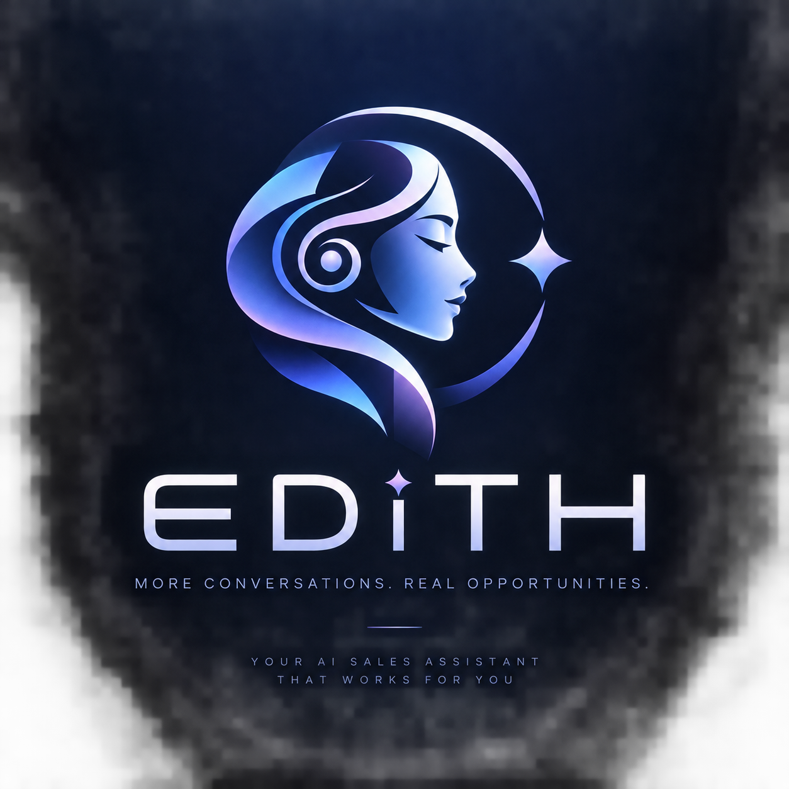

# 🌿 WB-Agent: Autonomous B2B AI Sales & Operations Platform

> [!NOTE]
> Welcome to the comprehensive, Obsidian-optimized documentation vault for **WB-Agent (EDITH & FRIDAY)**, the production-grade autonomous AI sales operating system built for **North Bengal Tea Co.** (B2B wholesale tea producer of Darjeeling, Dooars, and Assam CTC).
>
> This vault is hyperlinked, modular, and designed as an interconnected knowledge graph with `[[wikilinks]]`, relative Markdown paths, embedded UI screenshots, architectural blueprints, and full execution runbooks.

---

## 🧭 Master Map of Content (MOC)

```mermaid
flowchart TD
    Index["🌿 Knowledge Base Index (Home)"] --> Arch["🏛️ Architecture & Dual Brain"]
    Index --> UI["🖥️ Visual Tour & Dashboard"]
    Index --> ADR["📜 Architectural Decision Records (26 ADRs)"]
    Index --> Audits["🔍 System Audits & Handoffs (11 Audits)"]
    Index --> Setup["🚀 Setup & Deployment Guides"]
    Index --> Runbooks["⚙️ Operations & Incident Runbooks"]
    Index --> API["🔌 REST API & WebSocket Protocol"]

    Arch --> A1["[[architecture|System Architecture Deep Dive]]"]
    Arch --> A2["[[architecture/conversational-state-machine|16-Stage Sales State Machine]]"]
    Arch --> A3["[[architecture/deterministic-pricing-engine|Deterministic Pricing & Zero-Hallucination]]"]
    Arch --> A4["[[architecture/multi-tier-memory-system|Multi-Tier Memory & Customer Profiling]]"]
    Arch --> A5["[[architecture/durable-queue-and-worker|Durable Queue & SKIP LOCKED Worker]]"]

    UI --> U1["[[visual-tour|Dashboard Visual Tour (17 Screenshots)]]"]
    UI --> U2["[[assets/preview-dark-theme.png|Royal Pitch Black Theme]]"]
    UI --> U3["[[assets/preview-light-theme.png|Estate White Theme]]"]

    ADR --> ADR_List["[[decisions/0001-postgresql-primary-storage|ADR 0001–0026 Archive]]"]
    Audits --> AUD_List["[[audit/EDITH_CURRENT_STATE_HANDOFF|Complete Architecture Discovery Report]]"]

    Setup --> S1["[[setup/01-prerequisites-and-system-requirements|01. Prerequisites]]"]
    Setup --> S3["[[setup/03-backend-setup|03. FastAPI Backend]]"]
    Setup --> S4["[[setup/04-dashboard-frontend-setup|04. Next.js Dashboard]]"]

    Runbooks --> R1["[[operations-runbook|Operations Runbook & Kill-Switch]]"]
    Runbooks --> R2["[[runbooks/incident-response|Incident Response Playbook]]"]

    API --> API1["[[api-reference|Complete REST & WebSocket Reference]]"]
```

---

## 🏛️ 1. Architecture & Dual-Brain Operating System

WB-Agent operates with a **Dual-Brain Cognitive Architecture** that divides customer-facing sales execution from internal operational intelligence:

| AI Persona | Core Brain Engine | Model Stack | Primary Responsibility |
| :--- | :--- | :--- | :--- |
| **EDITH** | Autonomous Sales Consultant | `meta/llama-3.3-70b-instruct` (NVIDIA NIM) + Fallback Key Rotation | Customer negotiation, objection handling, SPIN qualification, pro-forma invoicing, WhatsApp outreach |
| **FRIDAY** | Mission Control Supervisor & Agency AI | `gemini-2.5-flash` (REST RAG/Chat) + `gemini-3.1-flash-live-preview` (Live Voice WS) | Operational auditing, UI manipulation, knowledge curation, live voice synthesis, diagnostic oversight |

### Core Architecture Documents:
- [[architecture|Comprehensive System Architecture]]: Monolithic modular service layer, database locking, turn execution mutex, and real-time WebSocket pub/sub.
- [[architecture/conversational-state-machine|16-Stage Consultative Sales State Machine]]: Detailed transition logic from `NEW` to `DISCOVERY`, `QUALIFIED`, `RECOMMENDATION`, `PURCHASE_INTENT`, `WON`, or `HUMAN_HANDOFF`.
- [[architecture/deterministic-pricing-engine|Deterministic Pricing & Zero-Hallucination Guardrails]]: Statutory mathematical pricing, volume tier step-curves, strict MOQs (20kg/50kg), and autonomous negotiation ceilings.
- [[architecture/multi-tier-memory-system|Multi-Tier Memory & Profiling System]]: Rolling turn context (last 5 turns), structured facts extraction, semantic customer profile memory, and session state serialization.
- [[architecture/durable-queue-and-worker|Transactional Task Queue & Background Worker]]: Database-backed reliable queue (`jobs` table) with `SELECT ... FOR UPDATE SKIP LOCKED` semantics and exponential backoff jitter.

---

## 🖥️ 2. Visual Operations Tour & UI Showcase

The Next.js 14 Mission Control dashboard provides deep observability and instant human intervention capabilities:

- **[[visual-tour|Complete Visual Operations Tour]]**: Detailed photographic walkthrough of all 17 dashboard views with annotated UI workflows.

### High-Resolution UI Snapshots:
| Module | Screenshot | Description |
| :--- | :--- | :--- |
| **Executive Overview** | `` | Real-time KPI counters, sales pipeline funnel, margin authority bounds, and live health pill. |
| **Live 3-Panel Inbox** | `` | 3-panel WhatsApp console: live thread list, message stream with AI badge, and customer intelligence takeover drawer. |
| **Pricing Rules** | `` | Volume discount step curve, MOQ limits, and autonomous negotiation authority table. |
| **Follow-up Sequences** | `` | ADR-009 automated cadences (Day 0, Day 1, Day 3) with preflight reply cancellation and manual abort controls. |
| **Human Handoffs** | `` | Escalation triage queue with owner WhatsApp alert dispatch (`+91 89006 53250`). |
| **Knowledge Hub & RAG** | `` | Dual-vector semantic RAG library, document chunk inspector, CSV catalog ingestion, and pending candidate approvals. |
| **Modular Prompts** | `` | Dynamic 7-section prompt assembler with NemoTron-driven AI optimization and rollback history. |
| **Campaigns & Outreach** | `` | Anti-ban campaign orchestrator with randomized jitter (25–45s), segment filters, and daily send limits. |
| **Lead Pipeline** | `` | B2B prospect table with qualification scoring, company classification, and CSV bulk import. |
| **Commercial Orders** | `` | Pro-forma invoices with statutory GST breakdown (CGST/SGST/IGST) and rate lock terms. |
| **AI Model Management** | `` | Real-time circuit breaker status, primary/fallback API key rotation, latency tracking, and playground. |
| **System Settings** | `` | Global autonomous kill-switch, quiet hours enforcement, and owner phone routing. |

---

## 📜 3. Architectural Decision Records (ADRs)

All 26 production architectural decisions are documented in [[decisions/0001-postgresql-primary-storage|assets docs/decisions/]]:

1. [[decisions/0001-postgresql-primary-storage|ADR-0001: PostgreSQL with pgvector as Primary Storage]]
2. [[decisions/0002-modular-monolith-architecture|ADR-0002: Modular Monolith Architecture]]
3. [[decisions/0003-database-backed-queue|ADR-0003: Database-Backed Queue with SKIP LOCKED]]
4. [[decisions/0004-conversation-concurrency|ADR-0004: Single-Turn Mutex & Optimistic Locking]]
5. [[decisions/0005-provider-abstraction|ADR-0005: WhatsApp Provider Abstraction]]
6. [[decisions/0006-memory-architecture|ADR-0006: Multi-Tier Memory (Active Context, Rolling Summary, Facts)]]
7. [[decisions/0007-knowledge-rag-authority|ADR-0007: Knowledge RAG Hierarchy & Grounding Authority]]
8. [[decisions/0008-human-takeover-race-prevention|ADR-0008: Atomic Human Takeover & Race Condition Prevention]]
9. [[decisions/0009-followup-engine-cancellation|ADR-0009: Pre-Dispatch Follow-up Verification & Guaranteed Cancellation]]
10. [[decisions/0010-local-first-architecture|ADR-0010: Local-First Hybrid Architecture & Offline Resilience]]
11. [[decisions/0011-whatsapp-adapter-architecture|ADR-0011: Dual WhatsApp Adapter Architecture]]
12. [[decisions/0012-operator-correction-learning|ADR-0012: In-Chat Operator Corrections as Knowledge Candidates]]
13. [[decisions/0013-modular-prompt-versioning|ADR-0013: 7-Section Dynamic Prompt Assembly & Rollback Versioning]]
14. [[decisions/0014-auditable-commercial-quotes|ADR-0014: Auditable Commercial Quote Generation & Expiry]]
15. [[decisions/0015-dual-brain-bidirectional-agency-and-refusal|ADR-0015: Dual-Brain Bus, Bidirectional Agency & Guardrail Refusal]]
16. [[decisions/0016-campaign-orchestration-and-anti-ban-guards|ADR-0016: Campaign Drip, Anti-Ban Protection & Anti-Spam Quotas]]
17. [[decisions/0017-resilient-sqlite-and-schema-migrations|ADR-0017: Resilient SQLite Fallback & Automated Schema Migrations]]
18. [[decisions/0018-whatsapp-rate-limiting-and-ban-prevention|ADR-0018: WhatsApp Anti-Ban Rate Limiter & Sliding Windows]]
19. [[decisions/0019-invoicing-gst-and-quote-lifecycle|ADR-0019: Automated Vector PDF Invoice Generation & Statutory GST]]
20. [[decisions/0020-frontend-architecture-and-observability|ADR-0020: Next.js 14 Frontend Architecture & Synaptic Telemetry]]
21. [[decisions/0021-multi-currency-pricing-and-internationalization|ADR-0021: Multi-Currency Pricing, FX Hedging & Export Support]]
22. [[decisions/0022-simulation-sandbox-isolation-and-live-whatsapp-guardrails|ADR-0022: Simulation Sandbox Isolation & Outbox Guardrails]]
23. [[decisions/0023-conversation-history-lifecycle-and-database-management|ADR-0023: Conversation History Lifecycle & VACUUM Maintenance]]
24. [[decisions/0024-whatsapp-group-message-suppression-and-operator-notification|ADR-0024: WhatsApp Group Message AI Suppression & Operator Alerts]]
25. [[decisions/0025-one-click-ai-suggestion-and-omnipotent-friday-agency|ADR-0025: One-Click AI Reply Suggestions & FRIDAY Autonomous Agency]]
26. [[decisions/0026-dynamic-model-assignment-and-zero-cost-nvidia-playground|ADR-0026: Dynamic Model Assignment & NVIDIA NIM Playground]]

---

## 🔍 4. System Audits & Technical Discovery

The complete technical handoff and system audit suite is located in [[audit/EDITH_CURRENT_STATE_HANDOFF|assets docs/audit/]]:

- **[[audit/EDITH_CURRENT_STATE_HANDOFF|Complete Architecture Discovery & Technical Handoff Report]]**: Exhaustive 20-section report documenting all working features, simulated stubs, database schemas, and remaining architectural decisions.
- **[[audit/CURRENT_ARCHITECTURE|Current Architecture Blueprint]]**: End-to-end component interaction flow, message lifecycle, and tenant boundaries.
- **[[audit/CHANGE_HISTORY|Change History & Evolution Log]]**: Chronological changelog from initial MVP to Enterprise v2.0.
- **[[audit/INTEGRATION_MAP|Integration & Hardware Map]]**: WhatsApp Baileys bridge, Meta Cloud API, NVIDIA NIM endpoints, and Google Gemini Live sockets.
- **[[audit/DASHBOARD_CURRENT_STATE|Dashboard State & Frontend Inventory]]**: Detailed route-by-route audit of UI state, mock dependencies, and live API wiring.
- **[[audit/MEMORY_CURRENT_STATE|Memory Architecture & State Report]]**: In-depth audit of fact extraction, customer memories, and Redis/SQLite state caching.
- **[[audit/KNOWN_ISSUES|Known Issues & Edge Case Catalog]]**: Edge cases, failure modes, and mitigation strategies.
- **[[audit/NEXT_DISCUSSION|Next Steps & Roadmap Discussion Guide]]**: Strategic architectural roadmap for multi-tenant SaaS scaling.
- **[[audit/REPOSITORY_INVENTORY|Complete Repository Inventory]]**: Byte-level categorization of all 226+ files across the repository.

---

## 🚀 5. Setup & Operational Deployment Guides

Step-by-step guides for developers and system operators:

- [[setup/01-prerequisites-and-system-requirements|01. Prerequisites & System Requirements]]: Python 3.11+, Node 18+, Docker, and OS environment.
- [[setup/02-database-and-pgvector-setup|02. PostgreSQL & pgvector Setup]]: Database creation, schema migrations, and SQLite offline fallback.
- [[setup/03-backend-setup|03. FastAPI Backend Setup]]: Virtual environments, configuration, and testing.
- [[setup/04-dashboard-frontend-setup|04. Next.js 14 Dashboard Setup]]: Environment variables, build process, and Tailwind theme configuration.
- [[setup/05-whatsapp-integration-guide|05. WhatsApp Integration Guide]]: Baileys WebSocket bridge vs. Meta Cloud API setup with webhook verification.
- [[setup/06-nvidia-nemotron-and-llm-setup|06. NVIDIA NIM & LLM Setup]]: Dual-key configuration, latency optimization, and rate limit resilience.
- [[setup/07-owner-escalation-channel|07. Owner Escalation Setup]]: Configuring owner alerts to `+91 89006 53250` for hot leads and human takeovers.
- [[setup/08-end-to-end-verification|08. End-to-End Simulation & Verification]]: Running multi-turn simulations across cafe, hotel, and wholesale buyer personas.

---

## ⚙️ 6. Operations Runbooks & Production Maintenance

- [[operations-runbook|Operations Runbook & Kill-Switch]]: Emergency protocols, worker scaling, database backups, and health monitoring.
- [[runbooks/production-deployment|Production Deployment Runbook]]: Docker Compose orchestration, SSL termination, systemd services, and rolling updates.
- [[runbooks/incident-response|Incident Response Playbook]]: Step-by-step resolution for WhatsApp disconnections, database locks, LLM outages, and stuck queues.
- [[guides/developer-onboarding|Developer Onboarding Guide]]: Quick-start guide for new engineers joining the project.
- [[troubleshooting/error-catalog-and-solutions|Comprehensive Error Catalog & Solutions]]: Detailed encyclopedia of known error messages with concrete code fixes.
- [[api-reference|REST API & WebSocket Protocol Reference]]: Complete schema reference for all 45+ backend endpoints.

---

## 🛡️ 7. Key Architecture Principles & Guarantees

> [!IMPORTANT]
> 1. **Zero Hallucination Pricing**: LLM is **never** permitted to generate product prices or calculate discount totals. All quotes and invoices are computed by the deterministic pricing engine from database rules.
> 2. **Single-Turn Mutex**: Each customer conversation can only process one message at a time. Inbound messages while an AI turn is running are held or queued to prevent race conditions.
> 3. **WhatsApp Group Chat AI Silence**: EDITH never auto-replies in WhatsApp groups (`@g.us`). Conversations are forced to `HUMAN` mode and alert the operator.
> 4. **Preflight Follow-up Cancellation**: If a customer replies, opts out, or is taken over by a human, all scheduled follow-ups are cancelled immediately before dispatch.
> 5. **Dual Model Key Rotation**: NVIDIA NIM calls rotate between primary (`NVIDIA_API_KEY`) and fallback (`NVIDIA_API_KEY_FALLBACK`) with automated circuit breaking.
> 6. **Statutory Tax Invoicing**: Invoices include valid GSTIN, FSSAI numbers, bank payment instructions, and statutory tax breakdown (5% GST: CGST+SGST or IGST).

---

*Last Updated: 2026-09-24 · WB-Agent Enterprise v2.0.0 · Maintained by DeepMind Advanced Agentic Coding Pair*
