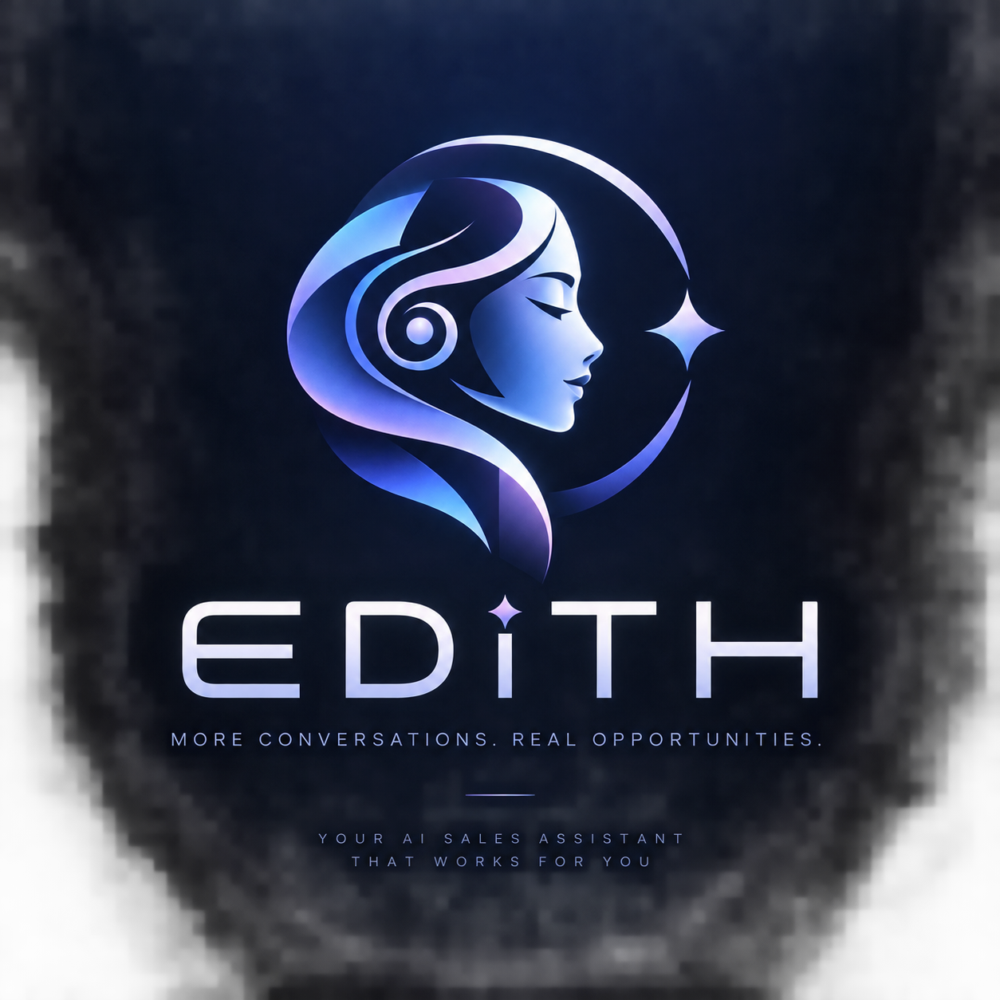

# 🚀 WhatsApp AI Agent by NS: Autonomous Dual-Brain AI Sales & Operations OS

> [!NOTE]
> Welcome to the master documentation vault for **WhatsApp AI Agent by NS (EDITH & FRIDAY)** — the production-grade, industry-agnostic autonomous AI sales and operations operating system engineered by **Naboraj Sarkar (NS)**.
>
> Designed for **any business or industry** (with 1-click **AI Business Auto-Fill Architect**, **6 built-in commercial presets**, and a **Custom Preset Creator**), this vault provides documentation for every audience—from a **15-year-old student** running the project for the first time to a **senior software architect** auditing concurrency locks and WebSocket protocols.

---

## 🎯 Start Here: Guides by Skill Level (`guides/`)

| Audience / Role | Guide | What You Will Learn |
| :--- | :--- | :--- |
| 🧒 **Beginner / Student (ELI15)** | **[Beginner & Student Quick-Start Guide](guides/beginner-quick-start.md)** | Plain-English explanation of EDITH + FRIDAY, 1-command startup (`python run.py`), and 5 fun things to try in 5 minutes—even with zero API keys. |
| 💼 **Business Owner / Operator** | **[Business Owner & Operator Playbook](guides/business-owner-guide.md)** | No-code setup using the **AI Business Auto-Fill Architect**, **Simplified vs. Advanced Mode**, **13 Feature Toggles**, **Official Meta Cloud vs. QR Pairing**, and daily inbox/order operations. |
| 🏛️ **Senior Software Architect** | **[Senior Developer & Systems Architecture Reference](guides/senior-developer-architecture.md)** | Deep dive into `InterBrainBus`, 15-step `AgentOrchestrator` mutex, 5-role `AIRouter`, Ephemeral Gemini Live WebSockets, Unified `KnowledgeItem` RAG, and Rust 3D meshes (`rust-models/`). |
| 🛠️ **Software Contributor** | **[Developer Onboarding & Local Environment Guide](guides/developer-onboarding.md)** | Repository layout, CLI flags (`--skip-install`, `--no-open`, `--clean`), multi-terminal debugging, cURL simulation, and 4-tier `pytest` execution. |
| 📱 **WhatsApp Integrator** | **[WhatsApp Connectivity Guide (Baileys vs. Meta Cloud)](guides/whatsapp-bridge-guide.md)** | Switching between the zero-cost **Unofficial Baileys Bridge (`:3001`)** (QR / 8-Digit Pairing / Session Reset) and **Official Meta Cloud API (`Graph v20.0`)**, plus `@lid` deduplication. |

---

## 🧭 Master Map of Content (MOC)

```mermaid
flowchart TD
    Index["🚀 Master Knowledge Base Index (Home)"] --> Guides["🎯 Role-Based Guides (ELI15 to Senior Dev)"]
    Index --> Arch["🏛️ Architecture & Dual Brain"]
    Index --> UI["🖥️ Visual Tour & 17 Dashboard Routes"]
    Index --> ADR["📜 Architectural Decision Records (26 ADRs)"]
    Index --> Audits["🔍 System Audits & Handoffs (11 Audits)"]
    Index --> Setup["⚡ Setup & Deployment Guides (01–09)"]
    Index --> Runbooks["⚙️ Operations & Incident Runbooks"]
    Index --> API["🔌 REST API & WebSocket Reference (137 Endpoints)"]

    Guides --> G1["[[guides/beginner-quick-start|🧒 Beginner Guide (ELI15)]]"]
    Guides --> G2["[[guides/business-owner-guide|💼 Business Owner Playbook]]"]
    Guides --> G3["[[guides/senior-developer-architecture|🏛️ Senior Architect Reference]]"]

    Arch --> A1["[[architecture|System Architecture Deep Dive]]"]
    Arch --> A2["[[architecture/conversational-state-machine|16-Stage Sales State Machine]]"]
    Arch --> A3["[[architecture/deterministic-pricing-engine|Deterministic Pricing & GST Engine]]"]
    Arch --> A4["[[architecture/multi-tier-memory-system|Multi-Tier Memory & Customer Profiling]]"]
    Arch --> A5["[[architecture/durable-queue-and-worker|Durable Queue & Worker]]"]

    UI --> U1["[[visual-tour|Dashboard Visual Tour (All 17 Routes)]]"]
    UI --> U2["[[assets/preview-dark-theme.png|Royal Pitch Black Theme]]"]
    UI --> U3["[[assets/preview-light-theme.png|Estate White Theme]]"]

    ADR --> ADR_List["[[decisions/0001-postgresql-primary-storage|ADR 0001–0026 Archive]]"]
    Audits --> AUD_List["[[audit/EDITH_CURRENT_STATE_HANDOFF|Complete Architecture Discovery Report]]"]

    Setup --> S1["[[setup/01-prerequisites-and-system-requirements|01. Prerequisites]]"]
    Setup --> S3["[[setup/03-backend-setup|03. FastAPI Backend]]"]
    Setup --> S4["[[setup/04-dashboard-frontend-setup|04. Next.js Dashboard]]"]

    Runbooks --> R1["[[operations-runbook|Operations Runbook & Kill-Switch]]"]
    Runbooks --> R2["[[runbooks/incident-response|Incident Response Playbook]]"]

    API --> API1["[[api-reference|Complete REST & WebSocket Reference]]"]
```

---

## 🏛️ 1. Architecture & Dual-Brain Operating System

**WhatsApp AI Agent by NS** operates with a **Dual-Brain Cognitive Architecture** that separates customer-facing commercial negotiation from internal operator intelligence and voice/DOM agency:

| AI Brain | Core Role | Default Model Stack (5-Role Router) | Primary Responsibility |
| :--- | :--- | :--- | :--- |
| **🟢 EDITH** | Autonomous Commercial Sales Closer | `meta/llama-3.3-70b-instruct` (Sales) + `nvidia/nemotron-3-ultra-550b` (Policy/Governance) | 24/7 WhatsApp buyer discovery, SPIN qualification, deterministic pricing & volume tier quotes, GST PDF invoices, and owner escalations. |
| **🟣 FRIDAY** | Mission Control Supervisor & Voice Copilot | `gemini-2.5-flash` (Web/RAG) + `gemini-3.1-flash-live-preview` (16kHz/24kHz Live Voice WS) | Real-time voice control, DOM scrolling & multi-step workflows, AI Business Auto-Fill, Knowledge Hub spreadsheet curation, and executive briefings. |

### Core Architecture Documents:
- **[[architecture|Comprehensive System Architecture]]**: Dual-Brain topology, 15-step turn cycle, 5-role dynamic model router, 35 database entities, and failover matrix.
- **[[architecture/system-overview|High-Level System Overview]]**: End-to-end data flow between WhatsApp gateways, FastAPI core, and Next.js Mission Control.
- **[[architecture/conversational-state-machine|16-Stage Consultative Sales State Machine]]**: Deterministic transition logic from `NEW` to `DISCOVERY`, `QUALIFIED`, `RECOMMENDATION`, `PURCHASE_INTENT`, `PROFORMA_ISSUED`, `WON`, or `HUMAN_HANDOFF`.
- **[[architecture/deterministic-pricing-engine|Deterministic Pricing & Zero-Hallucination Guardrails]]**: Statutory mathematical pricing, volume tier step-curves, MOQs, multi-currency FX, and autonomous discount ceilings.
- **[[architecture/multi-tier-memory-system|Multi-Tier Memory & Profiling System]]**: Rolling active context, compressed conversation summaries, and structured customer facts with provenance.
- **[[architecture/durable-queue-and-worker|Transactional Task Queue & Background Worker]]**: Database-backed reliable queue (`jobs` & `followup_jobs`) with `SELECT ... FOR UPDATE SKIP LOCKED` semantics and anti-ban jitter.
- **[[sales/consultative-framework|Consultative SPIN Sales Framework]]**: Non-pushy B2B & retail discovery methodology, single-question discipline, and objection handling.
- **[[security/threat-model|Security & Threat Model]]**: Ephemeral Gemini Live token constraints, HMAC-SHA256 webhook verification, prompt injection sanitization, and sliding-window rate limiting.

---

## 🖥️ 2. Visual Operations Tour & 17-Route UI Showcase

The Next.js 14 Mission Control dashboard features **✨ Simplified Mode** (for everyday store owners) and **🛠️ Advanced Mode** (for engineers and power operators):

- **[[visual-tour|Complete Visual Operations Tour]]**: Photographic walkthrough of all 17 dashboard routes and global modals.

### High-Resolution UI Snapshots (`screenshots/`):
| Module | Preview | Key Capabilities |
| :--- | :--- | :--- |
| **Executive Overview (`/`)** | [View Snapshot](screenshots/overview.png) | 3D WebGL Dual-Brain stage (`friday_orb.obj` & `edith_core.obj`), Synaptic Activity Ticker, Morning Audio Briefing, 24h Velocity Heatmap, and Live Sandbox Simulator. |
| **Live 3-Panel Inbox (`/conversations`)** | [View Snapshot](screenshots/live_inbox.png) | Canonical `@lid`-deduplicated thread list, message timeline with `✨ AI Suggest Reply`, voice note transcription, and atomic **Take Over / Resume AI** drawer. |
| **AI Business Architect & Settings (`/settings`)** | [View Snapshot](screenshots/settings.png) | **AI Business Auto-Fill Architect**, 6 Industry Presets + Custom Preset Creator, **Official Meta Cloud API vs. Unofficial Baileys Bridge**, and Global Kill-Switch. |
| **Unified Knowledge Hub (`/knowledge`)** | [View Snapshot](screenshots/knowledge_rag.png) | Consolidates Catalog, Pricing, Policies & Guides with an **Interactive Excel-like Spreadsheet Editor**, Document Viewer, and Vector RAG tester. |
| **Modular Prompts Studio (`/prompts`)** | [View Snapshot](screenshots/modular_prompts.png) | **7 Dynamic System Prompt Sections** + custom sections, NemoTron AI Optimizer, server-side **Git-Style Line Diff Viewer**, version pinning, and rollback. |
| **Model Router & Arena (`/integrations`, `/playground`)** | [View Snapshot](screenshots/integrations.png) | 5-role dynamic model assignment across 18 Gemini & NVIDIA NIM models, fallback sequence manager, and the **15-Model Negotiation Playground**. |
| **Pricing & Volume Curve (`/pricing`)** | [View Snapshot](screenshots/pricing_rules.png) | Interactive volume discount step curve, MOQ limits, and deterministic quote simulator. |
| **Product Catalog (`/products`)** | [View Snapshot](screenshots/catalog.png) | Multi-industry catalog items, custom units (`unit`, `kg`, `seat`, `package`, `sq.ft`), and 1-click stock toggles. |
| **Lead Pipeline (`/leads`)** | [View Snapshot](screenshots/leads_pipeline.png) | E.164 CSV bulk upload, 0–100 lead qualification scoring, and 1-click custom WhatsApp proposal dispatch. |
| **Anti-Ban Campaigns (`/campaigns`)** | [View Snapshot](screenshots/campaigns.png) | Chat-driven campaign drafting with Friday & EDITH guardrail validation and randomized **25s–45s anti-ban jitter**. |
| **Commercial Orders (`/orders`)** | [View Snapshot](screenshots/orders.png) | Order lifecycle tracking, automatic owner WhatsApp alerts, and ReportLab GST Pro-Forma PDF invoice generation. |
| **Sales Analytics (`/analytics`)** | [View Snapshot](screenshots/analytics.png) | Pareto 80/20 objection distribution, regional revenue density, weighted stage forecast, and 1-click CSV export. |
| **Follow-Up Sequences (`/followups`)** | [View Snapshot](screenshots/followups.png) | Bounded Touch 1 / Touch 2 / Touch 3 nudges with quiet hours (`9 PM – 9 AM`) and preflight reply auto-cancellation. |
| **Human Handoffs (`/handoffs`)** | [View Snapshot](screenshots/handoffs.png) | Escalation triage queue (`HOT_LEAD`, `CUSTOM_PRICING`, `COMPLAINT`, `KNOWLEDGE_GAP`) with 1-click resolution. |

---

## 📜 3. Architectural Decision Records (26 ADRs)

All 26 architectural decisions are documented in `assets docs/decisions/`:

1. [[decisions/0001-postgresql-primary-storage|ADR-0001: Primary Storage & Vector Architecture]]
2. [[decisions/0002-modular-monolith-architecture|ADR-0002: Modular Monolith Architecture]]
3. [[decisions/0003-database-backed-queue|ADR-0003: Database-Backed Queue with SKIP LOCKED]]
4. [[decisions/0004-conversation-concurrency|ADR-0004: Single-Turn Mutex & Optimistic Locking]]
5. [[decisions/0005-provider-abstraction|ADR-0005: Multi-Provider LLM & Channel Abstraction]]
6. [[decisions/0006-memory-architecture|ADR-0006: Multi-Tier Memory (Active Context, Rolling Summary, Facts)]]
7. [[decisions/0007-knowledge-rag-authority|ADR-0007: Knowledge RAG Hierarchy & Grounding Authority]]
8. [[decisions/0008-human-takeover-race-prevention|ADR-0008: Atomic Human Takeover & Race Condition Prevention]]
9. [[decisions/0009-followup-engine-cancellation|ADR-0009: Pre-Dispatch Follow-up Verification & Guaranteed Cancellation]]
10. [[decisions/0010-local-first-architecture|ADR-0010: Local-First Hybrid Architecture & Offline Resilience]]
11. [[decisions/0011-whatsapp-adapter-architecture|ADR-0011: Dual WhatsApp Adapter Architecture (Baileys + Meta Cloud)]]
12. [[decisions/0012-operator-correction-learning|ADR-0012: In-Chat Operator Corrections as Knowledge Candidates]]
13. [[decisions/0013-modular-prompt-versioning|ADR-0013: 7-Section Dynamic Prompt Assembly & Rollback Versioning]]
14. [[decisions/0014-auditable-commercial-quotes|ADR-0014: Auditable Commercial Quote Generation & Expiry]]
15. [[decisions/0015-dual-brain-bidirectional-agency-and-refusal|ADR-0015: Dual-Brain Bus, Bidirectional Agency & Guardrail Refusal]]
16. [[decisions/0016-campaign-orchestration-and-anti-ban-guards|ADR-0016: Campaign Drip, Anti-Ban Protection & Anti-Spam Quotas]]
17. [[decisions/0017-resilient-sqlite-and-schema-migrations|ADR-0017: Resilient SQLite WAL Default & Automated Schema Migrations]]
18. [[decisions/0018-whatsapp-rate-limiting-and-ban-prevention|ADR-0018: WhatsApp Anti-Ban Rate Limiter & Sliding Windows]]
19. [[decisions/0019-invoicing-gst-and-quote-lifecycle|ADR-0019: Automated Vector PDF Invoice Generation & Statutory GST]]
20. [[decisions/0020-frontend-architecture-and-observability|ADR-0020: Next.js 14 Frontend Architecture & Synaptic Telemetry]]
21. [[decisions/0021-multi-currency-pricing-and-internationalization|ADR-0021: Multi-Currency Pricing, FX Hedging & Export Support]]
22. [[decisions/0022-simulation-sandbox-isolation-and-live-whatsapp-guardrails|ADR-0022: Simulation Sandbox Isolation & Outbox Guardrails]]
23. [[decisions/0023-conversation-history-lifecycle-and-database-management|ADR-0023: Conversation History Lifecycle & VACUUM Maintenance]]
24. [[decisions/0024-whatsapp-group-message-suppression-and-operator-notification|ADR-0024: WhatsApp Group Message AI Suppression & Operator Alerts]]
25. [[decisions/0025-one-click-ai-suggestion-and-omnipotent-friday-agency|ADR-0025: One-Click AI Reply Suggestions & FRIDAY Autonomous Agency]]
26. [[decisions/0026-dynamic-model-assignment-and-zero-cost-nvidia-playground|ADR-0026: Dynamic 5-Role Model Assignment & NVIDIA NIM Playground]]

---

## 🚀 4. Setup & Operational Deployment Guides (`setup/` & `runbooks/`)

Step-by-step runbooks for local zero-config startup and enterprise cloud deployment:

- [[setup/01-prerequisites-and-system-requirements|01. Prerequisites & System Requirements]]: Python 3.10+, Node 18+, and zero-config `python run.py` setup.
- [[setup/02-database-and-pgvector-setup|02. Database Setup (SQLite WAL Default & PostgreSQL pgvector)]]: Zero-config SQLite WAL (`wb_agent.db`) + optional cloud PostgreSQL 16 setup.
- [[setup/03-backend-setup|03. FastAPI Backend Setup]]: Virtual environments, configuration, and testing.
- [[setup/04-dashboard-frontend-setup|04. Next.js 14 Dashboard Setup]]: Environment variables, 17 routes, and Dual-Theme configuration.
- [[setup/05-whatsapp-integration-guide|05. WhatsApp Integration Guide]]: Unofficial Baileys WebSocket bridge (`:3001`) vs. Official Meta Cloud API (`v20.0`).
- [[setup/06-nvidia-nemotron-and-llm-setup|06. NVIDIA NIM & Google Gemini LLM Setup]]: Dual-key configuration, 5-role routing, and circuit breaker resilience.
- [[setup/07-owner-escalation-channel|07. Owner Escalation Channel Setup]]: Configuring your Owner WhatsApp number in `/settings` for hot leads and handoffs.
- [[setup/08-end-to-end-verification|08. End-to-End Simulation & Verification]]: Using the 5-point UI Health Verification modal and multi-turn test scripts.
- [[setup/09-production-deployment-checklist|09. Production Deployment Checklist]]: Pre-launch security, backup, and scaling checklist.
- [[operations-runbook|Operations Runbook & Kill-Switch]]: Master `run.py` flags, emergency kill-switch, and campaign anti-ban cooldowns.
- [[runbooks/production-deployment|Production Deployment Runbook]]: Docker Compose orchestration, Nginx SSL, and rolling updates.
- [[runbooks/incident-response|Incident Response Playbook]]: Playbooks for bridge disconnects, database locks, and LLM rate limits.
- [[troubleshooting/error-catalog-and-solutions|Comprehensive Error Catalog & Solutions]]: Encyclopedia of common errors and fixes.
- [[api-reference|Complete REST API & WebSocket Reference]]: Full documentation of all **137 backend endpoints** across 27 routers.
- [[CHANGELOG|Platform Changelog (`v2.4.0`)]]: Release history and feature log.

---

## 🔍 5. Historical System Audits & Technical Discovery (`audit/`)

- [[audit/EDITH_CURRENT_STATE_HANDOFF|Complete Architecture Discovery & Technical Handoff Report]]
- [[audit/BUSINESS_AGNOSTIC_AUDIT|Business-Agnostic Customization Audit]]
- [[audit/CURRENT_ARCHITECTURE|Current Architecture Blueprint]]
- [[audit/CHANGE_HISTORY|Change History & Evolution Log]]
- [[audit/INTEGRATION_MAP|Integration & Hardware Map]]
- [[audit/DASHBOARD_CURRENT_STATE|Dashboard State & Frontend Inventory]]
- [[audit/MEMORY_CURRENT_STATE|Memory Architecture & State Report]]
- [[audit/KNOWN_ISSUES|Known Issues & Edge Case Catalog]]
- [[audit/NEXT_DISCUSSION|Next Steps & Roadmap Discussion Guide]]
- [[audit/REPOSITORY_INVENTORY|Complete Repository Inventory]]

---

*Last Updated: 2026-09-29 · **WhatsApp AI Agent by NS (v2.4.0)** · Architected & Maintained by **Naboraj Sarkar (NS)***
