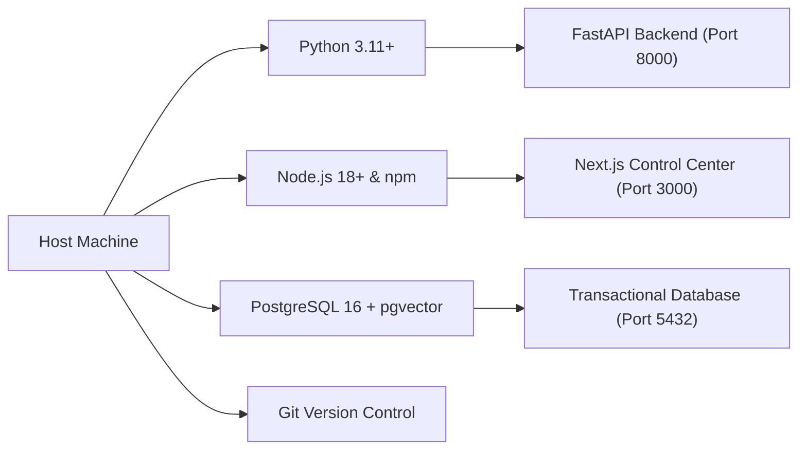

# 🚀 01. Prerequisites & System Requirements

> [!NOTE]
> This document details the minimum and recommended system requirements, tooling dependencies, port reservations, and environmental configurations needed before running **WB-Agent**.
>
> ⬅️ Back to: [[index|Knowledge Base Index]]  
> ➡️ Next Step: [[02-database-and-pgvector-setup|02. PostgreSQL 16 & pgvector Setup]]

---

## 🖥️ System Requirements

| Specification | Minimum Requirement | Recommended Production |
| :--- | :--- | :--- |
| **Operating System** | Windows 10/11, Ubuntu 22.04 LTS, Debian 12, or macOS 13+ | Ubuntu 22.04 LTS (x86_64) |
| **CPU** | 2 vCPUs / Cores | 4+ vCPUs |
| **RAM** | 4 GB | 8 GB+ (for PostgreSQL vector indexing) |
| **Disk Space** | 2 GB free storage | 20 GB+ NVMe SSD |
| **Network** | Outbound HTTPS (for WhatsApp & LLM APIs) | Static public IP or Domain with SSL |

---

## 🛠️ Required Software Tooling



### 1. Python 3.11+
The backend is built with modern Python 3.11+ async features.
Verify your installation:
```bash
python --version
# Output: Python 3.11.x, 3.12.x, 3.13.x, or 3.14.x
```
> [!TIP]
> On Windows, ensure you check the checkbox **"Add python.exe to PATH"** during Python setup.

### 2. Node.js 18+ and npm 9+
The operator dashboard is powered by Next.js 14 and React 18.
Verify your installation:
```bash
node --version
# Output: v18.x.x, v20.x.x, or v22.x.x+

npm --version
# Output: 9.x.x or 10.x.x+
```

### 3. PostgreSQL 16 with pgvector Extension
- **Production / Staging**: PostgreSQL 16 with the official `pgvector` extension installed for cosine semantic vector storage.
- **Local Development / Offline Testing**: If PostgreSQL is not installed locally, the backend automatically uses an offline dialect-agnostic SQLite fallback (`sqlite+aiosqlite:///./wb_agent.db`) and in-memory test databases with universal JSON and mock vector decorators.

### 4. Git Version Control
Required for cloning, tracking changes, and syncing upstream:
```bash
git --version
```

---

## 🔌 Port Reservations & Conflicts

Ensure the following default ports are available on your machine:

| Port | Service | Configuration Variable | Used By |
| :--- | :--- | :--- | :--- |
| **8000** | FastAPI REST & WebSockets | `API_URL=http://localhost:8000` | Backend runtime & Webhooks |
| **3000** | Next.js Dashboard | `DASHBOARD_URL=http://localhost:3000` | Operator UI |
| **5432** | PostgreSQL Database | `DATABASE_URL=postgresql+asyncpg://...` | Relational & vector storage |

> [!WARNING]
> If port `8000` or `3000` is occupied by another process, see the troubleshooting steps in [[error-catalog-and-solutions#port-conflicts|Error Catalog: Port Conflicts]].

---

## 🔀 Next Step
Once all prerequisites are installed and verified:
👉 Proceed to **[[02-database-and-pgvector-setup|02. PostgreSQL 16 & pgvector Setup]]** to initialize your database storage.
