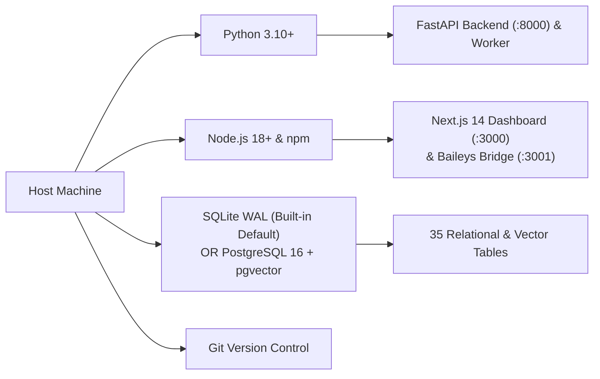

# 🚀 01. Prerequisites & System Requirements

> [!NOTE]
> **WhatsApp AI Agent by NS (EDITH + FRIDAY)** · *Engineered by Naboraj Sarkar (NS)*  
> This document details the minimum and recommended system requirements, software dependencies, and port reservations needed before running the platform.
>
> ⬅️ Back to: [[../index|Master Knowledge Base Index]]  
> ➡️ Next Step: [[02-database-and-pgvector-setup|02. Database Setup (Zero-Config SQLite WAL & PostgreSQL pgvector)]]

---

## 🖥️ System Requirements

| Specification | Minimum Requirement (Local / SMB) | Recommended Production (Enterprise) |
| :--- | :--- | :--- |
| **Operating System** | Windows 10/11, Ubuntu 22.04 LTS, Debian 12, or macOS 13+ | Ubuntu 22.04+ LTS (x86_64 / ARM64) |
| **CPU** | 2 vCPUs / Cores | 4+ vCPUs |
| **RAM** | 4 GB | 8 GB+ |
| **Disk Space** | 2 GB free storage | 20 GB+ NVMe SSD |
| **Network** | Outbound HTTPS (for WhatsApp & LLM APIs) | Static public IP or Domain with HTTPS/TLS |

---

## 🛠️ Required Software Tooling


```mermaid
flowchart LR
    Host["Host Machine"] --> Py["Python 3.10+"]
    Host --> Node["Node.js 18+ & npm"]
    Host --> DB["SQLite WAL (Built-in Default)\nOR PostgreSQL 16 + pgvector"]
    Host --> Git["Git Version Control"]

    Py --> Backend["FastAPI Backend (:8000) & Worker"]
    Node --> Frontend["Next.js 14 Dashboard (:3000)\n& Baileys Bridge (:3001)"]
    DB --> Storage["35 Relational & Vector Tables"]
```

### 1. Python 3.10+ (3.11+ Recommended)
The backend and master orchestrator (`run.py`) use modern Python async features.
Verify your installation:
```bash
python --version
# Output: Python 3.10.x, 3.11.x, 3.12.x, or 3.13.x+
```
> [!TIP]
> On Windows, ensure you check **"Add python.exe to PATH"** during Python installation.

### 2. Node.js 18+ and npm 9+
Powers both the Next.js 14 Mission Control Dashboard (`:3000`) and the self-hosted WhatsApp Baileys Bridge (`:3001`).
Verify your installation:
```bash
node --version
# Output: v18.x.x, v20.x.x, or v22.x.x+

npm --version
# Output: 9.x.x or 10.x.x+
```

### 3. Database Engine (Zero-Config SQLite Built-In!)
- **Default Zero-Config Mode (`SQLite WAL`)**: You do **not** need to install any external database server! Python's built-in SQLite engine (`sqlite+aiosqlite:///./wb_agent.db`) initializes automatically in Write-Ahead Logging (`WAL`) mode when you run `python run.py`.
- **Optional Enterprise Mode (`PostgreSQL 16 + pgvector`)**: For high-concurrency multi-worker cloud deployments (Supabase, Neon, RDS, Railway, or Docker), set `DATABASE_URL=postgresql+asyncpg://...` in `.env` (auto-upgraded if you pass `postgres://` or `postgresql://`).

### 4. Git Version Control
Required for cloning and pulling updates:
```bash
git --version
```

---

## 🔌 Port Reservations & Automatic Cleanup

Ensure the following default ports are available on your machine (`python run.py` automatically detects and frees stale locks on ports `3000`, `3001`, and `8000` at startup):

| Port | Service | Configuration Variable | Used By |
| :--- | :--- | :--- | :--- |
| **3000** | Next.js 14 Mission Control UI | `DASHBOARD_URL=http://localhost:3000` | Operator Browser & Friday Voice Copilot |
| **3001** | WhatsApp Baileys Web Bridge | `WHATSAPP_BRIDGE_URL=http://localhost:3001` | QR Scan, 8-Digit Pairing & Multi-Device Socket |
| **8000** | FastAPI REST & WebSocket Core | `API_URL=http://localhost:8000` | 138 API Endpoints, Webhooks & Realtime Bus |
| **5432** | PostgreSQL *(Optional)* | `DATABASE_URL=postgresql+asyncpg://...` | Only used if running external PostgreSQL |

> [!WARNING]
> If port `8000`, `3001`, or `3000` is occupied by another process, run `python run.py --clean` or see the troubleshooting steps in [[../troubleshooting/error-catalog-and-solutions#port-conflicts|Error Catalog: Port Conflicts]].

---

## 🔀 Next Step
Once all prerequisites are installed and verified:
👉 Run `python run.py` for instant 1-command startup, or proceed to **[[02-database-and-pgvector-setup|02. Database Setup (SQLite WAL & PostgreSQL pgvector)]]**.
