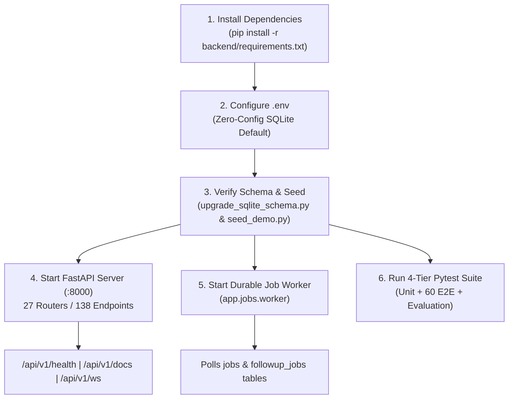

# ⚙️ 03. FastAPI Backend Setup & Execution Guide

> [!NOTE]
> **WhatsApp AI Agent by NS** · *Engineered by Naboraj Sarkar (NS)*  
> This guide covers setting up the Python environment, configuring `.env`, running the FastAPI REST & WebSocket server (`:8000`), launching the durable background worker, and executing the 4-tier test suite.
> *(Tip: Running `python run.py` from the repository root performs all of these steps automatically in one command!)*
>
> ⬅️ Previous Step: [[02-database-and-pgvector-setup|02. Database Setup (SQLite WAL & PostgreSQL pgvector)]]  
> ➡️ Next Step: [[04-dashboard-frontend-setup|04. Next.js 14 Dashboard Setup]]

---

## 🧭 Backend Process Lifecycle


```mermaid
flowchart TD
    Env["1. Install Dependencies\n(pip install -r backend/requirements.txt)"] --> Config["2. Configure .env\n(Zero-Config SQLite Default)"]
    Config --> Migrate["3. Verify Schema & Seed\n(upgrade_sqlite_schema.py & seed_demo.py)"]
    
    Migrate --> API["4. Start FastAPI Server (:8000)\n27 Routers / 138 Endpoints"]
    Migrate --> Worker["5. Start Durable Job Worker\n(app.jobs.worker)"]
    Migrate --> Tests["6. Run 4-Tier Pytest Suite\n(Unit + 60 E2E + Evaluation)"]

    API --> Endpoints["/api/v1/health | /api/v1/docs | /api/v1/ws"]
    Worker --> Queue["Polls jobs & followup_jobs tables"]
```

---

## 📦 1. Install Python Dependencies

### Windows (PowerShell)
```powershell
python -m venv .venv
.\.venv\Scripts\Activate.ps1
python -m pip install --upgrade pip
pip install -r backend/requirements.txt
```

### Linux / macOS (Bash / Zsh)
```bash
python3 -m venv .venv
source .venv/bin/activate
pip install --upgrade pip
pip install -r backend/requirements.txt
```

---

## 🔐 2. Environment Variables Configuration (`.env`)

Copy the template:
```bash
cp .env.example .env
```

Key parameters in `.env`:

```ini
# Core Configuration
APP_ENV=development
SECRET_KEY=change-this-to-a-super-secret-hex-token-in-production
API_V1_STR=/api/v1
PROJECT_NAME="WB-Agent Platform"

# Primary Database (Zero-Config SQLite WAL default; or postgresql+asyncpg://...)
DATABASE_URL=sqlite+aiosqlite:///./wb_agent.db
DATABASE_URL_SYNC=sqlite:///./wb_agent.db

# Business Owner Escalation Target (Configure in /settings UI or set E.164 phone here)
OWNER_WHATSAPP_NUMBER=
DEFAULT_ORG_ID=org_default

# WhatsApp Gateway Provider: 'bridge' (Baileys :3001), 'meta_cloud' (Official v20.0), or 'simulator'
WHATSAPP_PROVIDER=bridge
WHATSAPP_BRIDGE_URL=http://localhost:3001
WHATSAPP_VERIFY_TOKEN=wb_agent_verify_token

# AI Providers (Google Gemini for FRIDAY + NVIDIA NIM for EDITH)
GEMINI_API_KEY=your_gemini_api_key
NVIDIA_API_KEY=nvapi-your_nvidia_nim_api_key
LLM_PROVIDER=nvidia
LLM_FALLBACK_PROVIDER=simulator

# Worker & Concurrency Controls
WORKER_COUNT=2
JOB_POLL_INTERVAL_SECONDS=1.0
MESSAGE_DEBOUNCE_WINDOW_SECONDS=2.5
```

---

## 🚀 3. Starting the FastAPI Application Server

```bash
# On Windows PowerShell:
$env:PYTHONPATH="backend"
python -m uvicorn app.main:app --host 0.0.0.0 --port 8000 --reload

# On Linux / macOS:
PYTHONPATH="backend" python -m uvicorn app.main:app --host 0.0.0.0 --port 8000 --reload
```

### Verifying Service Liveness & OpenAPI Docs
- **Root Info**: `http://localhost:8000/`
- **Health Check**: `http://localhost:8000/api/v1/health`
- **Interactive Swagger UI (138 Endpoints)**: `http://localhost:8000/api/v1/docs`
- **Readiness Probe**: `http://localhost:8000/api/v1/readiness`

---

## ⚡ 4. Starting the Background Job Worker Daemon

The durable worker polls `jobs` and `followup_jobs` for scheduled follow-up sequences, anti-ban campaign drips, and background AI deliberation:

```bash
# On Windows PowerShell:
$env:PYTHONPATH="backend"
python -m app.jobs.worker

# On Linux / macOS:
PYTHONPATH="backend" python -m app.jobs.worker
```

---

## 🧪 5. Executing the Automated Test Suite

```bash
# 1. Run all 43 Unit Test modules
$env:PYTHONPATH="backend"; python -m pytest backend/tests/unit -v

# 2. Run the 60-Test 4-Tier End-to-End (E2E) Suite
python run_e2e_tests.py

# 3. Run Adversarial & Multi-Turn Persona Evaluations
$env:PYTHONPATH="backend"; python -m pytest backend/tests/evaluation -v
```

---

## 🚨 Troubleshooting Common Backend Issues

- **Port 8000 is occupied**: Run `python run.py --clean` or see [[../troubleshooting/error-catalog-and-solutions#port-conflicts|Error Catalog: Port Conflicts]].
- **`ModuleNotFoundError: No module named 'app'`**: Ensure `$env:PYTHONPATH="backend"` (PowerShell) or `PYTHONPATH="backend"` (Bash) is set.
- **Database issues**: See [[02-database-and-pgvector-setup|02. Database Setup Guide]].

---

## 🔀 Next Step
With the backend server and worker operating smoothly:
👉 Proceed to **[[04-dashboard-frontend-setup|04. Next.js 14 Dashboard Setup]]** to launch the Mission Control UI.
