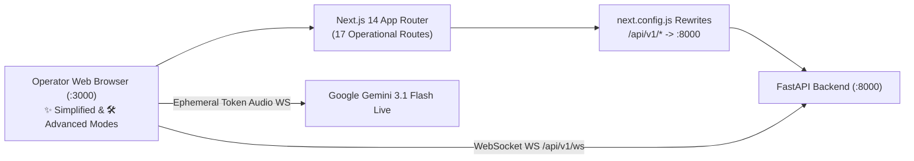

# 🖥️ 04. Next.js 14 Dashboard Frontend Setup

> [!NOTE]
> **WhatsApp AI Agent by NS** · *Engineered by Naboraj Sarkar (NS)*  
> The **Mission Control Dashboard** is a Next.js 14 (App Router) application built with React 18, TypeScript, Tailwind CSS, Recharts, and Three.js WebGL 3D cores. It connects to the FastAPI backend via reverse proxy rewrites and real-time WebSockets, and streams live 16kHz/24kHz voice audio with **FRIDAY (`Gemini 3.1 Flash Live`)**.
>
> ⬅️ Previous Step: [[03-backend-setup|03. FastAPI Backend Setup]]  
> ➡️ Next Step: [[05-whatsapp-integration-guide|05. WhatsApp Integration Guide]]

---

## 🎨 Dashboard Architecture



---

## 📦 1. Installing Frontend Dependencies

From the repository root, change into the `dashboard` directory (or let `python run.py` handle this automatically):

```bash
cd dashboard
npm install
```

Key frontend packages:
- `next`: `^14.2.x` (App Router)
- `react` & `react-dom`: `^18.2.0`
- `three`: Interactive 3D WebGL rendering for `NativeFridayOrb3D` (`friday_orb.obj`) & `NativeEdithCore3D` (`edith_core.obj`)
- `recharts`: Capability radar charts, Pareto curves, and token budget donuts
- `lucide-react`: High-density operational iconography
- `tailwindcss`: Dual-theme styling (**Royal Pitch Black** & **Estate White**)

---

## 🚀 2. Starting the Development Server

```bash
cd dashboard
npm run dev
```

Open your browser to:
👉 **`http://localhost:3000`**

### Verifying Production Build
```bash
cd dashboard
npm run build
npm run start
```

---

## 🧭 3. All 17 Dashboard Routes & Workspace Modes

> [!TIP]
> For the complete photographic walkthrough of all 17 operational views, visit **[[../visual-tour|Dashboard Visual Operations Tour]]**.

### Workspace Modes & Global Modals (`DashboardShell.tsx` & `OnboardingAndModeModal.tsx`)
- **`✨ Simplified` vs. `🛠️ Advanced` Mode Toggle**: Located in the top navigation bar. Simplified mode keeps the interface clean for everyday store owners, while Advanced mode unlocks all 17 engineering and AI studio routes.
- **`⚙️ Setup, WhatsApp & Features` Modal**: 3-step popup to configure **Unofficial Baileys QR/8-Digit Pairing vs. Official Meta Cloud API**, run the **AI Business Auto-Fill Architect**, toggle **13 platform modules ON/OFF**, and execute the **5-Point End-to-End Health Verification**.

### Complete Route Directory:
1. **`/` (`Overview Command Center`)**: 3D WebGL Dual-Brain stage, Live Synaptic Activity Ticker, Executive Morning Audio Briefing, 24h Traffic Velocity Heatmap, and Live Inbound WhatsApp Simulator.
2. **`/conversations` (`Live 3-Panel Inbox`)**: Canonical `@lid`-deduplicated thread list, live chat timeline with `✨ AI Suggest Reply`, voice note transcription, and atomic **Take Over / Resume AI** drawer.
3. **`/brain` (`Dual-Brain Synaptic Console`)**: Live Friday ↔ EDITH deliberation console, 6-dimension capability radar chart, token economics, synaptic ledger, and AI codebase self-inspection suite.
4. **`/playground` (`15-Model AI Negotiation Arena`)**: Interactive testing arena for 15+ Google Gemini & NVIDIA NIM models with 4 persona presets, 6 B2B test prompts, and 1-click AI prompt upgrading.
5. **`/knowledge` (`Unified Knowledge Hub & Spreadsheet Editor`)**: Consolidates Product Catalog, Pricing Rules, Policies, and Guides with an **Excel-like Interactive Spreadsheet Editor**, Document Viewer, Agentic Chat Updater, and Vector RAG tester.
6. **`/prompts` (`Modular System Prompts Studio`)**: Manages **7 dynamic system prompt sections** (`core_safety`, `core_identity`, `business_policy`, `sales_style`, `business_profile`, `product_steering`, `escalation_rules`) + custom sections with NemoTron AI optimization, server-side git diff viewer, version pinning, and rollback.
7. **`/settings` (`AI Business Architect & Gateway Settings`)**: **AI Business Auto-Fill Architect** (plain English -> 16 business fields + 4 seeded products), **6 Industry Presets + Custom Preset Creator**, **Official Meta Cloud API vs. Unofficial Baileys Bridge controls**, owner escalation phone, and Global Kill-Switch.
8. **`/integrations` (`5-Role Dynamic Model Router`)**: Assign models to `friday_web_model`, `edith_sales_model`, `friday_voice_model`, `edith_policy_model`, and `system_watchdog_model` with live latency benchmarks.
9. **`/leads` (`Lead Intake & Proposal Pipeline`)**: E.164 CSV bulk import, 0–100 lead scoring, and 1-click custom WhatsApp proposal dispatch.
10. **`/campaigns` (`Anti-Ban Campaign Drip Engine`)**: Chat-driven campaign drafting with Friday & EDITH guardrail validation and randomized **25s–45s anti-ban jitter**.
11. **`/orders` (`Commercial Orders & GST Invoices`)**: Order lifecycle management, automatic owner WhatsApp alerts, and ReportLab GST Pro-Forma PDF invoices.
12. **`/analytics` (`Sales Intelligence & Objection Analytics`)**: Pareto 80/20 objection chart, regional revenue table, stage-weighted forecast, and 1-click CSV export.
13. **`/followups` (`Follow-Up Sequence Engine`)**: Scheduled Touch 1 / Touch 2 / Touch 3 nudges with quiet hours and preflight reply auto-cancellation.
14. **`/handoffs` (`Human Escalation Queue`)**: High-value buyer escalations (`HOT_LEAD`, `CUSTOM_PRICING`, `COMPLAINT`, `KNOWLEDGE_GAP`) with 1-click resolution.
15. **`/notifications` (`Autonomous Agent Notifications Center`)**: Real-time alert feed from EDITH and Friday.
16. **`/pricing` & `/products`**: Dedicated views and unified redirects to the `/knowledge` catalog & pricing spreadsheet hub.

---

## 🔀 Next Step
Now that both the backend and frontend are operational:
👉 Proceed to **[[05-whatsapp-integration-guide|05. WhatsApp Integration Guide]]** to connect your WhatsApp channel.
