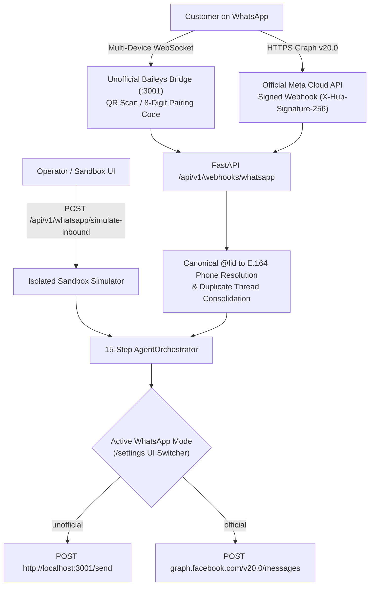

# 📱 05. WhatsApp Integration Guide (Baileys Bridge, Official Meta Cloud API & Simulator)

> [!NOTE]
> **WhatsApp AI Agent by NS** features a 3-mode provider abstraction (`WhatsAppProvider`):
> 1. **📲 Unofficial Baileys Web Bridge (`:3001`)**: Zero-cost instant QR Code scan or 8-Digit Pairing Code with any WhatsApp phone.
> 2. **✅ Official Meta Cloud API (`Graph v20.0`)**: Enterprise WABA integration with cryptographic HMAC-SHA256 webhook verification.
> 3. **🧪 Isolated Sandbox Simulator**: 100% offline/local conversational testing without a phone.
>
> ⬅️ Previous Step: [[04-dashboard-frontend-setup|04. Next.js 14 Dashboard Setup]]  
> ➡️ Next Step: [[06-nvidia-nemotron-and-llm-setup|06. NVIDIA NIM & Google Gemini LLM Setup]]

---

## 🏗️ WhatsApp Gateway Architecture



---

## 📲 Part 1: Unofficial Baileys Web Bridge (`:3001` — Default & Zero-Cost)

When you launch `python run.py`, the Node.js Baileys bridge (`whatsapp-bridge/index.js`) starts automatically on port `3001`.

### Connecting Any Phone via Dashboard UI
1. Open `http://localhost:3000` and click **`⚙️ Setup, WhatsApp & Features`** in the top bar (or go to **`/settings`**).
2. Select **📲 Unofficial Web Bridge (QR / Pairing Code)**.
3. Link your phone using either method:
   - **Scan Live QR Code**: Open WhatsApp on your phone → **Linked Devices** → **Link a Device** → scan the QR code rendered in the modal (or via `/api/v1/whatsapp/qr-embed`).
   - **8-Digit Pairing Code**: Enter your phone number with country code (e.g., `919876543210`) and click **Get Code** (`POST /api/v1/settings/whatsapp-pair`).
4. **Switching Numbers Anytime**: Click **"Switch / Connect a Different WhatsApp Number"** (`POST /api/v1/settings/whatsapp-reset`) to log out the current session and generate a fresh QR code.

---

## ✅ Part 2: Official Meta Cloud WhatsApp API (`Graph v20.0`)

To connect an official Meta WhatsApp Business Account (WABA):

### 1. Obtain Credentials from Meta Developer Console
1. Go to [developers.facebook.com](https://developers.facebook.com/) → **My Apps** → **Create App (Business)** → **WhatsApp**.
2. Retrieve your **Phone Number ID**, **WhatsApp Business Account (WABA) ID**, and generate a **Permanent System User Access Token** (`whatsapp_business_messaging`, `whatsapp_business_management`).

### 2. Configure Directly in the Dashboard UI (`/settings`)
1. Open **`http://localhost:3000/settings`** (or **Step 1** of the Setup Modal).
2. Switch the gateway mode to **✅ Official Meta Cloud API (WABA)**.
3. Enter your **Meta Phone Number ID**, **WABA ID**, **Permanent Access Token**, and **Webhook Verify Token**, then click **Save**.
   *(Changes automatically persist to `.workspace_config.json` and `.env` without restarting the server!)*

### 3. Configure Meta Webhook Callback URL
Point your Meta App Webhook Callback URL to:
```text
https://<your-domain-or-ngrok>/api/v1/webhooks/whatsapp
```
Subscribe to the `messages` webhook field.

---

## 🧪 Part 3: Local Sandbox Simulation (No Phone Required)

You can simulate an inbound customer message at any time using the Dashboard Overview page (`/`), the `/conversations` Sandbox tab, or via `curl`:

```bash
curl -X POST "http://localhost:8000/api/v1/whatsapp/simulate-inbound" \
  -H "Content-Type: application/json" \
  -d '{
    "phone": "+919876543210",
    "name": "Rahul Sharma",
    "company": "Heritage Cafe",
    "message": "Hi, what is your wholesale price for 50 units?"
  }'
```

---

## 🚨 Common WhatsApp Pitfalls & Solutions

- **403 Forbidden on Meta Webhook Verification**: Ensure the Verify Token in Meta Console matches your configured `WHATSAPP_VERIFY_TOKEN`. See [[../troubleshooting/error-catalog-and-solutions#whatsapp-webhook-403-forbidden|Error Catalog: Webhook 403]].
- **Multi-Device `@lid` Duplicate Threads**: Automatically handled! Both `whatsapp-bridge/index.js` and `backend/app/utils/phone.py` resolve `@lid` JIDs to canonical E.164 phone numbers.
- **Want to unlink and connect a new phone?**: Click **"Switch / Connect a Different WhatsApp Number"** in `/settings`.

---

## 🔀 Next Step
With WhatsApp configured:
👉 Proceed to **[[06-nvidia-nemotron-and-llm-setup|06. NVIDIA NIM & Google Gemini LLM Setup]]** to configure the Dual-Brain AI models.
