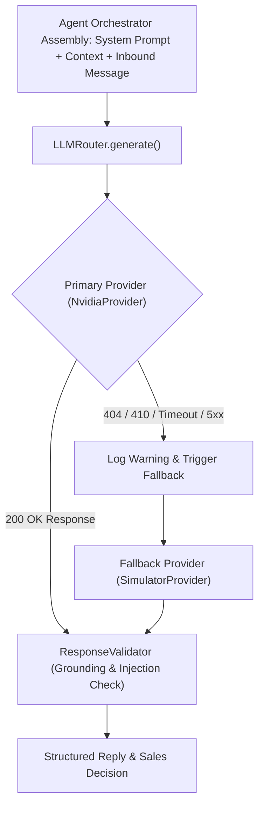

# 🧠 06. NVIDIA Nemotron & LLM Router Setup

> [!NOTE]
> WB-Agent uses **NVIDIA Nemotron-4 340B Instruct** as its primary reasoning model for intent classification, objection reframing, and professional tea consulting, paired with a resilient **Fallback LLM Router** that guarantees 100% uptime.
>
> ⬅️ Previous Step: [[05-whatsapp-integration-guide|05. WhatsApp Simulator & Meta Cloud API]]  
> ➡️ Next Step: [[07-owner-escalation-channel|07. Owner Escalation Setup (+91 89006 53250)]]

---

## 🏛️ LLM Router & Failover Flowchart



---

## 🔑 1. Obtaining an NVIDIA API Key

1. Navigate to **[NVIDIA NIM Catalog](https://build.nvidia.com/)**.
2. Sign in with your NVIDIA Developer account.
3. Select **nemotron-4-340b-instruct** under Foundation Models.
4. Click **Get API Key** and generate a new key (starts with `nvapi-...`).
5. Copy the generated key.

---

## ⚙️ 2. Environment Configuration (`.env`)

Configure the following parameters in your `.env`:

```ini
# Primary Sales Agent Provider: NVIDIA Nemotron
NVIDIA_API_KEY=nvapi-your-actual-nvidia-api-key
NVIDIA_BASE_URL=https://integrate.api.nvidia.com/v1
NVIDIA_MODEL=nvidia/nemotron-4-340b-instruct

# Vector Embeddings Model
NVIDIA_EMBEDDING_MODEL=nvidia/nv-embedqa-e5-v5

# Provider Modes: 'nvidia' or 'simulator'
LLM_PROVIDER=nvidia
LLM_FALLBACK_PROVIDER=simulator

# Model Hyperparameters
LLM_TEMPERATURE=0.2
LLM_MAX_TOKENS=1024
LLM_REQUEST_TIMEOUT=30
```

> [!TIP]
> Setting `LLM_TEMPERATURE=0.2` ensures stable, factual, deterministic phrasing without hallucinating discounts or tea origins.

---

## 🔄 3. Resilience: The Hybrid Failover Router (ADR-002)

In `backend/app/agent/providers/router.py`:
```python
class LLMRouter:
    async def generate(self, messages: List[LLMMessage]) -> LLMResponse:
        try:
            return await self.primary_provider.generate(messages)
        except Exception as e:
            logger.warning(f"Primary LLM provider failed ({e}). Routing to fallback provider.")
            return await self.fallback_provider.generate(messages)
```

If the remote NVIDIA endpoint experiences downtime, network timeouts, or quota exhaustion, **WB-Agent does not crash**. It automatically logs a diagnostic warning and fulfills the conversational turn via the deterministic `SimulatorProvider`.

---

## 🛡️ 4. Grounding & Anti-Hallucination Guardrails

The LLM is explicitly barred from making unverified claims or committing company funds through two distinct layers:

1. **System Prompt Guardrails**:
   - The LLM is instructed: *"Never invent discounts, wholesale rates, or free shipping. Always rely strictly on retrieved product records and pricing calculations."*
2. **Defensive ResponseValidator**:
   - Analyzes generated output for unauthorized financial guarantees (e.g. "payment verified", "50% off applied", "free delivery guaranteed").
   - If a violation occurs, the validator flags the turn, adjusts the response, and alerts the operator.

---

## 🚨 Diagnostics & Common Issues

- **404 Not Found on `/chat/completions`**: Ensure `NVIDIA_BASE_URL=https://integrate.api.nvidia.com/v1` (without trailing slash).
- **410 Gone on `/embeddings`**: NVIDIA regularly updates endpoint paths for preview embedding models. The system automatically falls back to `LocalMockEmbeddingProvider` for zero interruption.

---

## 🔀 Next Step
With the AI reasoning engine configured:
👉 Proceed to **[[07-owner-escalation-channel|07. Owner Escalation Setup (+91 89006 53250)]]** to verify owner WhatsApp alerts.
