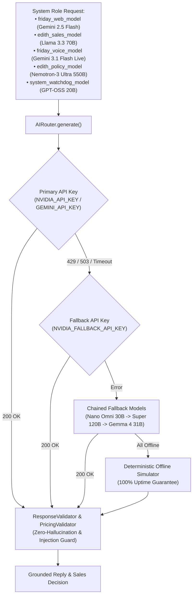

# 🧠 06. NVIDIA NIM & Google Gemini Dual-Brain LLM Router Setup

> [!NOTE]
> **WhatsApp AI Agent by NS** uses a **5-Role Dynamic AI Router** (`ADR-0026`) that pairs **Google Gemini (`2.5 Flash` & `3.1 Flash Live`)** for **🟣 FRIDAY** (Voice & Web Copilot) with **NVIDIA NIM (`Llama 3.3 70B`, `Nemotron-3 Ultra 550B`, `Super 120B`, `Nano Omni 30B`)** for **🟢 EDITH** (Autonomous Commercial Sales Closer), backed by dual-key rotation, circuit breaking, and an offline deterministic simulator.
>
> ⬅️ Previous Step: [[05-whatsapp-integration-guide|05. WhatsApp Integration Guide]]  
> ➡️ Next Step: [[07-owner-escalation-channel|07. Owner Escalation Channel Setup]]

---

## 🏛️ 5-Role Dynamic AI Router & Failover Flowchart


```mermaid
flowchart TD
    Prompt["System Role Request:\n• friday_web_model (Gemini 2.5 Flash)\n• edith_sales_model (Llama 3.3 70B)\n• friday_voice_model (Gemini 3.1 Flash Live)\n• edith_policy_model (Nemotron-3 Ultra 550B)\n• system_watchdog_model (GPT-OSS 20B)"] --> Router["AIRouter.generate()"]
    
    Router --> Primary{"Primary API Key\n(NVIDIA_API_KEY / GEMINI_API_KEY)"}
    
    Primary -->|200 OK| Valid["ResponseValidator & PricingValidator\n(Zero-Hallucination & Injection Guard)"]
    
    Primary -->|429 / 503 / Timeout|BackupKey{"Fallback API Key\n(NVIDIA_FALLBACK_API_KEY)"}
    BackupKey -->|200 OK| Valid
    BackupKey -->|Error| Chain["Chained Fallback Models\n(Nano Omni 30B -> Super 120B -> Gemma 4 31B)"]
    Chain -->|All Offline| Sim["Deterministic Offline Simulator\n(100% Uptime Guarantee)"]
    Chain -->|200 OK| Valid
    Sim --> Valid

    Valid --> Output["Grounded Reply & Sales Decision"]
```

---

## 🔑 1. Obtaining Free Developer API Keys

### A. Google Gemini API Key (For 🟣 FRIDAY Voice & Web Copilot)
1. Visit **[Google AI Studio](https://aistudio.google.com/)**.
2. Click **Get API Key** → **Create API Key**.
3. Copy your key (`AIza...`).

### B. NVIDIA NIM API Key (For 🟢 EDITH Commercial Brain & 15-Model Playground)
1. Visit **[NVIDIA NIM Catalog](https://build.nvidia.com/)**.
2. Sign in and click **Get API Key** on any model card (e.g., `meta/llama-3.3-70b-instruct` or `nvidia/nemotron-3-super-120b-a12b`).
3. Copy your key (`nvapi-...`).

---

## ⚙️ 2. Configuring Keys in `.env` or Directly in the Dashboard (`/integrations`)

You can configure your keys in `.env` **or** paste them live inside the browser at **`http://localhost:3000/integrations`** (which automatically syncs them into your local `.env` file!):

```ini
# Google Gemini (FRIDAY Live Voice & Web Copilot)
GEMINI_API_KEY=your_google_gemini_api_key
GEMINI_MODEL=gemini-3.1-flash-live-preview

# NVIDIA NIM (EDITH Sales Closer, Policy Auditor & Watchdog)
NVIDIA_API_KEY=nvapi-your-primary-nvidia-api-key
NVIDIA_NIM_API_KEY_PRIMARY=nvapi-your-primary-nvidia-api-key
NVIDIA_NIM_API_KEY_FALLBACK=nvapi-your-optional-backup-nvidia-key
NVIDIA_BASE_URL=https://integrate.api.nvidia.com/v1
NVIDIA_MODEL=nvidia/nemotron-3-super-120b-a12b
NVIDIA_FALLBACK_MODELS=nvidia/nemotron-3.5-lightning-30b-a3b,openai/gpt-oss-20b
NVIDIA_EMBEDDING_MODEL=nvidia/nv-embedqa-e5-v5

# Provider Modes & Hyperparameters
LLM_PROVIDER=nvidia
LLM_FALLBACK_PROVIDER=simulator
LLM_TEMPERATURE=0.2
LLM_MAX_TOKENS=1024
LLM_REQUEST_TIMEOUT=30
```

---

## 🧪 3. Testing Models in the 15-Model AI Playground (`/playground`)

1. Open **`http://localhost:3000/playground`** (in `🛠️ Advanced` mode).
2. Choose from **15+ Google Gemini & NVIDIA NIM models** (`Nemotron-3 Ultra 550B`, `Super 120B`, `Nano Omni 30B`, `Nemotron-4 340B`, `DeepSeek R1`, `Llama 3.3 70B`, `Qwen 2.5 72B`, `Mistral Large`, `Gemma 4 31B`, `Gemini 2.5 Pro/Flash`).
3. Select a persona (`EDITH Commercial Closer`, `Friday Web Copilot`, `Policy Auditor`, or `Technical Architect`) and test real-time latency and token economics!

---

## 🔀 Next Step
With the Dual-Brain AI router configured:
👉 Proceed to **[[07-owner-escalation-channel|07. Owner Escalation Channel Setup]]** to configure owner WhatsApp notifications.
