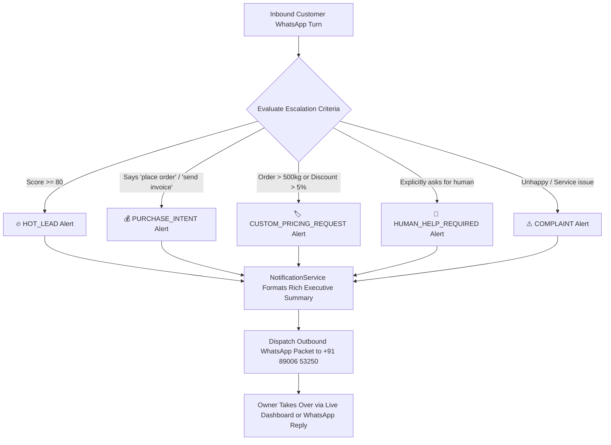

# 🚨 07. Owner WhatsApp Escalation Channel Setup

> [!NOTE]
> WB-Agent does not isolate human leadership from high-stakes commercial opportunities. The moment a prospect shows high purchase intent, asks for custom contract pricing, or requests human intervention, the system instantly compiles a high-density executive briefing and dispatches it directly to the business owner via WhatsApp.
>
> ⬅️ Previous Step: [[06-nvidia-nemotron-and-llm-setup|06. NVIDIA Nemotron & LLM Router]]  
> ➡️ Next Step: [[08-end-to-end-verification|08. End-to-End Simulation & Verification]]

---

## 👤 Escalation Target Profile

| Role | Details |
| :--- | :--- |
| **Recipient Name** | Rajiv Sen (Managing Director & Commercial Head) |
| **Company** | North Bengal Tea Co. |
| **Normalized E.164 Phone** | `+918900653250` |
| **Channel** | WhatsApp Cloud API v20.0 |
| **Configuration Key** | `OWNER_WHATSAPP_NUMBER=+918900653250` |

---

## ⚡ Escalation Triggers & Classification

The agent evaluates incoming messages and lead scoring shifts in real time to trigger notifications under the following conditions:



---

## 📱 Executive Briefing Format

When an alert is emitted, the owner receives a structured, actionable notification on WhatsApp:

```text
🔥 HOT LEAD ALERT

Name: Rahul Sharma
Phone: +918900653250
Location: Siliguri, West Bengal
Business: Heritage Cafe & Bakery
Interested in: Assam Kadak CTC (100kg) & Darjeeling First Flush
Requirement: 100 kg / month
Budget: ₹35,000 / month
Lead score: 92/100
Stage: PURCHASE_INTENT

Customer said: "We have finalized our menu and want to place the first commercial order today."

AI summary: Customer verified restaurant owner. Sample kit received last week with positive review. Ready to confirm GST billing and transit terms.

Recommended action: Open Live Inbox at http://localhost:3000/conversations to confirm payment terms and dispatch invoice.
```

---

## 🛡️ Atomic Takeover Protection (ADR-008)

To eliminate collision where the AI agent and the human owner respond simultaneously:

1. When Rajiv clicks **Take Over** in the dashboard or an escalation occurs, `Conversation.mode` transitions to `HUMAN`.
2. The orchestrator checks this status right before transmitting an outbound message:
```python
# Atomic Pre-Send State Check (ADR-008)
refreshed_conv = await self.session.get(Conversation, conversation_id)
if refreshed_conv.mode in ("HUMAN", "PAUSED"):
    logger.info(f"Outbound AI reply suppressed: conversation is in mode '{refreshed_conv.mode}'")
    return AgentTurnResponse(reply_text="[Suppressed - Operator Takeover]", is_suppressed=True)
```
3. Outbound AI messages are automatically suppressed, ensuring the human operator has 100% control over the conversation.

---

## 🧪 Testing Owner Alerts Locally

Run the unit test verifying owner notification dispatch and formatting:

```bash
# On PowerShell:
$env:PYTHONPATH="backend"
python -m pytest backend/tests/unit/test_followups_and_handoffs.py -k test_handoff_and_owner_notifications -v
```

---

## 🔀 Next Step
With all systems and notification channels configured:
👉 Proceed to **[[08-end-to-end-verification|08. End-to-End Simulation & Verification]]** to run the complete platform verification.
