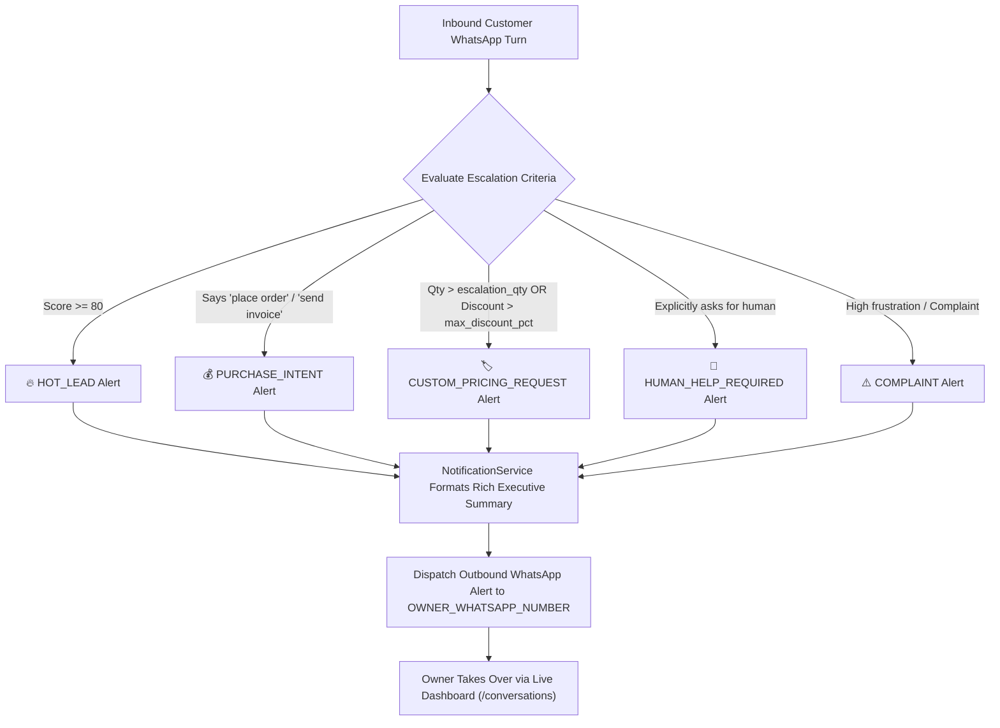

# 🚨 07. Owner WhatsApp Escalation Channel Setup

> [!NOTE]
> **WhatsApp AI Agent by NS** keeps business owners in full command of high-value deals. Whenever a buyer agrees to purchase, requests a discount above your autonomous ceiling (`max_discount_pct`), orders above your escalation quantity (`escalation_qty`), or asks for a human, **EDITH** instantly dispatches a structured executive summary to your personal WhatsApp number.
>
> ⬅️ Previous Step: [[06-nvidia-nemotron-and-llm-setup|06. NVIDIA NIM & Google Gemini LLM Setup]]  
> ➡️ Next Step: [[08-end-to-end-verification|08. End-to-End Simulation & Verification]]

---

## 👤 Configuring Your Owner Escalation Number

Zero personal phone numbers are hardcoded in the repository. You can set your **Owner Escalation WhatsApp Number** in two ways:

1. **Via the Dashboard UI (Recommended)**:
   - Click **`⚙️ Setup, WhatsApp & Features`** in the top bar (or open **`/settings`**).
   - Enter your personal WhatsApp number in E.164 format (e.g., `+919876543210`) under **Owner Escalation WhatsApp Number** and click **Save**.
   - Click **"Verify System & Send WhatsApp Test Ping"** in **Step 3** of the Setup Modal to receive an instant verification message on your phone!
2. **Via `.env`**:
   ```ini
   OWNER_WHATSAPP_NUMBER=+919876543210
   OWNER_NOTIFICATION_ENABLED=true
   ```

---

## ⚡ Escalation Triggers & Classification


```mermaid
flowchart TD
    Turn["Inbound Customer WhatsApp Turn"] --> Check{"Evaluate Escalation Criteria"}
    
    Check -->|Score >= 80| Hot["🔥 HOT_LEAD Alert"]
    Check -->|Says 'place order' / 'send invoice'| Buy["💰 PURCHASE_INTENT Alert"]
    Check -->|Qty > escalation_qty OR Discount > max_discount_pct| Price["🏷️ CUSTOM_PRICING_REQUEST Alert"]
    Check -->|Explicitly asks for human| Human["👤 HUMAN_HELP_REQUIRED Alert"]
    Check -->|High frustration / Complaint| Comp["⚠️ COMPLAINT Alert"]

    Hot & Buy & Price & Human & Comp --> Format["NotificationService Formats Rich Executive Summary"]
    Format --> Send["Dispatch Outbound WhatsApp Alert to OWNER_WHATSAPP_NUMBER"]
    Send --> Takeover["Owner Takes Over via Live Dashboard (/conversations)"]
```

---

## 📱 Executive Briefing Format Sent to Your Phone

```text
🔥 HOT LEAD / PURCHASE INTENT ALERT

Name: Rahul Sharma
Phone: +919876543210
Location: Mumbai, Maharashtra
Business: Apex Retail & Cafe
Requirement: 100 units / month
Lead score: 92/100
Stage: PURCHASE_INTENT

Customer said: "We have finalized our requirement and want to place the first commercial order today."

AI summary: Qualified B2B buyer. Pricing verified within autonomous tier rules. Ready for GST pro-forma invoice and payment confirmation.

Recommended action: Open Live Inbox at http://localhost:3000/conversations to review or take over.
```

---

## 🛡️ Atomic Takeover Protection (`ADR-0008`)

To prevent the AI agent and human owner from talking over each other:
1. When you click **Take Over** in `/conversations` (or when a mandatory escalation switches `Conversation.mode` to `HUMAN`), the database record is updated immediately.
2. Right before sending any AI reply, `AgentOrchestrator` re-queries `Conversation.mode`. If it is `HUMAN` or `PAUSED`, the outbound AI reply is suppressed atomically.

---

## 🧪 Testing Owner Alerts Locally

```bash
$env:PYTHONPATH="backend"
python -m pytest backend/tests/unit/test_followups_and_handoffs.py -k test_handoff_and_owner_notifications -v
```

---

## 🔀 Next Step
With your owner escalation channel configured:
👉 Proceed to **[[08-end-to-end-verification|08. End-to-End Simulation & Verification]]** to run the full 5-point platform verification.
