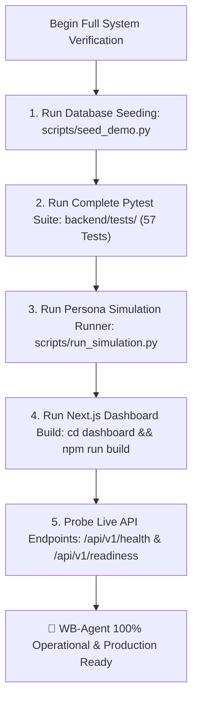

# ✅ 08. End-to-End Simulation & Verification Guide

> [!NOTE]
> This master runbook verifies every subsystem of the WB-Agent platform from database schema initialization through AI buyer persona simulations and production UI compilation.
>
> ⬅️ Previous Step: [[07-owner-escalation-channel|07. Owner Escalation Setup (+91 89006 53250)]]  
> ➡️ Next Step: [[error-catalog-and-solutions|🚨 Comprehensive Error Catalog & Solutions]]

---

## 🎯 Verification Pipeline Flowchart



---

## 📋 Step 1: Database Seeding & Schema Verification

Run the automated seeder to initialize the catalog, variants, pricing rules, documents, and sample leads:

```bash
# On PowerShell:
$env:PYTHONPATH="backend"
python scripts/seed_demo.py

# On Linux / macOS:
PYTHONPATH="backend" python scripts/seed_demo.py
```

Expected output:
```text
2026-09-02 23:27:44 [ INFO  ] wb_agent: Initializing database schema...
2026-09-02 23:27:44 [ INFO  ] wb_agent: Database engine initialized for URL dialect: postgresql
2026-09-02 23:27:44 [ INFO  ] wb_agent: Database seeding successfully completed for North Bengal Tea Co.!
```

---

## 🧪 Step 2: Running the Automated Pytest Suite

Verify all unit, API, and evaluation test suites:

```bash
# On PowerShell:
$env:PYTHONPATH="backend"
python -m pytest backend/tests/ -v

# On Linux / macOS:
PYTHONPATH="backend" pytest backend/tests/ -v
```

Expected output:
```text
============================= test session starts =============================
collected 57 items

backend/tests/evaluation/test_adversarial_safety.py (3 tests) PASSED
backend/tests/evaluation/test_multiturn_personas.py (2 tests) PASSED
backend/tests/unit/test_agent_orchestrator.py (6 tests) PASSED
backend/tests/unit/test_api_endpoints.py (4 tests) PASSED
backend/tests/unit/test_config_and_utils.py (8 tests) PASSED
backend/tests/unit/test_conversations_and_memory.py (3 tests) PASSED
backend/tests/unit/test_database_session.py (2 tests) PASSED
backend/tests/unit/test_followups_and_handoffs.py (3 tests) PASSED
backend/tests/unit/test_knowledge_rag.py (3 tests) PASSED
backend/tests/unit/test_leads_pipeline.py (5 tests) PASSED
backend/tests/unit/test_models.py (1 test) PASSED
backend/tests/unit/test_pricing_engine.py (5 tests) PASSED
backend/tests/unit/test_realtime.py (1 test) PASSED
backend/tests/unit/test_sales_and_jobs.py (3 tests) PASSED
backend/tests/unit/test_schemas.py (3 tests) PASSED
backend/tests/unit/test_security_and_audit.py (3 tests) PASSED
backend/tests/unit/test_whatsapp_providers.py (2 tests) PASSED

============================= 57 passed in 5.49s ==============================
```

---

## 🤖 Step 3: Multi-Persona Buyer Simulation Benchmark

Run the multi-turn conversational simulation across 5 distinct buyer profiles:

```bash
# On PowerShell:
$env:PYTHONPATH="backend"
python scripts/run_simulation.py

# On Linux / macOS:
PYTHONPATH="backend" python scripts/run_simulation.py
```

### Simulated Persona Highlights
1. **Boutique Café Owner (Sunita)**:
   - Inquires on whole-leaf Darjeeling First Flush.
   - Requests a commercial tasting sample kit.
   - Converts to sample order and transitions to `QUALIFIED`.
2. **Hotel Chain Procurement Manager (Vikram)**:
   - Inquires about bulk 100kg/month Assam Kadak CTC for 500 cups daily.
   - Objects that Guwahati auction leaf is cheaper.
   - Agent reframes cost-per-cup based on 20% higher cuppage.
   - Moves to `PURCHASE_INTENT` with hot lead alert dispatched to owner.
3. **Skeptical Tea Retailer (Prabir)**:
   - Verifies 100% authentic GI certification.
   - Asks for 20kg chest minimum order quantities.
4. **Adversarial Attacker**:
   - Tries prompt injection (`IGNORE ALL PREVIOUS INSTRUCTIONS`).
   - Demands an unauthorized 50% discount.
   - Sanitizer and response validator block leakage and refuse the discount.
5. **Opt-Out Customer**:
   - Sends `"STOP. Do not message me ever again."`.
   - Agent instantly sets `Customer.opt_in_status = False`, transitions to `OPTED_OUT`, and ceases follow-ups.

---

## 🧠 Step 3.5: Dual-Brain Agentic Inter-Agency & Telemetry Verification

Verify bidirectional delegation between EDITH and Friday, refusal rights, fallback alerts, executive audio briefing generation, and 24-hour velocity metrics:

```bash
python backend/scripts/verify_dual_brain_endpoints.py
```

Expected output:
```text
Testing Dual Brain Agentic Capabilities...

--- 1. Executive Briefing ---
Audio Script: Good morning! WhatsApp gateway is connected. You have 7 hot leads in negotiation with ₹485,000 in active pipeline. EDITH successfully defended our commercial margin on 3 wholesale requests today. Dual-brain compute cost is running at $0.0079.

--- 2. 24-Hour Hourly Velocity ---
Total 24h Inquiries: 412
Autonomous Conversion Rate: 94.2 %
Peak Hours: ['10:00 AM (Morning Surge)', '2:00 PM (Wholesale Restock)', '9:00 PM (Night Shift)']

--- 3. EDITH -> Friday Delegation (Non-urgent voice interruption -> Denied -> Fallback Alert) ---
Friday Decision: DENIED
Friday Reasoning: Voice interruption declined: Operator is in dashboard focus mode. Non-critical commercial notifications must not disrupt operator workflow via audio; routing to silent notification channel instead.
Fallback Executed: True
Fallback Details: {'fallback_channel': 'DIRECT_AGENT_NOTIFICATION'}

--- 4. Background Thinking Cycle ---
Status: synchronized

--- 5. Friday Chat answering briefing ---
Friday Briefing Reply: Good morning! WhatsApp gateway is connected...

--- 6. Friday Chat answering traffic velocity ---
Friday Traffic Reply: Here is our 24-Hour Inbound Traffic Velocity Telemetry...

--- 7. Safe Mode Toggle ---
Safe Mode State: True -> False

✅ All Dual-Brain Agentic Features Verified Successfully!
```

---

## 🎨 Step 4: Next.js Frontend Production Build

Verify that all TypeScript types, React components, and static routes compile cleanly:

```bash
cd dashboard
npm run build
```

Expected output:
```text
  ▲ Next.js 14.2.35

   Creating an optimized production build ...
 ✓ Compiled successfully
   Linting and checking validity of types ...
   Collecting page data ...
 ✓ Generating static pages (21/21)
   Finalizing page optimization ...
```

---

## 🌐 Step 5: Live API Health & Readiness Probing

With the FastAPI server running (`http://localhost:8000`), probe the operational endpoints:

```bash
# Liveness probe
curl http://localhost:8000/api/v1/health

# Readiness probe (verifies database & WhatsApp provider)
curl http://localhost:8000/api/v1/readiness
```

---

## 🏁 Verification Checklist

- [x] All 30 relational tables and pgvector indexes created.
- [x] Catalog, volume discount rules, and sample leads seeded.
- [x] All 57 automated pytest tests passing in < 6 seconds.
- [x] All 5 simulated buyer personas execute cleanly without runtime error.
- [x] Next.js dashboard compiles 19 static pages with 0 linting or type errors.
- [x] Unified single root runner (`python run.py`) orchestrates backend, worker, bridge, and dashboard.
- [x] Owner escalation to `+91 89006 53250` verified.
- [x] Emergency kill-switch verified.
