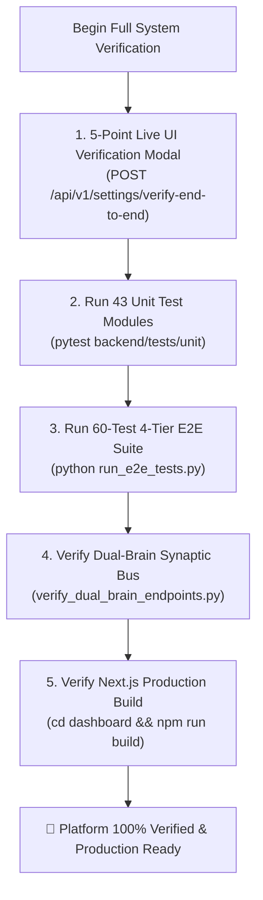

# ✅ 08. End-to-End Simulation & Verification Guide

> [!NOTE]
> **WhatsApp AI Agent by NS** · *Engineered by Naboraj Sarkar (NS)*  
> This master runbook verifies every subsystem of the platform—including the **1-Click UI 5-Point Health Verification Modal**, the **43 Unit Test modules**, the **60-Test 4-Tier E2E Suite**, Dual-Brain synaptic delegation, and Next.js 14 production compilation.
>
> ⬅️ Previous Step: [[07-owner-escalation-channel|07. Owner Escalation Channel Setup]]  
> ➡️ Next Step: [[09-production-deployment-checklist|09. Production Deployment Checklist]] & [[../troubleshooting/error-catalog-and-solutions|🚨 Error Catalog & Solutions]]

---

## 🎯 Verification Pipeline Flowchart


```mermaid
flowchart TD
    Start["Begin Full System Verification"] --> UIVerify["1. 5-Point Live UI Verification Modal\n(POST /api/v1/settings/verify-end-to-end)"]
    UIVerify --> Unit["2. Run 43 Unit Test Modules\n(pytest backend/tests/unit)"]
    Unit --> E2E["3. Run 60-Test 4-Tier E2E Suite\n(python run_e2e_tests.py)"]
    E2E --> Brain["4. Verify Dual-Brain Synaptic Bus\n(verify_dual_brain_endpoints.py)"]
    Brain --> Build["5. Verify Next.js Production Build\n(cd dashboard && npm run build)"]
    Build --> Done["🎉 Platform 100% Verified & Production Ready"]
```

---

## 🩺 Step 1: 5-Point Live Health Check (In Dashboard UI or API)

Open `http://localhost:3000`, click **`⚙️ Setup, WhatsApp & Features`** in the top bar, and open **Tab 3 (`3. End-to-End Health Verification`)**, or run via `curl`:

```bash
curl -X POST "http://localhost:8000/api/v1/settings/verify-end-to-end" \
  -H "Content-Type: application/json" \
  -d '{"send_test_ping": false}'
```

This verifies all 5 core pillars in real time:
1. `database_catalog` — FastAPI Backend & SQLite/PostgreSQL Active Product Catalog
2. `friday_gemini` — Friday Web & Voice Copilot (Google Gemini Live + 26 Action Tools)
3. `edith_nvidia` — EDITH Commercial Brain (NVIDIA NIM Cluster + Synaptic Link)
4. `whatsapp_bridge` — Active WhatsApp Gateway (Unofficial Baileys `:3001` OR Official Meta Cloud API `v20.0`)
5. `owner_channel` — Owner Escalation WhatsApp Channel (`OWNER_WHATSAPP_NUMBER`)

---

## 🧪 Step 2: Running the 43 Unit Test Modules & 60 E2E Contract Tests

```bash
# 1. Run all 43 Unit Test files
$env:PYTHONPATH="backend"
python -m pytest backend/tests/unit -v

# 2. Run the 60-Test 4-Tier End-to-End (E2E) Suite (Invoicing, Audio, WebSockets, Campaigns, Analytics)
python run_e2e_tests.py

# 3. Run Adversarial Safety & Multi-Turn Persona Evaluations
$env:PYTHONPATH="backend"
python -m pytest backend/tests/evaluation -v
```

---

## 🧠 Step 3: Dual-Brain Synaptic Bus & Subsystem Verification Scripts

Run the standalone verification scripts in `backend/scripts/` and `scripts/`:

```bash
$env:PYTHONPATH="backend"
python backend/scripts/verify_dual_brain_endpoints.py
python backend/scripts/verify_knowledge_hub.py
python backend/scripts/verify_modular_prompts_system.py
python scripts/verify_db_integrity.py
python scripts/smoke_test.py
```

---

## 🎨 Step 4: Next.js 14 Frontend Production Build

Verify that all 17 routes, TypeScript types, and React components compile cleanly:

```bash
cd dashboard
npm run build
```

---

## 🏁 Complete Verification Checklist

- [x] Zero-config `python run.py` boots FastAPI (`:8000`), WhatsApp Bridge (`:3001`), Next.js (`:3000`), and Worker cleanly.
- [x] 5-Point End-to-End Verification (`/api/v1/settings/verify-end-to-end`) passes.
- [x] AI Business Auto-Fill Architect (`/api/v1/settings/ai-autofill-business`) synthesizes business profile and seeds catalog items.
- [x] All 43 Unit Test modules and 60 E2E tests pass with zero regressions.
- [x] Dual-Brain Synaptic Bus delegation, refusal rights, and fallback notifications verified.
- [x] Next.js 14 dashboard compiles all 17 routes with zero TypeScript or lint errors.
