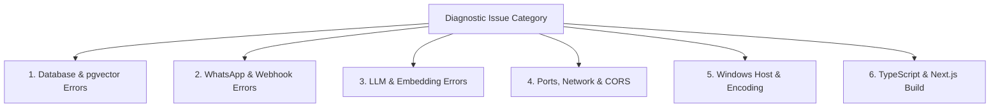

# 🚨 Comprehensive Error Catalog & Solutions

> [!NOTE]
> This encyclopedia documents known errors, warning messages, stack traces, underlying root causes, and verified step-by-step solutions encountered during development, installation, and production deployment of **WB-Agent**.
>
> ⬅️ Back to: [[index|Knowledge Base Index]]

---

## 📑 Diagnostic Directory



---

## 🗄️ 1. Database & pgvector Errors

### 1.1 `ConnectionRefusedError: Connection refused (localhost:5432)`
```text
sqlalchemy.exc.OperationalError: (asyncpg.exceptions.ConnectionDoesNotExistError)
connection to server at "localhost" (127.0.0.1), port 5432 failed: Connection refused
```
- **Root Cause**: The PostgreSQL server is not running or is bound to a different interface/port.
- **Solution**:
  1. If using Docker, start the container:
     ```bash
     docker compose up -d postgres
     ```
  2. If running native PostgreSQL, start the service:
     ```bash
     # Linux
     sudo systemctl start postgresql
     # macOS
     brew services start postgresql@16
     ```
  3. Or use the offline SQLite development fallback by setting in `.env`:
     ```ini
     DATABASE_URL=sqlite+aiosqlite:///./wb_agent.db
     DATABASE_URL_SYNC=sqlite:///./wb_agent.db
     ```

---

### 1.2 `UndefinedObject: type "vector" does not exist`
```text
asyncpg.exceptions.UndefinedObjectError: type "vector" does not exist
LINE 1: ...embedding_model VARCHAR(128) NOT NULL, embedding vector(1536)...
```
- **Root Cause**: The `pgvector` extension has not been enabled in the PostgreSQL database.
- **Solution**:
  Connect to PostgreSQL as superuser and execute:
  ```sql
  \c wb_agent;
  CREATE EXTENSION IF NOT EXISTS vector;
  ```
  Verify with `SELECT * FROM pg_extension WHERE extname = 'vector';`.

---

### 1.3 `NoSuchModuleError: Can't load plugin: sqlalchemy.dialects:postgresql.asyncpg`
- **Root Cause**: The `asyncpg` driver is missing or the connection string is improperly formatted.
- **Solution**:
  1. Ensure `asyncpg` is installed:
     ```bash
     pip install asyncpg
     ```
  2. Verify that your `DATABASE_URL` in `.env` starts with `postgresql+asyncpg://`, NOT `postgresql://`.

---

### 1.4 `QueuePool limit of size 10 overflow 20 reached`
```text
sqlalchemy.exc.TimeoutError: QueuePool limit of size 10 overflow 20 reached, connection timed out, timeout 30.00
```
- **Root Cause**: Database sessions are being opened without being properly closed or committed, causing connection pool exhaustion.
- **Solution**:
  1. Ensure every session is opened with an async context manager:
     ```python
     async with session_factory() as session:
         # operations here
     ```
  2. If high concurrency is expected, increase pool size in `.env`:
     ```ini
     DB_POOL_SIZE=20
     DB_MAX_OVERFLOW=40
     DB_POOL_TIMEOUT=60
     ```

---

## 📱 2. WhatsApp & Webhook Errors

### 2.1 WhatsApp Webhook Verification Returns `403 Forbidden`
```text
GET /api/v1/webhooks/whatsapp?hub.mode=subscribe&hub.verify_token=...&hub.challenge=...
HTTP/1.1 403 Forbidden - {"detail": "Webhook verification failed."}
```
- **Root Cause**: The `hub.verify_token` sent by Meta does not match `WHATSAPP_VERIFY_TOKEN` configured in your `.env`.
- **Solution**:
  1. Check what value is set in `.env`:
     ```ini
     WHATSAPP_VERIFY_TOKEN=wb_agent_verify_token
     ```
  2. In Meta Developer Console under **WhatsApp → Configuration → Webhook**, enter the exact same string in the **Verify Token** field.

---

### 2.2 Inbound POST Webhook Returns `403 Forbidden: Invalid signature`
- **Root Cause**: The `X-Hub-Signature-256` header does not match the computed HMAC-SHA256 signature using `WHATSAPP_WEBHOOK_SECRET`.
- **Solution**:
  1. In Meta Developer Console, go to **App Settings → Basic** and copy your **App Secret**.
  2. Update `.env`:
     ```ini
     WHATSAPP_WEBHOOK_SECRET=your_actual_meta_app_secret
     ```
  3. If running in local development with Simulator mode, ensure:
     ```ini
     WHATSAPP_PROVIDER=simulator
     ```
     The simulator automatically bypasses external Meta signature validation.

---

### 2.3 Outbound Message Displays `[Suppressed - Operator Takeover]`
- **Root Cause**: Not an error, but an intended safety feature (ADR-008). A human operator has clicked **Take Over** in the live inbox (`Conversation.mode = 'HUMAN'`), so the agent suppresses automated AI replies to prevent conflicting messages to the customer.
- **Solution**:
  To return the conversation to autonomous AI selling, click **Resume AI** in the live dashboard or make a POST request to `/api/v1/conversations/{id}/takeover` with `{"mode": "AI"}`.

---

### 2.4 Phantom Inbound Customer Messages & Accidental Outbound Dispatch to Real Numbers (Simulation Leaks)
- **Symptom**:
  - The Dashboard Live Inbox displays an incoming customer query (e.g. *"We need 250 units for next week shipment..."* from `+919876543210`), but in the actual WhatsApp Web / phone app, the customer never messaged that.
  - When an operator replied manually in the dashboard, the system dispatched an unexpected message to that real subscriber.
- **Root Cause**:
  1. **Simulation Channel Pollution**: Running in-browser simulations (e.g., `/api/v1/whatsapp/simulate-inbound` or Overview simulator) previously created threads on `channel="whatsapp"` in the primary database, placing fake customer inquiries directly in the live WhatsApp queue.
  2. **Un-isolated Operator Dispatch**: When operators responded in the Live Inbox, `send_manual_operator_message` dispatched the reply to the phone number over the live WhatsApp bridge without checking if the thread was simulated.
  3. **Test Leakage**: Tests using test numbers (like `+919876543210`) previously executed un-mocked send calls.
- **Fix & Architectural Safeguards (ADR 0022)**:
  1. **Sandbox Phone Interceptor**: `is_sandbox_test_phone()` checks phone numbers at the provider level (`BridgeWhatsAppProvider` and `MetaCloudWhatsAppProvider`). Calls to test sequences (`+919876543210`, `+919999988888`, etc.) are intercepted with synthetic confirmations and never transmitted over Baileys or Meta Cloud.
  2. **Strict Channel Segregation**: Inbound simulations exclusively assign `channel="simulation"`, tag `metadata_json={"is_simulation": True}`, and mark customers with `company_type="simulation"`.
  3. **Live Inbox Segmentation**: The dashboard defaults to the **WhatsApp Live** filter tab, ensuring only genuine customer messages appear. Simulated threads reside under the **🧪 Simulated** tab with distinct `[SIM]` tags and `[🧪 Sandbox Simulation]` header badges.
  4. **Outbound Manual Reply Protection**: Operator replies within simulated or sandbox conversations are persisted locally with `delivery_status="delivered"` and never dispatched to real WhatsApp.
  5. **Database Sanitization**: Execute `python scripts/sanitize_simulation_conversations.py` to isolate legacy test records.

---

### 2.5 Managing Conversation History, Pruning Storage, and Contact Visibility (ADR 0023)
- **Symptom**:
  - Operators need to view all conversation history (both genuine WhatsApp and test numbers like personal owner tests) or delete obsolete threads to prevent database bloat.
  - An operator asks: *"Can we delete conversation history or wipe simulation test data without losing real client chats?"*
- **Solution & Controls**:
  1. **Dashboard UI Controls**:
     - Switch between **WA Live**, **🧪 Sim**, or **All** tabs in `/conversations` to view all contacts or segment live vs test threads.
     - Click the red **Delete** button in the chat header to permanently delete a thread and all its messages.
     - In the **🧪 Sim** tab, click **Purge All** to wipe all simulation test threads and messages in a single click.
     - Click **Reset** to clear all messages and reset customer state while keeping the contact record.
  2. **API Endpoints**:
     - `DELETE /api/v1/conversations/{id}`: Permanently deletes the conversation and cascades to messages, events, and summaries.
     - `POST /api/v1/conversations/simulations/purge`: Purges all test data atomically.
     - `GET /api/v1/conversations/database/stats`: Returns live counts of total conversations, stored messages, and channel distribution.
  3. **FRIDAY & EDITH Dual-Brain Commands**:
     - You can ask Friday: *"Check the full database stats"*, and Friday will report live storage metrics.
     - You can command Friday: *"Purge simulation history"*, which coordinates with EDITH over the Inter-Brain Bus and executes safe pruning.
     - **Autonomous Refusal Guard**: If asked to delete an active, qualified hot lead, EDITH independently refuses the deletion to prevent pipeline damage and prompts manual dashboard confirmation.

---

### 2.6 AI Spam in WhatsApp Group Chats (`@g.us`) & Operator Response Routing (ADR 0024)
- **Symptom**:
  - The bot phone number is added to a WhatsApp group chat (e.g., industry wholesale suppliers, regional dealer forums).
  - Operator asks: *"Will EDITH or Friday reply to group messages and spam the group?"*
- **Root Cause**:
  - If group messages are forwarded directly to conversational LLM agents without group discrimination, the AI can treat public group messages as private 1-on-1 sales inquiries and output automated replies into the group.
- **Architectural Solution & Safeguards**:
  1. **Fail-Closed Inbound Suppression**: Webhook detection identifies WhatsApp group JIDs ending in `@g.us` (`is_whatsapp_group_jid`). The inbound webhook records the message, extracts the participant sender phone, sets `Conversation.mode = "HUMAN"`, and **skips enqueuing any AI turn job**.
  2. **Orchestrator Defense-in-Depth**: `AgentOrchestrator.process_turn` explicitly inspects `metadata_json.get("is_group")` and `channel_id.endswith("@g.us")`. Any attempted turn execution is suppressed immediately with `reason_code="GROUP_MESSAGE_AI_DISABLED"` and zero outbound messages.
  3. **Live Operator Notification**: Dispatches an `AgentNotification` (`category="GROUP_MESSAGE"`, `severity="warning"`) with a real-time WebSocket toast on the dashboard linking directly to the thread.
  4. **Dashboard Experience**: Group chats display a `👥 GROUP` badge in the thread list, are filtered under the `👥 Groups` tab, show an amber alert banner (*"AI auto-reply is disabled for groups. Responses are dispatched only when you send an Operator Reply"*), and disable the AI resume toggle.
  5. **Direct Manual Reply**: Operators can review group discussions and type replies directly from the dashboard, which Baileys dispatches directly to the group JID.

---

### 2.7 1-Click AI Suggestion Reply for Groups & Omnipotent Friday Agency (ADR 0025)
- **Symptom**:
  - Operators want AI assistance in drafting group chat replies without letting the AI send messages autonomously.
  - Operator asks: *"Can Friday or EDITH suggest what to reply in a group chat, let me refine it, and put it directly into my composer?"*
  - Operator asks: *"Can Friday click buttons, change themes, and navigate the website like a human?"*
- **Solution & Controls**:
  1. **1-Click AI Draft Button**: In the `/conversations` input toolbar, click **"✨ Suggest Reply"**. Friday & EDITH inspect recent messages and active catalog products, generate a professional draft, and inject it directly into the text input area without sending.
  2. **Refine with Friday**:
     - Quick chips allow 1-click refinement: `⚡ Shorter`, `💰 5% Bulk Discount`, `🚚 3-Day Delivery`, `👔 Formal Tone`, `🇮🇳 Hindi (हिंदी)`.
     - Click **💬 Talk to Friday...** to enter custom instructions (e.g., *"translate to Bengali"*, *"add bank details"*).
  3. **Voice & Text Agency**:
     - You can speak to Friday via the Voice Agent or type into Friday Chat: *"suggest reply for group with 5% discount"*, and Friday places the updated draft in your composer live via WebSocket.
     - You can tell Friday to click any element (*"click Suggest Reply"*, *"click Take Over"*), navigate routes (*"go to orders"*), or toggle themes (*"switch to dark mode"*). Friday executes DOM actions natively with animated visual rings.

---

### 2.8 Zero-Cost NVIDIA NIM Economics, Real-Time Model Speed Benchmarking & Dynamic Task Roles (ADR 0026)
- **Symptom**:
  - Operator asks: *"Why do NVIDIA models show dollar costs when my NVIDIA API key has inclusive access?"*
  - Operator asks: *"How fast is a model responding right now in milliseconds? Can I test responsiveness in 1-click?"*
  - Operator asks: *"Can I scroll and select which model handles Friday Web, EDITH WhatsApp sales, Voice, Margin Audit, and Watchdog?"*
  - Operator asks: *"Can I chat directly with any model in a dedicated ChatGPT/Gemini-style Playground?"*
- **Solution & Controls**:
  1. **Zero-Cost NVIDIA NIM Pricing**:
     - All NVIDIA NIM models are marked strictly as **"Included / Free (NVIDIA Key)"** (`$0.00`). Dollar cost calculations are maintained solely for Google Gemini models ($0.10/1M in, $0.40/1M out, etc.).
  2. **1-Click Live Speed Test**:
     - In the `/integrations` Model Economics table, click the green **"⚡ Speed Test"** button on any model row.
     - WB-Agent sends an authentic API request to Google Gemini or NVIDIA NIM, measures precise round-trip latency via `time.perf_counter()`, and displays live milliseconds with a color-coded status dot (🟢 `<1000ms`, 🟡 `<3000ms`, 🔴 `>3000ms` or error).
     - No simulated fallbacks or fake canned token numbers (such as 84, 132) are displayed.
  3. **Dynamic Model-to-Task Assignment**:
     - In the **Dynamic Model-to-Task Assignment** card on `/integrations`, operators can select models for:
       - **Friday Web Assistant**: e.g., `gemini-2.5-flash`
       - **EDITH WhatsApp Commercial Closer**: e.g., `nvidia/nemotron-3-ultra-550b-a55b`
       - **Friday Voice Agent**: `gemini-3.1-flash-live-preview` (Native 16kHz PCM audio stream)
       - **Policy & Margin Auditor**: e.g., `nvidia/nemotron-4-340b-instruct`
       - **System Watchdog Supervisor**: e.g., `nvidia/nemotron-3-nano-omni-30b-a3b-reasoning`
     - Click **"Save Task Assignments"** to immediately update active runtime and persist settings to `.env`.
  4. **Dedicated AI Playground (`/playground`)**:
     - Navigate to `/playground` via the top or sidebar navigation, or click **"🚀 Playground"** on any model row in `/integrations`.
     - Select any Google Gemini or NVIDIA model from the dropdown.
     - Choose persona presets (**Friday Web Copilot**, **EDITH Commercial Closer**, **Policy Auditor**, or **Technical Architect**).
     - Every turn displays live telemetry pills: `⚡ Latency ms | 📊 Prompt/Completion/Total Tokens | 💰 Cost/Free | 🏷️ Model`.

---

## 🧠 3. LLM & Embedding Errors

### 3.1 `httpx.HTTPStatusError: 404 Not Found on /chat/completions`
```text
[WARNING] wb_agent: Primary LLM provider failed (Client error '404 Not Found' for url 'https://integrate.api.nvidia.com/v1/chat/completions'). Routing to fallback provider.
```
- **Root Cause**: Invalid `NVIDIA_BASE_URL` format or an unauthenticated/deprecated model endpoint.
- **Solution**:
  1. Check `.env`:
     ```ini
     NVIDIA_BASE_URL=https://integrate.api.nvidia.com/v1
     NVIDIA_MODEL=nvidia/nemotron-4-340b-instruct
     ```
  2. Ensure there is no trailing slash on `NVIDIA_BASE_URL`.
  3. Notice that WB-Agent automatically triggers `SimulatorProvider` as an instant failover, keeping the conversation active.

---

### 3.2 `httpx.HTTPStatusError: 410 Gone on /embeddings`
```text
[WARNING] wb_agent: NVIDIA Embedding API call failed (Client error '410 Gone'). Falling back to LocalMockEmbeddingProvider.
```
- **Root Cause**: NVIDIA Foundation endpoint for the embedding preview model was deprecated or moved.
- **Solution**:
  WB-Agent is engineered with an automatic fallback in `NvidiaEmbeddingProvider`:
  ```python
  except Exception as e:
      logger.warning(f"NVIDIA Embedding API call failed ({e}). Falling back to LocalMockEmbeddingProvider.")
      return await LocalMockEmbeddingProvider(dimension=self._dim).embed_texts(texts)
  ```
  Zero action needed: the system falls back gracefully to `LocalMockEmbeddingProvider` without interrupting catalog seeding or search.

---

## 🌐 4. Networking, Ports & CORS Errors

### 4.1 `[Errno 10048] address already in use (Port 8000 or 3000)`
```text
ERROR: [Errno 10048] error while attempting to bind on address ('0.0.0.0', 8000): address already in use
```
- **Root Cause**: A previously launched Uvicorn server, Node.js process, or background task is still listening on port 8000 or 3000.
- **Solution**:
  Find and terminate the process holding the port:
  ```powershell
  # On Windows PowerShell:
  Get-Process -Id (Get-NetTCPConnection -LocalPort 8000).OwningProcess | Stop-Process -Force
  Get-Process -Id (Get-NetTCPConnection -LocalPort 3000).OwningProcess | Stop-Process -Force

  # On Linux / macOS:
  lsof -ti:8000 | xargs kill -9
  lsof -ti:3000 | xargs kill -9
  ```

---

### 4.2 `ModuleNotFoundError: No module named 'app'`
- **Root Cause**: Python cannot find the `app` package because `PYTHONPATH` was not exported.
- **Solution**:
  ```powershell
  # On Windows PowerShell:
  $env:PYTHONPATH="backend"
  python -m pytest backend/tests/

  # On Linux / macOS:
  PYTHONPATH="backend" pytest backend/tests/
  ```

---

### 4.3 `CORS error: Request has been blocked by CORS policy`
- **Root Cause**: The dashboard origin (`http://localhost:3000`) is not included in `settings.CORS_ORIGINS`.
- **Solution**:
  Verify in `.env`:
  ```ini
  CORS_ORIGINS=["http://localhost:3000","http://localhost:8000"]
  ```

---

## 🪟 5. Windows Host & Encoding Errors

### 5.1 `UnicodeEncodeError: 'charmap' codec can't encode character '\u20b9'`
```text
UnicodeEncodeError: 'charmap' codec can't encode character '\u20b9' in position 52: character maps to <undefined>
```
- **Root Cause**: Windows PowerShell by default uses code page 1252 (ANSI), which cannot encode the Indian Rupee sign (`₹`) or emojis without explicit UTF-8 reconfiguration.
- **Solution**:
  Reconfigure `sys.stdout` to UTF-8 at the entrypoint of the script:
  ```python
  import sys
  if sys.platform == "win32":
      sys.stdout.reconfigure(encoding="utf-8")
  ```
  Or set in PowerShell:
  ```powershell
  $env:PYTHONIOENCODING="utf-8"
  ```

---

### 5.2 PowerShell Script Execution Disabled (`Activate.ps1 cannot be loaded`)
```text
.venv\Scripts\Activate.ps1 cannot be loaded because running scripts is disabled on this system.
```
- **Root Cause**: Windows default ExecutionPolicy restricts running unsigned scripts.
- **Solution**:
  Run PowerShell as Administrator and execute:
  ```powershell
  Set-ExecutionPolicy -ExecutionPolicy RemoteSigned -Scope CurrentUser
  ```

---

## 💻 6. TypeScript & Next.js Build Errors

### 6.1 `Type error: Cannot find name 'int'`
```text
./app/conversations/page.tsx:28:15
Type error: Cannot find name 'int'.
> 28 |   lead_score: int;
```
- **Root Cause**: In TypeScript, the numeric primitive is `number`, not `int`.
- **Solution**:
  Replace `int` with `number`:
  ```typescript
  interface ConversationItem {
    lead_score: number;
    unread_count: number;
  }
  ```

---

> [!TIP]
> **Encountered an unlisted issue?** Enable verbose logging by setting `LOG_LEVEL=DEBUG` in your `.env` and restart the backend service to inspect complete stack traces.
