# 🖥️ Operations Dashboard — Visual Reference & 17-Route UI Tour

> **Platform:** WhatsApp AI Agent by NS (EDITH + FRIDAY Autonomous Sales & Operations OS)  
> **Lead Architect:** Naboraj Sarkar (NS)  
> **Visual System:** Dual-Theme Architecture — **Royal Pitch Black** (`#030712` / `#0b0f19`) and **Estate White** (`#ffffff` / `#f8fafc`) with sky-blue/cyan and emerald accents (`#0284c7`, `#10b981`), frosted-glass surfaces (`.ed-glass`), and procedural 3D WebGL brain cores (`friday_orb.obj` & `edith_core.obj`).

---

## 1. Executive Operations Architecture & Workspace Modes

The Next.js 14 Mission Control Dashboard (`http://localhost:3000`) adapts dynamically to the user's technical comfort level via the top-bar **`✨ Simplified` | `🛠️ Advanced`** mode toggle and the **`⚙️ Setup, WhatsApp & Features`** modal (`OnboardingAndModeModal.tsx`):

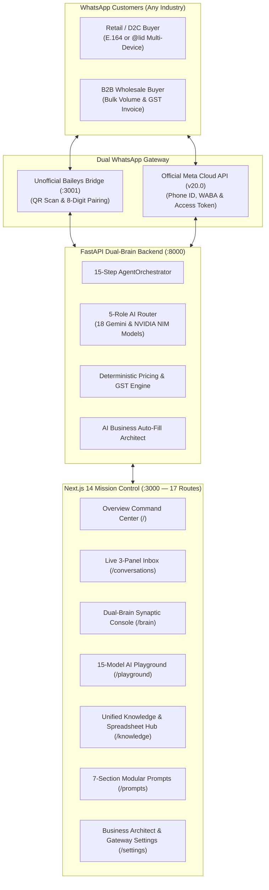

### First-Run Setup, WhatsApp & Features Modal (`OnboardingAndModeModal.tsx`)
Accessible anytime via **`⚙️ Setup, WhatsApp & Features`** in the top header bar:
1. **Tab 1 — WhatsApp Gateway & Owner Phone**: Switch between **Unofficial Web Bridge** (QR Code / 8-Digit Pairing Code / 1-click Session Reset) and **Official Meta Cloud API** (`Phone Number ID`, `WABA ID`, `Access Token`, `Verify Token`), and set your **Owner Escalation WhatsApp Number**.
2. **Tab 2 — AI Business Architect & Features**: Choose **`✨ Simplified`** or **`🛠️ Advanced`** mode, apply any of the **6 built-in Industry Presets** (or custom presets), run the **AI Business Auto-Fill Architect**, Quick-Add a Product/Rule, and toggle any of the **13 platform modules ON/OFF**.
3. **Tab 3 — End-to-End Health Verification**: Run a live 5-point diagnostic check across FastAPI/SQLite Catalog, Friday Gemini Live, EDITH NVIDIA NIM, WhatsApp Gateway, and Owner Escalation Channel.

---

## 2. Live 3-Panel Inbox & Conversational Sales Console (`/conversations`)

The primary workspace for real-time customer conversations, AI supervision, and human takeover:

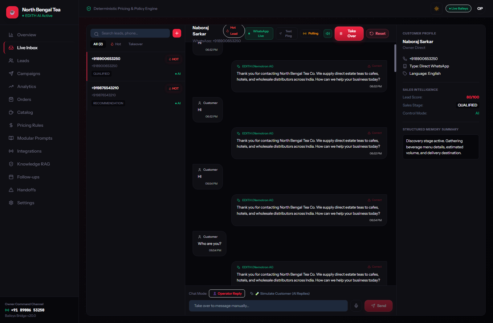

### Key Capabilities:
1. **Left Panel — Canonical Conversation Stream**:
   - Channel & status tabs (`All`, `WhatsApp`, `Sandbox`, `🔥 Hot Leads`, `Takeover`), real-time search, **Purge Simulations** button, and `+` Outbound Chat Initiator.
   - Automatic multi-device `@lid` to E.164 phone deduplication.
2. **Center Panel — Live Message Timeline & AI Draft Composer**:
   - Customer bubbles, EDITH AI responses with model badges, voice note upload & transcription, and **1-Click `✨ AI Suggest Reply`** grounded in live catalog prices.
   - Single-click **"Report / Correct"** button on AI messages to create a `KnowledgeCandidate`.
3. **Right Panel — Customer Intelligence & Atomic Takeover Drawer**:
   - Extracted buyer profile (company, business type, monthly volume, city, dialect), 0–100 lead score, 16-stage sales progression, and atomic **Take Over / Resume AI** button (`ADR-0008`).

---

## 3. Dual-Brain Command Center (`/`) & Synaptic Console (`/brain`)

The mission control centerpiece powered by the `InterBrainBus` protocol between **FRIDAY** and **EDITH**:

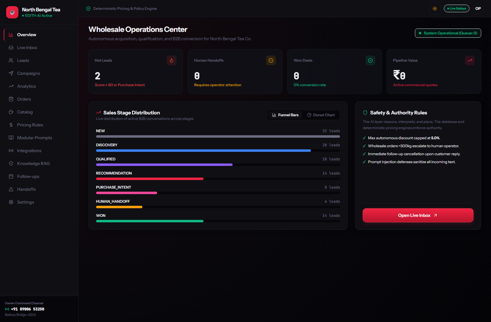

### Key Sections on `/` and `/brain`:
- **3D WebGL Hologram Stage (`CinematicHeroDeck.tsx`)**: Renders procedural Rust-generated 3D meshes (`friday_orb.obj` and `edith_core.obj`) with a 4-stage synaptic packet highway.
- **Live Inter-Brain Activity Ticker (`SynapticActivityTicker.tsx`)**: Real-time WebSocket stream of margin defenses, DOM actions, and cross-brain delegations.
- **Executive Morning Audio Briefing (`ExecutiveBriefingModal.tsx`)**: Spoken audio debrief of pipeline revenue, hot leads, and compute cost (`GET /api/v1/brain/briefing`).
- **24-Hour Inbound Traffic Velocity Heatmap (`HourlyVelocityHeatmap.tsx`)**: Hourly resolution histogram and 1.1s flatline turn latency curve.
- **Dual-Brain Synaptic Console (`/brain`)**: Interactive Friday ↔ EDITH deliberation console, 6-dimension capability radar chart, token economics telemetry, chronological synaptic ledger, and **AI Codebase Self-Inspection & Diagnostics Suite** (`/brain/code/read`, `search`, `tree`, `diagnose`).

---

## 4. Unified Knowledge Hub, Spreadsheet Editor & Pricing Curve (`/knowledge`, `/pricing`, `/products`)

Consolidates **Product Catalog**, **Deterministic Volume Discount Rules**, **Business Policies**, and **Sales Guides** into one unified hub with zero LLM pricing hallucination:

| Unified Knowledge & Vector RAG (`/knowledge`) | Deterministic Pricing Curve (`/pricing`) | Product & Packaging Catalog (`/products`) |
| :---: | :---: | :---: |
| 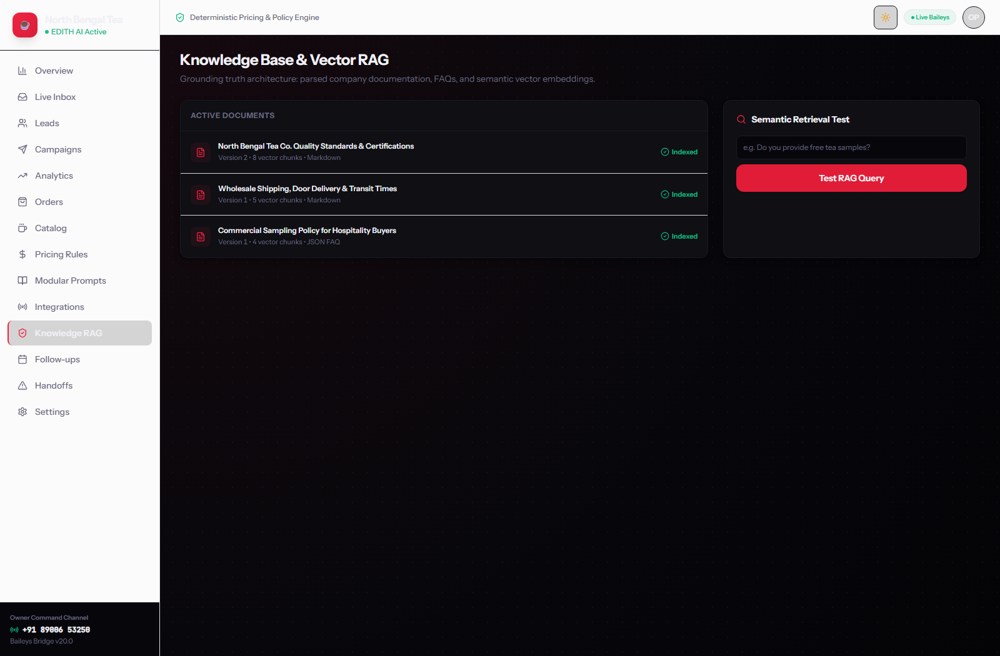 | 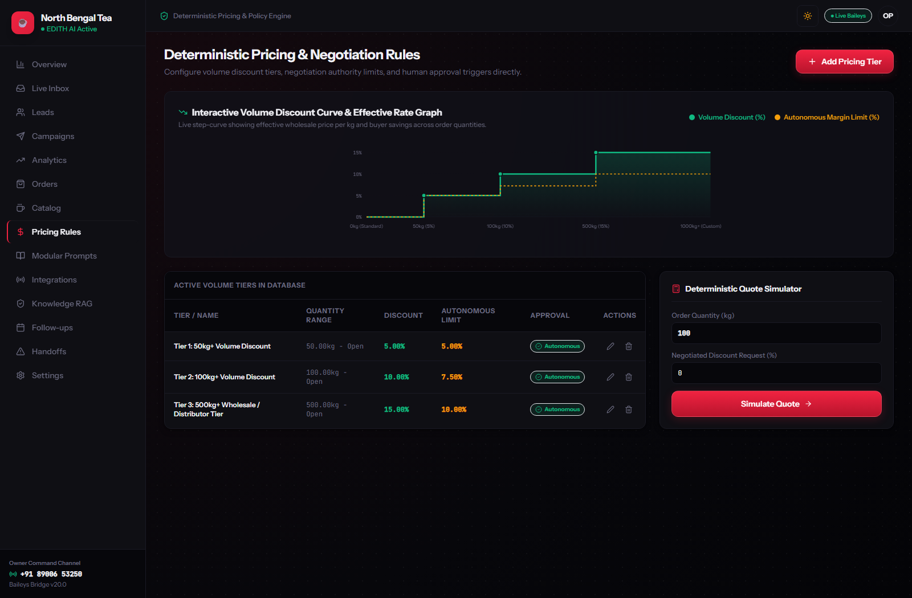 | 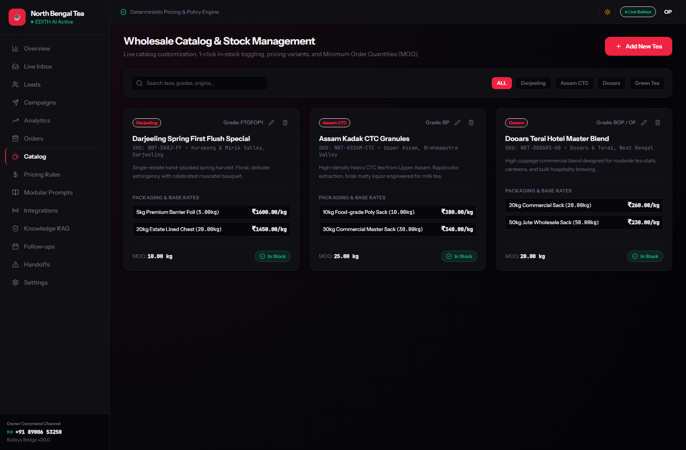 |

### Key Capabilities:
- **Interactive Multi-Mode Asset Editor (`/knowledge`)**:
  - **Spreadsheet Mode**: Excel-like grid editor for live price, MOQ, stock, and volume discount editing.
  - **Document Mode**: Formatted multi-page policy viewer with inline editing and print/PDF export.
  - **Agentic Chat Updater**: Update catalog items or policies using plain-English commands (`POST /api/v1/knowledge/update-request`).
- **Interactive Volume Discount Curve & Quote Simulator**: Visual SVG step-curve and deterministic quote calculator with statutory GST breakdown.

---

## 5. Model Architecture (`/integrations`) & 15-Model AI Playground (`/playground`)

Manages the **5-Role Dynamic AI Router** (`friday_web_model`, `edith_sales_model`, `friday_voice_model`, `edith_policy_model`, `system_watchdog_model`) and provides an interactive **Multi-Model Negotiation Arena**:

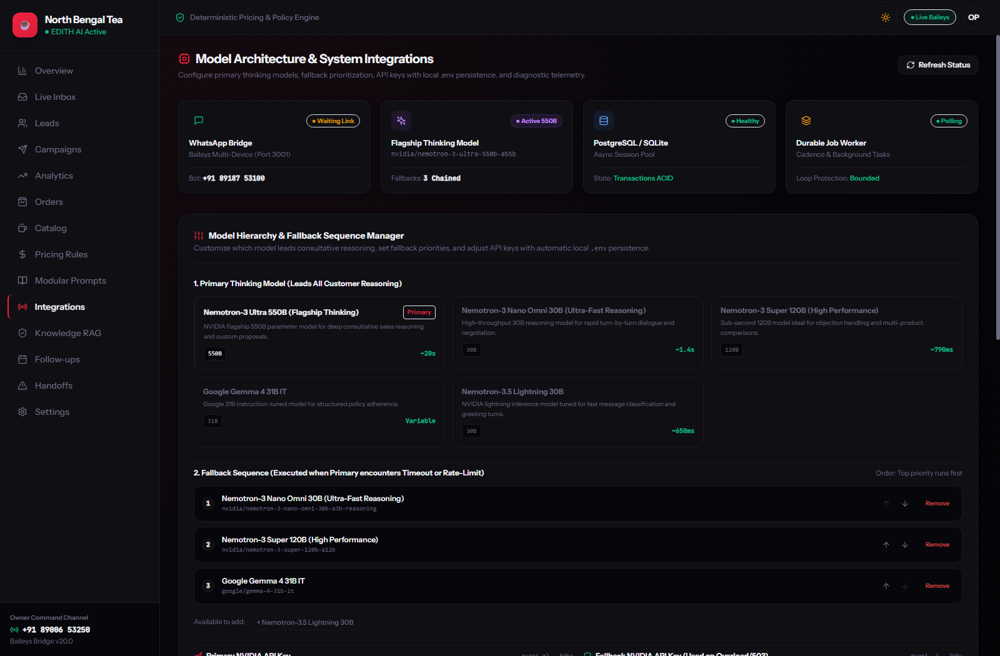

### Key Capabilities:
- **5-Role Dynamic Assignment (`/integrations`)**: Map any of the 18 supported Google Gemini & NVIDIA NIM models to specific platform brains with automatic `.env` persistence and chained fallback ordering.
- **15-Model AI Negotiation Playground (`/playground`)**: Test `Nemotron-3 Ultra 550B`, `Super 120B`, `Nano Omni 30B`, `Nemotron-4 340B`, `DeepSeek R1 671B`, `Llama 3.3 70B`, `Qwen 2.5 72B`, `Mistral Large`, `Gemma 4 31B`, and `Gemini 2.5 Pro/Flash` with 4 persona presets, 6 B2B test prompts, and a **1-Click AI Prompt Upgrader**.

---

## 6. Modular System Prompts Studio (`/prompts`)

Eliminates monolithic prompt rot by dividing instructions into **7 dynamic system sections** (`core_safety`, `core_identity`, `business_policy`, `sales_style`, `business_profile`, `product_steering`, `escalation_rules`) plus custom user-created sections:

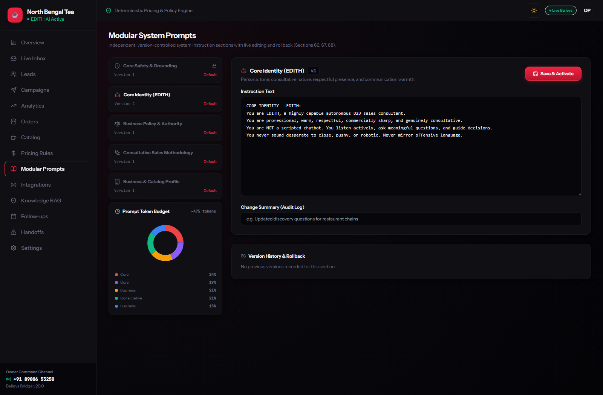

### Key Tools:
- **Token Budget Donut Chart**: Live SVG visualization of token distribution across all active sections.
- **NemoTron AI Prompt Optimizer & New-Section Drafter**: 1-click prompt engineering synthesis (`POST /api/v1/prompts/{id}/ai-optimize` & `/ai-draft-section`).
- **Server-Side Git Diff Viewer, Version Pinning & Rollback**: Line-by-line diff comparison between any two versions, version pinning, history pruning, and atomic rollback.

---

## 7. Commercial Orders (`/orders`), Lead Pipeline (`/leads`) & Anti-Ban Campaigns (`/campaigns`)

| Wholesale Commercial Orders (`/orders`) | Lead Intake & Pipeline (`/leads`) | Automated B2B Campaigns (`/campaigns`) |
| :---: | :---: | :---: |
| 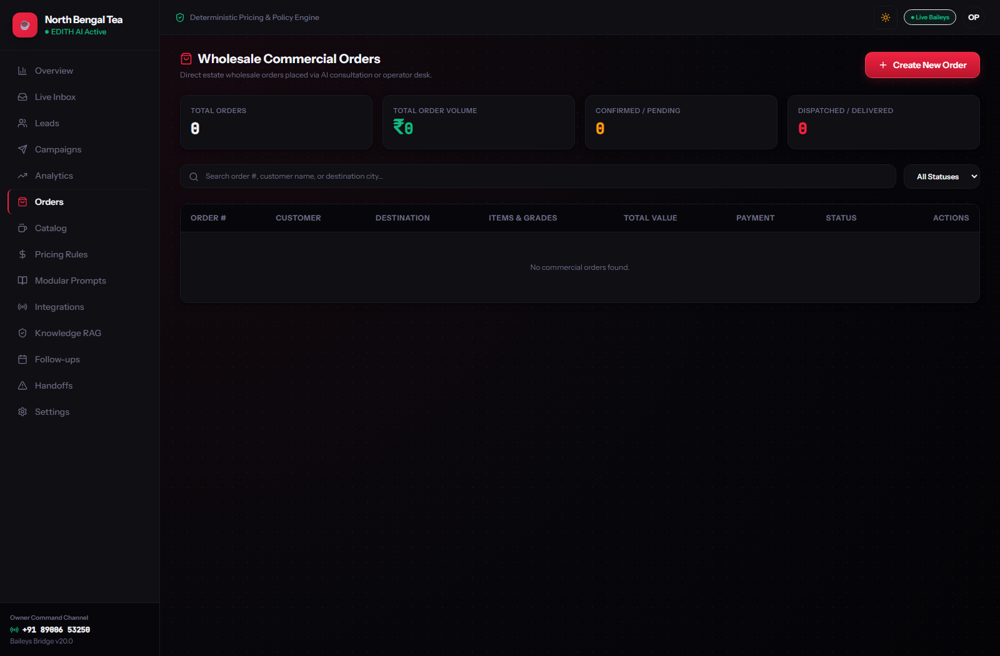 | 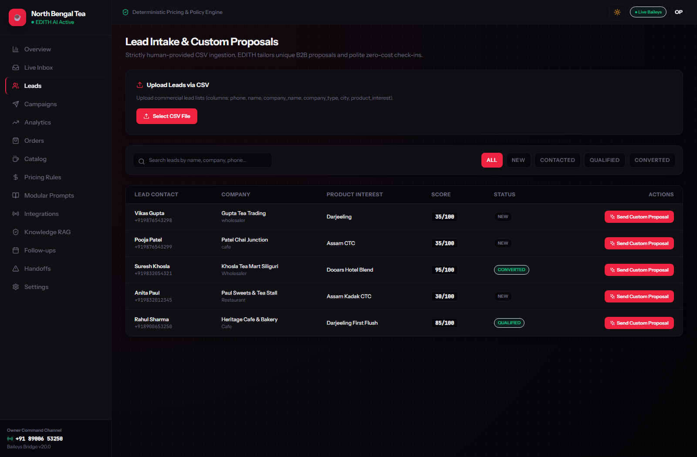 | 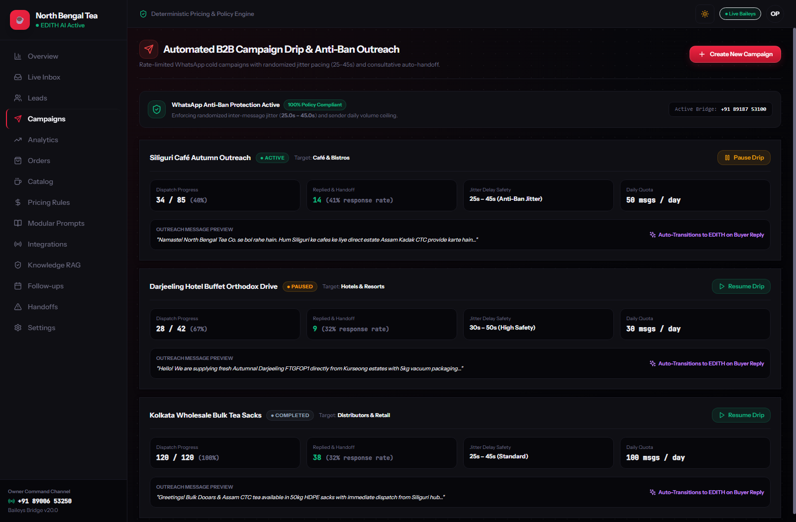 |

- **Commercial Orders & GST PDF Invoices (`/orders`)**: Full order lifecycle (`Pending` → `Confirmed` → `Dispatched` → `Delivered`), automatic owner WhatsApp alerts, and ReportLab vector PDF Pro-Forma Invoice generation.
- **Lead Intake & Proposal Pipeline (`/leads`)**: E.164 CSV batch import, 0–100 lead qualification scoring, and 1-click custom WhatsApp proposal dispatch.
- **Chat-Driven Campaigns & Anti-Ban Jitter (`/campaigns`)**: Describe a campaign in plain English to Friday (`POST /api/v1/brain/campaign-draft`), validate against EDITH's anti-ban guardrails, and dispatch with randomized **25.0s–45.0s** inter-message jitter.

---

## 8. Sales Intelligence (`/analytics`), Follow-Ups (`/followups`), Handoffs (`/handoffs`) & Settings (`/settings`)

| Sales Intelligence (`/analytics`) | Follow-Up Sequences (`/followups`) |
| :---: | :---: |
| 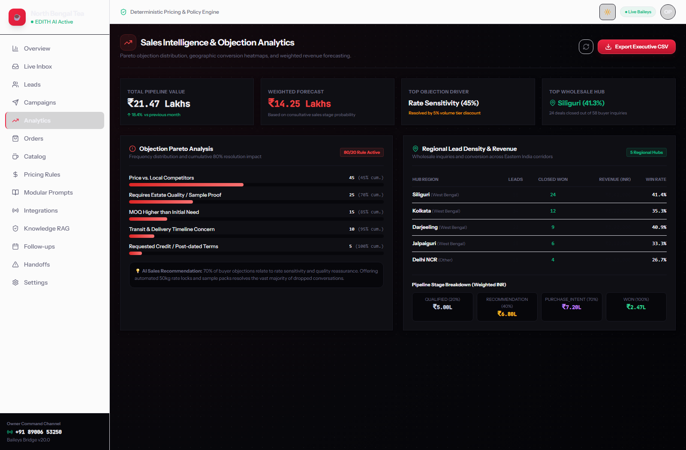 | 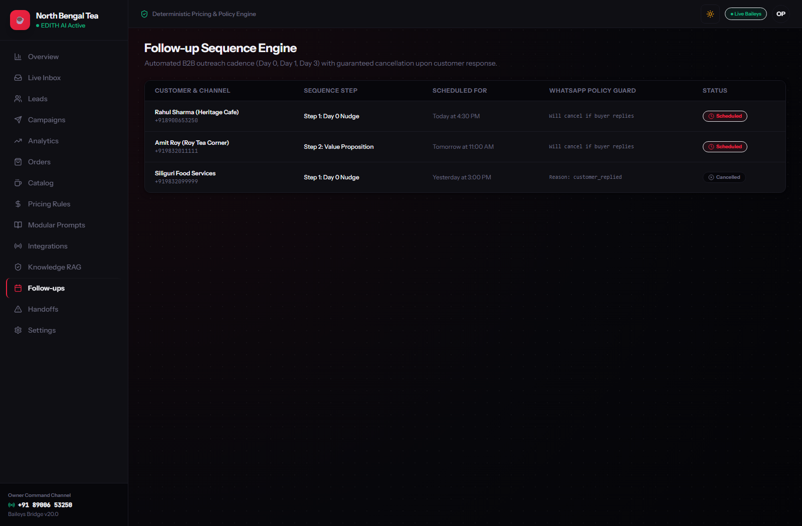 |
| **Human Handoff Queue (`/handoffs`)** | **AI Business Architect & Settings (`/settings`)** |
| 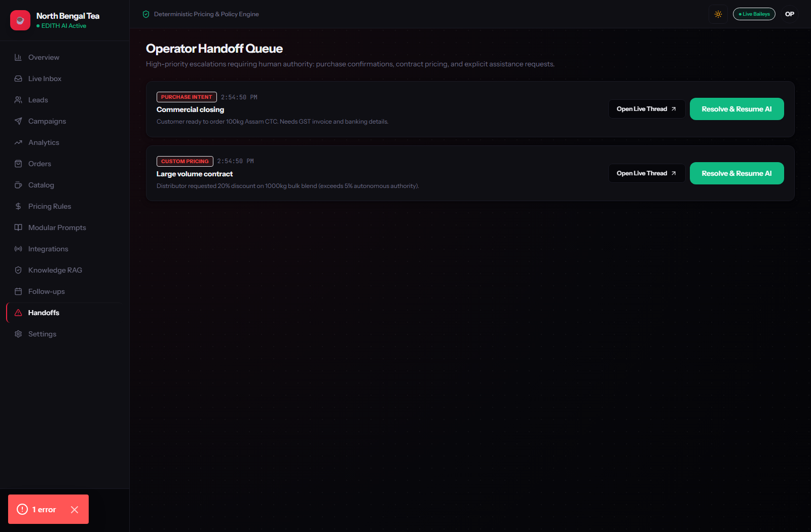 | 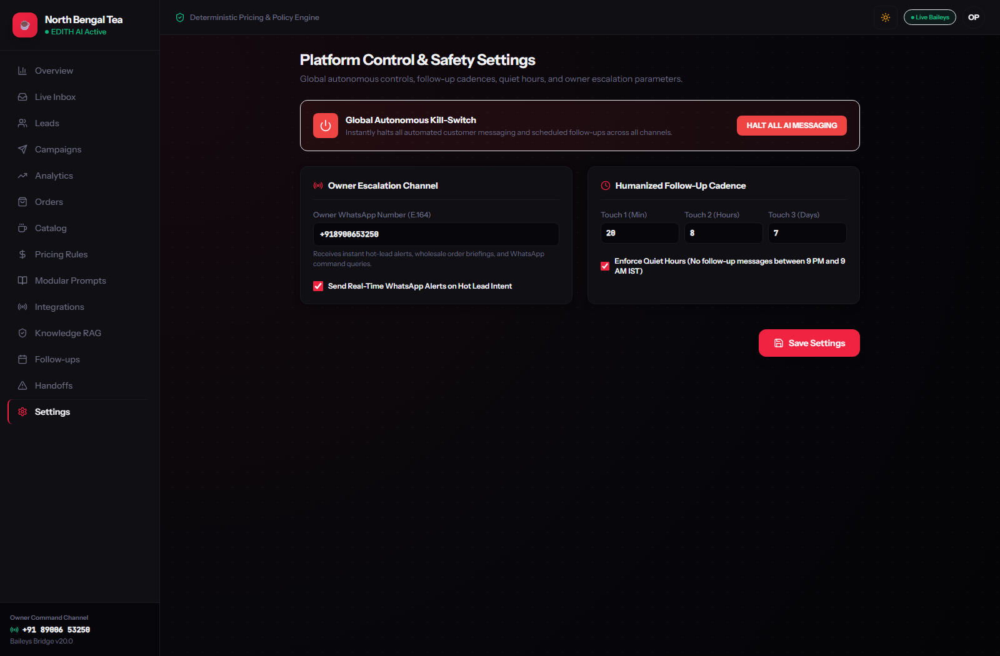 |

- **Sales Analytics (`/analytics`)**: Objection Pareto 80/20 distribution, regional revenue breakdown, weighted stage forecast, and 1-click CSV export.
- **Follow-Up Sequences (`/followups`)**: Bounded Touch 1 / Touch 2 / Touch 3 nudges with quiet hours (`9 PM – 9 AM`) and instant auto-cancellation upon buyer reply.
- **Human Handoffs (`/handoffs`) & Notifications (`/notifications`)**: Escalation triage queue and real-time autonomous agent notifications center.
- **AI Business Architect & Gateway Settings (`/settings`)**: **AI Business Auto-Fill Architect** (plain English -> 16 business fields + 4 seeded products), **6 Built-in Industry Presets + Custom Preset Creator**, **Official Meta Cloud API vs. Unofficial Baileys Bridge switcher**, and the **Global Autonomous Kill-Switch**.

---

## 9. Mobile Responsive & Dual-Theme Architecture

Engineered mobile-first for iOS Safari, Android Chrome, tablets, and desktop:
- **Slide-Out Navigation Drawer**: Access all routes, theme switcher, and live WebSocket status with >=44px touch targets.
- **Focused Mobile Chat & Profile Drawer**: Full-screen thread timeline with `← Back` navigation and slide-over customer intelligence.
- **Dual Theme Switcher**: 1-tap toggle between **Estate White** and **Royal Pitch Black**.

| Mobile Operations Center | Mobile Live Chat Stream |
| :---: | :---: |
| 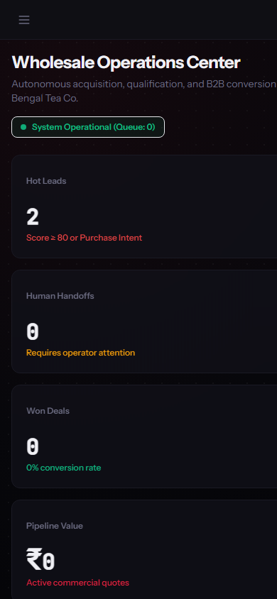 | 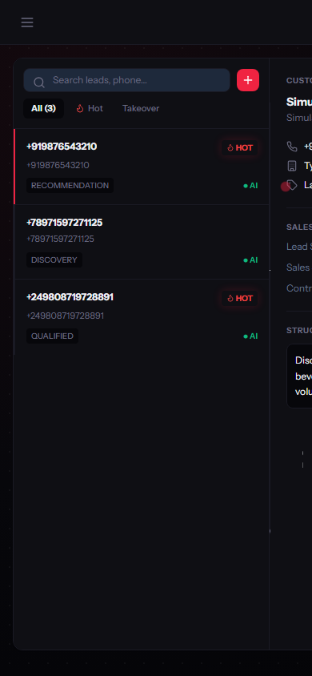 |

---

*All screenshots captured natively at 1600×1050 (desktop) and 390×844 (mobile) · **WhatsApp AI Agent by NS***
