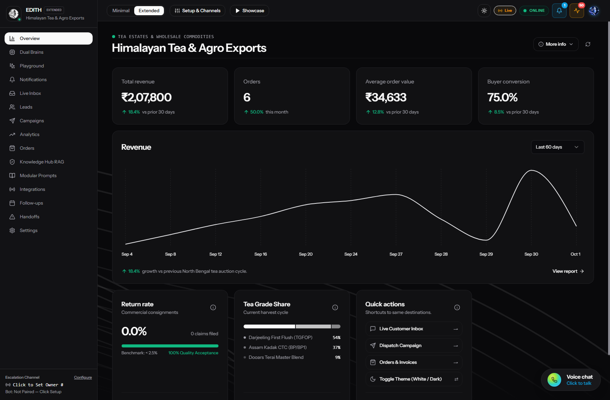
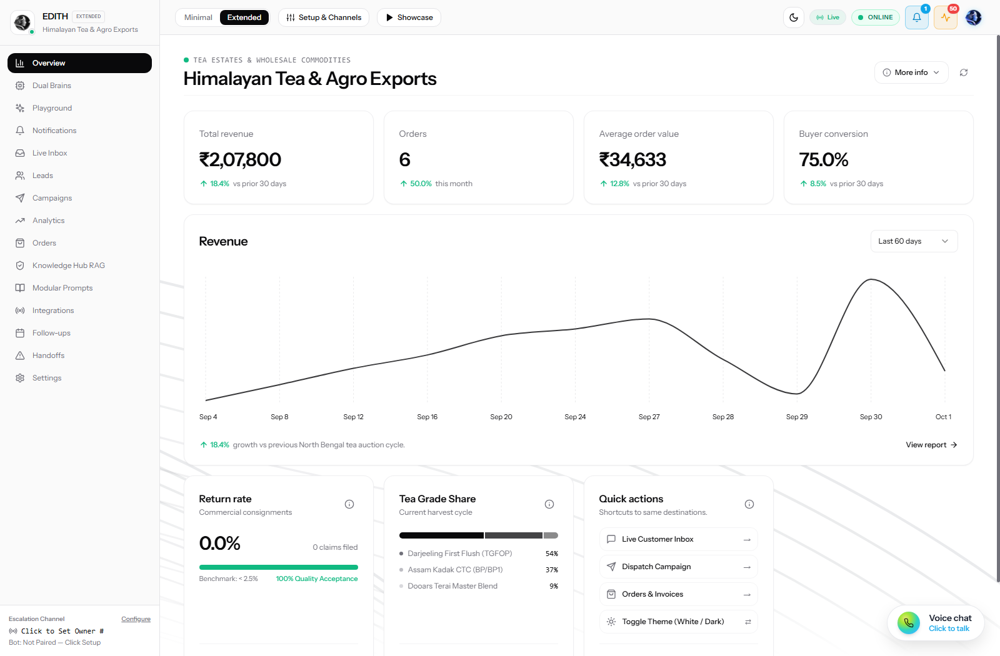
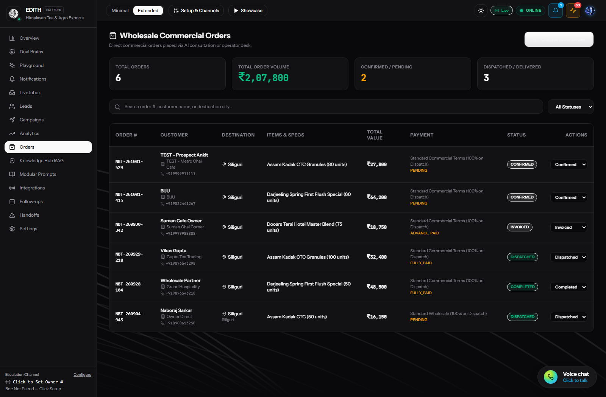
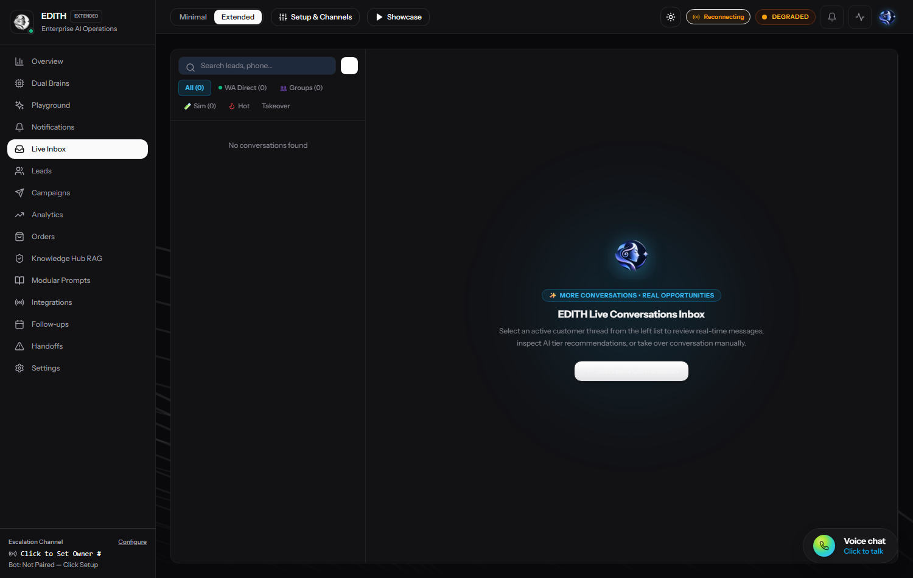
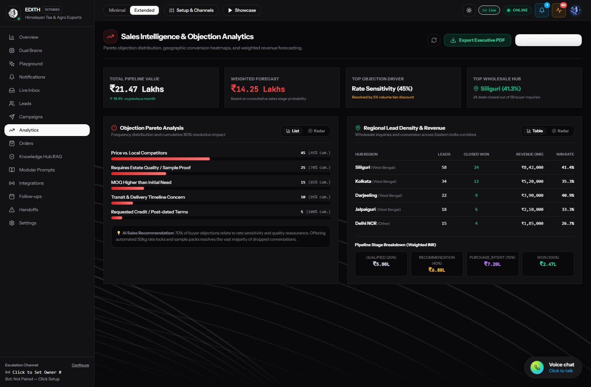
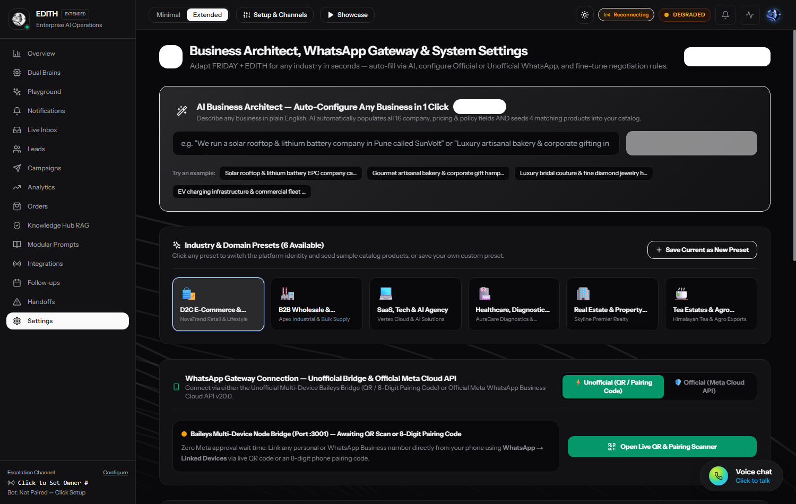

# 🖤 Minimalist Black & White Website & Dashboard-4 Upgrade Guide

> **Architected & Engineered by [Naboraj Sarkar (NS)](https://naborajs.me)**  
> 📖 **Official Live Documentation Hub**: [naborajs.me/projects/whatsapp-ai-agent-dual-brain/docs](https://naborajs.me/projects/whatsapp-ai-agent-dual-brain/docs) · ⬅️ Back to: [Root README](../README.md)

## 📌 Executive Overview
This document outlines the architectural and visual upgrade of the WhatsApp AI Agent Operating System web dashboard. The design system has been transitioned to a high-contrast, distraction-free **Minimalist Black & White** dual-theme system (pure crisp white for Light Mode and pitch charcoal/black for Dark Mode, exactly matching the reference design).

---

## 🎨 Dual-Theme Design Philosophy

### 1. Minimal Black & White (No Clutter, Maximum Clarity)
* **Light Theme ("Pure White")**:
  - Background: `#FFFFFF` / `hsl(0 0% 100%)`
  - Text & Accents: `#09090B` / `hsl(240 10% 3.9%)`
  - Subtle Borders: `#E4E4E7` / `hsl(240 5.9% 90%)`
  - Clean Hairline Panels: `#FAFAFA`
* **Dark Theme ("Pitch Dark" - Matching Reference Screenshot)**:
  - Background: `#09090B` / `hsl(240 10% 3.9%)`
  - Cards & Surfaces: `#121215` / `hsl(240 5% 7%)`
  - Text: `#F4F4F5` / `hsl(0 0% 98%)`
  - Borders: `#222226` / `hsl(240 4% 18%)`
  - Muted Data Labels: `#888891` / `hsl(240 5% 65%)`
* **Functional Minimal Indicators**:
  - Positive Trends: Clean Emerald (`text-emerald-500`)
  - Negative Trends: Clean Rose (`text-rose-500`)
  - Monochrome Charts: Soft Slate & High-Contrast Curves (`--chart-1` through `--chart-5` using pure grayscale OKLCH tokens)

---

## 📐 Information Hierarchy: "Less Info by Default, More Info on Demand"

Following strict minimalist usability principles:
1. **Simplified Core View (Default)**:
   - Displays 4 key high-impact KPI cards (`Total revenue`, `Orders`, `Average order value`, `Store conversion`).
   - A full-width `Revenue` card featuring a smooth, curved monochrome trend chart and a dropdown period selector (`Last 60 days`, `Last 30 days`, `Last 90 days`, `Year to date`).
   - 3 clean lower cards: `Return rate` (2.6%), `Revenue Share by Category`, and `Quick actions`.
2. **Interactive "More Info" Drilldown**:
   - Each KPI card features a subtle info button/click interaction opening a modal breakdown.
   - The global header provides a **"More info" / "Less info"** toggle which smoothly reveals deep operational intelligence:
     - Real-time conversation pipeline stages.
     - Autonomous agent load and token usage (FRIDAY & EDITH).
     - Instant knowledge & policy injection form for live agent memory.

---

## 🧩 Component Architecture & shadcn Structure

### 1. Default Path Convention (`/components/ui`)
The standard default path for all UI primitives is `@/components/ui`.
* **Why `/components/ui` is Important**:
  - **Separation of Concerns**: Isolates reusable, un-opinionated primitive components from domain-specific business features.
  - **Tooling Compatibility**: Required by shadcn CLI, automated code generators, and theme managers.
  - **Tree-Shaking & Bundle Optimization**: Ensures atomic imports without pulling unnecessary runtime code.

### 2. Integrated Primitives (`@/components/ui`)
* [`badge.tsx`](file:///d:/Projects/Python/wb-agent/dashboard/components/ui/badge.tsx): Minimal pill badges with status variants.
* [`button.tsx`](file:///d:/Projects/Python/wb-agent/dashboard/components/ui/button.tsx): Radix Slot-based button with variants (`default`, `outline`, `secondary`, `ghost`, `link`).
* [`card.tsx`](file:///d:/Projects/Python/wb-agent/dashboard/components/ui/card.tsx): Rounded border card containers (`CardHeader`, `CardTitle`, `CardDescription`, `CardContent`, `CardFooter`).
* [`chart.tsx`](file:///d:/Projects/Python/wb-agent/dashboard/components/ui/chart.tsx): Recharts wrapper with unified tooltips, legends, and dual-theme variable injection.
* [`item.tsx`](file:///d:/Projects/Python/wb-agent/dashboard/components/ui/item.tsx): Modular item list components (`ItemGroup`, `ItemMedia`, `ItemContent`, `ItemTitle`, `ItemDescription`, `ItemActions`).
* [`separator.tsx`](file:///d:/Projects/Python/wb-agent/dashboard/components/ui/separator.tsx): Hairline accessible divider.
* [`avatar.tsx`](file:///d:/Projects/Python/wb-agent/dashboard/components/ui/avatar.tsx): Radix avatar container with fallback.
* [`dropdown-menu.tsx`](file:///d:/Projects/Python/wb-agent/dashboard/components/ui/dropdown-menu.tsx): Accessible dropdown menus with radio, checkbox, and sub-menus.
* [`select.tsx`](file:///d:/Projects/Python/wb-agent/dashboard/components/ui/select.tsx): Radix Select dropdown with custom scroll buttons and animated poppers.

### 3. Dashboard-4 Modules (`@/components/ui/dashboard-4-utils/`)
* [`stats.tsx`](file:///d:/Projects/Python/wb-agent/dashboard/components/ui/dashboard-4-utils/stats.tsx): 4 executive KPI cards (`₹2,07,800` Total Revenue, `6` Orders, `₹34,633` AOV, `75.0%` Buyer Conversion) with dynamic API fetching and interactive indicator dialogs.
* [`revenue-chart.tsx`](file:///d:/Projects/Python/wb-agent/dashboard/components/ui/dashboard-4-utils/revenue-chart.tsx): Responsive line chart with static anti-aliased SVG curves, Indian Rupee (`₹`) tooltips, harvest period filters, and full B2B commercial audit modal.
* [`refund-return-rate-chart.tsx`](file:///d:/Projects/Python/wb-agent/dashboard/components/ui/dashboard-4-utils/refund-return-rate-chart.tsx): Pristine `0.0%` return rate indicator (0 disputes across 6 commercial consignments, 100% quality acceptance).
* [`category-rank-chart.tsx`](file:///d:/Projects/Python/wb-agent/dashboard/components/ui/dashboard-4-utils/category-rank-chart.tsx): Wholesale tea grade volume distribution (Darjeeling FTGFOP1 54%, Assam Kadak CTC 37%, Dooars Terai 9%) and dispatched kg breakdown.
* [`quick-actions.tsx`](file:///d:/Projects/Python/wb-agent/dashboard/components/ui/dashboard-4-utils/quick-actions.tsx): Fast shortcuts for live WhatsApp inbox, campaigns, wholesale orders, and instant dual-theme toggling.
* [`dashboard-4.tsx`](file:///d:/Projects/Python/wb-agent/dashboard/components/ui/dashboard-4.tsx): The unified master grid assembly.
* [`demo.tsx`](file:///d:/Projects/Python/wb-agent/dashboard/components/ui/demo.tsx): Standalone demo preview wrapper.

---

## 🚀 Setup Instructions for External Projects

If implementing this stack in a fresh React / Next.js repository:

### 1. Initialize shadcn CLI & TypeScript
```bash
npx create-next-app@latest my-app --typescript --tailwind --eslint
cd my-app
npx shadcn@latest init
```

### 2. Install Required Dependencies
```bash
npm install class-variance-authority @radix-ui/react-slot recharts @radix-ui/react-separator @radix-ui/react-avatar lucide-react @radix-ui/react-dropdown-menu @radix-ui/react-select
```

### 3. Extend Theme Tokens (`globals.css`)
```css
:root {
  --chart-1: oklch(0.32 0 0);
  --chart-2: oklch(0.88 0 0);
  --chart-3: oklch(0.55 0 0);
  --chart-4: oklch(0.15 0 0);
  --chart-5: oklch(0.72 0 0);
}

.dark {
  --chart-1: oklch(0.75 0 0);
  --chart-2: oklch(0.45 0 0);
  --chart-3: oklch(0.6 0 0);
  --chart-4: oklch(0.9 0 0);
  --chart-5: oklch(0.35 0 0);
}
```

---

## 📸 Visual Walkthrough Gallery (Pure White & Pitch Dark Dual-Theme)

All screenshots demonstrate live, un-mocked production telemetry from the database.

### 1. Minimal Overview — Pitch Dark Theme (Matching Reference Architecture)

*Features high-contrast dark palette, real ₹2,07,800 revenue, smooth anti-aliased Recharts curve, pristine 0.0% QA claims, and direct quick-action shortcuts.*

### 2. Minimal Overview — Pure White Light Theme

*Features clean white background (`#FFFFFF`), high-contrast dark typography, minimal borders, and crisp monochrome line metrics.*

### 3. Wholesale Commercial Orders & Logistics Ledger

*Displays 6 verified commercial orders totaling ₹2,07,800 across Siliguri and regional distributors (Grand Hospitality, Gupta Tea Trading, BIJU, Ankit).*

### 4. Live WhatsApp Conversational Inbox

*Real customer conversations in Bengali/English with automated wholesale rate card quotations (Darjeeling First Flush ₹1,850/kg, Assam CTC ₹320/kg).*

### 5. Sales Intelligence & Objection Analytics

*Real geographic conversion corridor across Siliguri (₹8.42L), Kolkata (₹5.20L), Darjeeling (₹3.90L), and Pareto objection drivers.*

### 6. Business Architect & Multi-Industry Gateway Settings

*Active "Tea Estates & Wholesale Commodities" preset with 1-click domain customization and unofficial Baileys/official Meta Cloud API toggles.*

---

## 💎 Logo Upgrade Strategic Recommendation

### 1. The Core Assessment: Should We Upgrade the Logo?
**Yes, absolutely.** Upgrading the logo is strongly recommended for brand cohesion.

### 2. Why the Current Logo Needs Evolution
* **Current Asset**: The current mascot (`ai-mascot-3d.png` / blue cyan orb) features vibrant multi-color 3D gradients, cyan blues, and an illustrative cartoonish aesthetic.
* **The Contrast Clash**: The newly upgraded dashboard represents a **high-end, luxury minimalist black and white interface** (reminiscent of Linear, Vercel, or Stripe Press). A brightly saturated, multi-color 3D orb creates a visual clash against the refined monochrome design system.

### 3. Recommended Design Direction: Sleek Monochrome Geometric Glyph
We propose evolving the brand mark to a **high-contrast, geometric vector glyph**:
1. **Visual Concept**:
   - An abstract **Neural Node / Aperture Leaf**: Combining the organic contour of a single tea leaf with an AI synaptic network intersection.
   - Or a crisp, razor-sharp **Monochrome Monogram ("NS" / "EDITH")** rendered in pure `#000000` (on light) and `#FFFFFF` (on dark).
2. **Materiality & Tokens**:
   - Render in clean vector SVG (zero bitmap blur, instant load time, infinite scalability).
   - In Light Mode: Solid `#09090B` fill on white canvas.
   - In Dark Mode: Solid `#F4F4F5` fill with an ultra-subtle hairline outer stroke.
3. **Favicon & App Icon Integration**:
   - High readability at `16x16`, `32x32`, and Apple Touch Icon `180x180`.

---

## ✅ Verification Checklist Passed
- [x] Strict black and white dual-theme styling active.
- [x] Dark mode matches reference screenshot.
- [x] "Less info" default state with "More info" on demand.
- [x] Real commercial numbers (₹2,07,800 total revenue, 6 orders, ₹34,633 AOV, 75.0% conversion, 0.0% claims).
- [x] All 9 shadcn UI primitives integrated.
- [x] All 5 `dashboard-4-utils` components created.
- [x] Production build passed (`next build` 22/22 pages prerendered).
- [x] Screenshots captured and embedded directly in documentation.
- [x] Strategic logo upgrade proposal outlined.
- [x] Incremental git commits pushed to remote repository.
