# 🌿 WB-Agent: Autonomous AI Sales Agent Platform Knowledge Base

> [!NOTE]
> Welcome to the comprehensive, Obsidian-optimized documentation vault for **WB-Agent**, the enterprise-grade autonomous AI sales operating system built for **North Bengal Tea Co.** (B2B wholesale tea supplier of Darjeeling, Dooars, and Assam CTC).
>
> This documentation is hyperlinked, modular, and designed as a knowledge graph. Use the navigation links below or your Obsidian Graph View to explore any subsystem.

---

## 🗺️ Map of Content (MOC)

```mermaid
flowchart TD
    Index["🌿 Knowledge Base Index (00-Home)"] --> Setup["🚀 Setup & Deployment Guides"]
    Index --> Arch["🏛️ Architecture & Core Engines"]
    Index --> Integ["🔌 Integrations & Hardware"]
    Index --> Ops["⚙️ Operations & Governance"]
    Index --> Errors["🚨 Error Catalog & Troubleshooting"]

    Setup --> S1["[[01-prerequisites-and-system-requirements|01. Prerequisites & Environment]]"]
    Setup --> S2["[[02-database-and-pgvector-setup|02. PostgreSQL 16 & pgvector Setup]]"]
    Setup --> S3["[[03-backend-setup|03. FastAPI Backend Setup]]"]
    Setup --> S4["[[04-dashboard-frontend-setup|04. Next.js 14 Dashboard Setup]]"]
    Setup --> S5["[[05-whatsapp-integration-guide|05. WhatsApp Simulator & Meta Cloud API]]"]
    Setup --> S6["[[06-nvidia-nemotron-and-llm-setup|06. NVIDIA Nemotron & Embeddings]]"]
    Setup --> S7["[[07-owner-escalation-channel|07. Owner Escalation Setup (+91 89006 53250)]]"]
    Setup --> S8["[[08-end-to-end-verification|08. End-to-End Simulation & Verification]]"]

    Arch --> A1["[[architecture|System Architecture Deep Dive]]"]
    Arch --> A2["[[conversational-state-machine|16-Stage Sales State Machine]]"]
    Arch --> A3["[[deterministic-pricing-engine|Deterministic Pricing & Margin Safety]]"]
    Arch --> A4["[[multi-tier-memory-system|Multi-Tier Memory & Facts]]"]
    Arch --> A5["[[durable-queue-and-worker|Durable Queue with SKIP LOCKED]]"]

    Errors --> E1["[[error-catalog-and-solutions|Comprehensive Error Catalog & Solutions]]"]

    Ops --> O1["[[operations-runbook|Operations Runbook & Kill-Switch]]"]
    Ops --> O2["[[api-reference|REST API & WebSocket Reference]]"]
    Ops --> O3["[[decisions/0001-postgresql-primary-storage|Architectural Decision Records (ADRs)]]"]
```

---

## 📚 Section Breakdown

### 1. 🚀 Setup & Installation Guides
Step-by-step guides to install, configure, wire, and execute all services locally or in production:
- [[01-prerequisites-and-system-requirements|01. Prerequisites & System Requirements]]: Python 3.11+, Node 18+, Docker, Windows vs Linux prerequisites.
- [[02-database-and-pgvector-setup|02. PostgreSQL & pgvector Setup]]: Setting up PostgreSQL 16, pgvector extension, migrations, seeding, and SQLite offline fallback.
- [[03-backend-setup|03. FastAPI Backend Setup]]: Virtual environments, poetry/pip dependencies, `.env` configuration, Uvicorn, and Pytest.
- [[04-dashboard-frontend-setup|04. Next.js Dashboard Setup]]: Next.js 14 TypeScript operator control center, API rewrites, and Tailwind styling.
- [[05-whatsapp-integration-guide|05. WhatsApp Integration Guide]]: In-depth guide covering both Simulator mode and official Meta Graph API v20.0 with HMAC signatures and webhook forwarding.
- [[06-nvidia-nemotron-and-llm-setup|06. NVIDIA Nemotron & LLM Router]]: Connecting to NVIDIA AI Foundation endpoints and automatic failover handling.
- [[07-owner-escalation-channel|07. Owner Escalation Channel]]: Configuring alerts to Rajiv Sen (`+91 89006 53250`) upon hot lead discovery or purchase intent.
- [[08-end-to-end-verification|08. End-to-End Simulation & Verification]]: Running `scripts/seed_demo.py` and `scripts/run_simulation.py` to test 5 buyer personas.

### 2. 🏛️ Architecture & Domain Engines
Explore the core algorithms, design principles, and guardrails:
- [[architecture|Architecture Overview]]: High-level data flow, turn mutex, and component breakdown.
- [[conversational-state-machine|16-Stage Sales State Machine]]: State transitions, transition conditions, and stage definitions.
- [[deterministic-pricing-engine|Deterministic Pricing & Margin Safety]]: Formulaic volume pricing, MOQs, and negotiation boundaries.
- [[multi-tier-memory-system|Multi-Tier Memory Architecture]]: Rolling turn context, semantic summaries, and long-term customer memory facts.
- [[durable-queue-and-worker|Durable Queue & SKIP LOCKED Worker]]: Background worker daemon, transactional queue, exponential backoff, and jitter.

### 3. 🚨 Error Catalog & Diagnostics
- [[error-catalog-and-solutions|Comprehensive Error Catalog & Solutions]]: Detailed encyclopedia of common errors across database connections, vector extensions, WhatsApp webhooks, HMAC signature mismatches, NVIDIA API responses, Windows encoding, and Next.js builds.

### 4. ⚙️ Operations & Reference
- [[operations-runbook|Operations Runbook & Kill-Switch]]: Emergency kill-switch trigger, queue scaling, worker daemon management, and unified `python run.py` launcher.
- [[visual-tour|Dashboard Visual Operations Tour]]: Complete visual UI tour across desktop and mobile responsive views with dual themes.
- [[api-reference|REST API & WebSocket Reference]]: Complete endpoint specifications, query schemas, and live WebSocket streaming protocol.
- [[decisions/0001-postgresql-primary-storage|Architectural Decision Records (ADRs 0001 to 0014)]]: Technical decisions and architectural rationales.

---

> [!TIP]
> **New to WB-Agent?** Start by reading [[01-prerequisites-and-system-requirements|01. Prerequisites & System Requirements]] and then proceed through the numbered setup guides in sequential order.
