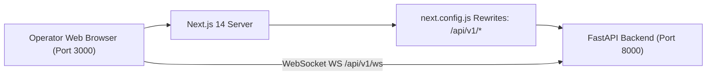

# 🖥️ 04. Next.js 14 Dashboard Frontend Setup

> [!NOTE]
> The **Operator Control Center** is an enterprise Next.js 14 application built with React 18, TypeScript, and Tailwind CSS. It connects to the FastAPI backend via reverse proxy rewrites and real-time WebSockets.
>
> ⬅️ Previous Step: [[03-backend-setup|03. FastAPI Backend Setup]]  
> ➡️ Next Step: [[05-whatsapp-integration-guide|05. WhatsApp Simulator & Meta Cloud API]]

---

## 🎨 Dashboard Architecture



---

## 📦 1. Installing Frontend Dependencies

From the repository root, change into the `dashboard` directory:

```bash
cd dashboard

# Install packages with npm
npm install
```

Installed packages include:
- `next`: ^14.1.4
- `react`: ^18.2.0
- `lucide-react`: High-density icon library
- `tailwindcss`: Utility-first CSS framework
- `typescript`: Type safety and validation

---

## ⚙️ 2. API Proxy Configuration (`next.config.js`)

To prevent CORS issues in development, `dashboard/next.config.js` transparently proxies all requests matching `/api/v1/:path*` directly to the backend:

```javascript
/** @type {import('next').NextConfig} */
const nextConfig = {
  reactStrictMode: true,
  output: "standalone",
  async rewrites() {
    return [
      {
        source: "/api/v1/:path*",
        destination: `${process.env.NEXT_PUBLIC_API_URL || "http://127.0.0.1:8000"}/api/v1/:path*`,
      },
    ];
  },
};

module.exports = nextConfig;
```

---

## 🚀 3. Starting Development Server

Launch the development server with Hot Module Replacement (HMR):

```bash
npm run dev
```

Open your browser to:
👉 **`http://localhost:3000`**

---

## 🏗️ 4. Verifying Production Build

Verify that all TypeScript types, React components, and static routes compile cleanly:

```bash
npm run build
```

Expected build output:
```text
  ▲ Next.js 14.2.35

   Creating an optimized production build ...
 ✓ Compiled successfully
   Linting and checking validity of types ...
   Collecting page data ...
 ✓ Generating static pages (12/12)
   Finalizing page optimization ...

Route (app)                              Size     First Load JS
┌ ○ /                                    3.02 kB        90.2 kB
├ ○ /_not-found                          873 B          88.1 kB
├ ○ /conversations                       4.55 kB        91.8 kB
├ ○ /followups                           1.66 kB        88.9 kB
├ ○ /handoffs                            2 kB           89.2 kB
├ ○ /knowledge                           2.24 kB        89.5 kB
├ ○ /leads                               2.68 kB        89.9 kB
├ ○ /pricing                             2.53 kB        89.8 kB
├ ○ /products                            2.2 kB         89.4 kB
└ ○ /settings                            1.9 kB         89.1 kB
+ First Load JS shared by all            87.2 kB
```

To run the optimized production server:
```bash
npm run start
```

---

## 🧭 5. Dashboard Pages Tour

### 📊 Overview (`/`)
- KPI Summary: Total Leads, Active Conversations, 🔥 Hot Leads, Pending Handoffs, Won Deals, and Net Pipeline (INR).
- Live 16-stage sales funnel distribution chart.
- System health and queue depth monitor.

### 💬 Live 3-Panel Inbox (`/conversations`)
- **Left Panel**: Scrollable conversation list with search, filter tabs (`All`, `🔥 Hot`, `Human`), lead score badges (0-100), and unread indicators.
- **Center Panel**: Real-time WhatsApp timeline displaying customer, AI consultant, and human operator Rajiv messages with delivery checkmarks and manual operator reply box.
- **Right Panel**: Real-time customer profile, long-term memory facts with verification badges (`CUSTOMER_SAID`, `SYSTEM_VERIFIED`), rolling AI summary, and atomic takeover buttons (`Take Over` / `Resume AI`).

### 👥 Leads Directory (`/leads`)
- Searchable directory of wholesale buyers with E.164 phone normalization.
- Multipart CSV batch import button with row-level error reporting and deduplication.

### ☕ Tea Catalog (`/products`)
- Wholesale catalog of North Bengal Tea Co.: Darjeeling First Flush, Assam Kadak CTC, and Dooars Hotel Blend with packaging weights (5kg, 10kg, 20kg, 30kg, 50kg) and Minimum Order Quantities (MOQs).

### 🏷️ Pricing & Negotiation Rules (`/pricing`)
- Live table of deterministic volume discount tiers (50kg, 100kg, 500kg).
- Interactive quote and margin calculator testing discount limits and human escalation flags.

### 📚 Knowledge Base & Vector RAG (`/knowledge`)
- List of active ingested markdown policy documents, certifications, and tasting sample guides.
- Semantic vector search query tester.

### 📅 Follow-up Sequences (`/followups`)
- Monitor active Day 0, Day 1, Day 3 follow-up sequence jobs and verified cancellation audit reasons (`customer_replied`, `customer_opted_out`).

### 🚨 Human Handoff Queue (`/handoffs`)
- Queue of high-value buyer escalations requiring manual commercial approval.
- One-click `Resolve & Resume AI` actions.

### ⚙️ Platform Settings & Kill-Switch (`/settings`)
- Global autonomous kill-switch: instantly suspends outbound messaging.
- Dry-run and Sandbox mode toggles.
- Primary business owner escalation phone setting (`+918900653250`).

---

## 🔀 Next Step
Now that both the backend and frontend are operational:
👉 Proceed to **[[05-whatsapp-integration-guide|05. WhatsApp Simulator & Meta Cloud API]]** to configure WhatsApp messaging channels.
