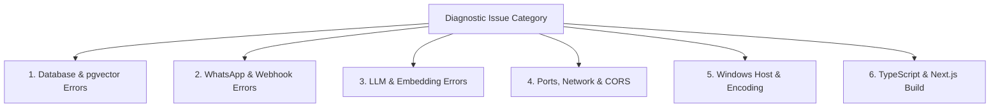

# 🚨 Comprehensive Error Catalog & Solutions

> [!NOTE]
> This encyclopedia documents known errors, warning messages, stack traces, underlying root causes, and verified step-by-step solutions encountered during development, installation, and production deployment of **WB-Agent**.
>
> ⬅️ Back to: [[index|Knowledge Base Index]]

---

## 📑 Diagnostic Directory



---

## 🗄️ 1. Database & pgvector Errors

### 1.1 `ConnectionRefusedError: Connection refused (localhost:5432)`
```text
sqlalchemy.exc.OperationalError: (asyncpg.exceptions.ConnectionDoesNotExistError)
connection to server at "localhost" (127.0.0.1), port 5432 failed: Connection refused
```
- **Root Cause**: The PostgreSQL server is not running or is bound to a different interface/port.
- **Solution**:
  1. If using Docker, start the container:
     ```bash
     docker compose up -d postgres
     ```
  2. If running native PostgreSQL, start the service:
     ```bash
     # Linux
     sudo systemctl start postgresql
     # macOS
     brew services start postgresql@16
     ```
  3. Or use the offline SQLite development fallback by setting in `.env`:
     ```ini
     DATABASE_URL=sqlite+aiosqlite:///./wb_agent.db
     DATABASE_URL_SYNC=sqlite:///./wb_agent.db
     ```

---

### 1.2 `UndefinedObject: type "vector" does not exist`
```text
asyncpg.exceptions.UndefinedObjectError: type "vector" does not exist
LINE 1: ...embedding_model VARCHAR(128) NOT NULL, embedding vector(1536)...
```
- **Root Cause**: The `pgvector` extension has not been enabled in the PostgreSQL database.
- **Solution**:
  Connect to PostgreSQL as superuser and execute:
  ```sql
  \c wb_agent;
  CREATE EXTENSION IF NOT EXISTS vector;
  ```
  Verify with `SELECT * FROM pg_extension WHERE extname = 'vector';`.

---

### 1.3 `NoSuchModuleError: Can't load plugin: sqlalchemy.dialects:postgresql.asyncpg`
- **Root Cause**: The `asyncpg` driver is missing or the connection string is improperly formatted.
- **Solution**:
  1. Ensure `asyncpg` is installed:
     ```bash
     pip install asyncpg
     ```
  2. Verify that your `DATABASE_URL` in `.env` starts with `postgresql+asyncpg://`, NOT `postgresql://`.

---

### 1.4 `QueuePool limit of size 10 overflow 20 reached`
```text
sqlalchemy.exc.TimeoutError: QueuePool limit of size 10 overflow 20 reached, connection timed out, timeout 30.00
```
- **Root Cause**: Database sessions are being opened without being properly closed or committed, causing connection pool exhaustion.
- **Solution**:
  1. Ensure every session is opened with an async context manager:
     ```python
     async with session_factory() as session:
         # operations here
     ```
  2. If high concurrency is expected, increase pool size in `.env`:
     ```ini
     DB_POOL_SIZE=20
     DB_MAX_OVERFLOW=40
     DB_POOL_TIMEOUT=60
     ```

---

## 📱 2. WhatsApp & Webhook Errors

### 2.1 WhatsApp Webhook Verification Returns `403 Forbidden`
```text
GET /api/v1/webhooks/whatsapp?hub.mode=subscribe&hub.verify_token=...&hub.challenge=...
HTTP/1.1 403 Forbidden - {"detail": "Webhook verification failed."}
```
- **Root Cause**: The `hub.verify_token` sent by Meta does not match `WHATSAPP_VERIFY_TOKEN` configured in your `.env`.
- **Solution**:
  1. Check what value is set in `.env`:
     ```ini
     WHATSAPP_VERIFY_TOKEN=wb_agent_verify_token
     ```
  2. In Meta Developer Console under **WhatsApp → Configuration → Webhook**, enter the exact same string in the **Verify Token** field.

---

### 2.2 Inbound POST Webhook Returns `403 Forbidden: Invalid signature`
- **Root Cause**: The `X-Hub-Signature-256` header does not match the computed HMAC-SHA256 signature using `WHATSAPP_WEBHOOK_SECRET`.
- **Solution**:
  1. In Meta Developer Console, go to **App Settings → Basic** and copy your **App Secret**.
  2. Update `.env`:
     ```ini
     WHATSAPP_WEBHOOK_SECRET=your_actual_meta_app_secret
     ```
  3. If running in local development with Simulator mode, ensure:
     ```ini
     WHATSAPP_PROVIDER=simulator
     ```
     The simulator automatically bypasses external Meta signature validation.

---

### 2.3 Outbound Message Displays `[Suppressed - Operator Takeover]`
- **Root Cause**: Not an error, but an intended safety feature (ADR-008). A human operator has clicked **Take Over** in the live inbox (`Conversation.mode = 'HUMAN'`), so the agent suppresses automated AI replies to prevent conflicting messages to the customer.
- **Solution**:
  To return the conversation to autonomous AI selling, click **Resume AI** in the live dashboard or make a POST request to `/api/v1/conversations/{id}/takeover` with `{"mode": "AI"}`.

---

## 🧠 3. LLM & Embedding Errors

### 3.1 `httpx.HTTPStatusError: 404 Not Found on /chat/completions`
```text
[WARNING] wb_agent: Primary LLM provider failed (Client error '404 Not Found' for url 'https://integrate.api.nvidia.com/v1/chat/completions'). Routing to fallback provider.
```
- **Root Cause**: Invalid `NVIDIA_BASE_URL` format or an unauthenticated/deprecated model endpoint.
- **Solution**:
  1. Check `.env`:
     ```ini
     NVIDIA_BASE_URL=https://integrate.api.nvidia.com/v1
     NVIDIA_MODEL=nvidia/nemotron-4-340b-instruct
     ```
  2. Ensure there is no trailing slash on `NVIDIA_BASE_URL`.
  3. Notice that WB-Agent automatically triggers `SimulatorProvider` as an instant failover, keeping the conversation active.

---

### 3.2 `httpx.HTTPStatusError: 410 Gone on /embeddings`
```text
[WARNING] wb_agent: NVIDIA Embedding API call failed (Client error '410 Gone'). Falling back to LocalMockEmbeddingProvider.
```
- **Root Cause**: NVIDIA Foundation endpoint for the embedding preview model was deprecated or moved.
- **Solution**:
  WB-Agent is engineered with an automatic fallback in `NvidiaEmbeddingProvider`:
  ```python
  except Exception as e:
      logger.warning(f"NVIDIA Embedding API call failed ({e}). Falling back to LocalMockEmbeddingProvider.")
      return await LocalMockEmbeddingProvider(dimension=self._dim).embed_texts(texts)
  ```
  Zero action needed: the system falls back gracefully to `LocalMockEmbeddingProvider` without interrupting catalog seeding or search.

---

## 🌐 4. Networking, Ports & CORS Errors

### 4.1 `[Errno 10048] address already in use (Port 8000 or 3000)`
```text
ERROR: [Errno 10048] error while attempting to bind on address ('0.0.0.0', 8000): address already in use
```
- **Root Cause**: A previously launched Uvicorn server, Node.js process, or background task is still listening on port 8000 or 3000.
- **Solution**:
  Find and terminate the process holding the port:
  ```powershell
  # On Windows PowerShell:
  Get-Process -Id (Get-NetTCPConnection -LocalPort 8000).OwningProcess | Stop-Process -Force
  Get-Process -Id (Get-NetTCPConnection -LocalPort 3000).OwningProcess | Stop-Process -Force

  # On Linux / macOS:
  lsof -ti:8000 | xargs kill -9
  lsof -ti:3000 | xargs kill -9
  ```

---

### 4.2 `ModuleNotFoundError: No module named 'app'`
- **Root Cause**: Python cannot find the `app` package because `PYTHONPATH` was not exported.
- **Solution**:
  ```powershell
  # On Windows PowerShell:
  $env:PYTHONPATH="backend"
  python -m pytest backend/tests/

  # On Linux / macOS:
  PYTHONPATH="backend" pytest backend/tests/
  ```

---

### 4.3 `CORS error: Request has been blocked by CORS policy`
- **Root Cause**: The dashboard origin (`http://localhost:3000`) is not included in `settings.CORS_ORIGINS`.
- **Solution**:
  Verify in `.env`:
  ```ini
  CORS_ORIGINS=["http://localhost:3000","http://localhost:8000"]
  ```

---

## 🪟 5. Windows Host & Encoding Errors

### 5.1 `UnicodeEncodeError: 'charmap' codec can't encode character '\u20b9'`
```text
UnicodeEncodeError: 'charmap' codec can't encode character '\u20b9' in position 52: character maps to <undefined>
```
- **Root Cause**: Windows PowerShell by default uses code page 1252 (ANSI), which cannot encode the Indian Rupee sign (`₹`) or emojis without explicit UTF-8 reconfiguration.
- **Solution**:
  Reconfigure `sys.stdout` to UTF-8 at the entrypoint of the script:
  ```python
  import sys
  if sys.platform == "win32":
      sys.stdout.reconfigure(encoding="utf-8")
  ```
  Or set in PowerShell:
  ```powershell
  $env:PYTHONIOENCODING="utf-8"
  ```

---

### 5.2 PowerShell Script Execution Disabled (`Activate.ps1 cannot be loaded`)
```text
.venv\Scripts\Activate.ps1 cannot be loaded because running scripts is disabled on this system.
```
- **Root Cause**: Windows default ExecutionPolicy restricts running unsigned scripts.
- **Solution**:
  Run PowerShell as Administrator and execute:
  ```powershell
  Set-ExecutionPolicy -ExecutionPolicy RemoteSigned -Scope CurrentUser
  ```

---

## 💻 6. TypeScript & Next.js Build Errors

### 6.1 `Type error: Cannot find name 'int'`
```text
./app/conversations/page.tsx:28:15
Type error: Cannot find name 'int'.
> 28 |   lead_score: int;
```
- **Root Cause**: In TypeScript, the numeric primitive is `number`, not `int`.
- **Solution**:
  Replace `int` with `number`:
  ```typescript
  interface ConversationItem {
    lead_score: number;
    unread_count: number;
  }
  ```

---

> [!TIP]
> **Encountered an unlisted issue?** Enable verbose logging by setting `LOG_LEVEL=DEBUG` in your `.env` and restart the backend service to inspect complete stack traces.
