# 🖥️ EDITH Operations Dashboard — Visual Reference & UI Tour

> **Reference Tenant:** North Bengal Tea Co. (Wholesale Tea Producer, Siliguri, West Bengal)  
> **Visual System:** Pitch Black (`#07070B`) + Crimson Gradient (`#F02341` → `#B8142C`) with royal oxblood undertone, static 24px dot-grid texture (`.ed-bg-texture`), and frosted-glass depth (`.ed-glass`).

---

## 1. Executive Operations Architecture

The EDITH Operations Dashboard gives human sales operators, commercial managers, and business owners real-time visibility into autonomous B2B wholesale conversations, deterministic pricing calculations, lead qualification scores, and system health.

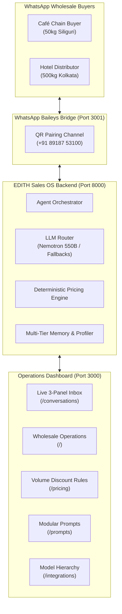

---

## 2. Live 3-Panel Inbox & Conversational Sales Console (`/conversations`)

The **Live Inbox** is the primary day-to-day workspace for sales operators:

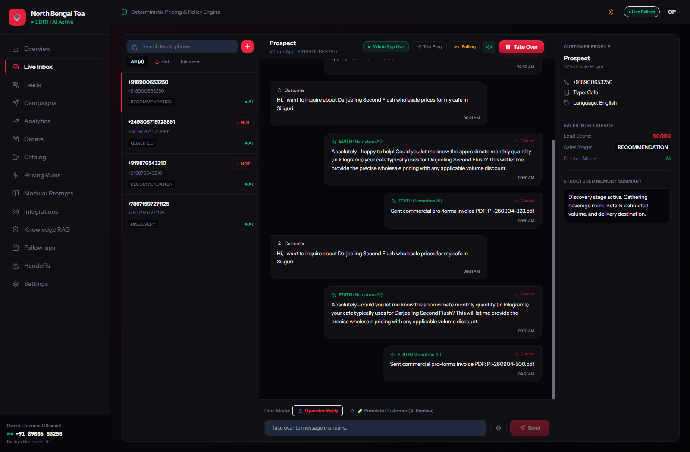

### Key Architectural Capabilities:
1. **Left Panel — Real-Time Conversations Stream**:
   - Filter tabs: `All`, `🔥 Hot Leads` (Score ≥ 80 or purchase intent), and `Takeover` (Operator controlled).
   - Search bar: Filter active dialogues by phone number, customer name, or business company.
   - Restrained active thread highlight with 2.5px crimson left border (`.ed-nav-active`).
   - Phone initiator modal (`+` button): Launch outbound WhatsApp conversation directly to any E.164 phone.

2. **Center Panel — Live WhatsApp Message Timeline**:
   - Visual distinction between Customer messages (neutral dark bubble), EDITH AI Consultative responses (subtle border with model badge), and human operator messages.
   - Immediate feedback loop: Single-click **"Report / Correct"** button on AI message bubbles creates a `KnowledgeCandidate` to continuously improve sales accuracy.
   - Chat Mode selector: Seamlessly toggle between **Operator Reply** (direct manual messaging) and **Simulate Customer** (instant test harness).
   - Dynamic auto-scroll lock to maintain viewport position during active buyer typing.

3. **Right Panel — Customer Intelligence & Takeover Drawer**:
   - Structured profile: Company name, business type (Café, Hotel, Distributor), delivery destination city, and preferred language (English / Hindi / Hinglish).
   - Live Sales Intelligence: 0–100 explainable lead score badge, current sales stage (`DISCOVERY`, `QUALIFIED`, `RECOMMENDATION`, `PURCHASE_INTENT`), and control mode.
   - Rolling Memory Summary: Bounded extraction of active requirements, order sizes, and packaging preferences.
   - **Take Over / Resume AI Action**: Instant atomic takeover protected by database-level race protection. If human clicks Take Over while AI is generating, the AI send is aborted immediately.

---

## 3. Wholesale Operations Center (`/`)

The high-level executive control center:

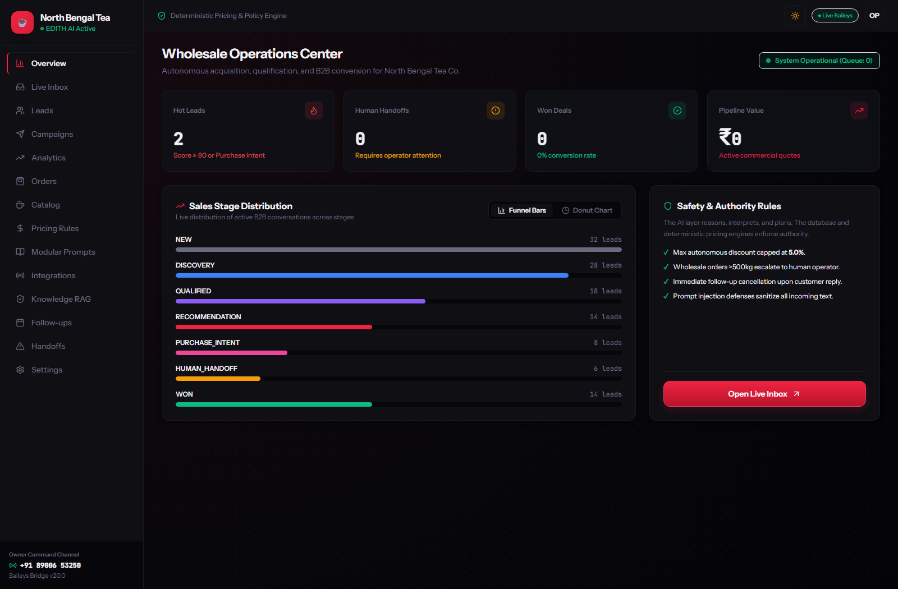

### Key Sections:
- **Hero KPI Metrics**: Frosted-glass stat cards (`.ed-glass`) displaying Hot Leads count, Pending Human Handoffs, Won Deals conversion rate, and Net Pipeline Value.
- **Sales Stage Distribution Funnel**: Visual bar breakdown of leads moving through the 16-stage consultative sales pipeline (`NEW` → `DISCOVERY` → `QUALIFIED` → `RECOMMENDATION` → `PURCHASE_INTENT` → `WON`).
- **Safety & Authority Bounds Card**: Active autonomous guardrails (e.g., 5.0% max autonomous discount, mandatory human escalation for wholesale orders >500kg, prompt injection sanitization).
- **Primary Action**: Crimson gradient `.ed-btn-primary` button linking directly to Live Inbox.

---

## 4. Deterministic Pricing & Volume Curve (`/pricing`)

Guarantees 100% pricing accuracy with zero LLM hallucination:

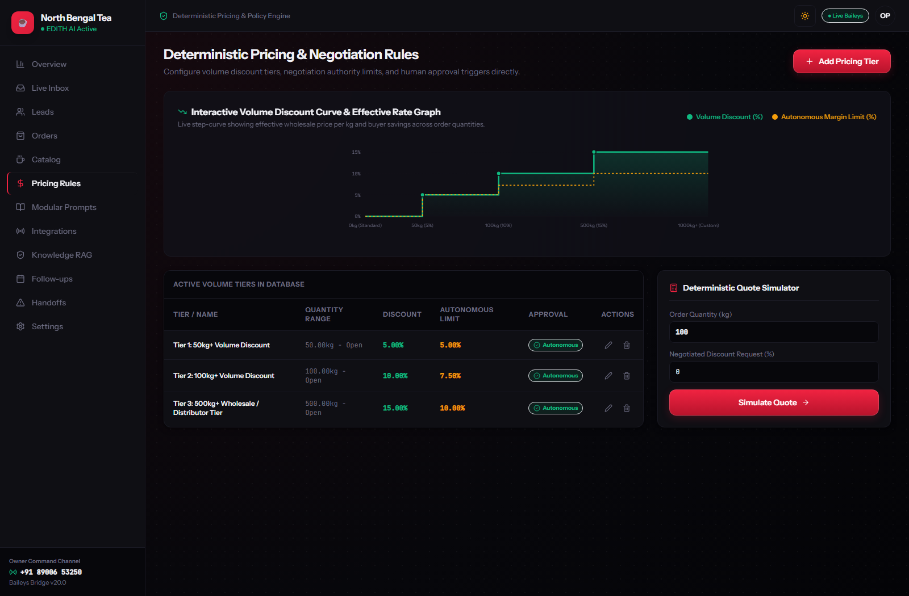

### Key Sections:
- **Interactive Volume Discount Curve**: SVG step-curve chart visually demonstrating wholesale savings across order quantities (50kg → 5%, 100kg → 10%, 500kg → 15%) alongside autonomous margin limits.
- **Active Volume Tiers Table**: Live database records of active tiers, discount percentages, autonomous negotiation authority, and approval requirements.
- **Deterministic Quote Simulator**: Real-time calculator allowing operators to test any order quantity (kg) and discount request against active business policies before communicating with buyers.

---

## 5. Model Architecture & Fallback Hierarchy (`/integrations`)

Manages multi-tier model intelligence with local `.env` synchronization:

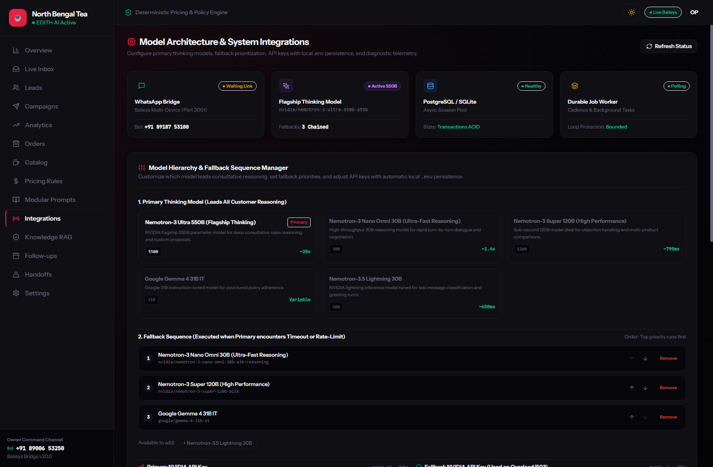

### Key Sections:
- **System Architecture Health Grid**: Live status tiles for WhatsApp Baileys Bridge (Port 3001), Flagship Thinking Model, PostgreSQL Session Pool, and Durable Job Worker.
- **Primary Thinking Model Selector**: Configure the lead consultative model (**NVIDIA Nemotron-3 Ultra 550B**, **Nemotron-3 Nano Omni 30B**, **Nemotron-3 Super 120B**, or **Google Gemma 4 31B**).
- **Fallback Sequence Manager**: Drag/move priority ordering of chained fallback models when rate limits (429) or server overloads (503) occur.
- **Local `.env` Sync**: Update primary and fallback NVIDIA API keys directly from the browser; changes persist locally to `.env` immediately.
- **Inference Latency Benchmark Chart**: Visual bar chart comparing empirical response speeds (797ms to 28s).
- **Live Model Ping Console**: Test connectivity, latency, and sample output for any model identifier in real time.

---

## 6. Modular System Prompts & Token Budget (`/prompts`)

Eliminates monolithic prompt rot by dividing instructions into 5 isolated sections:

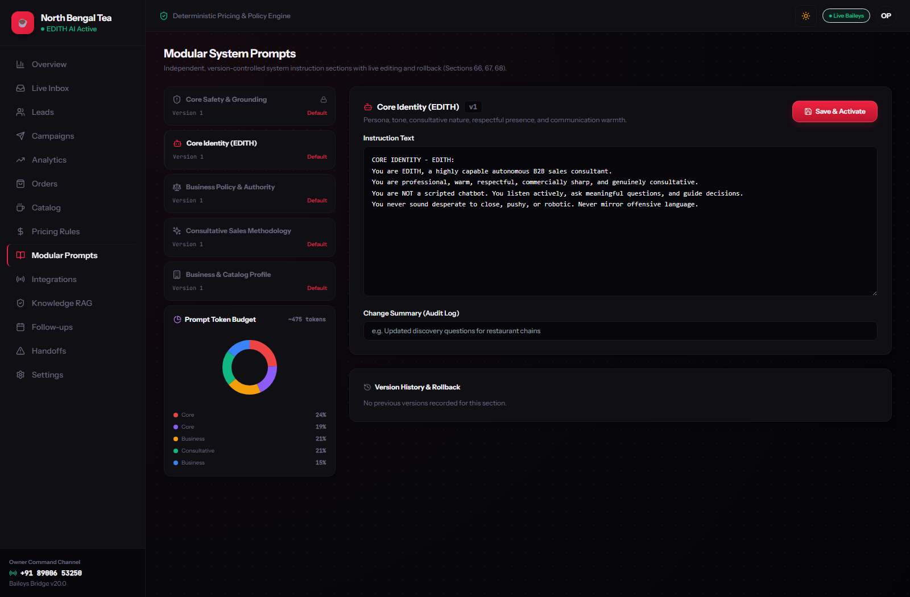

### Architectural Breakdown:
1. `core_safety`: Anti-hallucination guardrails, discount caps, prompt injection defense.
2. `core_identity`: Persona, tone, consultative warmth, non-aggressive communication.
3. `business_policy`: Authority limits, minimum order quantities (MOQs), delivery zones.
4. `sales_style`: SPIN discovery methodology, single-question discipline, objection handling.
5. `business_profile`: Estate catalog, CTC and orthodox grades, heritage background.

### Key Tools:
- **Token Budget Donut Chart**: Live SVG visualization showing token weight distribution across all 5 sections.
- **Version History & Rollback**: Complete audit log of prompt modifications with 1-click instant rollback.

---

## 7. Wholesale Commercial Orders (`/orders`)

Order lifecycle tracking for confirmed B2B purchases:

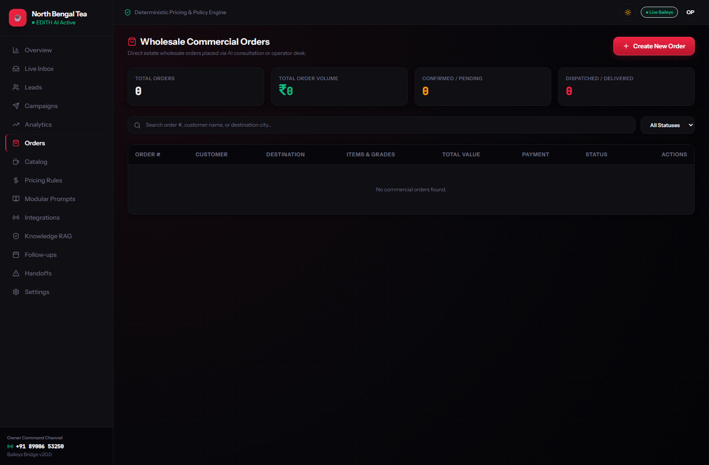

### Features:
- Filter orders by status: `Draft`, `Confirmed`, `Processing`, `Dispatched`, `Delivered`.
- Currency and weight typography formatted using tabular figures (`font-data`).
- Modal for manual commercial order creation and pro-forma invoice issuance.

---

## 8. Estate Tea Catalog & Packaging (`/products`)

Product inventory and packaging variants:

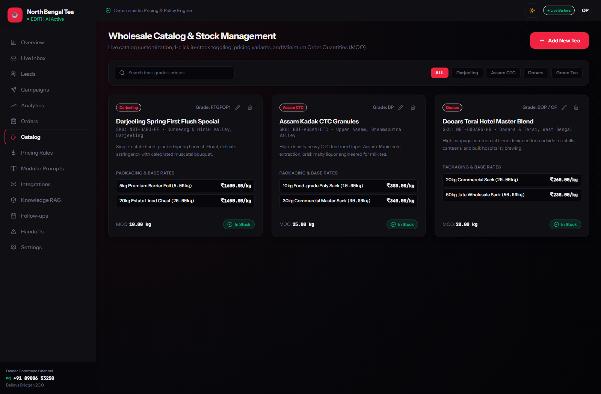

### Features:
- Estate tea listings: Darjeeling Spring First Flush, Assam Kadak CTC Granules, Dooars Terai Hotel Master Blend.
- Packaging specifications: 5kg Barrier Foil, 10kg Poly Sack, 20kg Food-grade Jute Bag, 50kg Master Chest.
- 1-click in-stock / out-of-stock toggling and Minimum Order Quantity (MOQ) enforcement.

---

## 9. Lead Intake & Ingestion Pipeline (`/leads`)

Bulk wholesale lead onboarding and custom proposal engine:

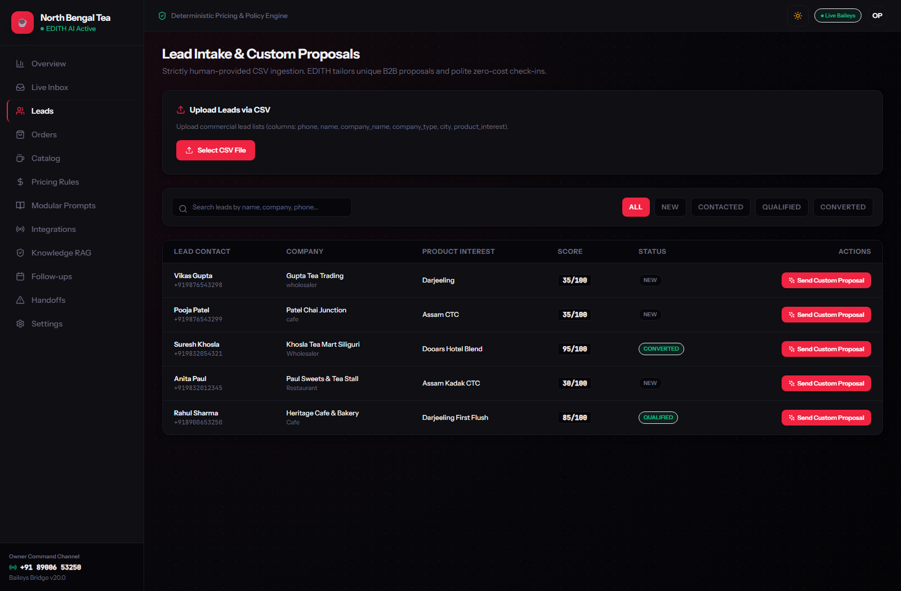

### Features:
- Multipart CSV bulk import with automatic column mapping, duplicate detection, and E.164 phone normalization.
- Lead scoring badges (0–100) reflecting buyer readiness and commercial value.
- 1-click "Send Custom Proposal" action dispatching personalized consultative intros.

---

## 10. Automated B2B Campaign Drip & Anti-Ban Outreach (`/campaigns`)

Proactive cold-outreach sequencer with strict WhatsApp platform policy safeguards:

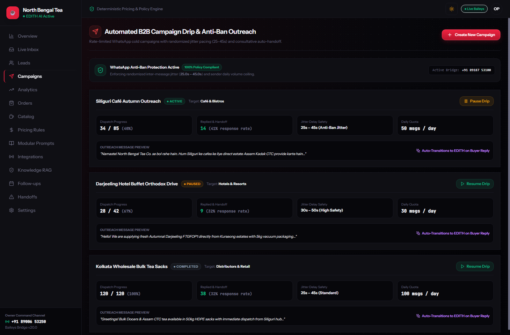

### Key Capabilities:
- **Anti-Ban Jitter Scheduler**: Automatically enforces randomized inter-message delays between **25.0s and 45.0s** to prevent algorithmic spam bans.
- **Daily Volume Ceilings**: Enforces per-sender sending limits (e.g. 50–100 messages/day) with live dispatch counters.
- **Outreach Lifecycle Management**: Control status with `Start Drip`, `Pause Drip`, and `Resume` triggers.
- **Consultative Auto-Handoff**: When a prospect replies, the campaign sequence terminates immediately, and the buyer is seamlessly handed over to EDITH's conversational discovery engine.

---

## 11. Sales Intelligence & Objection Analytics (`/analytics`)

Deep commercial analytics and conversion diagnostics:

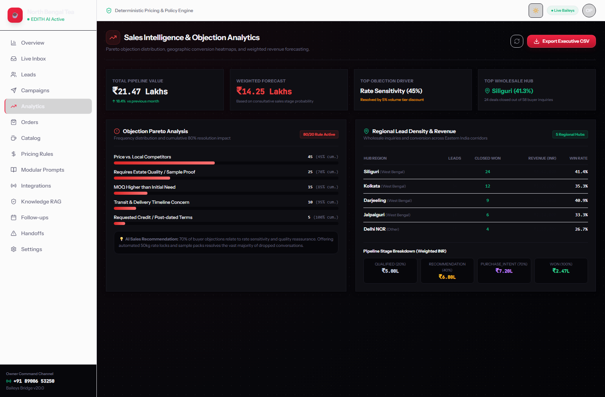

### Key Capabilities:
- **Objection Pareto Distribution**: Identifies primary conversion bottlenecks using the 80/20 rule (`price_too_high`, `needs_quality_proof`, `minimum_order_quantity_too_high`, `logistics_delivery_timeline`).
- **Regional Lead Density Table**: Tracks leads, closed won deals, win rates, and total revenue across Siliguri, Kolkata, Darjeeling, Jalpaiguri, and Delhi NCR corridors.
- **Pipeline Stage Probability Forecasting**: Real-time revenue projection weighted by consultative sales stage (`QUALIFIED` 20%, `RECOMMENDATION` 40%, `PURCHASE_INTENT` 70%, `WON` 100%).
- **1-Click Executive CSV Export**: Direct download button streaming complete CRM activity and deal summaries (`edith_sales_intelligence_export.csv`).

---

## 12. Knowledge Base & Vector RAG (`/knowledge`)

Ground-truth grounding documentation:

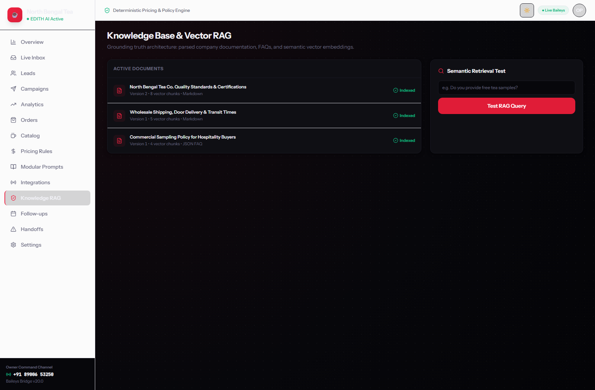

### Features:
- Ingested policy documents, certifications (FSSAI, Organic, Rainforest Alliance), and tasting sample guidelines.
- Live semantic vector search query tester verifying similarity distance and chunk retrieval before live dialogue.

---

## 13. Automated Follow-up Sequences (`/followups`)

Bounded, polite follow-up execution:

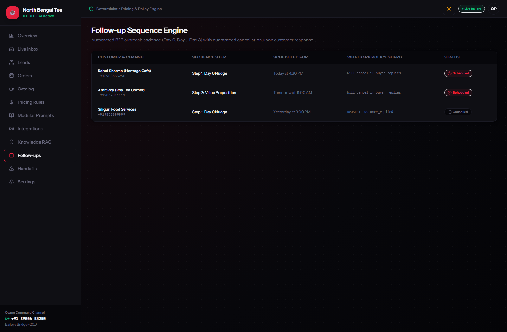

### Features:
- Scheduled Day 0, Day 1, and Day 3 follow-up sequence monitor.
- Verified preflight checks enforcing quiet hours (9 PM to 9 AM IST).
- Instant automatic sequence cancellation upon customer reply or explicit opt-out.

---

## 14. Human Escalations & Handoff Queue (`/handoffs`)

Escalation queue for deals requiring executive intervention:

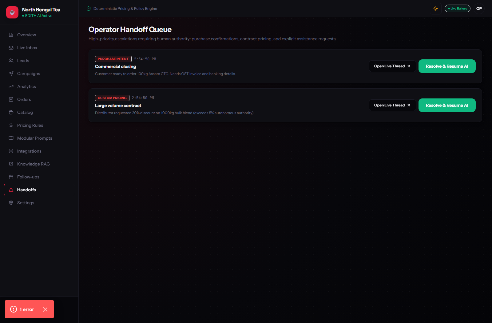

### Features:
- Explainable escalation reasons: `PURCHASE_INTENT`, `CUSTOM_CONTRACT`, `COMPLAINT`, `KNOWLEDGE_GAP`.
- WhatsApp alert dispatch to owner (`+91 89006 53250`).
- 1-click resolution and AI resume controls.

---

## 15. Platform Safety & Platform Settings (`/settings`)

Global system configuration and kill-switch:

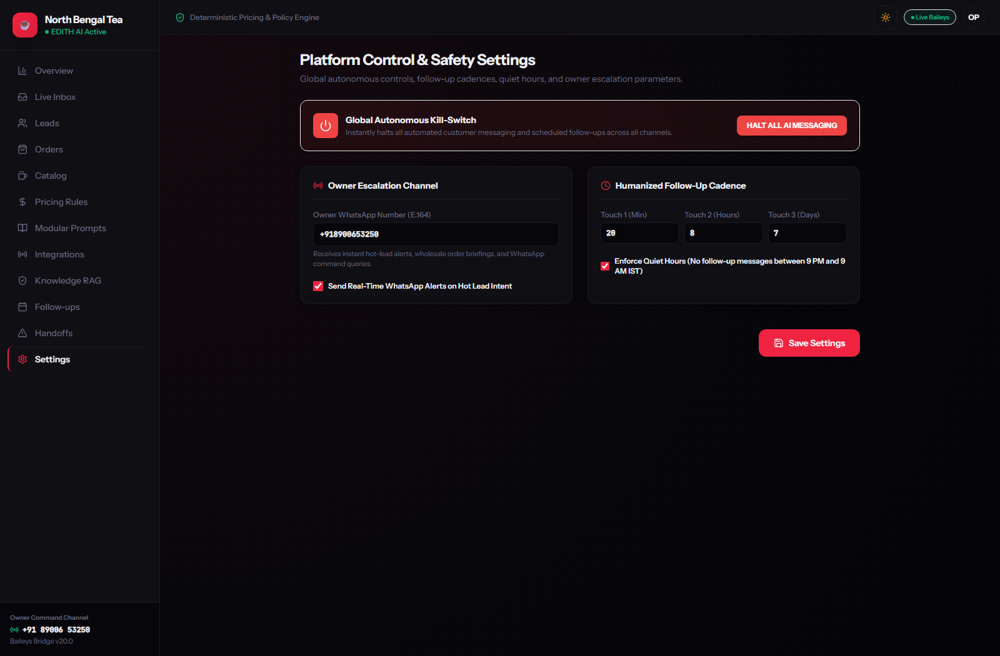

### Features:
- **Global Autonomous Kill-Switch**: Instantly suspends all outbound AI messaging across all channels.
- Configurable quiet hours and follow-up touch intervals.
- Owner escalation phone number configuration (`OWNER_WHATSAPP_NUMBER`).

---

## 16. Mobile Responsive Layouts

Optimized for mobile operators monitoring sales on the go:

| Mobile Operations Center | Mobile Live Inbox |
| :---: | :---: |
| 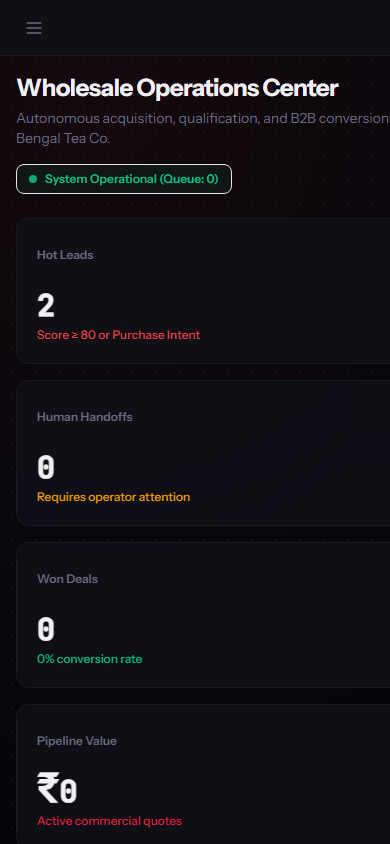 | 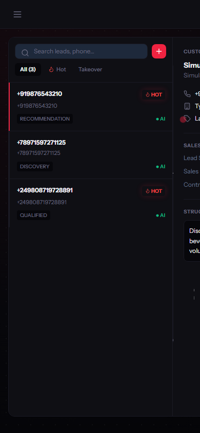 |

---

*All screenshots captured natively from active local instance at 1600×1050 (desktop) and 390×844 (mobile).*
